# Moltworker Global Roadmap

> **Single source of truth** for all project planning and status tracking.
> Updated by every AI agent after every task. Human checkpoints marked explicitly.

**Last Updated:** 2026-02-08

---

## Project Overview

**Moltworker** is a multi-platform AI assistant gateway deployed on Cloudflare Workers. It provides:
- 30+ AI models via OpenRouter + direct provider APIs (with capability metadata)
- 9 tools (fetch_url, github_read_file, github_list_files, github_api, url_metadata, generate_chart, get_weather, fetch_news, browse_url) — parallel execution
- Durable Objects for unlimited-time task execution
- Multi-platform chat (Telegram, Discord, Slack)
- Image generation (FLUX.2 models)
- Browser automation (Cloudflare Browser Rendering)
- Admin dashboard (React)

**Philosophy:** Ship fast, compound learnings, multi-model by default.

---

## Status Legend

| Emoji | Status |
|-------|--------|
| ✅ | Complete |
| 🔄 | In Progress |
| 🔲 | Not Started |
| ⏸️ | Blocked |
| 🧪 | Needs Testing |

---

## Phase Plan

### Phase 0: Quick Wins (Trivial effort, immediate value)

| ID | Task | Status | Owner | Notes |
|----|------|--------|-------|-------|
| 0.1 | Enable `supportsTools: true` for Gemini 3 Flash | ✅ | Previous PR | Already on main |
| 0.2 | Add GPT-OSS-120B to model catalog | ✅ | Claude | `gptoss` alias, free tier |
| 0.3 | Add GLM 4.7 to model catalog | ✅ | Claude | `glm47` alias, $0.07/$0.40 |
| 0.4 | Fix section numbering in tool-calling-analysis.md | ✅ | Human | Resolved externally |
| 0.5 | Add OpenRouter Pony Alpha | ✅ | Claude | `pony` alias, free |

> 🧑 HUMAN CHECK 0.6: Verify new model IDs are correct on OpenRouter — ✅ DEPLOYED OK

---

### Phase 1: Tool-Calling Optimization (Low-Medium effort, high value)

| ID | Task | Status | Owner | Notes |
|----|------|--------|-------|-------|
| 1.1 | Implement parallel tool execution (`Promise.all`) | ✅ | Claude | `client.ts` + `task-processor.ts` — concurrent execution of all tool_calls |
| 1.2 | Enrich model capability metadata | ✅ | Claude | `parallelCalls`, `structuredOutput`, `reasoning`, `maxContext` for all 30+ models |
| 1.3 | Add configurable reasoning per model | ✅ | Claude | Auto-detect + `think:LEVEL` override; DeepSeek/Grok `{enabled}`, Gemini `{effort}` |
| 1.4 | Combine vision + tools into unified method | 🔲 | Codex | Merge `chatCompletionWithVision` and `chatCompletionWithTools` |
| 1.5 | Add structured output support | 🔲 | Claude | `response_format: { type: "json_schema" }` for compatible models |

> 🧑 HUMAN CHECK 1.6: Test parallel tool execution with real API calls — ⏳ PENDING
> 🧑 HUMAN CHECK 1.7: Verify reasoning control doesn't break existing models — ⏳ PENDING

### Phase 1.5: Upstream Sync & Infrastructure (Completed)

| ID | Task | Status | Owner | Notes |
|----|------|--------|-------|-------|
| 1.5.1 | Cherry-pick upstream exitCode fix (0c1b37d) | ✅ | Claude | `sync.ts` — fixes race condition in config file detection |
| 1.5.2 | Cherry-pick container downgrade (92eb06a) | ✅ | Claude | `standard-4` → `standard-1` (~$26→$6/mo) |
| 1.5.3 | Cherry-pick WebSocket token injection (73acb8a) | ✅ | Claude | Fixes CF Access users losing `?token=` after auth redirect |
| 1.5.4 | Port AI Gateway model support (021a9ed) | ✅ | Claude | `CF_AI_GATEWAY_MODEL` env var for any provider/model |
| 1.5.5 | Port channel config overwrite fix (fb6bc1e) | ✅ | Claude | Prevents stale R2 backup keys failing validation |
| 1.5.6 | Port Anthropic config leak fix (1a3c118) | ✅ | Claude | Remove `console.log` of full config with secrets |
| 1.5.7 | Port workspace sync to R2 (12eb483) | ✅ | Claude | Persists IDENTITY.md, MEMORY.md across restarts |

---

### Phase 2: Observability & Cost Intelligence (Medium effort)

| ID | Task | Status | Owner | Notes |
|----|------|--------|-------|-------|
| 2.1 | Add token/cost tracking per request | 🔲 | Claude | New `src/openrouter/costs.ts`, accumulate in task processor |
| 2.2 | Add `/costs` Telegram command | 🔲 | Claude | Show usage breakdown by model |
| 2.3 | Integrate Acontext observability (Phase 1) | 🔲 | Claude/Codex | Store messages in Acontext Sessions for replay |
| 2.4 | Add Acontext dashboard link to admin UI | 🔲 | Codex | Low-risk, read-only integration |

> 🧑 HUMAN CHECK 2.5: Set up Acontext account and configure API key — ⏳ PENDING
> 🧑 HUMAN CHECK 2.6: Review cost tracking accuracy against OpenRouter billing — ⏳ PENDING

---

### Phase 2.5: Free API Integration (Low effort, high value, $0 cost)

> Based on [storia-free-apis-catalog.md](storia-free-apis-catalog.md). All APIs are free/no-auth or free-tier.
> These can be implemented as new moltworker tools or Telegram/Discord commands.

| ID | Task | Status | Owner | Effort | Notes |
|----|------|--------|-------|--------|-------|
| 2.5.1 | URL metadata tool (Microlink) | ✅ | Claude | 1h | Rich link previews in chat — title, description, image extraction. 🟢 No auth |
| 2.5.2 | Chart image generation (QuickChart) | ✅ | Claude | 2h | Generate chart images for `/brief` command and data visualization. 🟢 No auth |
| 2.5.3 | Weather tool (Open-Meteo) | ✅ | Claude | 2h | Full weather forecast, no key, no rate limits. 🟢 No auth |
| 2.5.4 | Currency conversion tool (ExchangeRate-API) | 🔲 | Any AI | 1h | 150+ currencies, zero auth. 🟢 No auth |
| 2.5.5 | HackerNews + Reddit + arXiv feeds | ✅ | Claude | 3h | `fetch_news` tool — 3 sources, 14 tests. 🟢 No auth |
| 2.5.6 | Crypto expansion (CoinCap + DEX Screener + CoinPaprika) | 🔲 | Any AI | 4h | DeFi pairs + richer metadata beyond CoinGecko. 🟢 No auth |
| 2.5.7 | Daily briefing aggregator | 🔲 | Claude | 6h | Combine weather + crypto + news + quotes into gecko-style morning briefing via Telegram |
| 2.5.8 | Geolocation from IP (ipapi) | 🔲 | Any AI | 1h | Auto-detect timezone/location for regional relevance. 🟢 No auth |
| 2.5.9 | Holiday awareness (Nager.Date) | 🔲 | Any AI | 1h | 100+ countries, adjust briefing tone on holidays. 🟢 No auth |
| 2.5.10 | Quotes & personality (Quotable + Advice Slip) | 🔲 | Any AI | 2h | Enrich bot personality in daily briefings and idle responses. 🟢 No auth |

**Total: ~23h = 10 new capabilities at $0/month cost.**

> 🧑 HUMAN CHECK 2.5.11: Decide which free APIs to prioritize first — ⏳ PENDING
> Recommended order: 2.5.1 (Microlink) → 2.5.2 (QuickChart) → 2.5.3 (Weather) → 2.5.5 (News feeds) → 2.5.7 (Daily briefing)

---

### Phase 3: Compound Engineering (Medium effort, transformative)

| ID | Task | Status | Owner | Notes |
|----|------|--------|-------|-------|
| 3.1 | Implement compound learning loop | 🔲 | Claude | New `src/openrouter/learnings.ts`, extract patterns after task completion |
| 3.2 | Add structured task phases (Plan → Work → Review) | 🔲 | Claude | Phase tracking in `TaskState`, phase-aware prompts |
| 3.3 | Add `/learnings` Telegram command | 🔲 | Claude/Codex | View past patterns and success rates |
| 3.4 | Inject relevant learnings into system prompts | 🔲 | Claude | Use stored learnings to improve future tasks |

> 🧑 HUMAN CHECK 3.5: Review learning data quality after 20+ tasks — ⏳ PENDING

---

### Phase 4: Context Engineering (Medium-High effort)

| ID | Task | Status | Owner | Notes |
|----|------|--------|-------|-------|
| 4.1 | Replace `compressContext()` with Acontext token-budgeted retrieval | 🔲 | Claude | Eliminate chars/4 heuristic |
| 4.2 | Replace `estimateTokens()` with actual tokenizer | 🔲 | Claude | Use Acontext or tiktoken |
| 4.3 | Add tool result caching | 🔲 | Codex | Cache identical tool calls (same GitHub file, etc.) |
| 4.4 | Implement cross-session context continuity | 🔲 | Claude | Resume complex tasks days later with full context |

> 🧑 HUMAN CHECK 4.5: Validate context quality with Acontext vs. current compression — ⏳ PENDING

---

### Phase 5: Advanced Capabilities (High effort, strategic)

| ID | Task | Status | Owner | Notes |
|----|------|--------|-------|-------|
| 5.1 | Multi-agent review for complex tasks | 🔲 | Claude | Route results through reviewer model |
| 5.2 | MCP integration (mcporter pattern) | 🔲 | Claude | Dynamic tool registration from MCP servers |
| 5.3 | Acontext Sandbox for code execution | 🔲 | Codex | Replaces roadmap Priority 3.2 |
| 5.4 | Acontext Disk for file management | 🔲 | Codex | Replaces roadmap Priority 3.3 |
| 5.5 | Web search tool | 🔲 | Any AI | Brave Search or SearXNG |
| 5.6 | Multi-agent orchestration | 🔲 | Claude | Leverage Claude Sonnet 4.5 speculative execution |

> 🧑 HUMAN CHECK 5.7: Evaluate MCP server hosting options (Sandbox vs. external) — ⏳ PENDING
> 🧑 HUMAN CHECK 5.8: Security review of code execution sandbox — ⏳ PENDING

---

### Phase 6: Platform Expansion (Future)

| ID | Task | Status | Owner | Notes |
|----|------|--------|-------|-------|
| 6.1 | Telegram inline buttons | 🔲 | Any AI | Confirmations, model selection |
| 6.2 | Response streaming (Telegram) | 🔲 | Any AI | Progressive message updates |
| 6.3 | Voice messages (Whisper + TTS) | 🔲 | Any AI | High effort |
| 6.4 | Calendar/reminder tools | 🔲 | Any AI | Cron-based |
| 6.5 | Email integration | 🔲 | Any AI | Cloudflare Email Workers |
| 6.6 | WhatsApp integration | 🔲 | Any AI | WhatsApp Business API |

---

## AI Task Ownership

| AI Agent | Primary Responsibilities | Strengths |
|----------|------------------------|-----------|
| **Claude** | Architecture, complex refactoring, tool-calling logic, task processor, compound learning | Deep reasoning, multi-step changes, system design |
| **Codex** | Frontend (React admin UI), tests, simple model additions, Acontext integration | Fast execution, UI work, parallel tasks |
| **Other Bots** | Code review, documentation, simple fixes, model catalog updates | Varies by model |
| **Human** | Security review, deployment, API key management, architecture decisions | Final authority |

---

## Human Checkpoints Summary

| ID | Description | Status |
|----|-------------|--------|
| 0.6 | Verify new model IDs on OpenRouter | ✅ DEPLOYED |
| 1.6 | Test parallel tool execution with real APIs | ⏳ PENDING |
| 1.7 | Verify reasoning control compatibility | ⏳ PENDING |
| 2.5 | Set up Acontext account/API key | ⏳ PENDING |
| 2.5.11 | Decide which free APIs to prioritize first | ⏳ PENDING |
| 2.6 | Review cost tracking vs. OpenRouter billing | ⏳ PENDING |
| 3.5 | Review learning data quality | ⏳ PENDING |
| 4.5 | Validate Acontext context quality | ⏳ PENDING |
| 5.7 | Evaluate MCP hosting options | ⏳ PENDING |
| 5.8 | Security review of code execution | ⏳ PENDING |

---

## Bug Fixes & Corrective Actions

| Date | Issue | Fix | Files | AI |
|------|-------|-----|-------|----|
| — | No bugs tracked yet | — | — | — |

---

## Changelog

> Newest first. Format: `YYYY-MM-DD | AI | Description | files`

```
2026-02-08 | Claude Opus 4.6 (Session: 01Wjud3VHKMfSRbvMTzFohGS) | feat(client): configurable reasoning per model — Phase 1.3 complete | src/openrouter/models.ts, src/openrouter/client.ts, src/telegram/handler.ts, src/openrouter/reasoning.test.ts
2026-02-08 | Claude Opus 4.6 (Session: 01Wjud3VHKMfSRbvMTzFohGS) | feat(tools): add fetch_news tool (HN/Reddit/arXiv) — Phase 2.5.5 complete | src/openrouter/tools.ts, src/openrouter/tools.test.ts
2026-02-08 | Claude Opus 4.6 (Session: 01Wjud3VHKMfSRbvMTzFohGS) | feat(tools): add get_weather tool via Open-Meteo API — Phase 2.5.3 complete | src/openrouter/tools.ts, src/openrouter/tools.test.ts
2026-02-08 | Claude Opus 4.6 (Session: 01Wjud3VHKMfSRbvMTzFohGS) | feat(tools): add generate_chart tool via QuickChart API — Phase 2.5.2 complete | src/openrouter/tools.ts, src/openrouter/tools.test.ts
2026-02-08 | Claude Opus 4.6 (Session: 01Wjud3VHKMfSRbvMTzFohGS) | feat(tools): add url_metadata tool via Microlink API — Phase 2.5.1 complete | src/openrouter/tools.ts, src/openrouter/tools.test.ts
2026-02-08 | Claude Opus 4.6 (Session: 01Lg3st5TTU3gXnMqPxfCPpW) | docs: update all core docs — mark Phase 1.1/1.2 complete, add Phase 2.5 (free APIs), update sprint status | claude-share/core/*.md
2026-02-08 | Claude Opus 4.6 (Session: 01Lg3st5TTU3gXnMqPxfCPpW) | feat(upstream): cherry-pick 7 upstream fixes — WS token, AI Gateway, channel config, workspace sync, exitCode, container downgrade, config leak | src/index.ts, src/types.ts, src/gateway/*.ts, start-moltbot.sh, Dockerfile, wrangler.jsonc, README.md
2026-02-08 | Claude Opus 4.6 (Session: 01Lg3st5TTU3gXnMqPxfCPpW) | feat(tools): parallel tool execution + model capability metadata — Phase 1.1 + 1.2 complete | src/openrouter/client.ts, src/durable-objects/task-processor.ts, src/openrouter/models.ts
2026-02-07 | Claude Opus 4.6 (Session: 011qMKSadt2zPFgn2GdTTyxH) | feat(models): add Pony Alpha, GPT-OSS-120B, GLM 4.7 — Phase 0 complete | src/openrouter/models.ts
2026-02-06 | Claude Opus 4.6 (Session: 011qMKSadt2zPFgn2GdTTyxH) | docs: Create multi-AI orchestration documentation structure | claude-share/core/*.md, CLAUDE.md, AGENTS.md
2026-02-06 | Claude Opus 4.6 (Session: 011qMKSadt2zPFgn2GdTTyxH) | docs: Add Compound Engineering Plugin analysis | brainstorming/tool-calling-analysis.md
2026-02-06 | Claude Opus 4.6 (Session: 011qMKSadt2zPFgn2GdTTyxH) | docs: Add Acontext context data platform analysis | brainstorming/tool-calling-analysis.md
2026-02-06 | Claude Opus 4.6 (Session: 011qMKSadt2zPFgn2GdTTyxH) | docs: Initial tool-calling landscape and steipete analysis | brainstorming/tool-calling-analysis.md
```

---

## Dependency Graph

```mermaid
graph TD
    P0[Phase 0: Quick Wins ✅] --> P1[Phase 1: Tool-Calling ✅/🔄]
    P0 --> P15[Phase 1.5: Upstream Sync ✅]
    P1 --> P2[Phase 2: Observability & Costs]
    P1 --> P25[Phase 2.5: Free APIs 🔲]
    P1 --> P3[Phase 3: Compound Engineering]
    P2 --> P4[Phase 4: Context Engineering]
    P3 --> P4
    P4 --> P5[Phase 5: Advanced Capabilities]
    P5 --> P6[Phase 6: Platform Expansion]
    P25 --> P6

    subgraph "Phase 1 (1.1-1.2 ✅)"
        P1_1[1.1 Parallel tools ✅]
        P1_2[1.2 Model metadata ✅]
        P1_3[1.3 Reasoning control 🔲]
        P1_4[1.4 Vision + tools 🔲]
    end

    subgraph "Phase 2.5: Free APIs ($0 cost)"
        P25_1[2.5.1 URL metadata - Microlink]
        P25_2[2.5.2 Charts - QuickChart]
        P25_3[2.5.3 Weather - Open-Meteo]
        P25_5[2.5.5 News feeds - HN/Reddit/arXiv]
        P25_7[2.5.7 Daily briefing aggregator]
    end

    subgraph "Phase 2 (Medium)"
        P2_1[2.1 Cost tracking]
        P2_3[2.3 Acontext observability]
    end

    subgraph "Phase 3 (Medium)"
        P3_1[3.1 Learning loop]
        P3_2[3.2 Task phases]
    end

    P1_1 --> P5_1[5.1 Multi-agent review]
    P1_2 --> P1_3
    P1_2 --> P2_1
    P25_1 --> P25_7
    P25_2 --> P25_7
    P25_3 --> P25_7
    P25_5 --> P25_7
    P2_3 --> P4
    P3_1 --> P3_2
    P3_2 --> P5_1
```



---

## References

- [Tool-Calling Analysis](../../brainstorming/tool-calling-analysis.md) — Full analysis with 10 gaps and 13 recommendations
- [Free APIs Catalog](storia-free-apis-catalog.md) — 25+ free APIs for zero-cost feature expansion
- [Future Integrations](../../brainstorming/future-integrations.md) — Original roadmap (pre-analysis)
- [README](../../README.md) — User-facing documentation
- [AGENTS.md](../../AGENTS.md) — Developer/AI agent instructions
- [CLAUDE.md](../../CLAUDE.md) — Claude Code project instructions
