# Moltworker Global Roadmap

> **Single source of truth** for all project planning and status tracking.
> Updated by every AI agent after every task. Human checkpoints marked explicitly.

**Last Updated:** 2026-02-22 (7A.2 + 7A.3 complete — 1158 tests)

---

## Project Overview

**Moltworker** is a multi-platform AI assistant gateway deployed on Cloudflare Workers. It provides:
- 30+ AI models via OpenRouter + direct provider APIs (with capability metadata)
- 16 tools (fetch_url, github_read_file, github_list_files, github_api, github_create_pr, url_metadata, generate_chart, get_weather, fetch_news, convert_currency, get_crypto, geolocate_ip, browse_url, sandbox_exec, web_search, cloudflare_api) — parallel execution with safety whitelist
- Durable Objects for unlimited-time task execution
- Multi-platform chat (Telegram, Discord, Slack)
- Image generation (FLUX.2 models)
- Browser automation (Cloudflare Browser Rendering)
- Admin dashboard (React)

**Philosophy:** Ship fast, compound learnings, multi-model by default.

---

## Status Legend

| Emoji | Status |
|-------|--------|
| ✅ | Complete |
| 🔄 | In Progress |
| 🔲 | Not Started |
| ⏸️ | Blocked |
| 🧪 | Needs Testing |

---

## Phase Plan

### Phase 0: Quick Wins (Trivial effort, immediate value)

| ID | Task | Status | Owner | Notes |
|----|------|--------|-------|-------|
| 0.1 | Enable `supportsTools: true` for Gemini 3 Flash | ✅ | Previous PR | Already on main |
| 0.2 | Add GPT-OSS-120B to model catalog | ✅ | Claude | `gptoss` alias, free tier |
| 0.3 | Add GLM 4.7 to model catalog | ✅ | Claude | `glm47` alias, $0.07/$0.40 |
| 0.4 | Fix section numbering in tool-calling-analysis.md | ✅ | Human | Resolved externally |
| 0.5 | Add OpenRouter Pony Alpha | ✅ | Claude | `pony` alias, free |

> 🧑 HUMAN CHECK 0.6: Verify new model IDs are correct on OpenRouter — ✅ DEPLOYED OK

---

### Phase 1: Tool-Calling Optimization (Low-Medium effort, high value)

| ID | Task | Status | Owner | Notes |
|----|------|--------|-------|-------|
| 1.1 | Implement parallel tool execution (`Promise.allSettled`) | ✅ | Claude | `task-processor.ts` — `Promise.allSettled` + `PARALLEL_SAFE_TOOLS` whitelist (11 read-only safe, 3 mutation sequential); `client.ts` — `Promise.all` (no whitelist, Worker path) |
| 1.2 | Enrich model capability metadata | ✅ | Claude | `parallelCalls`, `structuredOutput`, `reasoning`, `maxContext` for all 30+ models |
| 1.3 | Add configurable reasoning per model | ✅ | Claude | Auto-detect + `think:LEVEL` override; DeepSeek/Grok `{enabled}`, Gemini `{effort}` |
| 1.4 | Combine vision + tools into unified method | ✅ | Claude | Vision messages now route through tool-calling path (DO) for tool-supporting models |
| 1.5 | Add structured output support | ✅ | Claude | `response_format: { type: "json_object" }` via `json:` prefix for compatible models |

> 🧑 HUMAN CHECK 1.6: Test parallel tool execution with real API calls — ⏳ PENDING
> 🧑 HUMAN CHECK 1.7: Verify reasoning control doesn't break existing models — ✅ TESTED (works but BUG-3: think: not passed through DO)
> ✅ BUG-3 FIXED: `think:` override now passed through Durable Object path — `reasoningLevel` added to `TaskRequest`

### Phase 1.5: Upstream Sync & Infrastructure (Completed)

| ID | Task | Status | Owner | Notes |
|----|------|--------|-------|-------|
| 1.5.1 | Cherry-pick upstream exitCode fix (0c1b37d) | ✅ | Claude | `sync.ts` — fixes race condition in config file detection |
| 1.5.2 | Cherry-pick container downgrade (92eb06a) | ✅ | Claude | `standard-4` → `standard-1` (~$26→$6/mo) |
| 1.5.3 | Cherry-pick WebSocket token injection (73acb8a) | ✅ | Claude | Fixes CF Access users losing `?token=` after auth redirect |
| 1.5.4 | Port AI Gateway model support (021a9ed) | ✅ | Claude | `CF_AI_GATEWAY_MODEL` env var for any provider/model |
| 1.5.5 | Port channel config overwrite fix (fb6bc1e) | ✅ | Claude | Prevents stale R2 backup keys failing validation |
| 1.5.6 | Port Anthropic config leak fix (1a3c118) | ✅ | Claude | Remove `console.log` of full config with secrets |
| 1.5.7 | Port workspace sync to R2 (12eb483) | ✅ | Claude | Persists IDENTITY.md, MEMORY.md across restarts |

---

### Phase 2: Observability & Cost Intelligence (Medium effort)

| ID | Task | Status | Owner | Notes |
|----|------|--------|-------|-------|
| 2.1 | Add token/cost tracking per request | ✅ | Claude | `costs.ts` — pricing parser, per-user daily accumulation, cost footer on responses |
| 2.2 | Add `/costs` Telegram command | ✅ | Claude | `/costs` today + `/costs week` 7-day breakdown, integrated with Phase 2.1 |
| 2.3 | Integrate Acontext observability (Phase 1) | ✅ | Claude | Lightweight REST client, session storage at task completion, /sessions command |
| 2.4 | Add Acontext dashboard link to admin UI | ✅ | Codex+Claude | Backend route + React section + CSS + 13 tests (785 total) |

> 🧑 HUMAN CHECK 2.5: Set up Acontext account and configure API key — ✅ DONE (2026-02-11)
> 🧑 HUMAN CHECK 2.6: Review cost tracking accuracy against OpenRouter billing — ⏳ PENDING

---

### Phase 2.5: Free API Integration (Low effort, high value, $0 cost)

> Based on [storia-free-apis-catalog.md](storia-free-apis-catalog.md). All APIs are free/no-auth or free-tier.
> These can be implemented as new moltworker tools or Telegram/Discord commands.

| ID | Task | Status | Owner | Effort | Notes |
|----|------|--------|-------|--------|-------|
| 2.5.1 | URL metadata tool (Microlink) | ✅ | Claude | 1h | Rich link previews in chat — title, description, image extraction. 🟢 No auth |
| 2.5.2 | Chart image generation (QuickChart) | ✅ | Claude | 2h | Generate chart images for `/brief` command and data visualization. 🟢 No auth |
| 2.5.3 | Weather tool (Open-Meteo) | ✅ | Claude | 2h | Full weather forecast, no key, no rate limits. 🟢 No auth |
| 2.5.4 | Currency conversion tool (ExchangeRate-API) | ✅ | Claude | 1h | `convert_currency` tool — 150+ currencies, 30min cache, 14 tests. 🟢 No auth |
| 2.5.5 | HackerNews + Reddit + arXiv feeds | ✅ | Claude | 3h | `fetch_news` tool — 3 sources, 14 tests. 🟢 No auth |
| 2.5.6 | Crypto expansion (CoinCap + DEX Screener + CoinPaprika) | ✅ | Claude | 4h | `get_crypto` tool — price/top/dex actions, 3 APIs, 5min cache, 11 tests. 🟢 No auth |
| 2.5.7 | Daily briefing aggregator | ✅ | Claude | 6h | `/briefing` command — weather + HN top 5 + Reddit top 3 + arXiv latest 3, 15min cache, partial failure handling |
| 2.5.8 | Geolocation from IP (ipapi) | ✅ | Claude | 1h | `geolocate_ip` tool — city/country/timezone/ISP, 15min cache, 7 tests. 🟢 No auth |
| 2.5.9 | Holiday awareness (Nager.Date) | ✅ | Claude | 1h | Nager.Date API integration, holiday banner in briefing, 100+ countries |
| 2.5.10 | Quotes & personality (Quotable + Advice Slip) | ✅ | Claude | 2h | Quotable API + Advice Slip fallback in daily briefing, 7 tests. 🟢 No auth |

**Total: ~23h = 10 new capabilities at $0/month cost.**

> 🧑 HUMAN CHECK 2.5.11: Decide which free APIs to prioritize first — ⏳ PENDING
> Recommended order: 2.5.1 (Microlink) → 2.5.2 (QuickChart) → 2.5.3 (Weather) → 2.5.5 (News feeds) → 2.5.7 (Daily briefing)

---

### Phase 3: Compound Engineering (Medium effort, transformative)

| ID | Task | Status | Owner | Notes |
|----|------|--------|-------|-------|
| 3.1 | Implement compound learning loop | ✅ | Claude | `src/openrouter/learnings.ts` — extract/store/inject patterns, 36 tests |
| 3.2 | Add structured task phases (Plan → Work → Review) | ✅ | Claude | Phase tracking in `TaskState`, phase-aware prompts, 8 tests |
| 3.3 | Add `/learnings` Telegram command | ✅ | Claude | View past patterns and success rates + P1 guardrails (Task Router, source-grounding, confidence labels) |
| 3.4 | Inject relevant learnings into system prompts | ✅ | Claude | Included in 3.1 — learnings injected into system prompt in handler.ts |

> 🧑 HUMAN CHECK 3.5: Review learning data quality after 20+ tasks — ⏳ PENDING

---

### Sprint 48h: Infrastructure Guardrails (2026-02-20)

| ID | Task | Status | Owner | Notes |
|----|------|--------|-------|-------|
| S48.1 | Phase budget circuit breakers | ✅ | Claude | `phase-budget.ts` — per-phase wall-clock budgets (plan=120s, work=240s, review=60s), checkpoint-save-before-crash, auto-resume on exceeded. Original budgets (8s/18s/3s) were too tight — measured wall-clock but sized for CPU time, causing 1-2 iter/resume on slow models. 15 tests |
| S48.2 | Parallel tools → allSettled + safety whitelist | ✅ | Claude | `task-processor.ts` — `Promise.allSettled` isolation, `PARALLEL_SAFE_TOOLS` (11 read-only), mutation tools sequential. 8 tests |

> Risk "No phase timeouts (9x10 severity)" → mitigated by S48.1

---

### Phase 4: Context Engineering (Medium-High effort)

| ID | Task | Status | Owner | Notes |
|----|------|--------|-------|-------|
| 4.1 | Replace `compressContext()` with token-budgeted retrieval | ✅ | Claude | Priority-scored messages, tool pairing, summarization — 28 tests |
| 4.2 | Replace `estimateTokens()` with actual tokenizer | ✅ | Claude | `gpt-tokenizer` cl100k_base encoding, heuristic fallback — 18 tests (772 total) |
| 4.3 | Add tool result caching | ✅ | Codex+Claude | In-memory cache + in-flight dedup, PARALLEL_SAFE_TOOLS whitelist, 5 tests |
| 4.4 | Implement cross-session context continuity | ✅ | Claude | SessionSummary ring buffer (20 entries), 24h TTL, keyword-scored injection, 19 tests |

> 🧑 HUMAN CHECK 4.5: Validate context quality with Acontext vs. current compression — ⏳ PENDING

---

### Audit Phase 2: P2 Guardrails (Medium effort)

| ID | Task | Status | Owner | Notes |
|----|------|--------|-------|-------|
| P2.1 | Tool result validation + error classification | ✅ | Claude | `src/guardrails/tool-validator.ts` — validateToolResult, ToolErrorTracker, isMutationToolCall, 34 unit tests |
| P2.2 | "No Fake Success" enforcement | ✅ | Claude | Mutation tool failures (github_create_pr, github_api POST, sandbox_exec) append warning to final response |
| P2.3 | Enhanced confidence labeling | ✅ | Claude | Mutation errors downgrade confidence High→Medium; 3+ read errors downgrade High→Medium |
| P2.4 | Multi-agent review | 🔲 | Claude | Moved to Phase 5.1 — route complex results through reviewer model |

> P2.1-P2.3 complete (2026-02-21): 34 unit tests + 4 integration tests (973 total)

---

### Phase 5: Advanced Capabilities (High effort, strategic)

| ID | Task | Status | Owner | Notes |
|----|------|--------|-------|-------|
| 5.1 | Multi-agent review for complex tasks | 🔲 | Claude | Route results through reviewer model |
| 5.2 | MCP integration (Cloudflare Code Mode) | ✅ | Claude | Generic MCP HTTP client + `cloudflare_api` tool (2500+ CF endpoints), 38 tests |
| 5.3 | Acontext Sandbox for code execution | 🔲 | Codex | Replaces roadmap Priority 3.2 |
| 5.4 | Acontext Disk for file management | 🔲 | Codex | Replaces roadmap Priority 3.3 |
| 5.5 | Web search tool | ✅ | Codex | Brave Search API tool with TTL cache + Telegram/DO key plumbing |
| 5.6 | Multi-agent orchestration | 🔲 | Claude | Leverage Claude Sonnet 4.5 speculative execution |

> 🧑 HUMAN CHECK 5.7: Evaluate MCP server hosting options (Sandbox vs. external) — ⏳ PENDING
> 🧑 HUMAN CHECK 5.8: Security review of code execution sandbox — ⏳ PENDING

---

### Dream Machine Integration (Storia ↔ Moltworker)

| ID | Task | Status | Owner | Notes |
|----|------|--------|-------|-------|
| DM.1 | Dream Build stage — DO, queue, callbacks, spec parser, safety gates | ✅ | Claude | DreamBuildProcessor DO, POST /dream-build, queue consumer, R2 artifacts, 63 tests |
| DM.2 | Auth — Bearer token (STORIA_MOLTWORKER_SECRET), constant-time compare | ✅ | Claude | Deployed, verified 401/400 responses |
| DM.3 | Route fix — move from /api/ to /dream-build (bypass CF Access) | ✅ | Claude | CF Access 302 redirect was blocking Bearer auth |
| DM.4 | Wire real AI code generation into executeBuild() | ✅ | Claude | OpenRouter → Claude Sonnet 4.5, type-aware prompts, token/cost tracking, budget enforcement, 20 tests (993 total) |
| DM.5 | Add POST /dream-build/:jobId/approve endpoint | ✅ | Claude | resumeJob() DO method, approved flag skips destructive check, 8 tests (1001 total) |
| DM.6 | Token/cost tracking in build pipeline | ✅ | Claude | Done as part of DM.4 — estimateCost(), MODEL_COST_RATES, real budget enforcement |
| DM.7 | Enforce checkTrustLevel() at route layer | ✅ | Claude | Added trustLevel to DreamBuildJob, 403 for observer/planner, 6 tests (1007 total) |
| DM.8 | Pre-PR code validation step | ✅ | Claude | In-memory validation (brackets, eval, any, stubs, SQL), warnings in PR body, 24 tests (1031 total) |
| DM.10 | Queue consumer Worker for overnight batch builds | ✅ | Claude | Enhanced queue consumer: job validation, dead-letter to R2, batch metrics, 3 retries, 8 tests |
| DM.11 | Migrate GitHub API calls to Code Mode MCP | ✅ | Claude | GitHubClient class replaces raw fetch(), MCP-ready interface (getBranchSha, createBranch, writeFile, createPR, enableAutoMerge), 14 tests |
| DM.12 | JWT-signed trust level (replace body field) | ✅ | Claude | HMAC-SHA256 JWT with dreamTrustLevel claim, iss/exp/iat validation, legacy fallback, route middleware, 14 tests |
| DM.13 | Shipper-tier deploy to Cloudflare staging | ✅ | Claude | Auto-merge PR via GitHub API + staging deploy via Cloudflare MCP, deploying/deployed callbacks |
| DM.14 | Vex review integration for risky steps | ✅ | Claude | 14-pattern risk scanner, rule-based + AI review, reject/pause/proceed, PR body section, 17 tests |

> 🧑 HUMAN CHECK DM.9: Review dream-build security (token auth, branch protection, destructive op detection) — ⏳ PENDING
> 🧑 HUMAN CHECK DM.15: Deployment verified (2026-02-22) — DM.10 queue consumer, DM.12 JWT auth, shared secret auth, smoke test all PASS. Test PRs: test-repo#1, moltworker#149 — ✅ VERIFIED
> **Source:** `brainstorming/dream-machine-moltworker-brief.md` (v1.2) — DM.10-DM.14 derived from gaps between brief and implementation

---

### Phase 7: Performance & Quality Engine (Medium-High effort, transformative)

> **Goal:** Make the bot faster and more reliable. Derived from honest assessment of the Agent Skills Engine Spec
> (`brainstorming/AGENT_SKILLS_ENGINE_SPEC.md`) — extracting only the high-ROI pieces — plus
> speed optimizations identified through codebase analysis.
>
> **Why this matters:** A typical multi-tool task takes 2-5 minutes end-to-end. Each LLM iteration
> is 5-30s, and tasks need 5-10 iterations. The bot claims "done" with no verification. These
> changes target fewer iterations, smarter context, and verified outputs.

#### Phase 7A: Quality & Correctness (from Agent Skills Engine Spec)

| ID | Task | Status | Owner | Effort | Priority | Notes |
|----|------|--------|-------|--------|----------|-------|
| 7A.1 | **CoVe Verification Loop** — post-execution verification step | 🔲 | Claude | Medium | **HIGH** | After work phase: read claimed files, run `npm test`, check `git diff`. No extra LLM call — just tool execution + simple pass/fail checks. If tests fail, inject results back into context and give model one retry iteration. Inspired by §2.2 of spec but drastically simplified (no separate verifier agent). |
| 7A.2 | **Smart Context Loading** — task-aware context in handler | ✅ | Claude | Low | **MEDIUM** | Complexity classifier in `src/utils/task-classifier.ts`. Simple queries (weather, greetings, crypto) skip R2 reads for learnings, last-task, sessions. History capped at 5 for simple. 35 tests (27 unit + 8 integration). Inspired by §5.1 of spec. |
| 7A.3 | **Destructive Op Guard** — wire Vex patterns into task processor | ✅ | Claude | Low | **LOW-MEDIUM** | `scanToolCallForRisks()` in `src/guardrails/destructive-op-guard.ts`. Reuses 14 RISKY_PATTERNS from Vex review. Critical/high → block, medium → warn+allow. Guards sandbox_exec, github_api, github_create_pr, cloudflare_api. 25 tests. Inspired by §4.2 of spec. |
| 7A.4 | **Structured Step Decomposition** — planner outputs JSON steps | 🔲 | Claude | Medium | **MEDIUM** | Current plan phase: model thinks for 1 iteration, then starts executing (discovering files as it goes, wasting 3-4 iterations on reads). New: force planner to output structured JSON `{steps: [{action, files, description}]}`. Pre-load referenced files into context before executor starts. Reduces iteration count by 2-4. Inspired by §8.2 of spec. |
| 7A.5 | **Prompt Caching** — `cache_control` for Anthropic direct API | 🔲 | Claude | Low | **MEDIUM** | Add `cache_control: { type: 'ephemeral' }` on system prompt blocks when using Anthropic models directly (not via OpenRouter). 90% cost savings on repeated system prompts. Only works for direct Anthropic API calls. Inspired by §5.3 of spec. |

> 🧑 HUMAN CHECK 7A.6: Review CoVe verification results after 10+ tasks — does it catch real failures?

#### Phase 7B: Speed Optimizations (beyond spec)

| ID | Task | Status | Owner | Effort | Priority | Notes |
|----|------|--------|-------|--------|----------|-------|
| 7B.1 | **Speculative Tool Execution** — start tools during streaming | 🔲 | Claude | High | **HIGH** | Current: wait for full LLM response → parse tool_calls → execute. New: parse tool_call names/args from streaming chunks as they arrive. For read-only tools (in `PARALLEL_SAFE_TOOLS`), start execution immediately while model is still generating. Saves 2-10s per iteration on multi-tool calls. Risk: model may change args in later chunks — only start after args are complete per tool_call. |
| 7B.2 | **Model Routing by Complexity** — fast models for simple queries | 🔲 | Claude | Medium | **HIGH** | Simple questions (weather, crypto, "what time is it?") → Haiku/Flash (1-2s response). Only complex multi-file/multi-tool tasks → Sonnet/Opus. Implement complexity classifier: message length, keyword presence (code/file/github/fix/build), conversation history length. Override user model choice for trivial queries (with opt-out). |
| 7B.3 | **Pre-fetching Context** — parse file refs from user message | 🔲 | Claude | Low | **MEDIUM** | When user says "fix the bug in auth.ts" or "update src/routes/api.ts", regex-extract file paths from the message. Start reading those files from GitHub/R2 immediately (before LLM even responds). Cache results so the tool call is instant. Works with existing tool cache infrastructure (Phase 4.3). |
| 7B.4 | **Reduce Iteration Count** — upfront file loading per plan step | 🔲 | Claude | Medium | **HIGH** | Biggest speed win. After 7A.4 produces structured steps, load ALL referenced files into context before each step. Model gets `[FILE: src/foo.ts]\n<contents>` in its system message, doesn't need to call `github_read_file`. Typical task drops from 8 iterations to 3-4. Depends on 7A.4. |
| 7B.5 | **Streaming User Feedback** — progressive Telegram updates | 🔲 | Claude | Medium | **MEDIUM** | Currently: "Thinking..." for 3 minutes, then wall of text. New: update Telegram message every ~15s with current phase (Planning step 2/4..., Executing: reading auth.ts..., Running tests...). Already have `editMessage` infrastructure (progress updates). Enhance with tool-level granularity. Subsumes Phase 6.2 (response streaming). |

> 🧑 HUMAN CHECK 7B.6: Benchmark before/after — measure end-to-end latency on 5 representative tasks

#### Phase 7 Dependency Graph

```
7A.2 (Smart Context) ─────────────────────── can be done independently
7A.3 (Destructive Guard) ─────────────────── can be done independently
7A.5 (Prompt Caching) ────────────────────── can be done independently
7B.2 (Model Routing) ─────────────────────── can be done independently
7B.3 (Pre-fetch Context) ─────────────────── can be done independently

7A.1 (CoVe Verification) ─────────────────── depends on nothing, but best after 7A.4
7A.4 (Step Decomposition) ──┬──────────────── depends on nothing
                            └─→ 7B.4 (Reduce Iterations) ── depends on 7A.4
7B.1 (Speculative Tools) ─────────────────── depends on nothing, but complex
7B.5 (Streaming Feedback) ────────────────── depends on nothing, subsumes 6.2
```

#### Recommended Implementation Order

1. ~~**7A.2** Smart Context Loading~~ ✅ Complete
2. ~~**7A.3** Destructive Op Guard~~ ✅ Complete
3. **7A.5** Prompt Caching (low effort, cost win)
4. **7B.2** Model Routing by Complexity (medium effort, biggest speed win for simple queries)
5. **7B.3** Pre-fetching Context (low effort, reduces tool call latency)
6. **7A.4** Structured Step Decomposition (medium effort, enables 7B.4)
7. **7A.1** CoVe Verification Loop (medium effort, biggest quality win)
8. **7B.4** Reduce Iteration Count (medium effort, biggest speed win for complex tasks)
9. **7B.5** Streaming User Feedback (medium effort, UX win)
10. **7B.1** Speculative Tool Execution (high effort, advanced optimization)

---

### Phase 6: Platform Expansion (Future)

| ID | Task | Status | Owner | Notes |
|----|------|--------|-------|-------|
| 6.1 | Telegram inline buttons | ✅ | Claude | /start feature buttons, model pick, start callbacks |
| 6.2 | Response streaming (Telegram) | 🔲 → 7B.5 | Any AI | Moved to Phase 7B.5 (Streaming User Feedback) |
| 6.3 | Voice messages (Whisper + TTS) | 🔲 | Any AI | High effort |
| 6.4 | Calendar/reminder tools | 🔲 | Any AI | Cron-based |
| 6.5 | Email integration | 🔲 | Any AI | Cloudflare Email Workers |
| 6.6 | WhatsApp integration | 🔲 | Any AI | WhatsApp Business API |

---

## AI Task Ownership

| AI Agent | Primary Responsibilities | Strengths |
|----------|------------------------|-----------|
| **Claude** | Architecture, complex refactoring, tool-calling logic, task processor, compound learning | Deep reasoning, multi-step changes, system design |
| **Codex** | Frontend (React admin UI), tests, simple model additions, Acontext integration | Fast execution, UI work, parallel tasks |
| **Other Bots** | Code review, documentation, simple fixes, model catalog updates | Varies by model |
| **Human** | Security review, deployment, API key management, architecture decisions | Final authority |

---

## Human Checkpoints Summary

| ID | Description | Status |
|----|-------------|--------|
| 0.6 | Verify new model IDs on OpenRouter | ✅ DEPLOYED |
| 1.6 | Test parallel tool execution with real APIs | ⏳ PENDING |
| 1.7 | Verify reasoning control compatibility | ⏳ PENDING |
| 2.5 | Set up Acontext account/API key | ✅ DONE (key in CF Workers secrets) |
| 2.5.11 | Decide which free APIs to prioritize first | ⏳ PENDING |
| 2.6 | Review cost tracking vs. OpenRouter billing | ⏳ PENDING |
| 3.5 | Review learning data quality | ⏳ PENDING |
| 4.5 | Validate Acontext context quality | ⏳ PENDING |
| 5.7 | Evaluate MCP hosting options | ⏳ PENDING |
| 5.8 | Security review of code execution | ⏳ PENDING |
| 7A.6 | Review CoVe verification results after 10+ tasks | ⏳ PENDING |
| 7B.6 | Benchmark before/after — measure latency on 5 representative tasks | ⏳ PENDING |

---

## Bug Fixes & Corrective Actions

| ID | Date | Issue | Severity | Fix | Files | AI |
|----|------|-------|----------|-----|-------|----|
| BUG-1 | 2026-02-08 | "Processing complex task..." shown for ALL messages on tool-capable models | Low/UX | ✅ Changed to "Thinking..." | `task-processor.ts` | ✅ |
| BUG-2 | 2026-02-08 | DeepSeek V3.2 doesn't proactively use tools (prefers answering from knowledge) | Medium | ✅ Added tool usage hint in system prompt | `handler.ts` | ✅ |
| BUG-3 | 2026-02-08 | `think:` override not passed through Durable Object path | Medium | ✅ Added `reasoningLevel` to `TaskRequest`, passed from handler to DO, injected in streaming call | `handler.ts`, `task-processor.ts` | ✅ |
| BUG-4 | 2026-02-08 | `/img` fails — "No endpoints found that support output modalities: image, text" | High | ✅ FLUX models need `modalities: ['image']` (image-only), not `['image', 'text']` | `client.ts:357` | ✅ |
| BUG-5 | 2026-02-08 | `/use fluxpro` + text → "No response generated" | Low | ✅ Fallback to default model with helpful message | `handler.ts` | ✅ |
| BUG-6 | 2026-02-10 | GLM Free missing `supportsTools` flag — hallucinated tool calls | Medium | ⚠️ Reverted — free tier doesn't support function calling. Paid GLM 4.7 works. | `models.ts` | ⚠️ |
| BUG-12 | 2026-02-10 | Auto-resume counter persists across different tasks (18→22 on new task) | High | ✅ Check `taskId` match before inheriting `autoResumeCount` | `task-processor.ts` | ✅ |
| BUG-7 | 2026-02-10 | 402 quota exceeded not handled — tasks loop forever | High | ✅ Fail fast, rotate to free model, user message | `client.ts`, `task-processor.ts` | ✅ |
| BUG-8 | 2026-02-10 | No cross-task context continuity | Medium | ✅ Store last task summary in R2, inject with 1h TTL | `task-processor.ts`, `handler.ts` | ✅ |
| BUG-9 | 2026-02-10 | Runaway auto-resume (no elapsed time limit) | High | ✅ 15min free / 30min paid cap | `task-processor.ts` | ✅ |
| BUG-10 | 2026-02-10 | No warning when non-tool model gets tool-needing message | Low/UX | ✅ Tool-intent detection + user warning | `handler.ts` | ✅ |
| BUG-11 | 2026-02-10 | Models with parallelCalls not prompted strongly enough | Low | ✅ Stronger parallel tool-call instruction | `client.ts` | ✅ |

---

## Changelog

> Newest first. Format: `YYYY-MM-DD | AI | Description | files`

```
2026-02-22 | Claude Opus 4.6 (Session: session_01V82ZPEL4WPcLtvGC6szgt5) | feat(guardrails): 7A.3 Destructive Op Guard — scanToolCallForRisks() pre-execution check, reuses 14 Vex patterns, blocks critical/high, warns medium, 25 new tests (1158 total) | src/guardrails/destructive-op-guard.ts, src/guardrails/destructive-op-guard.test.ts, src/durable-objects/task-processor.ts, src/dream/vex-review.ts
2026-02-22 | Claude Opus 4.6 (Session: session_01V82ZPEL4WPcLtvGC6szgt5) | feat(perf): 7A.2 Smart Context Loading — task complexity classifier skips R2 reads for simple queries (~300-400ms saved), 35 new tests (1133 total) | src/utils/task-classifier.ts, src/utils/task-classifier.test.ts, src/telegram/handler.ts, src/telegram/smart-context.test.ts
2026-02-22 | Claude Opus 4.6 (Session: session_01NzU1oFRadZHdJJkiKi2sY8) | docs(roadmap): add Phase 7 Performance & Quality Engine — 10 tasks (5 quality from Agent Skills Engine Spec §2.2/§4.2/§5.1/§5.3/§8.2, 5 speed optimizations: speculative tools, model routing, pre-fetch, iteration reduction, streaming feedback). Updated dependency graph, human checkpoints, references | claude-share/core/GLOBAL_ROADMAP.md, claude-share/core/WORK_STATUS.md, claude-share/core/next_prompt.md
2026-02-22 | Claude Opus 4.6 (Session: session_01NzU1oFRadZHdJJkiKi2sY8) | fix(task-processor): increase phase budgets (plan=120s, work=240s, review=60s) — old budgets (8s/18s/3s) used wall-clock time but were sized for CPU time, causing 1-2 iter/resume on slow models. Also fix auto-resume double-counting (PhaseBudgetExceeded handler + alarm handler both incremented autoResumeCount, burning 2 slots per cycle). 1098 tests pass | src/durable-objects/phase-budget.ts, src/durable-objects/phase-budget.test.ts, src/durable-objects/task-processor.ts
2026-02-22 | Claude Opus 4.6 (Session: session_01NzU1oFRadZHdJJkiKi2sY8) | verify(dream): Deployment verification — DM.10 queue consumer PASS, DM.12 JWT auth PASS, shared secret auth PASS, smoke test PASS. Both jobs completed with PRs created (test-repo#1, moltworker#149). Worker: moltbot-sandbox.petrantonft.workers.dev | (no code changes — verification only)
2026-02-21 | Claude Opus 4.6 (Session: session_01NzU1oFRadZHdJJkiKi2sY8) | feat(dream): DM.10-DM.14 — queue consumer (dead-letter, batch metrics), GitHubClient (replaces raw fetch), JWT auth (HMAC-SHA256 dreamTrustLevel claim), shipper deploy (auto-merge + CF staging), Vex review (14-pattern scanner, AI+rules), 53 new tests (1084 total) | src/dream/queue-consumer.ts, src/dream/github-client.ts, src/dream/jwt-auth.ts, src/dream/vex-review.ts, src/dream/build-processor.ts, src/dream/types.ts, src/dream/callbacks.ts, src/routes/dream.ts, src/index.ts
2026-02-21 | Claude Opus 4.6 (Session: session_01NzU1oFRadZHdJJkiKi2sY8) | feat(dream): DM.8 — pre-PR code validation: validateFile() + validateGeneratedFiles() with bracket balancing (string/comment aware), eval/any detection, stub detection, SQL checks, formatValidationWarnings() for PR body, validationWarnings[] on DreamJobState, wired into executeBuild() step 5, 24 new tests (1031 total) | src/dream/validation.ts, src/dream/validation.test.ts, src/dream/types.ts, src/dream/build-processor.ts
2026-02-21 | Claude Opus 4.6 (Session: session_01NzU1oFRadZHdJJkiKi2sY8) | feat(dream): DM.7 — enforce checkTrustLevel() at route layer: added trustLevel field to DreamBuildJob, call checkTrustLevel() in POST /dream-build handler (403 for observer/planner/missing), 6 new tests (1007 total) | src/dream/types.ts, src/routes/dream.ts, src/routes/dream.test.ts
2026-02-21 | Claude Opus 4.6 (Session: session_01NzU1oFRadZHdJJkiKi2sY8) | feat(dream): DM.5 — POST /dream-build/:jobId/approve endpoint: resumeJob() DO method validates paused state + sets approved flag + re-queues, approved flag skips destructive ops check on re-execution, 8 new tests (1001 total) | src/dream/build-processor.ts, src/dream/types.ts, src/routes/dream.ts, src/routes/dream.test.ts
2026-02-21 | Claude Opus 4.6 (Session: session_01NzU1oFRadZHdJJkiKi2sY8) | feat(dream): DM.4 — wire real AI code generation into Dream Build: OpenRouter → Claude Sonnet 4.5, type-aware system prompts (Hono routes, React components, SQL migrations), token/cost tracking (estimateCost, MODEL_COST_RATES), budget enforcement with real values, extractCodeFromResponse fence stripping, graceful fallback on AI failure, DM.6 done implicitly, 20 new tests (993 total) | src/dream/build-processor.ts, src/dream/types.ts, src/dream/build-processor.test.ts
2026-02-21 | Claude Opus 4.6 (Session: session_01NzU1oFRadZHdJJkiKi2sY8) | feat(guardrails): Audit Phase 2 — P2 guardrails: tool result validation (error classification: timeout/auth/rate_limit/http/invalid_args), mutation error tracking (ToolErrorTracker), "No Fake Success" enforcement (warning on mutation tool failures), enhanced confidence labeling (mutation errors downgrade High→Medium), 34 unit tests + 4 integration tests (973 total) | src/guardrails/tool-validator.ts, src/guardrails/tool-validator.test.ts, src/durable-objects/task-processor.ts, src/durable-objects/task-processor.test.ts
2026-02-21 | Claude Opus 4.6 (Session: session_01QETPeWbuAmbGASZr8mqoYm) | fix(routes): move dream-build from /api/ to /dream-build — bypass CF Access edge 302 redirect | src/routes/dream.ts, src/index.ts
2026-02-21 | Claude Opus 4.6 (Session: session_01QETPeWbuAmbGASZr8mqoYm) | feat(dream): Dream Machine Build stage — DreamBuildProcessor DO, queue consumer, spec parser, safety gates, callbacks, R2 artifacts, bearer auth, 63 new tests (935 total) | src/dream/*.ts, src/routes/dream.ts, src/index.ts, src/types.ts, wrangler.jsonc
2026-02-20 | Claude Opus 4.6 (Session: session_01QETPeWbuAmbGASZr8mqoYm) | feat(mcp): Phase 5.2 Cloudflare Code Mode MCP — generic MCP HTTP client, cloudflare_api tool (2500+ endpoints), /cf command, 38 new tests (872 total) | src/mcp/client.ts, src/mcp/cloudflare.ts, src/openrouter/tools-cloudflare.ts, src/openrouter/tools.ts, src/durable-objects/task-processor.ts, src/telegram/handler.ts, src/types.ts, src/routes/telegram.ts
2026-02-20 | Codex (Session: codex-phase-5-5-web-search-001) | feat(tools): add web_search (Brave Search API) with 5-minute cache, DO/Telegram key wiring, and 8 tests | src/openrouter/tools.ts, src/openrouter/tools.test.ts, src/durable-objects/task-processor.ts, src/telegram/handler.ts, src/routes/telegram.ts, src/types.ts, src/openrouter/briefing-aggregator.test.ts

2026-02-20 | Claude Opus 4.6 (Session: session_01SE5WrUuc6LWTmZC8WBXKY4) | feat(learnings+tools): Phase 4.4 cross-session context continuity + Phase 2.5.10 quotes & personality — SessionSummary ring buffer (20 entries, R2), 24h TTL, keyword-scored injection, Quotable + Advice Slip in briefing, 30 new tests (820 total) | src/openrouter/learnings.ts, src/openrouter/learnings.test.ts, src/openrouter/tools.ts, src/openrouter/tools.test.ts, src/durable-objects/task-processor.ts, src/durable-objects/task-processor.test.ts, src/telegram/handler.ts
2026-02-20 | Codex+Claude (Session: session_01SE5WrUuc6LWTmZC8WBXKY4) | feat(admin): Phase 2.4 Acontext sessions dashboard — backend route, React section, CSS, 13 new tests (785 total). Best-of-5 Codex outputs reviewed and merged by Claude | src/routes/api.ts, src/routes/api.test.ts, src/routes/admin-acontext.test.tsx, src/client/api.ts, src/client/pages/AdminPage.tsx, src/client/pages/AdminPage.css, vitest.config.ts
2026-02-20 | Claude Opus 4.6 (Session: session_01SE5WrUuc6LWTmZC8WBXKY4) | feat(context-budget): Phase 4.2 real tokenizer — gpt-tokenizer cl100k_base BPE encoding replaces heuristic estimateStringTokens, heuristic fallback, 18 new tests (772 total) | src/utils/tokenizer.ts, src/utils/tokenizer.test.ts, src/durable-objects/context-budget.ts, src/durable-objects/context-budget.test.ts, src/durable-objects/context-budget.edge.test.ts, package.json
2026-02-20 | Claude Opus 4.6 (Session: session_01AtnWsZSprM6Gjr9vjTm1xp) | feat(task-processor): parallel tools Promise.allSettled + safety whitelist — PARALLEL_SAFE_TOOLS set (11 read-only tools), mutation tools sequential, allSettled isolation, 8 new tests (762 total) | src/durable-objects/task-processor.ts, src/durable-objects/task-processor.test.ts
2026-02-20 | Claude Opus 4.6 (Session: session_01AtnWsZSprM6Gjr9vjTm1xp) | feat(task-processor): phase budget circuit breakers — per-phase CPU time budgets (plan=8s, work=18s, review=3s), checkpoint-save-before-crash, auto-resume on budget exceeded, 14 new tests (754 total) | src/durable-objects/phase-budget.ts, src/durable-objects/phase-budget.test.ts, src/durable-objects/task-processor.ts
2026-02-19 | Codex (Session: codex-phase-4-1-audit-001) | fix(task-processor/context): Phase 4.1 audit hardening — safer tool pairing, transitive pair retention, model-aware context budgets, 11 edge-case tests, audit report | src/durable-objects/context-budget.ts, src/durable-objects/context-budget.edge.test.ts, src/durable-objects/task-processor.ts, brainstorming/phase-4.1-audit.md
2026-02-18 | Claude Opus 4.6 (Session: 018M5goT7Vhaymuo8AxXhUCg) | feat(task-processor): Phase 4.1 token-budgeted context retrieval — priority-scored messages, tool pairing, summarization of evicted content, 28 new tests (717 total) | src/durable-objects/context-budget.ts, src/durable-objects/context-budget.test.ts, src/durable-objects/task-processor.ts
2026-02-18 | Claude Opus 4.6 (Session: 01SE5WrUuc6LWTmZC8WBXKY4) | feat(tools): Phase 2.5.9 holiday awareness — Nager.Date API integration, holiday banner in daily briefing, 9 new tests (689 total) | src/openrouter/tools.ts, src/openrouter/tools.test.ts
2026-02-18 | Claude Opus 4.6 (Session: 01SE5WrUuc6LWTmZC8WBXKY4) | feat(acontext): Phase 2.3 Acontext observability — lightweight REST client, session storage at task completion, /sessions command, 24 new tests (680 total) | src/acontext/client.ts, src/acontext/client.test.ts, src/types.ts, src/durable-objects/task-processor.ts, src/telegram/handler.ts, src/routes/telegram.ts
2026-02-18 | Claude Opus 4.6 (Session: 01SE5WrUuc6LWTmZC8WBXKY4) | feat(guardrails): P1 routing + hallucination guardrails + /learnings command — Task Router, source-grounding prompt, confidence labels, /learnings analytics, 656 tests | src/openrouter/models.ts, src/openrouter/learnings.ts, src/durable-objects/task-processor.ts, src/telegram/handler.ts
2026-02-16 | Codex (Session: codex-audit-plan-001) | docs(audit): full audit + build improvement plan for /dcode resume loops and hallucination mitigation | brainstorming/audit-build-improvement-plan.md
2026-02-11 | Claude Opus 4.6 (Session: 019jH8X9pJabGwP2untYhuYE) | feat(task-processor): structured task phases (plan → work → review) — Phase 3.2 complete, 8 new tests, 456 total | src/durable-objects/task-processor.ts, src/durable-objects/task-processor.test.ts
2026-02-11 | Claude Opus 4.6 (Session: 018gmCDcuBJqs9ffrrDHHBBd) | fix(tools): briefing location (Nominatim), news clickable links (HN/Reddit/arXiv URLs), crypto symbol disambiguation (pick highest mcap), 448 tests | src/openrouter/tools.ts
2026-02-11 | Claude Opus 4.6 (Session: 018gmCDcuBJqs9ffrrDHHBBd) | feat(telegram): /start redesign with feature buttons, bot menu commands, enhanced R2 skill prompt | src/telegram/handler.ts, src/routes/telegram.ts, claude-share/R2/skills/storia-orchestrator/prompt.md
2026-02-10 | Claude Opus 4.6 (Session: 018gmCDcuBJqs9ffrrDHHBBd) | fix: auto-resume counter reset + revert GLM free tool flag (BUG-12, BUG-6 update), 448 tests | src/durable-objects/task-processor.ts, src/openrouter/models.ts, src/openrouter/models.test.ts
2026-02-10 | Claude Opus 4.6 (Session: 018gmCDcuBJqs9ffrrDHHBBd) | fix: 6 bot improvements from Telegram analysis — GLM tools, 402 handling, cross-task context, elapsed cap, tool-intent warn, parallel prompt (33 new tests, 447 total) | src/openrouter/models.ts, src/openrouter/client.ts, src/durable-objects/task-processor.ts, src/telegram/handler.ts
2026-02-10 | Claude Opus 4.6 (Session: 018gmCDcuBJqs9ffrrDHHBBd) | feat(openrouter): compound learning loop — Phase 3.1+3.4 complete, extract/store/inject task patterns, 36 tests | src/openrouter/learnings.ts, src/openrouter/learnings.test.ts, src/durable-objects/task-processor.ts, src/telegram/handler.ts
2026-02-09 | Claude Opus 4.6 (Session: 013wvC2kun5Mbr3J81KUPn99) | feat(client): structured output support + json: prefix — Phase 1.5 complete | src/openrouter/client.ts, src/openrouter/models.ts, src/telegram/handler.ts, src/durable-objects/task-processor.ts, src/openrouter/structured-output.test.ts
2026-02-09 | Claude Opus 4.6 (Session: 013wvC2kun5Mbr3J81KUPn99) | feat(telegram): unify vision + tools + update /help — Phase 1.4 complete | src/telegram/handler.ts, src/openrouter/vision-tools.test.ts
2026-02-08 | Claude Opus 4.6 (Session: 013wvC2kun5Mbr3J81KUPn99) | feat(tools): add get_crypto + geolocate_ip tools — Phase 2.5.6+2.5.8 complete, 12 tools total | src/openrouter/tools.ts, src/openrouter/tools.test.ts
2026-02-08 | Claude Opus 4.6 (Session: 013wvC2kun5Mbr3J81KUPn99) | fix(ux): BUG-1 (Thinking... msg), BUG-2 (tool prompt hint), BUG-5 (image-gen fallback) — all 5 bugs now fixed | src/durable-objects/task-processor.ts, src/telegram/handler.ts
2026-02-08 | Claude Opus 4.6 (Session: 013wvC2kun5Mbr3J81KUPn99) | feat(costs): per-request token/cost tracking + /costs command — Phase 2.1+2.2 complete | src/openrouter/costs.ts, src/openrouter/costs.test.ts, src/durable-objects/task-processor.ts, src/telegram/handler.ts
2026-02-08 | Claude Opus 4.6 (Session: 013wvC2kun5Mbr3J81KUPn99) | feat(tools): add convert_currency tool via ExchangeRate-API — Phase 2.5.4 complete | src/openrouter/tools.ts, src/openrouter/tools.test.ts
2026-02-08 | Claude Opus 4.6 (Session: 013wvC2kun5Mbr3J81KUPn99) | feat(telegram): /briefing command + fix BUG-3 (think: DO passthrough) + fix BUG-4 (modalities: ['image']) — Phase 2.5.7 complete | src/openrouter/tools.ts, src/openrouter/client.ts, src/durable-objects/task-processor.ts, src/telegram/handler.ts, src/openrouter/tools.test.ts
2026-02-08 | Claude Opus 4.6 (Session: 01Wjud3VHKMfSRbvMTzFohGS) | docs: log 5 bugs found during live testing (BUG-1 to BUG-5) — DO status msg, DeepSeek tool use, think: passthrough, /img failure, fluxpro UX | claude-share/core/*.md
2026-02-08 | Claude Opus 4.6 (Session: 01Wjud3VHKMfSRbvMTzFohGS) | feat(client): configurable reasoning per model — Phase 1.3 complete | src/openrouter/models.ts, src/openrouter/client.ts, src/telegram/handler.ts, src/openrouter/reasoning.test.ts
2026-02-08 | Claude Opus 4.6 (Session: 01Wjud3VHKMfSRbvMTzFohGS) | feat(tools): add fetch_news tool (HN/Reddit/arXiv) — Phase 2.5.5 complete | src/openrouter/tools.ts, src/openrouter/tools.test.ts
2026-02-08 | Claude Opus 4.6 (Session: 01Wjud3VHKMfSRbvMTzFohGS) | feat(tools): add get_weather tool via Open-Meteo API — Phase 2.5.3 complete | src/openrouter/tools.ts, src/openrouter/tools.test.ts
2026-02-08 | Claude Opus 4.6 (Session: 01Wjud3VHKMfSRbvMTzFohGS) | feat(tools): add generate_chart tool via QuickChart API — Phase 2.5.2 complete | src/openrouter/tools.ts, src/openrouter/tools.test.ts
2026-02-08 | Claude Opus 4.6 (Session: 01Wjud3VHKMfSRbvMTzFohGS) | feat(tools): add url_metadata tool via Microlink API — Phase 2.5.1 complete | src/openrouter/tools.ts, src/openrouter/tools.test.ts
2026-02-08 | Claude Opus 4.6 (Session: 01Lg3st5TTU3gXnMqPxfCPpW) | docs: update all core docs — mark Phase 1.1/1.2 complete, add Phase 2.5 (free APIs), update sprint status | claude-share/core/*.md
2026-02-08 | Claude Opus 4.6 (Session: 01Lg3st5TTU3gXnMqPxfCPpW) | feat(upstream): cherry-pick 7 upstream fixes — WS token, AI Gateway, channel config, workspace sync, exitCode, container downgrade, config leak | src/index.ts, src/types.ts, src/gateway/*.ts, start-moltbot.sh, Dockerfile, wrangler.jsonc, README.md
2026-02-08 | Claude Opus 4.6 (Session: 01Lg3st5TTU3gXnMqPxfCPpW) | feat(tools): parallel tool execution + model capability metadata — Phase 1.1 + 1.2 complete | src/openrouter/client.ts, src/durable-objects/task-processor.ts, src/openrouter/models.ts
2026-02-07 | Claude Opus 4.6 (Session: 011qMKSadt2zPFgn2GdTTyxH) | feat(models): add Pony Alpha, GPT-OSS-120B, GLM 4.7 — Phase 0 complete | src/openrouter/models.ts
2026-02-06 | Claude Opus 4.6 (Session: 011qMKSadt2zPFgn2GdTTyxH) | docs: Create multi-AI orchestration documentation structure | claude-share/core/*.md, CLAUDE.md, AGENTS.md
2026-02-06 | Claude Opus 4.6 (Session: 011qMKSadt2zPFgn2GdTTyxH) | docs: Add Compound Engineering Plugin analysis | brainstorming/tool-calling-analysis.md
2026-02-06 | Claude Opus 4.6 (Session: 011qMKSadt2zPFgn2GdTTyxH) | docs: Add Acontext context data platform analysis | brainstorming/tool-calling-analysis.md
2026-02-06 | Claude Opus 4.6 (Session: 011qMKSadt2zPFgn2GdTTyxH) | docs: Initial tool-calling landscape and steipete analysis | brainstorming/tool-calling-analysis.md
```

---

## Dependency Graph

```mermaid
graph TD
    P0[Phase 0: Quick Wins ✅] --> P1[Phase 1: Tool-Calling ✅]
    P0 --> P15[Phase 1.5: Upstream Sync ✅]
    P1 --> P2[Phase 2: Observability & Costs ✅]
    P1 --> P25[Phase 2.5: Free APIs ✅]
    P1 --> P3[Phase 3: Compound Engineering ✅]
    P2 --> P4[Phase 4: Context Engineering ✅]
    P3 --> P4
    P4 --> P5[Phase 5: Advanced Capabilities]
    P5 --> P7[Phase 7: Performance & Quality Engine]
    P4 --> P7
    P25 --> P6[Phase 6: Platform Expansion]

    subgraph "Phase 7A: Quality & Correctness"
        P7A1[7A.1 CoVe Verification 🔲]
        P7A2[7A.2 Smart Context Loading ✅]
        P7A3[7A.3 Destructive Op Guard ✅]
        P7A4[7A.4 Step Decomposition 🔲]
        P7A5[7A.5 Prompt Caching 🔲]
    end

    subgraph "Phase 7B: Speed Optimizations"
        P7B1[7B.1 Speculative Tools 🔲]
        P7B2[7B.2 Model Routing 🔲]
        P7B3[7B.3 Pre-fetch Context 🔲]
        P7B4[7B.4 Reduce Iterations 🔲]
        P7B5[7B.5 Streaming Feedback 🔲]
    end

    P7A4 --> P7B4
    P7A4 --> P7A1
    P5 --> P7A1
    P4 --> P7A2
    P4 --> P7B3

    subgraph "Phase 1 (1.1-1.5 ✅)"
        P1_1[1.1 Parallel tools ✅]
        P1_2[1.2 Model metadata ✅]
        P1_3[1.3 Reasoning control ✅]
        P1_4[1.4 Vision + tools ✅]
        P1_5[1.5 Structured output ✅]
    end

    P1_1 --> P5_1[5.1 Multi-agent review]
    P1_2 --> P1_3
    P1_2 --> P2
```



---

## References

- [Tool-Calling Analysis](../../brainstorming/tool-calling-analysis.md) — Full analysis with 10 gaps and 13 recommendations
- [Agent Skills Engine Spec](../../brainstorming/AGENT_SKILLS_ENGINE_SPEC.md) — Full spec (Phase 7 extracts high-ROI pieces only)
- [Free APIs Catalog](storia-free-apis-catalog.md) — 25+ free APIs for zero-cost feature expansion
- [Future Integrations](../../brainstorming/future-integrations.md) — Original roadmap (pre-analysis)
- [README](../../README.md) — User-facing documentation
- [AGENTS.md](../../AGENTS.md) — Developer/AI agent instructions
- [CLAUDE.md](../../CLAUDE.md) — Claude Code project instructions
