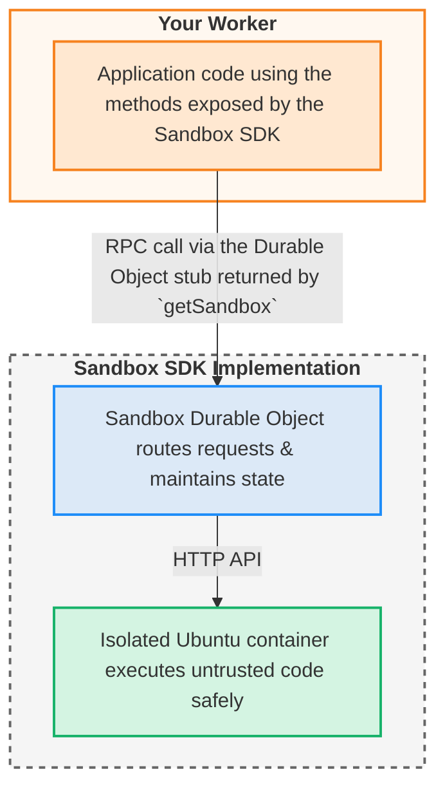

<page>
---
title: Overview · Cloudflare Sandbox SDK docs
description: The Sandbox SDK enables you to run untrusted code securely in
  isolated environments. Built on Containers, Sandbox SDK provides a simple API
  for executing commands, managing files, running background processes, and
  exposing services — all from your Workers applications.
lastUpdated: 2026-02-09T23:08:08.000Z
chatbotDeprioritize: false
source_url:
  html: https://developers.cloudflare.com/sandbox/
  md: https://developers.cloudflare.com/sandbox/index.md
---

Build secure, isolated code execution environments

Available on Workers Paid plan

The Sandbox SDK enables you to run untrusted code securely in isolated environments. Built on [Containers](https://developers.cloudflare.com/containers/), Sandbox SDK provides a simple API for executing commands, managing files, running background processes, and exposing services — all from your [Workers](https://developers.cloudflare.com/workers/) applications.

Sandboxes are ideal for building AI agents that need to execute code, interactive development environments, data analysis platforms, CI/CD systems, and any application that needs secure code execution at the edge. Each sandbox runs in its own isolated container with a full Linux environment, providing strong security boundaries while maintaining performance.

With Sandbox, you can execute Python scripts, run Node.js applications, analyze data, compile code, and perform complex computations — all with a simple TypeScript API and no infrastructure to manage.

* Execute Commands

  ```typescript
  import { getSandbox } from '@cloudflare/sandbox';


  export { Sandbox } from '@cloudflare/sandbox';


  export default {
    async fetch(request: Request, env: Env): Promise<Response> {
      const sandbox = getSandbox(env.Sandbox, 'user-123');


      // Execute a command and get the result
      const result = await sandbox.exec('python --version');


      return Response.json({
        output: result.stdout,
        exitCode: result.exitCode,
        success: result.success
      });
    }
  };
  ```

* Code Interpreter

  ```typescript
  import { getSandbox } from '@cloudflare/sandbox';


  export { Sandbox } from '@cloudflare/sandbox';


  export default {
    async fetch(request: Request, env: Env): Promise<Response> {
      const sandbox = getSandbox(env.Sandbox, 'user-123');


      // Create a Python execution context
      const ctx = await sandbox.createCodeContext({ language: 'python' });


      // Execute Python code with automatic result capture
      const result = await sandbox.runCode(`
  import pandas as pd
  data = {'product': ['A', 'B', 'C'], 'sales': [100, 200, 150]}
  df = pd.DataFrame(data)
  df['sales'].sum()  # Last expression is automatically returned
    `, { context: ctx });


        return Response.json({
          result: result.results?.[0]?.text,
          logs: result.logs
        });
      }
    };
  ```

* File Operations

  ```typescript
  import { getSandbox } from '@cloudflare/sandbox';


  export { Sandbox } from '@cloudflare/sandbox';


  export default {
    async fetch(request: Request, env: Env): Promise<Response> {
      const sandbox = getSandbox(env.Sandbox, 'user-123');


      // Create a project structure
      await sandbox.mkdir('/workspace/project/src', { recursive: true });


      // Write files
      await sandbox.writeFile(
        '/workspace/project/package.json',
        JSON.stringify({ name: 'my-app', version: '1.0.0' })
      );


      // Read a file back
      const content = await sandbox.readFile('/workspace/project/package.json');


      return Response.json({ content });
    }
  };
  ```

* File Watching

  ```typescript
  import { getSandbox } from '@cloudflare/sandbox';


  export { Sandbox } from '@cloudflare/sandbox';


  export default {
    async fetch(request: Request, env: Env): Promise<Response> {
      const sandbox = getSandbox(env.Sandbox, 'user-123');


      // Watch for file changes in real-time
      const watcher = await sandbox.watch('/workspace/src', {
        include: ['*.js', '*.ts'],
        onEvent: (event) => {
          console.log(`${event.type}: ${event.path}`);
          if (event.type === 'modify') {
            // Trigger rebuild or hot reload
            console.log('Code changed, recompiling...');
          }
        },
        onError: (error) => {
          console.error('Watch error:', error);
        }
      });


      // Stop watching when done
      setTimeout(() => watcher.stop(), 60000);


      return Response.json({ message: 'File watcher started' });
    }
  };
  ```

* Terminal Access

  ```typescript
  import { getSandbox } from '@cloudflare/sandbox';


  export { Sandbox } from '@cloudflare/sandbox';


  export default {
    async fetch(request: Request, env: Env): Promise<Response> {
      const url = new URL(request.url);


      // Terminal WebSocket connection
      if (url.pathname === '/ws/terminal') {
        const sandbox = getSandbox(env.Sandbox, 'user-123');
        return sandbox.terminal(request, { cols: 80, rows: 24 });
      }


      return Response.json({ message: 'Terminal endpoint' });
    }
  };
  ```

  Connect browser terminals directly to sandbox shells via WebSocket. Learn more: [Browser terminals](https://developers.cloudflare.com/sandbox/guides/browser-terminals/).

* WebSocket Connections

  ```typescript
  import { getSandbox } from '@cloudflare/sandbox';


  export { Sandbox } from '@cloudflare/sandbox';


  export default {
    async fetch(request: Request, env: Env): Promise<Response> {
      // Connect to WebSocket services in sandbox
      if (request.headers.get('Upgrade')?.toLowerCase() === 'websocket') {
        const sandbox = getSandbox(env.Sandbox, 'user-123');
        return await sandbox.wsConnect(request, 8080);
      }


      return Response.json({ message: 'WebSocket endpoint' });
    }
  };
  ```

  Connect to WebSocket servers running in sandboxes. Learn more: [WebSocket Connections](https://developers.cloudflare.com/sandbox/guides/websocket-connections/).

[Get started](https://developers.cloudflare.com/sandbox/get-started/)

[API Reference](https://developers.cloudflare.com/sandbox/api/)

***

## Features

### Execute commands securely

Run shell commands, Python scripts, Node.js applications, and more with streaming output support and automatic timeout handling.

[Learn about command execution](https://developers.cloudflare.com/sandbox/guides/execute-commands/)

### Manage files and processes

Read, write, and manipulate files in the sandbox filesystem. Run background processes, monitor output, and manage long-running operations.

[Learn about file operations](https://developers.cloudflare.com/sandbox/guides/manage-files/)

### Expose services with preview URLs

Expose HTTP services running in your sandbox with automatically generated preview URLs, perfect for interactive development environments and application hosting.

[Learn about preview URLs](https://developers.cloudflare.com/sandbox/guides/expose-services/)

### Execute code directly

Execute Python and JavaScript code with rich outputs including charts, tables, and images. Maintain persistent state between executions for AI-generated code and interactive workflows.

[Learn about code execution](https://developers.cloudflare.com/sandbox/guides/code-execution/)

### Build interactive terminals

Create browser-based terminal interfaces that connect directly to sandbox shells via WebSocket. Build collaborative terminals, interactive development environments, and real-time shell access with automatic reconnection.

[Learn about terminal UIs](https://developers.cloudflare.com/sandbox/guides/browser-terminals/)

### Persistent storage with object storage

Mount S3-compatible object storage (R2, S3, GCS, and more) as local filesystems. Access buckets using standard file operations with data that persists across sandbox lifecycles. Production deployment required.

[Learn about bucket mounting](https://developers.cloudflare.com/sandbox/guides/mount-buckets/)

### Watch files for real-time changes

Monitor files and directories for changes using native filesystem events. Perfect for building hot reloading development servers, build automation systems, and configuration monitoring tools.

[Learn about file watching](https://developers.cloudflare.com/sandbox/guides/file-watching/)

***

## Use Cases

Build powerful applications with Sandbox:

### AI Code Execution

Execute code generated by Large Language Models safely and reliably. Native integration with [Workers AI](https://developers.cloudflare.com/workers-ai/) models like GPT-OSS enables function calling with sandbox execution. Perfect for AI agents, code assistants, and autonomous systems that need to run untrusted code.

### Data Analysis & Notebooks

Create interactive data analysis environments with pandas, NumPy, and Matplotlib. Generate charts, tables, and visualizations with automatic rich output formatting.

### Interactive Development Environments

Build cloud IDEs, coding playgrounds, and collaborative development tools with full Linux environments and preview URLs.

### CI/CD & Build Systems

Run tests, compile code, and execute build pipelines in isolated environments with parallel execution and streaming logs.

***

## Related products

**[Containers](https://developers.cloudflare.com/containers/)**

Serverless container runtime that powers Sandbox, enabling you to run any containerized workload on the edge.

**[Workers AI](https://developers.cloudflare.com/workers-ai/)**

Run machine learning models and LLMs on the network. Combine with Sandbox for secure AI code execution workflows.

**[Durable Objects](https://developers.cloudflare.com/durable-objects/)**

Stateful coordination layer that enables Sandbox to maintain persistent environments with strong consistency.

***

## More resources

[Tutorials](https://developers.cloudflare.com/sandbox/tutorials/)

Explore complete examples including AI code execution, data analysis, and interactive environments.

[How-to Guides](https://developers.cloudflare.com/sandbox/guides/)

Learn how to solve specific problems and implement features with the Sandbox SDK.

[API Reference](https://developers.cloudflare.com/sandbox/api/)

Explore the complete API documentation for the Sandbox SDK.

[Concepts](https://developers.cloudflare.com/sandbox/concepts/)

Learn about the key concepts and architecture of the Sandbox SDK.

[Configuration](https://developers.cloudflare.com/sandbox/configuration/)

Learn about the configuration options for the Sandbox SDK.

[GitHub Repository](https://github.com/cloudflare/sandbox-sdk)

View the SDK source code, report issues, and contribute to the project.

[Beta Information](https://developers.cloudflare.com/sandbox/platform/beta-info/)

Learn about the Sandbox Beta, current status, and upcoming features.

[Pricing](https://developers.cloudflare.com/sandbox/platform/pricing/)

Understand Sandbox pricing based on the underlying Containers platform.

[Limits](https://developers.cloudflare.com/sandbox/platform/limits/)

Learn about resource limits, quotas, and best practices for working within them.

[Discord Community](https://discord.cloudflare.com)

Connect with the community on Discord. Ask questions, share what you're building, and get help from other developers.

</page>

<page>
---
title: 404 - Page Not Found · Cloudflare Sandbox SDK docs
chatbotDeprioritize: false
source_url:
  html: https://developers.cloudflare.com/sandbox/404/
  md: https://developers.cloudflare.com/sandbox/404/index.md
---

# 404

Check the URL, try using our [search](https://developers.cloudflare.com/search/) or try our LLM-friendly [llms.txt directory](https://developers.cloudflare.com/llms.txt).

</page>

<page>
---
title: API Reference · Cloudflare Sandbox SDK docs
description: The Sandbox SDK provides a comprehensive API for executing code,
  managing files, running processes, and exposing services in isolated
  sandboxes.
lastUpdated: 2026-02-09T23:08:08.000Z
chatbotDeprioritize: false
source_url:
  html: https://developers.cloudflare.com/sandbox/api/
  md: https://developers.cloudflare.com/sandbox/api/index.md
---

The Sandbox SDK provides a comprehensive API for executing code, managing files, running processes, and exposing services in isolated sandboxes.

[Lifecycle](https://developers.cloudflare.com/sandbox/api/lifecycle/)

Create and manage sandbox containers. Get sandbox instances, configure options, and clean up resources.

[Commands](https://developers.cloudflare.com/sandbox/api/commands/)

Execute commands and stream output. Run scripts, manage background processes, and capture execution results.

[Files](https://developers.cloudflare.com/sandbox/api/files/)

Read, write, and manage files in the sandbox filesystem. Includes directory operations and file metadata.

[File Watching](https://developers.cloudflare.com/sandbox/api/file-watching/)

Monitor real-time filesystem changes using native inotify. Build development tools, hot-reload systems, and responsive file processing.

[Code Interpreter](https://developers.cloudflare.com/sandbox/api/interpreter/)

Execute Python and JavaScript code with rich outputs including charts, tables, and formatted data.

[Ports](https://developers.cloudflare.com/sandbox/api/ports/)

Expose services running in the sandbox via preview URLs. Access web servers and APIs from the internet.

[Storage](https://developers.cloudflare.com/sandbox/api/storage/)

Mount S3-compatible buckets (R2, S3, GCS) as local filesystems for persistent data storage across sandbox lifecycles.

[Sessions](https://developers.cloudflare.com/sandbox/api/sessions/)

Create isolated execution contexts within a sandbox. Each session maintains its own shell state, environment variables, and working directory.

[Terminal](https://developers.cloudflare.com/sandbox/api/terminal/)

Connect browser-based terminal UIs to sandbox shells via WebSocket, with the xterm.js SandboxAddon for automatic reconnection and resize handling.

</page>

<page>
---
title: Concepts · Cloudflare Sandbox SDK docs
description: These pages explain how the Sandbox SDK works, why it's designed
  the way it is, and the concepts you need to understand to use it effectively.
lastUpdated: 2026-02-09T23:08:08.000Z
chatbotDeprioritize: false
source_url:
  html: https://developers.cloudflare.com/sandbox/concepts/
  md: https://developers.cloudflare.com/sandbox/concepts/index.md
---

These pages explain how the Sandbox SDK works, why it's designed the way it is, and the concepts you need to understand to use it effectively.

* [Architecture](https://developers.cloudflare.com/sandbox/concepts/architecture/) - How the SDK is structured and why
* [Sandbox lifecycle](https://developers.cloudflare.com/sandbox/concepts/sandboxes/) - Understanding sandbox states and behavior
* [Container runtime](https://developers.cloudflare.com/sandbox/concepts/containers/) - How code executes in isolated containers
* [Session management](https://developers.cloudflare.com/sandbox/concepts/sessions/) - When and how to use sessions
* [Preview URLs](https://developers.cloudflare.com/sandbox/concepts/preview-urls/) - How service exposure works
* [Security model](https://developers.cloudflare.com/sandbox/concepts/security/) - Isolation, validation, and safety mechanisms
* [Terminal connections](https://developers.cloudflare.com/sandbox/concepts/terminal/) - How browser terminal connections work

## Related resources

* [Tutorials](https://developers.cloudflare.com/sandbox/tutorials/) - Learn by building complete applications
* [How-to guides](https://developers.cloudflare.com/sandbox/guides/) - Solve specific problems
* [API reference](https://developers.cloudflare.com/sandbox/api/) - Technical details and method signatures

</page>

<page>
---
title: Configuration · Cloudflare Sandbox SDK docs
description: Configure your Sandbox SDK deployment with Wrangler, customize
  container images, and manage environment variables.
lastUpdated: 2026-02-10T11:20:23.000Z
chatbotDeprioritize: false
source_url:
  html: https://developers.cloudflare.com/sandbox/configuration/
  md: https://developers.cloudflare.com/sandbox/configuration/index.md
---

Configure your Sandbox SDK deployment with Wrangler, customize container images, and manage environment variables.

[Wrangler configuration](https://developers.cloudflare.com/sandbox/configuration/wrangler/)

Configure Durable Objects bindings, container images, and Worker settings in wrangler.jsonc.

[Dockerfile reference](https://developers.cloudflare.com/sandbox/configuration/dockerfile/)

Customize the sandbox container image with your own packages, tools, and configurations.

[Environment variables](https://developers.cloudflare.com/sandbox/configuration/environment-variables/)

Pass configuration and secrets to your sandboxes using environment variables.

[Transport modes](https://developers.cloudflare.com/sandbox/configuration/transport/)

Configure HTTP or WebSocket transport to optimize communication and avoid subrequest limits.

[Sandbox options](https://developers.cloudflare.com/sandbox/configuration/sandbox-options/)

Configure sandbox behavior with options like `keepAlive` for long-running processes.

## Related resources

* [Get Started guide](https://developers.cloudflare.com/sandbox/get-started/) - Initial setup walkthrough
* [Wrangler documentation](https://developers.cloudflare.com/workers/wrangler/) - Complete Wrangler reference
* [Docker documentation](https://docs.docker.com/engine/reference/builder/) - Dockerfile syntax
* [Security model](https://developers.cloudflare.com/sandbox/concepts/security/) - Understanding environment isolation

</page>

<page>
---
title: Getting started · Cloudflare Sandbox SDK docs
description: Build your first application with Sandbox SDK - a secure code
  execution environment. In this guide, you'll create a Worker that can execute
  Python code and work with files in isolated containers.
lastUpdated: 2026-02-06T17:12:25.000Z
chatbotDeprioritize: false
source_url:
  html: https://developers.cloudflare.com/sandbox/get-started/
  md: https://developers.cloudflare.com/sandbox/get-started/index.md
---

Build your first application with Sandbox SDK - a secure code execution environment. In this guide, you'll create a Worker that can execute Python code and work with files in isolated containers.

What you're building

A simple API that can safely execute Python code and perform file operations in isolated sandbox environments.

## Prerequisites

1. Sign up for a [Cloudflare account](https://dash.cloudflare.com/sign-up/workers-and-pages).
2. Install [`Node.js`](https://docs.npmjs.com/downloading-and-installing-node-js-and-npm).

Node.js version manager

Use a Node version manager like [Volta](https://volta.sh/) or [nvm](https://github.com/nvm-sh/nvm) to avoid permission issues and change Node.js versions. [Wrangler](https://developers.cloudflare.com/workers/wrangler/install-and-update/), discussed later in this guide, requires a Node version of `16.17.0` or later.

### Ensure Docker is running locally

Sandbox SDK uses [Docker](https://www.docker.com/) to build container images alongside your Worker.

You must have Docker running locally when you run `wrangler deploy`. For most people, the best way to install Docker is to follow the [docs for installing Docker Desktop](https://docs.docker.com/desktop/). Other tools like [Colima](https://github.com/abiosoft/colima) may also work.

You can check that Docker is running properly by running the `docker info` command in your terminal. If Docker is running, the command will succeed. If Docker is not running, the `docker info` command will hang or return an error including the message "Cannot connect to the Docker daemon".

## 1. Create a new project

Create a new Sandbox SDK project:

* npm

  ```sh
  npm create cloudflare@latest -- my-sandbox --template=cloudflare/sandbox-sdk/examples/minimal
  ```

* yarn

  ```sh
  yarn create cloudflare my-sandbox --template=cloudflare/sandbox-sdk/examples/minimal
  ```

* pnpm

  ```sh
  pnpm create cloudflare@latest my-sandbox --template=cloudflare/sandbox-sdk/examples/minimal
  ```

This creates a `my-sandbox` directory with everything you need:

* `src/index.ts` - Worker with sandbox integration
* `wrangler.jsonc` - Configuration for Workers and Containers
* `Dockerfile` - Container environment definition

```sh
cd my-sandbox
```

## 2. Explore the template

The template provides a minimal Worker that demonstrates core sandbox capabilities:

```typescript
import { getSandbox, proxyToSandbox, type Sandbox } from "@cloudflare/sandbox";


export { Sandbox } from "@cloudflare/sandbox";


type Env = {
  Sandbox: DurableObjectNamespace<Sandbox>;
};


export default {
  async fetch(request: Request, env: Env): Promise<Response> {
    const url = new URL(request.url);


    // Get or create a sandbox instance
    const sandbox = getSandbox(env.Sandbox, "my-sandbox");


    // Execute Python code
    if (url.pathname === "/run") {
      const result = await sandbox.exec('python3 -c "print(2 + 2)"');
      return Response.json({
        output: result.stdout,
        error: result.stderr,
        exitCode: result.exitCode,
        success: result.success,
      });
    }


    // Work with files
    if (url.pathname === "/file") {
      await sandbox.writeFile("/workspace/hello.txt", "Hello, Sandbox!");
      const file = await sandbox.readFile("/workspace/hello.txt");
      return Response.json({
        content: file.content,
      });
    }


    return new Response("Try /run or /file");
  },
};
```

**Key concepts**:

* `getSandbox()` - Gets or creates a sandbox instance by ID. Use the same ID to reuse the same sandbox instance across requests.
* `sandbox.exec()` - Execute shell commands in the sandbox and capture stdout, stderr, and exit codes.
* `sandbox.writeFile()` / `readFile()` - Write and read files in the sandbox filesystem.

## 3. Test locally

Start the development server:

```sh
npm run dev
# If you expect to have multiple sandbox instances, you can increase `max_instances`.
```

Note

First run builds the Docker container (2-3 minutes). Subsequent runs are much faster due to caching.

Test the endpoints:

```sh
# Execute Python code
curl http://localhost:8787/run


# File operations
curl http://localhost:8787/file
```

You should see JSON responses with the command output and file contents.

## 4. Deploy to production

Deploy your Worker and container:

```sh
npx wrangler deploy
```

This will:

1. Build your container image using Docker
2. Push it to Cloudflare's Container Registry
3. Deploy your Worker globally

Wait for provisioning

After first deployment, wait 2-3 minutes before making requests. The Worker deploys immediately, but the container needs time to provision.

Check deployment status:

```sh
npx wrangler containers list
```

## 5. Test your deployment

Visit your Worker URL (shown in deploy output):

```sh
# Replace with your actual URL
curl https://my-sandbox.YOUR_SUBDOMAIN.workers.dev/run
```

Your sandbox is now deployed and can execute code in isolated containers.

Preview URLs require custom domain

If you plan to expose ports from sandboxes (using `exposePort()` for preview URLs), you will need to set up a custom domain with wildcard DNS routing. The `.workers.dev` domain does not support the subdomain patterns required for preview URLs. See [Production Deployment](https://developers.cloudflare.com/sandbox/guides/production-deployment/) when you are ready to expose services.

## Understanding the configuration

Your `wrangler.jsonc` connects three pieces together:

* wrangler.jsonc

  ```jsonc
  {
    "containers": [
      {
        "class_name": "Sandbox",
        "image": "./Dockerfile",
        "instance_type": "lite",
        "max_instances": 1,
      },
    ],
    "durable_objects": {
      "bindings": [
        {
          "class_name": "Sandbox",
          "name": "Sandbox",
        },
      ],
    },
    "migrations": [
      {
        "new_sqlite_classes": ["Sandbox"],
        "tag": "v1",
      },
    ],
  }
  ```

* wrangler.toml

  ```toml
  [[containers]]
  class_name = "Sandbox"
  image = "./Dockerfile"
  instance_type = "lite"
  max_instances = 1


  [[durable_objects.bindings]]
  class_name = "Sandbox"
  name = "Sandbox"


  [[migrations]]
  new_sqlite_classes = [ "Sandbox" ]
  tag = "v1"
  ```

- **containers** - Defines the [container image, instance type, and resource limits](https://developers.cloudflare.com/workers/wrangler/configuration/#containers) for your sandbox environment. If you expect to have multiple sandbox instances, you can increase `max_instances`.
- **durable\_objects** - You need not be familiar with [Durable Objects](https://developers.cloudflare.com/durable-objects) to use Sandbox SDK, but if you'd like, you can [learn more about Cloudflare Containers and Durable Objects](https://developers.cloudflare.com/containers/get-started/#each-container-is-backed-by-its-own-durable-object). This configuration creates a [binding](https://developers.cloudflare.com/workers/runtime-apis/bindings#what-is-a-binding) that makes the `Sandbox` Durable Object accessible in your Worker code.
- **migrations** - Registers the `Sandbox` class, implemented by the Sandbox SDK, with [SQLite storage backend](https://developers.cloudflare.com/durable-objects/best-practices/access-durable-objects-storage) (required once)

For detailed configuration options including environment variables, secrets, and custom images, see the [Wrangler configuration reference](https://developers.cloudflare.com/sandbox/configuration/wrangler/).

## Next steps

Now that you have a working sandbox, explore more capabilities:

* [Code interpreter with Workers AI](https://developers.cloudflare.com/sandbox/tutorials/workers-ai-code-interpreter/) - Build an AI-powered code execution system
* [Execute commands](https://developers.cloudflare.com/sandbox/guides/execute-commands/) - Run shell commands and stream output
* [Manage files](https://developers.cloudflare.com/sandbox/guides/manage-files/) - Work with files and directories
* [Expose services](https://developers.cloudflare.com/sandbox/guides/expose-services/) - Get public URLs for services running in your sandbox
* [Production Deployment](https://developers.cloudflare.com/sandbox/guides/production-deployment/) - Set up custom domains for preview URLs
* [API reference](https://developers.cloudflare.com/sandbox/api/) - Complete API documentation

</page>

<page>
---
title: How-to guides · Cloudflare Sandbox SDK docs
description: These guides show you how to solve specific problems and implement
  features with the Sandbox SDK. Each guide focuses on a particular task and
  provides practical, production-ready solutions.
lastUpdated: 2025-10-21T14:02:11.000Z
chatbotDeprioritize: false
source_url:
  html: https://developers.cloudflare.com/sandbox/guides/
  md: https://developers.cloudflare.com/sandbox/guides/index.md
---

These guides show you how to solve specific problems and implement features with the Sandbox SDK. Each guide focuses on a particular task and provides practical, production-ready solutions.

[Run background processes](https://developers.cloudflare.com/sandbox/guides/background-processes/)

[Start and manage long-running services and applications.](https://developers.cloudflare.com/sandbox/guides/background-processes/)

[Browser terminals](https://developers.cloudflare.com/sandbox/guides/browser-terminals/)

[Connect browser-based terminals to sandbox shells using xterm.js or raw WebSockets.](https://developers.cloudflare.com/sandbox/guides/browser-terminals/)

[Use code interpreter](https://developers.cloudflare.com/sandbox/guides/code-execution/)

[Execute Python and JavaScript code with rich outputs.](https://developers.cloudflare.com/sandbox/guides/code-execution/)

[Execute commands](https://developers.cloudflare.com/sandbox/guides/execute-commands/)

[Run commands with streaming output, error handling, and shell access.](https://developers.cloudflare.com/sandbox/guides/execute-commands/)

[Expose services](https://developers.cloudflare.com/sandbox/guides/expose-services/)

[Create preview URLs and expose ports for web services.](https://developers.cloudflare.com/sandbox/guides/expose-services/)

[Watch filesystem changes](https://developers.cloudflare.com/sandbox/guides/file-watching/)

[Monitor files and directories in real-time to build responsive development tools and automation workflows.](https://developers.cloudflare.com/sandbox/guides/file-watching/)

[Work with Git](https://developers.cloudflare.com/sandbox/guides/git-workflows/)

[Clone repositories, manage branches, and automate Git operations.](https://developers.cloudflare.com/sandbox/guides/git-workflows/)

[Manage files](https://developers.cloudflare.com/sandbox/guides/manage-files/)

[Read, write, organize, and synchronize files in the sandbox.](https://developers.cloudflare.com/sandbox/guides/manage-files/)

[Mount buckets](https://developers.cloudflare.com/sandbox/guides/mount-buckets/)

[Mount S3-compatible object storage as local filesystems for persistent data storage.](https://developers.cloudflare.com/sandbox/guides/mount-buckets/)

[Deploy to Production](https://developers.cloudflare.com/sandbox/guides/production-deployment/)

[Set up custom domains for preview URLs in production.](https://developers.cloudflare.com/sandbox/guides/production-deployment/)

[Stream output](https://developers.cloudflare.com/sandbox/guides/streaming-output/)

[Handle real-time output from commands and processes.](https://developers.cloudflare.com/sandbox/guides/streaming-output/)

[WebSocket Connections](https://developers.cloudflare.com/sandbox/guides/websocket-connections/)

[Connect to WebSocket servers running in sandboxes.](https://developers.cloudflare.com/sandbox/guides/websocket-connections/)

## Related resources

* [Tutorials](https://developers.cloudflare.com/sandbox/tutorials/) - Step-by-step learning paths
* [API reference](https://developers.cloudflare.com/sandbox/api/) - Complete method documentation

</page>

<page>
---
title: Platform · Cloudflare Sandbox SDK docs
description: Information about the Sandbox SDK platform, including pricing,
  limits, and beta status.
lastUpdated: 2025-10-15T17:28:03.000Z
chatbotDeprioritize: false
source_url:
  html: https://developers.cloudflare.com/sandbox/platform/
  md: https://developers.cloudflare.com/sandbox/platform/index.md
---

Information about the Sandbox SDK platform, including pricing, limits, and beta status.

## Available resources

* [Pricing](https://developers.cloudflare.com/sandbox/platform/pricing/) - Understand costs based on the Containers platform
* [Limits](https://developers.cloudflare.com/sandbox/platform/limits/) - Resource limits and best practices
* [Beta Information](https://developers.cloudflare.com/sandbox/platform/beta-info/) - Current status and roadmap

Since Sandbox SDK is built on [Containers](https://developers.cloudflare.com/containers/), it shares the same underlying platform characteristics. Refer to these pages to understand how pricing and limits work for your sandbox deployments.

</page>

<page>
---
title: Tutorials · Cloudflare Sandbox SDK docs
description: Learn how to build applications with Sandbox SDK through
  step-by-step tutorials. Each tutorial takes 20-30 minutes.
lastUpdated: 2025-10-21T14:02:11.000Z
chatbotDeprioritize: false
source_url:
  html: https://developers.cloudflare.com/sandbox/tutorials/
  md: https://developers.cloudflare.com/sandbox/tutorials/index.md
---

Learn how to build applications with Sandbox SDK through step-by-step tutorials. Each tutorial takes 20-30 minutes.

[Code interpreter with Workers AI](https://developers.cloudflare.com/sandbox/tutorials/workers-ai-code-interpreter/)

[Build a code interpreter using Workers AI GPT-OSS model with the official workers-ai-provider package.](https://developers.cloudflare.com/sandbox/tutorials/workers-ai-code-interpreter/)

[Data persistence with R2](https://developers.cloudflare.com/sandbox/tutorials/persistent-storage/)

[Mount R2 buckets as local filesystem paths to persist data across sandbox lifecycles.](https://developers.cloudflare.com/sandbox/tutorials/persistent-storage/)

[Run Claude Code on a Sandbox](https://developers.cloudflare.com/sandbox/tutorials/claude-code/)

[Use Claude Code to implement a task in your GitHub repository.](https://developers.cloudflare.com/sandbox/tutorials/claude-code/)

[Build an AI code executor](https://developers.cloudflare.com/sandbox/tutorials/ai-code-executor/)

[Use Claude to generate Python code from natural language and execute it securely in sandboxes.](https://developers.cloudflare.com/sandbox/tutorials/ai-code-executor/)

[Analyze data with AI](https://developers.cloudflare.com/sandbox/tutorials/analyze-data-with-ai/)

[Upload CSV files, generate analysis code with Claude, and return visualizations.](https://developers.cloudflare.com/sandbox/tutorials/analyze-data-with-ai/)

[Automated testing pipeline](https://developers.cloudflare.com/sandbox/tutorials/automated-testing-pipeline/)

[Build a testing pipeline that clones Git repositories, installs dependencies, runs tests, and reports results.](https://developers.cloudflare.com/sandbox/tutorials/automated-testing-pipeline/)

[Build a code review bot](https://developers.cloudflare.com/sandbox/tutorials/code-review-bot/)

[Clone repositories, analyze code with Claude, and post review comments to GitHub PRs.](https://developers.cloudflare.com/sandbox/tutorials/code-review-bot/)

## Before you start

All tutorials assume you have:

* Completed the [Get Started guide](https://developers.cloudflare.com/sandbox/get-started/)
* Basic familiarity with [Workers](https://developers.cloudflare.com/workers/)
* [Docker](https://www.docker.com/) installed and running

## Related resources

* [How-to guides](https://developers.cloudflare.com/sandbox/guides/) - Solve specific problems
* [API reference](https://developers.cloudflare.com/sandbox/api/) - Complete SDK reference

</page>

<page>
---
title: File Watching · Cloudflare Sandbox SDK docs
description: Monitor filesystem changes in real-time using Linux's native
  inotify system. The file watching API provides efficient monitoring of files
  and directories with support for filtering, exclusions, and callback-based
  event handling.
lastUpdated: 2026-02-06T17:10:29.000Z
chatbotDeprioritize: false
source_url:
  html: https://developers.cloudflare.com/sandbox/api/file-watching/
  md: https://developers.cloudflare.com/sandbox/api/file-watching/index.md
---

Monitor filesystem changes in real-time using Linux's native inotify system. The file watching API provides efficient monitoring of files and directories with support for filtering, exclusions, and callback-based event handling.

## Methods

### `watch()`

Watch a directory for filesystem changes in real-time.

```ts
await sandbox.watch(path: string, options?: WatchOptions): Promise<WatchHandle>
```

**Parameters**:

* `path` - Absolute path or relative to `/workspace` (e.g., `/app/src` or `src`)

* `options` (optional):

  * `recursive` - Watch subdirectories recursively (default: `true`)
  * `include` - Glob patterns to include (e.g., `['*.ts', '*.js']`)
  * `exclude` - Glob patterns to exclude (default: `['.git', 'node_modules', '.DS_Store']`)
  * `signal` - AbortSignal to cancel the watch
  * `onEvent` - Callback for file change events
  * `onError` - Callback for watch errors

**Returns**: `WatchHandle` with `stop()` method and metadata properties

* JavaScript

  ```js
  // Watch entire project directory
  const watcher = await sandbox.watch("/workspace", {
    onEvent: (event) => {
      console.log(`${event.type}: ${event.path}`);
      console.log(`Is directory: ${event.isDirectory}`);
    },
    onError: (error) => {
      console.error("Watch error:", error.message);
    },
  });


  // Stop watching when done
  await watcher.stop();
  ```

* TypeScript

  ```ts
  // Watch entire project directory
  const watcher = await sandbox.watch('/workspace', {
    onEvent: (event) => {
      console.log(`${event.type}: ${event.path}`);
      console.log(`Is directory: ${event.isDirectory}`);
    },
    onError: (error) => {
      console.error('Watch error:', error.message);
    }
  });


  // Stop watching when done
  await watcher.stop();
  ```

- JavaScript

  ```js
  // Watch specific file types in a directory
  const watcher = await sandbox.watch("/workspace/src", {
    include: ["*.ts", "*.tsx"],
    exclude: ["*.test.ts", "dist"],
    onEvent: (event) => {
      if (event.type === "modify") {
        console.log(`TypeScript file modified: ${event.path}`);
      }
    },
  });
  ```

- TypeScript

  ```ts
  // Watch specific file types in a directory
  const watcher = await sandbox.watch('/workspace/src', {
    include: ['*.ts', '*.tsx'],
    exclude: ['*.test.ts', 'dist'],
    onEvent: (event) => {
      if (event.type === 'modify') {
        console.log(`TypeScript file modified: ${event.path}`);
      }
    }
  });
  ```

### `watchStream()`

Get raw SSE stream for file watching (advanced usage).

```ts
const stream = await sandbox.watchStream(path: string, options?: WatchRequest): Promise<ReadableStream<Uint8Array>>
```

Most users should use `watch()` instead, which provides a higher-level API with proper lifecycle management.

### `stopWatch()`

Stop a specific watch by ID.

```ts
await sandbox.stopWatch(watchId: string): Promise<{ success: boolean }>
```

**Parameters**:

* `watchId` - Watch ID from the WatchHandle

### `listWatches()`

List all active watches.

```ts
const result = await sandbox.listWatches(): Promise<WatchListResult>
```

**Returns**:

```ts
interface WatchListResult {
  success: boolean;
  watches: Array<{
    id: string;
    path: string;
    startedAt: string;
  }>;
  count: number;
  timestamp: string;
}
```

## Types

### `WatchHandle`

Handle returned from `watch()` to control and inspect the watch.

```ts
interface WatchHandle {
  /** Stop watching and clean up resources */
  stop(): Promise<void>;
  /** The watch ID (for debugging) */
  readonly id: string;
  /** The path being watched */
  readonly path: string;
}
```

### `WatchEvent`

File system change event passed to the `onEvent` callback.

```ts
interface WatchEvent {
  /** The type of change that occurred */
  type: WatchEventType;
  /** Absolute path to the file or directory that changed */
  path: string;
  /** Whether the changed path is a directory */
  isDirectory: boolean;
}
```

### `WatchEventType`

Types of filesystem changes that can be detected.

```ts
type WatchEventType = "create" | "modify" | "delete" | "rename";
```

* **`create`** - File or directory was created
* **`modify`** - File content or directory attributes changed
* **`delete`** - File or directory was deleted
* **`rename`** - File or directory was moved/renamed

### `WatchOptions`

Configuration options for watching directories.

```ts
interface WatchOptions {
  /** Watch subdirectories recursively (default: true) */
  recursive?: boolean;
  /** Glob patterns to include (e.g., ['*.ts', '*.js']) */
  include?: string[];
  /** Glob patterns to exclude (default: ['.git', 'node_modules', '.DS_Store']) */
  exclude?: string[];
  /** AbortSignal to cancel the watch */
  signal?: AbortSignal;
  /** Callback for file change events */
  onEvent?: (event: WatchEvent) => void;
  /** Callback for errors (e.g., watch process died) */
  onError?: (error: Error) => void;
}
```

## Notes

Container lifecycle

File watchers are automatically stopped when the sandbox container sleeps or is destroyed. You do not need to manually stop them on container shutdown.

Path requirements

All paths must exist when starting a watch. Watching non-existent paths returns an error. Create directories before watching them.

## Related resources

* [Watch filesystem changes guide](https://developers.cloudflare.com/sandbox/guides/file-watching/) - Patterns, best practices, and real-world examples

</page>

<page>
---
title: Commands · Cloudflare Sandbox SDK docs
description: Execute commands and manage background processes in the sandbox's
  isolated container environment.
lastUpdated: 2026-02-08T17:19:50.000Z
chatbotDeprioritize: false
source_url:
  html: https://developers.cloudflare.com/sandbox/api/commands/
  md: https://developers.cloudflare.com/sandbox/api/commands/index.md
---

Execute commands and manage background processes in the sandbox's isolated container environment.

## Methods

### `exec()`

Execute a command and return the complete result.

```ts
const result = await sandbox.exec(command: string, options?: ExecOptions): Promise<ExecuteResponse>
```

**Parameters**:

* `command` - The command to execute (can include arguments)

* `options` (optional):

  * `stream` - Enable streaming callbacks (default: `false`)
  * `onOutput` - Callback for real-time output: `(stream: 'stdout' | 'stderr', data: string) => void`
  * `timeout` - Maximum execution time in milliseconds
  * `env` - Environment variables for this command: `Record<string, string | undefined>`
  * `cwd` - Working directory for this command
  * `stdin` - Data to pass to the command's standard input (enables arbitrary input without shell injection risks)

**Returns**: `Promise<ExecuteResponse>` with `success`, `stdout`, `stderr`, `exitCode`

* JavaScript

  ```js
  const result = await sandbox.exec("npm run build");


  if (result.success) {
    console.log("Build output:", result.stdout);
  } else {
    console.error("Build failed:", result.stderr);
  }


  // With streaming
  await sandbox.exec("npm install", {
    stream: true,
    onOutput: (stream, data) => console.log(`[${stream}] ${data}`),
  });


  // With environment variables (undefined values are skipped)
  await sandbox.exec("node app.js", {
    env: {
      NODE_ENV: "production",
      PORT: "3000",
      DEBUG_MODE: undefined, // Skipped, uses container default or unset
    },
  });


  // Pass input via stdin (no shell injection risks)
  const result = await sandbox.exec("cat", {
    stdin: "Hello, world!",
  });
  console.log(result.stdout); // "Hello, world!"


  // Process user input safely
  const userInput = "user@example.com\nsecret123";
  await sandbox.exec("python process_login.py", {
    stdin: userInput,
  });
  ```

* TypeScript

  ```ts
  const result = await sandbox.exec('npm run build');


  if (result.success) {
    console.log('Build output:', result.stdout);
  } else {
    console.error('Build failed:', result.stderr);
  }


  // With streaming
  await sandbox.exec('npm install', {
    stream: true,
    onOutput: (stream, data) => console.log(`[${stream}] ${data}`)
  });


  // With environment variables (undefined values are skipped)
  await sandbox.exec('node app.js', {
    env: {
      NODE_ENV: 'production',
      PORT: '3000',
      DEBUG_MODE: undefined // Skipped, uses container default or unset
    }
  });


  // Pass input via stdin (no shell injection risks)
  const result = await sandbox.exec('cat', {
    stdin: 'Hello, world!'
  });
  console.log(result.stdout); // "Hello, world!"


  // Process user input safely
  const userInput = 'user@example.com\nsecret123';
  await sandbox.exec('python process_login.py', {
    stdin: userInput
  });
  ```

### `execStream()`

Execute a command and return a Server-Sent Events stream for real-time processing.

```ts
const stream = await sandbox.execStream(command: string, options?: ExecOptions): Promise<ReadableStream>
```

**Parameters**:

* `command` - The command to execute
* `options` - Same as `exec()` (including `stdin` support)

**Returns**: `Promise<ReadableStream>` emitting `ExecEvent` objects (`start`, `stdout`, `stderr`, `complete`, `error`)

* JavaScript

  ```js
  import { parseSSEStream } from "@cloudflare/sandbox";


  const stream = await sandbox.execStream("npm run build");


  for await (const event of parseSSEStream(stream)) {
    switch (event.type) {
      case "stdout":
        console.log("Output:", event.data);
        break;
      case "complete":
        console.log("Exit code:", event.exitCode);
        break;
      case "error":
        console.error("Failed:", event.error);
        break;
    }
  }


  // Stream with stdin input
  const inputStream = await sandbox.execStream(
    'python -c "import sys; print(sys.stdin.read())"',
    {
      stdin: "Data from Workers!",
    },
  );


  for await (const event of parseSSEStream(inputStream)) {
    if (event.type === "stdout") {
      console.log("Python received:", event.data);
    }
  }
  ```

* TypeScript

  ```ts
  import { parseSSEStream, type ExecEvent } from '@cloudflare/sandbox';


  const stream = await sandbox.execStream('npm run build');


  for await (const event of parseSSEStream<ExecEvent>(stream)) {
    switch (event.type) {
      case 'stdout':
        console.log('Output:', event.data);
        break;
      case 'complete':
        console.log('Exit code:', event.exitCode);
        break;
      case 'error':
        console.error('Failed:', event.error);
        break;
    }
  }


  // Stream with stdin input
  const inputStream = await sandbox.execStream('python -c "import sys; print(sys.stdin.read())"', {
    stdin: 'Data from Workers!'
  });


  for await (const event of parseSSEStream<ExecEvent>(inputStream)) {
    if (event.type === 'stdout') {
      console.log('Python received:', event.data);
    }
  }
  ```

### `startProcess()`

Start a long-running background process.

```ts
const process = await sandbox.startProcess(command: string, options?: ProcessOptions): Promise<Process>
```

**Parameters**:

* `command` - The command to start as a background process

* `options` (optional):

  * `cwd` - Working directory
  * `env` - Environment variables: `Record<string, string | undefined>`
  * `stdin` - Data to pass to the command's standard input
  * `timeout` - Maximum execution time in milliseconds
  * `processId` - Custom process ID
  * `encoding` - Output encoding (default: `'utf8'`)
  * `autoCleanup` - Whether to clean up process on sandbox sleep

**Returns**: `Promise<Process>` object with:

* `id` - Unique process identifier
* `pid` - System process ID
* `command` - The command being executed
* `status` - Current status (`'running'`, `'exited'`, etc.)
* `kill()` - Stop the process
* `getStatus()` - Get current status
* `getLogs()` - Get accumulated logs
* `waitForPort()` - Wait for process to listen on a port
* `waitForLog()` - Wait for pattern in process output
* `waitForExit()` - Wait for process to terminate and return exit code

- JavaScript

  ```js
  const server = await sandbox.startProcess("python -m http.server 8000");
  console.log("Started with PID:", server.pid);


  // With custom environment
  const app = await sandbox.startProcess("node app.js", {
    cwd: "/workspace/my-app",
    env: { NODE_ENV: "production", PORT: "3000" },
  });


  // Start process with stdin input (useful for interactive applications)
  const interactive = await sandbox.startProcess("python interactive_app.py", {
    stdin: "initial_config\nstart_mode\n",
  });
  ```

- TypeScript

  ```ts
  const server = await sandbox.startProcess('python -m http.server 8000');
  console.log('Started with PID:', server.pid);


  // With custom environment
  const app = await sandbox.startProcess('node app.js', {
    cwd: '/workspace/my-app',
    env: { NODE_ENV: 'production', PORT: '3000' }
  });


  // Start process with stdin input (useful for interactive applications)
  const interactive = await sandbox.startProcess('python interactive_app.py', {
    stdin: 'initial_config\nstart_mode\n'
  });
  ```

### `listProcesses()`

List all running processes.

```ts
const processes = await sandbox.listProcesses(): Promise<ProcessInfo[]>
```

* JavaScript

  ```js
  const processes = await sandbox.listProcesses();


  for (const proc of processes) {
    console.log(`${proc.id}: ${proc.command} (PID ${proc.pid})`);
  }
  ```

* TypeScript

  ```ts
  const processes = await sandbox.listProcesses();


  for (const proc of processes) {
    console.log(`${proc.id}: ${proc.command} (PID ${proc.pid})`);
  }
  ```

### `killProcess()`

Terminate a specific process and all of its child processes.

```ts
await sandbox.killProcess(processId: string, signal?: string): Promise<void>
```

**Parameters**:

* `processId` - The process ID (from `startProcess()` or `listProcesses()`)
* `signal` - Signal to send (default: `"SIGTERM"`)

Sends the signal to the entire process group, ensuring that both the main process and any child processes it spawned are terminated. This prevents orphaned processes from continuing to run after the parent is killed.

* JavaScript

  ```js
  const server = await sandbox.startProcess("python -m http.server 8000");
  await sandbox.killProcess(server.id);


  // Example with a process that spawns children
  const script = await sandbox.startProcess(
    'bash -c "sleep 10 & sleep 10 & wait"',
  );
  // killProcess terminates both sleep commands and the bash process
  await sandbox.killProcess(script.id);
  ```

* TypeScript

  ```ts
  const server = await sandbox.startProcess('python -m http.server 8000');
  await sandbox.killProcess(server.id);


  // Example with a process that spawns children
  const script = await sandbox.startProcess('bash -c "sleep 10 & sleep 10 & wait"');
  // killProcess terminates both sleep commands and the bash process
  await sandbox.killProcess(script.id);
  ```

### `killAllProcesses()`

Terminate all running processes.

```ts
await sandbox.killAllProcesses(): Promise<void>
```

* JavaScript

  ```js
  await sandbox.killAllProcesses();
  ```

* TypeScript

  ```ts
  await sandbox.killAllProcesses();
  ```

### `streamProcessLogs()`

Stream logs from a running process in real-time.

```ts
const stream = await sandbox.streamProcessLogs(processId: string): Promise<ReadableStream>
```

**Parameters**:

* `processId` - The process ID

**Returns**: `Promise<ReadableStream>` emitting `LogEvent` objects

* JavaScript

  ```js
  import { parseSSEStream } from "@cloudflare/sandbox";


  const server = await sandbox.startProcess("node server.js");
  const logStream = await sandbox.streamProcessLogs(server.id);


  for await (const log of parseSSEStream(logStream)) {
    console.log(`[${log.timestamp}] ${log.data}`);


    if (log.data.includes("Server started")) break;
  }
  ```

* TypeScript

  ```ts
  import { parseSSEStream, type LogEvent } from '@cloudflare/sandbox';


  const server = await sandbox.startProcess('node server.js');
  const logStream = await sandbox.streamProcessLogs(server.id);


  for await (const log of parseSSEStream<LogEvent>(logStream)) {
    console.log(`[${log.timestamp}] ${log.data}`);


    if (log.data.includes('Server started')) break;
  }
  ```

### `getProcessLogs()`

Get accumulated logs from a process.

```ts
const logs = await sandbox.getProcessLogs(processId: string): Promise<string>
```

**Parameters**:

* `processId` - The process ID

**Returns**: `Promise<string>` with all accumulated output

* JavaScript

  ```js
  const server = await sandbox.startProcess("node server.js");
  await new Promise((resolve) => setTimeout(resolve, 5000));


  const logs = await sandbox.getProcessLogs(server.id);
  console.log("Server logs:", logs);
  ```

* TypeScript

  ```ts
  const server = await sandbox.startProcess('node server.js');
  await new Promise(resolve => setTimeout(resolve, 5000));


  const logs = await sandbox.getProcessLogs(server.id);
  console.log('Server logs:', logs);
  ```

## Standard input (stdin)

All command execution methods support passing data to a command's standard input via the `stdin` option. This enables secure processing of user input without shell injection risks.

### How stdin works

When you provide the `stdin` option:

1. The input data is written to a temporary file inside the container
2. The command receives this data through its standard input stream
3. The temporary file is automatically cleaned up after execution

This approach prevents shell injection attacks that could occur when embedding user data directly in commands.

* JavaScript

  ```js
  // Safe: User input goes through stdin, not shell parsing
  const userInput = "user@domain.com; rm -rf /";
  const result = await sandbox.exec("python validate_email.py", {
    stdin: userInput,
  });


  // Instead of unsafe: `python validate_email.py "${userInput}"`
  // which could execute the embedded `rm -rf /` command
  ```

* TypeScript

  ```ts
  // Safe: User input goes through stdin, not shell parsing
  const userInput = 'user@domain.com; rm -rf /';
  const result = await sandbox.exec('python validate_email.py', {
    stdin: userInput
  });


  // Instead of unsafe: `python validate_email.py "${userInput}"`
  // which could execute the embedded `rm -rf /` command
  ```

### Common patterns

**Processing form data:**

* JavaScript

  ```js
  const formData = JSON.stringify({
    username: "john_doe",
    email: "john@example.com",
  });


  const result = await sandbox.exec("python process_form.py", {
    stdin: formData,
  });
  ```

* TypeScript

  ```ts
  const formData = JSON.stringify({
    username: 'john_doe',
    email: 'john@example.com'
  });


  const result = await sandbox.exec('python process_form.py', {
    stdin: formData
  });
  ```

**Interactive command-line tools:**

* JavaScript

  ```js
  // Simulate user responses to prompts
  const responses = "yes\nmy-app\n1.0.0\n";
  const result = await sandbox.exec("npm init", {
    stdin: responses,
  });
  ```

* TypeScript

  ```ts
  // Simulate user responses to prompts
  const responses = 'yes\nmy-app\n1.0.0\n';
  const result = await sandbox.exec('npm init', {
    stdin: responses
  });
  ```

**Data transformation:**

* JavaScript

  ```js
  const csvData = "name,age,city\nJohn,30,NYC\nJane,25,LA";
  const result = await sandbox.exec("python csv_processor.py", {
    stdin: csvData,
  });


  console.log("Processed data:", result.stdout);
  ```

* TypeScript

  ```ts
  const csvData = 'name,age,city\nJohn,30,NYC\nJane,25,LA';
  const result = await sandbox.exec('python csv_processor.py', {
    stdin: csvData
  });


  console.log('Processed data:', result.stdout);
  ```

## Process readiness methods

The `Process` object returned by `startProcess()` includes methods to wait for the process to be ready before proceeding.

### `process.waitForPort()`

Wait for a process to listen on a port.

```ts
await process.waitForPort(port: number, options?: WaitForPortOptions): Promise<void>
```

**Parameters**:

* `port` - The port number to check

* `options` (optional):

  * `mode` - Check mode: `'http'` (default) or `'tcp'`
  * `timeout` - Maximum wait time in milliseconds
  * `interval` - Check interval in milliseconds (default: `100`)
  * `path` - HTTP path to check (default: `'/'`, HTTP mode only)
  * `status` - Expected HTTP status range (default: `{ min: 200, max: 399 }`, HTTP mode only)

**HTTP mode** (default) makes an HTTP GET request and checks the response status:

* JavaScript

  ```js
  const server = await sandbox.startProcess("node server.js");


  // Wait for server to be ready (HTTP mode)
  await server.waitForPort(3000);


  // Check specific endpoint and status
  await server.waitForPort(8080, {
    path: "/health",
    status: { min: 200, max: 299 },
    timeout: 30000,
  });
  ```

* TypeScript

  ```ts
  const server = await sandbox.startProcess('node server.js');


  // Wait for server to be ready (HTTP mode)
  await server.waitForPort(3000);


  // Check specific endpoint and status
  await server.waitForPort(8080, {
    path: '/health',
    status: { min: 200, max: 299 },
    timeout: 30000
  });
  ```

**TCP mode** checks if the port accepts connections:

* JavaScript

  ```js
  const db = await sandbox.startProcess("redis-server");


  // Wait for database to accept connections
  await db.waitForPort(6379, {
    mode: "tcp",
    timeout: 10000,
  });
  ```

* TypeScript

  ```ts
  const db = await sandbox.startProcess('redis-server');


  // Wait for database to accept connections
  await db.waitForPort(6379, {
    mode: 'tcp',
    timeout: 10000
  });
  ```

**Throws**:

* `ProcessReadyTimeoutError` - If port does not become ready within timeout
* `ProcessExitedBeforeReadyError` - If process exits before becoming ready

### `process.waitForLog()`

Wait for a pattern to appear in process output.

```ts
const result = await process.waitForLog(pattern: string | RegExp, timeout?: number): Promise<WaitForLogResult>
```

**Parameters**:

* `pattern` - String or RegExp to match in stdout/stderr
* `timeout` - Maximum wait time in milliseconds (optional)

**Returns**: `Promise<WaitForLogResult>` with:

* `line` - The matching line of output
* `matches` - Array of capture groups (for RegExp patterns)

- JavaScript

  ```js
  const server = await sandbox.startProcess("node server.js");


  // Wait for string pattern
  const result = await server.waitForLog("Server listening");
  console.log("Ready:", result.line);


  // Wait for RegExp with capture groups
  const result = await server.waitForLog(/Server listening on port (\d+)/);
  console.log("Port:", result.matches[1]); // Extracted port number


  // With timeout
  await server.waitForLog("Ready", 30000);
  ```

- TypeScript

  ```ts
  const server = await sandbox.startProcess('node server.js');


  // Wait for string pattern
  const result = await server.waitForLog('Server listening');
  console.log('Ready:', result.line);


  // Wait for RegExp with capture groups
  const result = await server.waitForLog(/Server listening on port (\d+)/);
  console.log('Port:', result.matches[1]); // Extracted port number


  // With timeout
  await server.waitForLog('Ready', 30000);
  ```

**Throws**:

* `ProcessReadyTimeoutError` - If pattern is not found within timeout
* `ProcessExitedBeforeReadyError` - If process exits before pattern appears

### `process.waitForExit()`

Wait for a process to terminate and return the exit code.

```ts
const result = await process.waitForExit(timeout?: number): Promise<WaitForExitResult>
```

**Parameters**:

* `timeout` - Maximum wait time in milliseconds (optional)

**Returns**: `Promise<WaitForExitResult>` with:

* `exitCode` - The process exit code

- JavaScript

  ```js
  const build = await sandbox.startProcess("npm run build");


  // Wait for build to complete
  const result = await build.waitForExit();
  console.log("Build finished with exit code:", result.exitCode);


  // With timeout
  const result = await build.waitForExit(60000); // 60 second timeout
  ```

- TypeScript

  ```ts
  const build = await sandbox.startProcess('npm run build');


  // Wait for build to complete
  const result = await build.waitForExit();
  console.log('Build finished with exit code:', result.exitCode);


  // With timeout
  const result = await build.waitForExit(60000); // 60 second timeout
  ```

**Throws**:

* `ProcessReadyTimeoutError` - If process does not exit within timeout

## Related resources

* [Background processes guide](https://developers.cloudflare.com/sandbox/guides/background-processes/) - Managing long-running processes
* [Files API](https://developers.cloudflare.com/sandbox/api/files/) - File operations

</page>

<page>
---
title: Files · Cloudflare Sandbox SDK docs
description: Read, write, and manage files in the sandbox filesystem. All paths
  are absolute (e.g., /workspace/app.js).
lastUpdated: 2026-02-06T16:47:49.000Z
chatbotDeprioritize: false
source_url:
  html: https://developers.cloudflare.com/sandbox/api/files/
  md: https://developers.cloudflare.com/sandbox/api/files/index.md
---

Read, write, and manage files in the sandbox filesystem. All paths are absolute (e.g., `/workspace/app.js`).

## Methods

### `writeFile()`

Write content to a file.

```ts
await sandbox.writeFile(path: string, content: string, options?: WriteFileOptions): Promise<void>
```

**Parameters**:

* `path` - Absolute path to the file
* `content` - Content to write
* `options` (optional):
  * `encoding` - File encoding (`"utf-8"` or `"base64"`, default: `"utf-8"`)

- JavaScript

  ```js
  await sandbox.writeFile("/workspace/app.js", `console.log('Hello!');`);


  // Binary data
  await sandbox.writeFile("/tmp/image.png", base64Data, { encoding: "base64" });
  ```

- TypeScript

  ```ts
  await sandbox.writeFile('/workspace/app.js', `console.log('Hello!');`);


  // Binary data
  await sandbox.writeFile('/tmp/image.png', base64Data, { encoding: 'base64' });
  ```

Base64 validation

When using `encoding: 'base64'`, content must contain only valid base64 characters (A-Z, a-z, 0-9, +, /, =). Invalid base64 content returns a validation error.

### `readFile()`

Read a file from the sandbox.

```ts
const file = await sandbox.readFile(path: string, options?: ReadFileOptions): Promise<FileInfo>
```

**Parameters**:

* `path` - Absolute path to the file
* `options` (optional):
  * `encoding` - File encoding (`"utf-8"` or `"base64"`, default: auto-detected from MIME type)

**Returns**: `Promise<FileInfo>` with `content` and `encoding`

* JavaScript

  ```js
  const file = await sandbox.readFile("/workspace/package.json");
  const pkg = JSON.parse(file.content);


  // Binary data (auto-detected or forced)
  const image = await sandbox.readFile("/tmp/image.png", { encoding: "base64" });


  // Force encoding (override MIME detection)
  const textAsBase64 = await sandbox.readFile("/workspace/data.txt", {
    encoding: "base64",
  });
  ```

* TypeScript

  ```ts
  const file = await sandbox.readFile('/workspace/package.json');
  const pkg = JSON.parse(file.content);


  // Binary data (auto-detected or forced)
  const image = await sandbox.readFile('/tmp/image.png', { encoding: 'base64' });


  // Force encoding (override MIME detection)
  const textAsBase64 = await sandbox.readFile('/workspace/data.txt', { encoding: 'base64' });
  ```

Encoding behavior

When `encoding` is specified, it overrides MIME-based auto-detection. Without `encoding`, the SDK detects the appropriate encoding from the file's MIME type.

### `exists()`

Check if a file or directory exists.

```ts
const result = await sandbox.exists(path: string): Promise<FileExistsResult>
```

**Parameters**:

* `path` - Absolute path to check

**Returns**: `Promise<FileExistsResult>` with `exists` boolean

* JavaScript

  ```js
  const result = await sandbox.exists("/workspace/package.json");
  if (result.exists) {
    const file = await sandbox.readFile("/workspace/package.json");
    // process file
  }


  // Check directory
  const dirResult = await sandbox.exists("/workspace/src");
  if (!dirResult.exists) {
    await sandbox.mkdir("/workspace/src");
  }
  ```

* TypeScript

  ```ts
  const result = await sandbox.exists('/workspace/package.json');
  if (result.exists) {
    const file = await sandbox.readFile('/workspace/package.json');
    // process file
  }


  // Check directory
  const dirResult = await sandbox.exists('/workspace/src');
  if (!dirResult.exists) {
    await sandbox.mkdir('/workspace/src');
  }
  ```

Available on sessions

Both `sandbox.exists()` and `session.exists()` are supported.

### `mkdir()`

Create a directory.

```ts
await sandbox.mkdir(path: string, options?: MkdirOptions): Promise<void>
```

**Parameters**:

* `path` - Absolute path to the directory
* `options` (optional):
  * `recursive` - Create parent directories if needed (default: `false`)

- JavaScript

  ```js
  await sandbox.mkdir("/workspace/src");


  // Nested directories
  await sandbox.mkdir("/workspace/src/components/ui", { recursive: true });
  ```

- TypeScript

  ```ts
  await sandbox.mkdir('/workspace/src');


  // Nested directories
  await sandbox.mkdir('/workspace/src/components/ui', { recursive: true });
  ```

### `deleteFile()`

Delete a file.

```ts
await sandbox.deleteFile(path: string): Promise<void>
```

**Parameters**:

* `path` - Absolute path to the file

- JavaScript

  ```js
  await sandbox.deleteFile("/workspace/temp.txt");
  ```

- TypeScript

  ```ts
  await sandbox.deleteFile('/workspace/temp.txt');
  ```

### `renameFile()`

Rename a file.

```ts
await sandbox.renameFile(oldPath: string, newPath: string): Promise<void>
```

**Parameters**:

* `oldPath` - Current file path
* `newPath` - New file path

- JavaScript

  ```js
  await sandbox.renameFile("/workspace/draft.txt", "/workspace/final.txt");
  ```

- TypeScript

  ```ts
  await sandbox.renameFile('/workspace/draft.txt', '/workspace/final.txt');
  ```

### `moveFile()`

Move a file to a different directory.

```ts
await sandbox.moveFile(sourcePath: string, destinationPath: string): Promise<void>
```

**Parameters**:

* `sourcePath` - Current file path
* `destinationPath` - Destination path

- JavaScript

  ```js
  await sandbox.moveFile("/tmp/download.txt", "/workspace/data.txt");
  ```

- TypeScript

  ```ts
  await sandbox.moveFile('/tmp/download.txt', '/workspace/data.txt');
  ```

### `gitCheckout()`

Clone a git repository.

```ts
await sandbox.gitCheckout(repoUrl: string, options?: GitCheckoutOptions): Promise<void>
```

**Parameters**:

* `repoUrl` - Git repository URL

* `options` (optional):

  * `branch` - Branch to checkout (default: repository default branch)
  * `targetDir` - Directory to clone into (default: `/workspace/{repoName}`)
  * `depth` - Clone depth for shallow clones (e.g., `1` for latest commit only)

- JavaScript

  ```js
  await sandbox.gitCheckout("https://github.com/user/repo");


  // Specific branch
  await sandbox.gitCheckout("https://github.com/user/repo", {
    branch: "develop",
    targetDir: "/workspace/my-project",
  });


  // Shallow clone (faster for large repositories)
  await sandbox.gitCheckout("https://github.com/facebook/react", {
    depth: 1,
  });
  ```

- TypeScript

  ```ts
  await sandbox.gitCheckout('https://github.com/user/repo');


  // Specific branch
  await sandbox.gitCheckout('https://github.com/user/repo', {
    branch: 'develop',
    targetDir: '/workspace/my-project'
  });


  // Shallow clone (faster for large repositories)
  await sandbox.gitCheckout('https://github.com/facebook/react', {
    depth: 1
  });
  ```

## Related resources

* [Manage files guide](https://developers.cloudflare.com/sandbox/guides/manage-files/) - Detailed guide with best practices
* [Commands API](https://developers.cloudflare.com/sandbox/api/commands/) - Execute commands

</page>

<page>
---
title: Code Interpreter · Cloudflare Sandbox SDK docs
description: Execute Python, JavaScript, and TypeScript code with support for
  data visualizations, tables, and rich output formats. Contexts maintain state
  (variables, imports, functions) across executions.
lastUpdated: 2026-01-28T11:00:00.000Z
chatbotDeprioritize: false
source_url:
  html: https://developers.cloudflare.com/sandbox/api/interpreter/
  md: https://developers.cloudflare.com/sandbox/api/interpreter/index.md
---

Execute Python, JavaScript, and TypeScript code with support for data visualizations, tables, and rich output formats. Contexts maintain state (variables, imports, functions) across executions.

## Methods

### `createCodeContext()`

Create a persistent execution context for running code.

```ts
const context = await sandbox.createCodeContext(options?: CreateContextOptions): Promise<CodeContext>
```

**Parameters**:

* `options` (optional):

  * `language` - `"python" | "javascript" | "typescript"` (default: `"python"`)
  * `cwd` - Working directory (default: `"/workspace"`)
  * `envVars` - Environment variables
  * `timeout` - Request timeout in milliseconds (default: 30000)

**Returns**: `Promise<CodeContext>` with `id`, `language`, `cwd`, `createdAt`, `lastUsed`

* JavaScript

  ```js
  const ctx = await sandbox.createCodeContext({
    language: "python",
    envVars: { API_KEY: env.API_KEY },
  });
  ```

* TypeScript

  ```ts
  const ctx = await sandbox.createCodeContext({
    language: 'python',
    envVars: { API_KEY: env.API_KEY }
  });
  ```

### `runCode()`

Execute code in a context and return the complete result.

```ts
const result = await sandbox.runCode(code: string, options?: RunCodeOptions): Promise<ExecutionResult>
```

**Parameters**:

* `code` - The code to execute (required)

* `options` (optional):

  * `context` - Context to run in (recommended - see below)
  * `language` - `"python" | "javascript" | "typescript"` (default: `"python"`)
  * `timeout` - Execution timeout in milliseconds (default: 60000)
  * `onStdout`, `onStderr`, `onResult`, `onError` - Streaming callbacks

**Returns**: `Promise<ExecutionResult>` with:

* `code` - The executed code
* `logs` - `stdout` and `stderr` arrays
* `results` - Array of rich outputs (see [Rich Output Formats](#rich-output-formats))
* `error` - Execution error if any
* `executionCount` - Execution counter

**Recommended usage - create explicit context**:

* JavaScript

  ```js
  const ctx = await sandbox.createCodeContext({ language: "python" });


  await sandbox.runCode("import math; radius = 5", { context: ctx });
  const result = await sandbox.runCode("math.pi * radius ** 2", { context: ctx });


  console.log(result.results[0].text); // "78.53981633974483"
  ```

* TypeScript

  ```ts
  const ctx = await sandbox.createCodeContext({ language: 'python' });


  await sandbox.runCode('import math; radius = 5', { context: ctx });
  const result = await sandbox.runCode('math.pi * radius ** 2', { context: ctx });


  console.log(result.results[0].text); // "78.53981633974483"
  ```

Default context behavior

If no `context` is provided, a default context is automatically created/reused for the specified `language`. While convenient for quick tests, **explicitly creating contexts is recommended** for production use to maintain predictable state.

* JavaScript

  ```js
  const result = await sandbox.runCode(
    `
  data = [1, 2, 3, 4, 5]
  print(f"Sum: {sum(data)}")
  sum(data)
  `,
    { language: "python" },
  );


  console.log(result.logs.stdout); // ["Sum: 15"]
  console.log(result.results[0].text); // "15"
  ```

* TypeScript

  ```ts
  const result = await sandbox.runCode(`
  data = [1, 2, 3, 4, 5]
  print(f"Sum: {sum(data)}")
  sum(data)
  `, { language: 'python' });


  console.log(result.logs.stdout); // ["Sum: 15"]
  console.log(result.results[0].text); // "15"
  ```

**Error handling**:

* JavaScript

  ```js
  const result = await sandbox.runCode("x = 1 / 0", { language: "python" });


  if (result.error) {
    console.error(result.error.name); // "ZeroDivisionError"
    console.error(result.error.value); // "division by zero"
    console.error(result.error.traceback); // Stack trace array
  }
  ```

* TypeScript

  ```ts
  const result = await sandbox.runCode('x = 1 / 0', { language: 'python' });


  if (result.error) {
    console.error(result.error.name);      // "ZeroDivisionError"
    console.error(result.error.value);     // "division by zero"
    console.error(result.error.traceback); // Stack trace array
  }
  ```

**JavaScript and TypeScript features**:

JavaScript and TypeScript code execution supports top-level `await` and persistent variables across executions within the same context.

* JavaScript

  ```js
  const ctx = await sandbox.createCodeContext({ language: "javascript" });


  // Execution 1: Fetch data with top-level await
  await sandbox.runCode(
    `
  const response = await fetch('https://api.example.com/data');
  const data = await response.json();
  `,
    { context: ctx },
  );


  // Execution 2: Use the data from previous execution
  const result = await sandbox.runCode("console.log(data)", { context: ctx });
  console.log(result.logs.stdout); // Data persists across executions
  ```

* TypeScript

  ```ts
  const ctx = await sandbox.createCodeContext({ language: 'javascript' });


  // Execution 1: Fetch data with top-level await
  await sandbox.runCode(`
  const response = await fetch('https://api.example.com/data');
  const data = await response.json();
  `, { context: ctx });


  // Execution 2: Use the data from previous execution
  const result = await sandbox.runCode('console.log(data)', { context: ctx });
  console.log(result.logs.stdout); // Data persists across executions
  ```

Variables declared with `const`, `let`, or `var` persist across executions, enabling multi-step workflows:

* JavaScript

  ```js
  const ctx = await sandbox.createCodeContext({ language: "javascript" });


  await sandbox.runCode("const x = 10", { context: ctx });
  await sandbox.runCode("let y = 20", { context: ctx });
  const result = await sandbox.runCode("x + y", { context: ctx });


  console.log(result.results[0].text); // "30"
  ```

* TypeScript

  ```ts
  const ctx = await sandbox.createCodeContext({ language: 'javascript' });


  await sandbox.runCode('const x = 10', { context: ctx });
  await sandbox.runCode('let y = 20', { context: ctx });
  const result = await sandbox.runCode('x + y', { context: ctx });


  console.log(result.results[0].text); // "30"
  ```

### `listCodeContexts()`

List all active code execution contexts.

```ts
const contexts = await sandbox.listCodeContexts(): Promise<CodeContext[]>
```

* JavaScript

  ```js
  const contexts = await sandbox.listCodeContexts();
  console.log(`Found ${contexts.length} contexts`);
  ```

* TypeScript

  ```ts
  const contexts = await sandbox.listCodeContexts();
  console.log(`Found ${contexts.length} contexts`);
  ```

### `deleteCodeContext()`

Delete a code execution context and free its resources.

```ts
await sandbox.deleteCodeContext(contextId: string): Promise<void>
```

* JavaScript

  ```js
  const ctx = await sandbox.createCodeContext({ language: "python" });
  await sandbox.runCode('print("Hello")', { context: ctx });
  await sandbox.deleteCodeContext(ctx.id);
  ```

* TypeScript

  ```ts
  const ctx = await sandbox.createCodeContext({ language: 'python' });
  await sandbox.runCode('print("Hello")', { context: ctx });
  await sandbox.deleteCodeContext(ctx.id);
  ```

## Rich Output Formats

Results include: `text`, `html`, `png`, `jpeg`, `svg`, `latex`, `markdown`, `json`, `chart`, `data`

**Charts (matplotlib)**:

* JavaScript

  ```js
  const result = await sandbox.runCode(
    `
  import matplotlib.pyplot as plt
  import numpy as np


  x = np.linspace(0, 10, 100)
  plt.plot(x, np.sin(x))
  plt.show()
  `,
    { language: "python" },
  );


  if (result.results[0]?.png) {
    const imageBuffer = Buffer.from(result.results[0].png, "base64");
    return new Response(imageBuffer, {
      headers: { "Content-Type": "image/png" },
    });
  }
  ```

* TypeScript

  ```ts
  const result = await sandbox.runCode(`
  import matplotlib.pyplot as plt
  import numpy as np


  x = np.linspace(0, 10, 100)
  plt.plot(x, np.sin(x))
  plt.show()
  `, { language: 'python' });


  if (result.results[0]?.png) {
    const imageBuffer = Buffer.from(result.results[0].png, 'base64');
    return new Response(imageBuffer, {
      headers: { 'Content-Type': 'image/png' }
    });
  }
  ```

**Tables (pandas)**:

* JavaScript

  ```js
  const result = await sandbox.runCode(
    `
  import pandas as pd
  df = pd.DataFrame({'Name': ['Alice', 'Bob'], 'Age': [25, 30]})
  df
  `,
    { language: "python" },
  );


  if (result.results[0]?.html) {
    return new Response(result.results[0].html, {
      headers: { "Content-Type": "text/html" },
    });
  }
  ```

* TypeScript

  ```ts
  const result = await sandbox.runCode(`
  import pandas as pd
  df = pd.DataFrame({'Name': ['Alice', 'Bob'], 'Age': [25, 30]})
  df
  `, { language: 'python' });


  if (result.results[0]?.html) {
    return new Response(result.results[0].html, {
      headers: { 'Content-Type': 'text/html' }
    });
  }
  ```

## Related resources

* [Build an AI Code Executor](https://developers.cloudflare.com/sandbox/tutorials/ai-code-executor/) - Complete tutorial
* [Commands API](https://developers.cloudflare.com/sandbox/api/commands/) - Lower-level command execution
* [Files API](https://developers.cloudflare.com/sandbox/api/files/) - File operations

</page>

<page>
---
title: Lifecycle · Cloudflare Sandbox SDK docs
description: Create and manage sandbox containers. Get sandbox instances,
  configure options, and clean up resources.
lastUpdated: 2026-02-06T17:12:02.000Z
chatbotDeprioritize: false
source_url:
  html: https://developers.cloudflare.com/sandbox/api/lifecycle/
  md: https://developers.cloudflare.com/sandbox/api/lifecycle/index.md
---

Create and manage sandbox containers. Get sandbox instances, configure options, and clean up resources.

## Methods

### `getSandbox()`

Get or create a sandbox instance by ID.

```ts
const sandbox = getSandbox(
  binding: DurableObjectNamespace<Sandbox>,
  sandboxId: string,
  options?: SandboxOptions
): Sandbox
```

**Parameters**:

* `binding` - The Durable Object namespace binding from your Worker environment

* `sandboxId` - Unique identifier for this sandbox. The same ID always returns the same sandbox instance

* `options` (optional) - See [SandboxOptions](https://developers.cloudflare.com/sandbox/configuration/sandbox-options/) for all available options:

  * `sleepAfter` - Duration of inactivity before automatic sleep (default: `"10m"`)
  * `keepAlive` - Prevent automatic sleep entirely. Persists across hibernation (default: `false`)
  * `containerTimeouts` - Configure container startup timeouts
  * `normalizeId` - Lowercase sandbox IDs for preview URL compatibility (default: `false`)

**Returns**: `Sandbox` instance

Note

The container starts lazily on first operation. Calling `getSandbox()` returns immediately—the container only spins up when you execute a command, write a file, or perform other operations. See [Sandbox lifecycle](https://developers.cloudflare.com/sandbox/concepts/sandboxes/) for details.

* JavaScript

  ```js
  import { getSandbox } from "@cloudflare/sandbox";


  export default {
    async fetch(request, env) {
      const sandbox = getSandbox(env.Sandbox, "user-123");
      const result = await sandbox.exec("python script.py");
      return Response.json(result);
    },
  };
  ```

* TypeScript

  ```ts
  import { getSandbox } from '@cloudflare/sandbox';


  export default {
    async fetch(request: Request, env: Env): Promise<Response> {
      const sandbox = getSandbox(env.Sandbox, 'user-123');
      const result = await sandbox.exec('python script.py');
      return Response.json(result);
    }
  };
  ```

Warning

When using `keepAlive: true`, you **must** call `destroy()` when finished to prevent containers running indefinitely.

***

### `setKeepAlive()`

Enable or disable keepAlive mode dynamically after sandbox creation.

```ts
await sandbox.setKeepAlive(keepAlive: boolean): Promise<void>
```

**Parameters**:

* `keepAlive` - `true` to prevent automatic sleep, `false` to allow normal sleep behavior

When enabled, the sandbox automatically sends heartbeat pings every 30 seconds to prevent container eviction. When disabled, the sandbox returns to normal sleep behavior based on the `sleepAfter` configuration.

* JavaScript

  ```js
  const sandbox = getSandbox(env.Sandbox, "user-123");


  // Enable keepAlive for a long-running process
  await sandbox.setKeepAlive(true);
  await sandbox.startProcess("python long_running_analysis.py");


  // Later, disable keepAlive when done
  await sandbox.setKeepAlive(false);
  ```

* TypeScript

  ```ts
  const sandbox = getSandbox(env.Sandbox, 'user-123');


  // Enable keepAlive for a long-running process
  await sandbox.setKeepAlive(true);
  await sandbox.startProcess('python long_running_analysis.py');


  // Later, disable keepAlive when done
  await sandbox.setKeepAlive(false);
  ```

Heartbeat mechanism

When keepAlive is enabled, the sandbox automatically sends lightweight ping requests to the container every 30 seconds to prevent eviction. This happens transparently without affecting your application code.

Resource management

Containers with `keepAlive: true` will not automatically timeout. Always disable keepAlive or call `destroy()` when done to prevent containers running indefinitely.

***

### `destroy()`

Destroy the sandbox container and free up resources.

```ts
await sandbox.destroy(): Promise<void>
```

Immediately terminates the container and permanently deletes all state:

* All files in `/workspace`, `/tmp`, and `/home`
* All running processes
* All sessions (including the default session)
* Network connections and exposed ports

- JavaScript

  ```js
  async function executeCode(code) {
    const sandbox = getSandbox(env.Sandbox, `temp-${Date.now()}`);


    try {
      await sandbox.writeFile("/tmp/code.py", code);
      const result = await sandbox.exec("python /tmp/code.py");
      return result.stdout;
    } finally {
      await sandbox.destroy();
    }
  }
  ```

- TypeScript

  ```ts
  async function executeCode(code: string): Promise<string> {
    const sandbox = getSandbox(env.Sandbox, `temp-${Date.now()}`);


    try {
      await sandbox.writeFile('/tmp/code.py', code);
      const result = await sandbox.exec('python /tmp/code.py');
      return result.stdout;
    } finally {
      await sandbox.destroy();
    }
  }
  ```

Note

Containers automatically sleep after 10 minutes of inactivity but still count toward account limits. Use `destroy()` to immediately free up resources.

***

## Related resources

* [Sandbox lifecycle concept](https://developers.cloudflare.com/sandbox/concepts/sandboxes/) - Understanding container lifecycle and state
* [Sandbox options configuration](https://developers.cloudflare.com/sandbox/configuration/sandbox-options/) - Configure `keepAlive` and other options
* [Sessions API](https://developers.cloudflare.com/sandbox/api/sessions/) - Create isolated execution contexts within a sandbox

</page>

<page>
---
title: Ports · Cloudflare Sandbox SDK docs
description: Expose services running in your sandbox via public preview URLs.
  See Preview URLs concept for details.
lastUpdated: 2026-02-08T17:19:50.000Z
chatbotDeprioritize: false
source_url:
  html: https://developers.cloudflare.com/sandbox/api/ports/
  md: https://developers.cloudflare.com/sandbox/api/ports/index.md
---

Production requires custom domain

Preview URLs require a custom domain with wildcard DNS routing in production. See [Production Deployment](https://developers.cloudflare.com/sandbox/guides/production-deployment/).

Expose services running in your sandbox via public preview URLs. See [Preview URLs concept](https://developers.cloudflare.com/sandbox/concepts/preview-urls/) for details.

## Methods

### `exposePort()`

Expose a port and get a preview URL for accessing services running in the sandbox.

```ts
const response = await sandbox.exposePort(port: number, options: ExposePortOptions): Promise<ExposePortResponse>
```

**Parameters**:

* `port` - Port number to expose (1024-65535)

* `options`:

  * `hostname` - Your Worker's domain name (e.g., `'example.com'`). Required to construct preview URLs with wildcard subdomains like `https://8080-sandbox-abc123token.example.com`. Cannot be a `.workers.dev` domain as it doesn't support wildcard DNS patterns.
  * `name` - Friendly name for the port (optional)
  * `token` - Custom token for the preview URL (optional). Must be 1-16 characters containing only lowercase letters (a-z), numbers (0-9), hyphens (-), and underscores (\_). If not provided, a random 16-character token is generated automatically.

**Returns**: `Promise<ExposePortResponse>` with `port`, `url` (preview URL), `name`

* JavaScript

  ```js
  // Extract hostname from request
  const { hostname } = new URL(request.url);


  // Basic usage with auto-generated token
  await sandbox.startProcess("python -m http.server 8000");
  const exposed = await sandbox.exposePort(8000, { hostname });


  console.log("Available at:", exposed.url);
  // https://8000-sandbox-id-abc123random.yourdomain.com


  // With custom token for stable URLs across restarts
  const stable = await sandbox.exposePort(8080, {
    hostname,
    token: "my_service_v1", // 1-16 chars: a-z, 0-9, _
  });
  console.log("Stable URL:", stable.url);
  // https://8080-sandbox-id-my_service_v1.yourdomain.com


  // With custom token for stable URLs across deployments
  await sandbox.startProcess("node api.js");
  const api = await sandbox.exposePort(3000, {
    hostname,
    name: "api",
    token: "prod-api-v1", // URL stays same across restarts
  });


  console.log("Stable API URL:", api.url);
  // https://3000-sandbox-id-prod-api-v1.yourdomain.com


  // Multiple services with custom tokens
  await sandbox.startProcess("npm run dev");
  const frontend = await sandbox.exposePort(5173, {
    hostname,
    name: "frontend",
    token: "dev-ui",
  });
  ```

* TypeScript

  ```ts
  // Extract hostname from request
  const { hostname } = new URL(request.url);


  // Basic usage with auto-generated token
  await sandbox.startProcess('python -m http.server 8000');
  const exposed = await sandbox.exposePort(8000, { hostname });


  console.log('Available at:', exposed.url);
  // https://8000-sandbox-id-abc123random.yourdomain.com


  // With custom token for stable URLs across restarts
  const stable = await sandbox.exposePort(8080, {
    hostname,
    token: 'my_service_v1' // 1-16 chars: a-z, 0-9, _
  });
  console.log('Stable URL:', stable.url);
  // https://8080-sandbox-id-my_service_v1.yourdomain.com


  // With custom token for stable URLs across deployments
  await sandbox.startProcess('node api.js');
  const api = await sandbox.exposePort(3000, {
    hostname,
    name: 'api',
    token: 'prod-api-v1'  // URL stays same across restarts
  });


  console.log('Stable API URL:', api.url);
  // https://3000-sandbox-id-prod-api-v1.yourdomain.com


  // Multiple services with custom tokens
  await sandbox.startProcess('npm run dev');
  const frontend = await sandbox.exposePort(5173, {
    hostname,
    name: 'frontend',
    token: 'dev-ui'
  });
  ```

Local development

When using `wrangler dev`, you must add `EXPOSE` directives to your Dockerfile for each port. See [Expose Services guide](https://developers.cloudflare.com/sandbox/guides/expose-services/#local-development) for details.

## Custom Tokens for Stable URLs

Custom tokens enable consistent preview URLs across container restarts and deployments. This is useful for:

* **Production environments** - Share stable URLs with users or teams
* **Development workflows** - Maintain bookmarks and integrations
* **CI/CD pipelines** - Reference consistent URLs in tests or deployment scripts

**Token Requirements:**

* 1-16 characters in length
* Only lowercase letters (a-z), numbers (0-9), hyphens (-), and underscores (\_)
* Must be unique per sandbox (cannot reuse tokens across different ports)

- JavaScript

  ```js
  // Production API with stable URL
  const { url } = await sandbox.exposePort(8080, {
    hostname: "api.example.com",
    token: "v1-stable", // Always the same URL
  });


  // Error: Token collision prevention
  await sandbox.exposePort(8081, { hostname, token: "v1-stable" });
  // Throws: Token 'v1-stable' is already in use by port 8080


  // Success: Re-exposing same port with same token (idempotent)
  await sandbox.exposePort(8080, { hostname, token: "v1-stable" });
  // Works - same port, same token
  ```

- TypeScript

  ```ts
  // Production API with stable URL
  const { url } = await sandbox.exposePort(8080, {
    hostname: 'api.example.com',
    token: 'v1-stable'  // Always the same URL
  });


  // Error: Token collision prevention
  await sandbox.exposePort(8081, { hostname, token: 'v1-stable' });
  // Throws: Token 'v1-stable' is already in use by port 8080


  // Success: Re-exposing same port with same token (idempotent)
  await sandbox.exposePort(8080, { hostname, token: 'v1-stable' });
  // Works - same port, same token
  ```

### `validatePortToken()`

Validate if a token is authorized to access a specific exposed port. Useful for custom authentication or routing logic.

```ts
const isValid = await sandbox.validatePortToken(port: number, token: string): Promise<boolean>
```

**Parameters**:

* `port` - Port number to check
* `token` - Token to validate

**Returns**: `Promise<boolean>` - `true` if token is valid for the port, `false` otherwise

* JavaScript

  ```js
  // Custom validation in your Worker
  export default {
    async fetch(request, env) {
      const url = new URL(request.url);


      // Extract token from custom header or query param
      const customToken = request.headers.get("x-access-token");


      if (customToken) {
        const sandbox = getSandbox(env.Sandbox, "my-sandbox");
        const isValid = await sandbox.validatePortToken(8080, customToken);


        if (!isValid) {
          return new Response("Invalid token", { status: 403 });
        }
      }


      // Handle preview URL routing
      const proxyResponse = await proxyToSandbox(request, env);
      if (proxyResponse) return proxyResponse;


      // Your application routes
      return new Response("Not found", { status: 404 });
    },
  };
  ```

* TypeScript

  ```ts
  // Custom validation in your Worker
  export default {
    async fetch(request: Request, env: Env): Promise<Response> {
      const url = new URL(request.url);


      // Extract token from custom header or query param
      const customToken = request.headers.get('x-access-token');


      if (customToken) {
        const sandbox = getSandbox(env.Sandbox, 'my-sandbox');
        const isValid = await sandbox.validatePortToken(8080, customToken);


        if (!isValid) {
          return new Response('Invalid token', { status: 403 });
        }
      }


      // Handle preview URL routing
      const proxyResponse = await proxyToSandbox(request, env);
      if (proxyResponse) return proxyResponse;


      // Your application routes
      return new Response('Not found', { status: 404 });
    }
  };
  ```

### `unexposePort()`

Remove an exposed port and close its preview URL.

```ts
await sandbox.unexposePort(port: number): Promise<void>
```

**Parameters**:

* `port` - Port number to unexpose

- JavaScript

  ```js
  await sandbox.unexposePort(8000);
  ```

- TypeScript

  ```ts
  await sandbox.unexposePort(8000);
  ```

### `getExposedPorts()`

Get information about all currently exposed ports.

```ts
const response = await sandbox.getExposedPorts(): Promise<GetExposedPortsResponse>
```

**Returns**: `Promise<GetExposedPortsResponse>` with `ports` array (containing `port`, `exposedAt`, `name`)

* JavaScript

  ```js
  const { ports } = await sandbox.getExposedPorts();


  for (const port of ports) {
    console.log(`${port.name || port.port}: ${port.exposedAt}`);
  }
  ```

* TypeScript

  ```ts
  const { ports } = await sandbox.getExposedPorts();


  for (const port of ports) {
    console.log(`${port.name || port.port}: ${port.exposedAt}`);
  }
  ```

### `wsConnect()`

Connect to WebSocket servers running in the sandbox. Use this when your Worker needs to establish WebSocket connections with services in the sandbox.

**Common use cases:**

* Route incoming WebSocket upgrade requests with custom authentication or authorization
* Connect from your Worker to get real-time data from sandbox services

For exposing WebSocket services via public preview URLs, use `exposePort()` with `proxyToSandbox()` instead. See [WebSocket Connections guide](https://developers.cloudflare.com/sandbox/guides/websocket-connections/) for examples.

```ts
const response = await sandbox.wsConnect(request: Request, port: number): Promise<Response>
```

**Parameters**:

* `request` - Incoming WebSocket upgrade request
* `port` - Port number (1024-65535, excluding 3000)

**Returns**: `Promise<Response>` - WebSocket response establishing the connection

* JavaScript

  ```js
  import { getSandbox } from "@cloudflare/sandbox";


  export { Sandbox } from "@cloudflare/sandbox";


  export default {
    async fetch(request, env) {
      if (request.headers.get("Upgrade")?.toLowerCase() === "websocket") {
        const sandbox = getSandbox(env.Sandbox, "my-sandbox");
        return await sandbox.wsConnect(request, 8080);
      }


      return new Response("WebSocket endpoint", { status: 200 });
    },
  };
  ```

* TypeScript

  ```ts
  import { getSandbox } from "@cloudflare/sandbox";


  export { Sandbox } from "@cloudflare/sandbox";


  export default {
    async fetch(request: Request, env: Env): Promise<Response> {
      if (request.headers.get('Upgrade')?.toLowerCase() === 'websocket') {
        const sandbox = getSandbox(env.Sandbox, 'my-sandbox');
        return await sandbox.wsConnect(request, 8080);
      }


      return new Response('WebSocket endpoint', { status: 200 });
    }
  };
  ```

## Related resources

* [Preview URLs concept](https://developers.cloudflare.com/sandbox/concepts/preview-urls/) - How preview URLs work
* [Commands API](https://developers.cloudflare.com/sandbox/api/commands/) - Start background processes

</page>

<page>
---
title: Sessions · Cloudflare Sandbox SDK docs
description: Create isolated execution contexts within a sandbox. Each session
  maintains its own shell state, environment variables, and working directory.
  See Session management concept for details.
lastUpdated: 2026-02-09T23:08:08.000Z
chatbotDeprioritize: false
source_url:
  html: https://developers.cloudflare.com/sandbox/api/sessions/
  md: https://developers.cloudflare.com/sandbox/api/sessions/index.md
---

Create isolated execution contexts within a sandbox. Each session maintains its own shell state, environment variables, and working directory. See [Session management concept](https://developers.cloudflare.com/sandbox/concepts/sessions/) for details.

Note

Every sandbox has a default session that automatically maintains shell state. Create additional sessions when you need isolated shell contexts for different environments or parallel workflows. For sandbox-level operations like creating containers or destroying the entire sandbox, see the [Lifecycle API](https://developers.cloudflare.com/sandbox/api/lifecycle/).

## Methods

### `createSession()`

Create a new isolated execution session.

```ts
const session = await sandbox.createSession(options?: SessionOptions): Promise<ExecutionSession>
```

**Parameters**:

* `options` (optional):

  * `id` - Custom session ID (auto-generated if not provided)
  * `env` - Environment variables for this session: `Record<string, string | undefined>`
  * `cwd` - Working directory (default: `"/workspace"`)

**Returns**: `Promise<ExecutionSession>` with all sandbox methods bound to this session

* JavaScript

  ```js
  // Multiple isolated environments
  const prodSession = await sandbox.createSession({
    id: "prod",
    env: { NODE_ENV: "production", API_URL: "https://api.example.com" },
    cwd: "/workspace/prod",
  });


  const testSession = await sandbox.createSession({
    id: "test",
    env: {
      NODE_ENV: "test",
      API_URL: "http://localhost:3000",
      DEBUG_MODE: undefined, // Skipped, not set in this session
    },
    cwd: "/workspace/test",
  });


  // Run in parallel
  const [prodResult, testResult] = await Promise.all([
    prodSession.exec("npm run build"),
    testSession.exec("npm run build"),
  ]);
  ```

* TypeScript

  ```ts
  // Multiple isolated environments
  const prodSession = await sandbox.createSession({
    id: 'prod',
    env: { NODE_ENV: 'production', API_URL: 'https://api.example.com' },
    cwd: '/workspace/prod'
  });


  const testSession = await sandbox.createSession({
    id: 'test',
    env: {
      NODE_ENV: 'test',
      API_URL: 'http://localhost:3000',
      DEBUG_MODE: undefined // Skipped, not set in this session
    },
    cwd: '/workspace/test'
  });


  // Run in parallel
  const [prodResult, testResult] = await Promise.all([
    prodSession.exec('npm run build'),
    testSession.exec('npm run build')
  ]);
  ```

### `getSession()`

Retrieve an existing session by ID.

```ts
const session = await sandbox.getSession(sessionId: string): Promise<ExecutionSession>
```

**Parameters**:

* `sessionId` - ID of an existing session

**Returns**: `Promise<ExecutionSession>` bound to the specified session

* JavaScript

  ```js
  // First request - create session
  const session = await sandbox.createSession({ id: "user-123" });
  await session.exec("git clone https://github.com/user/repo.git");
  await session.exec("cd repo && npm install");


  // Second request - resume session (environment and cwd preserved)
  const session = await sandbox.getSession("user-123");
  const result = await session.exec("cd repo && npm run build");
  ```

* TypeScript

  ```ts
  // First request - create session
  const session = await sandbox.createSession({ id: 'user-123' });
  await session.exec('git clone https://github.com/user/repo.git');
  await session.exec('cd repo && npm install');


  // Second request - resume session (environment and cwd preserved)
  const session = await sandbox.getSession('user-123');
  const result = await session.exec('cd repo && npm run build');
  ```

***

### `deleteSession()`

Delete a session and clean up its resources.

```ts
const result = await sandbox.deleteSession(sessionId: string): Promise<SessionDeleteResult>
```

**Parameters**:

* `sessionId` - ID of the session to delete (cannot be `"default"`)

**Returns**: `Promise<SessionDeleteResult>` containing:

* `success` - Whether deletion succeeded
* `sessionId` - ID of the deleted session
* `timestamp` - Deletion timestamp

- JavaScript

  ```js
  // Create a temporary session for a specific task
  const tempSession = await sandbox.createSession({ id: "temp-task" });


  try {
    await tempSession.exec("npm run heavy-task");
  } finally {
    // Clean up the session when done
    await sandbox.deleteSession("temp-task");
  }
  ```

- TypeScript

  ```ts
  // Create a temporary session for a specific task
  const tempSession = await sandbox.createSession({ id: 'temp-task' });


  try {
    await tempSession.exec('npm run heavy-task');
  } finally {
    // Clean up the session when done
    await sandbox.deleteSession('temp-task');
  }
  ```

Warning

Deleting a session immediately terminates all running commands. The default session cannot be deleted.

***

### `setEnvVars()`

Set environment variables in the sandbox.

```ts
await sandbox.setEnvVars(envVars: Record<string, string | undefined>): Promise<void>
```

**Parameters**:

* `envVars` - Key-value pairs of environment variables to set or unset

  * `string` values: Set the environment variable
  * `undefined` or `null` values: Unset the environment variable

Warning

Call `setEnvVars()` **before** any other sandbox operations to ensure environment variables are available from the start.

* JavaScript

  ```js
  const sandbox = getSandbox(env.Sandbox, "user-123");


  // Set environment variables first
  await sandbox.setEnvVars({
    API_KEY: env.OPENAI_API_KEY,
    DATABASE_URL: env.DATABASE_URL,
    NODE_ENV: "production",
    OLD_TOKEN: undefined, // Unsets OLD_TOKEN if previously set
  });


  // Now commands can access these variables
  await sandbox.exec("python script.py");
  ```

* TypeScript

  ```ts
  const sandbox = getSandbox(env.Sandbox, 'user-123');


  // Set environment variables first
  await sandbox.setEnvVars({
    API_KEY: env.OPENAI_API_KEY,
    DATABASE_URL: env.DATABASE_URL,
    NODE_ENV: 'production',
    OLD_TOKEN: undefined // Unsets OLD_TOKEN if previously set
  });


  // Now commands can access these variables
  await sandbox.exec('python script.py');
  ```

***

## ExecutionSession methods

The `ExecutionSession` object has all sandbox methods bound to the specific session:

| Category | Methods |
| - | - |
| **Commands** | [`exec()`](https://developers.cloudflare.com/sandbox/api/commands/#exec), [`execStream()`](https://developers.cloudflare.com/sandbox/api/commands/#execstream) |
| **Processes** | [`startProcess()`](https://developers.cloudflare.com/sandbox/api/commands/#startprocess), [`listProcesses()`](https://developers.cloudflare.com/sandbox/api/commands/#listprocesses), [`killProcess()`](https://developers.cloudflare.com/sandbox/api/commands/#killprocess), [`killAllProcesses()`](https://developers.cloudflare.com/sandbox/api/commands/#killallprocesses), [`getProcessLogs()`](https://developers.cloudflare.com/sandbox/api/commands/#getprocesslogs), [`streamProcessLogs()`](https://developers.cloudflare.com/sandbox/api/commands/#streamprocesslogs) |
| **Files** | [`writeFile()`](https://developers.cloudflare.com/sandbox/api/files/#writefile), [`readFile()`](https://developers.cloudflare.com/sandbox/api/files/#readfile), [`mkdir()`](https://developers.cloudflare.com/sandbox/api/files/#mkdir), [`deleteFile()`](https://developers.cloudflare.com/sandbox/api/files/#deletefile), [`renameFile()`](https://developers.cloudflare.com/sandbox/api/files/#renamefile), [`moveFile()`](https://developers.cloudflare.com/sandbox/api/files/#movefile), [`gitCheckout()`](https://developers.cloudflare.com/sandbox/api/files/#gitcheckout) |
| **Environment** | [`setEnvVars()`](https://developers.cloudflare.com/sandbox/api/sessions/#setenvvars) |
| **Terminal** | [`terminal()`](https://developers.cloudflare.com/sandbox/api/terminal/#terminal) |
| **Code Interpreter** | [`createCodeContext()`](https://developers.cloudflare.com/sandbox/api/interpreter/#createcodecontext), [`runCode()`](https://developers.cloudflare.com/sandbox/api/interpreter/#runcode), [`listCodeContexts()`](https://developers.cloudflare.com/sandbox/api/interpreter/#listcodecontexts), [`deleteCodeContext()`](https://developers.cloudflare.com/sandbox/api/interpreter/#deletecodecontext) |

## Related resources

* [Session management concept](https://developers.cloudflare.com/sandbox/concepts/sessions/) - How sessions work
* [Commands API](https://developers.cloudflare.com/sandbox/api/commands/) - Execute commands

</page>

<page>
---
title: Storage · Cloudflare Sandbox SDK docs
description: Mount S3-compatible storage buckets (R2, S3, GCS) into the sandbox
  filesystem for persistent data access.
lastUpdated: 2026-02-08T17:20:18.000Z
chatbotDeprioritize: false
source_url:
  html: https://developers.cloudflare.com/sandbox/api/storage/
  md: https://developers.cloudflare.com/sandbox/api/storage/index.md
---

Mount S3-compatible storage buckets (R2, S3, GCS) into the sandbox filesystem for persistent data access.

## Methods

### `mountBucket()`

Mount an S3-compatible bucket to a local path in the sandbox.

```ts
await sandbox.mountBucket(
  bucket: string,
  mountPath: string,
  options: MountBucketOptions
): Promise<void>
```

**Parameters**:

* `bucket` - Bucket name (e.g., `"my-r2-bucket"`)
* `mountPath` - Local filesystem path to mount at (e.g., `"/data"`)
* `options` - Mount configuration (see [`MountBucketOptions`](#mountbucketoptions))

- JavaScript

  ```js
  // Mount R2 bucket to /data
  await sandbox.mountBucket("my-bucket", "/data", {
    endpoint: "https://YOUR_ACCOUNT_ID.r2.cloudflarestorage.com",
    provider: "r2",
  });


  // Read/write files directly
  const data = await sandbox.readFile("/data/config.json");
  await sandbox.writeFile("/data/results.json", JSON.stringify(data));


  // Mount with explicit credentials
  await sandbox.mountBucket("my-bucket", "/storage", {
    endpoint: "https://s3.amazonaws.com",
    credentials: {
      accessKeyId: env.AWS_ACCESS_KEY_ID,
      secretAccessKey: env.AWS_SECRET_ACCESS_KEY,
    },
  });


  // Read-only mount
  await sandbox.mountBucket("datasets", "/datasets", {
    endpoint: "https://YOUR_ACCOUNT_ID.r2.cloudflarestorage.com",
    readOnly: true,
  });


  // Mount a subdirectory within the bucket
  await sandbox.mountBucket("shared-bucket", "/user-data", {
    endpoint: "https://YOUR_ACCOUNT_ID.r2.cloudflarestorage.com",
    prefix: "/users/user-123/",
  });
  ```

- TypeScript

  ```ts
  // Mount R2 bucket to /data
  await sandbox.mountBucket('my-bucket', '/data', {
    endpoint: 'https://YOUR_ACCOUNT_ID.r2.cloudflarestorage.com',
    provider: 'r2'
  });


  // Read/write files directly
  const data = await sandbox.readFile('/data/config.json');
  await sandbox.writeFile('/data/results.json', JSON.stringify(data));


  // Mount with explicit credentials
  await sandbox.mountBucket('my-bucket', '/storage', {
    endpoint: 'https://s3.amazonaws.com',
    credentials: {
      accessKeyId: env.AWS_ACCESS_KEY_ID,
      secretAccessKey: env.AWS_SECRET_ACCESS_KEY
    }
  });


  // Read-only mount
  await sandbox.mountBucket('datasets', '/datasets', {
    endpoint: 'https://YOUR_ACCOUNT_ID.r2.cloudflarestorage.com',
    readOnly: true
  });


  // Mount a subdirectory within the bucket
  await sandbox.mountBucket('shared-bucket', '/user-data', {
    endpoint: 'https://YOUR_ACCOUNT_ID.r2.cloudflarestorage.com',
    prefix: '/users/user-123/'
  });
  ```

**Throws**:

* `InvalidMountPointError` - Invalid mount path or conflicts with existing mounts
* `BucketAccessError` - Bucket does not exist or insufficient permissions

Authentication

Credentials can be provided via:

1. Explicit `credentials` in options
2. Environment variables (`AWS_ACCESS_KEY_ID`, `AWS_SECRET_ACCESS_KEY`)
3. Automatic detection from bound R2 buckets

See the [Mount Buckets guide](https://developers.cloudflare.com/sandbox/guides/mount-buckets/) for detailed authentication options.

### `unmountBucket()`

Unmount a previously mounted bucket.

```ts
await sandbox.unmountBucket(mountPath: string): Promise<void>
```

**Parameters**:

* `mountPath` - Path where the bucket is mounted (e.g., `"/data"`)

- JavaScript

  ```js
  // Mount, process, unmount
  await sandbox.mountBucket("data", "/data", { endpoint: "..." });
  await sandbox.exec("python process.py");


  // Unmount
  await sandbox.unmountBucket("/data");
  ```

- TypeScript

  ```ts
  // Mount, process, unmount
  await sandbox.mountBucket('data', '/data', { endpoint: '...' });
  await sandbox.exec('python process.py');


  // Unmount
  await sandbox.unmountBucket('/data');
  ```

Automatic cleanup

Mounted buckets are automatically unmounted when the container is destroyed.

## Types

### `MountBucketOptions`

```ts
interface MountBucketOptions {
  endpoint: string;
  provider?: BucketProvider;
  credentials?: BucketCredentials;
  readOnly?: boolean;
  prefix?: string;
  s3fsOptions?: Record<string, string>;
}
```

**Fields**:

* `endpoint` (required) - S3-compatible endpoint URL

  * R2: `'https://YOUR_ACCOUNT_ID.r2.cloudflarestorage.com'`
  * S3: `'https://s3.amazonaws.com'`
  * GCS: `'https://storage.googleapis.com'`

* `provider` (optional) - Storage provider hint

  * Enables provider-specific optimizations
  * Values: `'r2'`, `'s3'`, `'gcs'`

* `credentials` (optional) - API credentials

  * Contains `accessKeyId` and `secretAccessKey`
  * If not provided, uses environment variables

* `readOnly` (optional) - Mount in read-only mode

  * Default: `false`

* `prefix` (optional) - Subdirectory within the bucket to mount

  * When specified, only contents under this prefix are visible at the mount point
  * Must start and end with `/` (e.g., `/data/uploads/`)
  * Default: Mount entire bucket

* `s3fsOptions` (optional) - Advanced s3fs mount flags

  * Example: `{ 'use_cache': '/tmp/cache' }`

### `BucketProvider`

Storage provider hint for automatic s3fs flag optimization.

```ts
type BucketProvider = "r2" | "s3" | "gcs";
```

* `'r2'` - Cloudflare R2 (recommended, applies `nomixupload` flag)
* `'s3'` - Amazon S3
* `'gcs'` - Google Cloud Storage

## Related resources

* [Mount Buckets guide](https://developers.cloudflare.com/sandbox/guides/mount-buckets/) - Complete bucket mounting walkthrough
* [Files API](https://developers.cloudflare.com/sandbox/api/files/) - Read and write files

</page>

<page>
---
title: Terminal · Cloudflare Sandbox SDK docs
description: Connect browser-based terminal UIs to sandbox shells via WebSocket.
lastUpdated: 2026-02-09T23:08:08.000Z
chatbotDeprioritize: false
source_url:
  html: https://developers.cloudflare.com/sandbox/api/terminal/
  md: https://developers.cloudflare.com/sandbox/api/terminal/index.md
---

Connect browser-based terminal UIs to sandbox shells via WebSocket. The server-side `terminal()` method proxies WebSocket connections to the container, and the client-side `SandboxAddon` integrates with xterm.js for terminal rendering.

## Server-side methods

### `terminal()`

Proxy a WebSocket upgrade request to create a terminal connection.

```ts
const response = await sandbox.terminal(request: Request, options?: PtyOptions): Promise<Response>
```

**Parameters**:

* `request` - WebSocket upgrade request from the browser (must include `Upgrade: websocket` header)

* `options` (optional):

  * `cols` - Terminal width in columns (default: `80`)
  * `rows` - Terminal height in rows (default: `24`)

**Returns**: `Promise<Response>` — WebSocket upgrade response

* JavaScript

  ```js
  // In your Worker's fetch handler
  return await sandbox.terminal(request, { cols: 120, rows: 30 });
  ```

* TypeScript

  ```ts
  // In your Worker's fetch handler
  return await sandbox.terminal(request, { cols: 120, rows: 30 });
  ```

Works with both [default and explicitly created sessions](https://developers.cloudflare.com/sandbox/concepts/sessions/):

* JavaScript

  ```js
  // Default session
  return await sandbox.terminal(request);


  // Specific session
  const session = await sandbox.getSession("dev");
  return await session.terminal(request);
  ```

* TypeScript

  ```ts
  // Default session
  return await sandbox.terminal(request);


  // Specific session
  const session = await sandbox.getSession('dev');
  return await session.terminal(request);
  ```

## Client-side addon

The `@cloudflare/sandbox/xterm` module provides `SandboxAddon` for xterm.js, which handles the WebSocket connection, reconnection, and terminal resize forwarding.

### `SandboxAddon`

```ts
import { SandboxAddon } from '@cloudflare/sandbox/xterm';


const addon = new SandboxAddon(options: SandboxAddonOptions);
```

**Options**:

* `getWebSocketUrl(params)` - Build the WebSocket URL for each connection attempt. Receives:

  * `sandboxId` - Target sandbox ID
  * `sessionId` (optional) - Target session ID
  * `origin` - WebSocket origin derived from `window.location` (for example, `wss://example.com`)

* `reconnect` - Enable automatic reconnection with exponential backoff (default: `true`)

* `onStateChange(state, error?)` - Callback for connection state changes

- JavaScript

  ```js
  import { Terminal } from "@xterm/xterm";
  import { SandboxAddon } from "@cloudflare/sandbox/xterm";


  const terminal = new Terminal({ cursorBlink: true });
  terminal.open(document.getElementById("terminal"));


  const addon = new SandboxAddon({
    getWebSocketUrl: ({ sandboxId, sessionId, origin }) => {
      const params = new URLSearchParams({ id: sandboxId });
      if (sessionId) params.set("session", sessionId);
      return `${origin}/ws/terminal?${params}`;
    },
    onStateChange: (state, error) => {
      console.log(`Terminal ${state}`, error);
    },
  });


  terminal.loadAddon(addon);
  addon.connect({ sandboxId: "my-sandbox" });
  ```

- TypeScript

  ```ts
  import { Terminal } from '@xterm/xterm';
  import { SandboxAddon } from '@cloudflare/sandbox/xterm';


  const terminal = new Terminal({ cursorBlink: true });
  terminal.open(document.getElementById('terminal'));


  const addon = new SandboxAddon({
    getWebSocketUrl: ({ sandboxId, sessionId, origin }) => {
      const params = new URLSearchParams({ id: sandboxId });
      if (sessionId) params.set('session', sessionId);
      return `${origin}/ws/terminal?${params}`;
    },
    onStateChange: (state, error) => {
      console.log(`Terminal ${state}`, error);
    }
  });


  terminal.loadAddon(addon);
  addon.connect({ sandboxId: 'my-sandbox' });
  ```

### `connect()`

Establish a connection to a sandbox terminal.

```ts
addon.connect(target: ConnectionTarget): void
```

**Parameters**:

* `target`:

  * `sandboxId` - Sandbox to connect to
  * `sessionId` (optional) - Session within the sandbox

Calling `connect()` with a new target disconnects from the current target and connects to the new one. Calling it with the same target while already connected is a no-op.

### `disconnect()`

Close the connection and stop any reconnection attempts.

```ts
addon.disconnect(): void
```

### Properties

| Property | Type | Description |
| - | - | - |
| `state` | `'disconnected' \| 'connecting' \| 'connected'` | Current connection state |
| `sandboxId` | `string \| undefined` | Current sandbox ID |
| `sessionId` | `string \| undefined` | Current session ID |

## WebSocket protocol

The `SandboxAddon` handles the WebSocket protocol automatically. These details are for building custom terminal clients without the addon. For a complete example, refer to [Connect without xterm.js](https://developers.cloudflare.com/sandbox/guides/browser-terminals/#connect-without-xtermjs).

### Connection lifecycle

1. Client opens a WebSocket to your Worker endpoint. Set `binaryType` to `arraybuffer`.
2. The server replays any **buffered output** from a previous connection as binary frames. This may arrive before the `ready` message.
3. The server sends a `ready` status message — the terminal is now accepting input.
4. Binary frames flow in both directions: UTF-8 encoded keystrokes from the client, terminal output (including ANSI escape sequences) from the server.
5. If the client disconnects, the PTY stays alive. Reconnecting to the same session replays buffered output so the terminal appears unchanged.

### Control messages (client to server)

Send JSON text frames to control the terminal.

**Resize** — update terminal dimensions (both `cols` and `rows` must be positive):

```json
{ "type": "resize", "cols": 120, "rows": 30 }
```

### Status messages (server to client)

The server sends JSON text frames for lifecycle events.

**Ready** — the PTY is initialized. Buffered output (if any) has already been sent:

```json
{ "type": "ready" }
```

**Exit** — the shell process has terminated:

```json
{ "type": "exit", "code": 0, "signal": "SIGTERM" }
```

**Error** — an error occurred (for example, invalid control message or session not found):

```json
{ "type": "error", "message": "Session not found" }
```

## Types

```ts
interface PtyOptions {
  cols?: number;
  rows?: number;
}


type ConnectionState = "disconnected" | "connecting" | "connected";


interface ConnectionTarget {
  sandboxId: string;
  sessionId?: string;
}


interface SandboxAddonOptions {
  getWebSocketUrl: (params: {
    sandboxId: string;
    sessionId?: string;
    origin: string;
  }) => string;
  reconnect?: boolean;
  onStateChange?: (state: ConnectionState, error?: Error) => void;
}
```

## Related resources

* [Terminal connections](https://developers.cloudflare.com/sandbox/concepts/terminal/) — How terminal connections work
* [Browser terminals](https://developers.cloudflare.com/sandbox/guides/browser-terminals/) — Step-by-step setup guide
* [Sessions API](https://developers.cloudflare.com/sandbox/api/sessions/) — Session management
* [Commands API](https://developers.cloudflare.com/sandbox/api/commands/) — Non-interactive command execution

</page>

<page>
---
title: Architecture · Cloudflare Sandbox SDK docs
description: "Sandbox SDK lets you execute untrusted code safely from your
  Workers. It combines three Cloudflare technologies to provide secure,
  stateful, and isolated execution:"
lastUpdated: 2026-02-10T11:20:23.000Z
chatbotDeprioritize: false
source_url:
  html: https://developers.cloudflare.com/sandbox/concepts/architecture/
  md: https://developers.cloudflare.com/sandbox/concepts/architecture/index.md
---

Sandbox SDK lets you execute untrusted code safely from your Workers. It combines three Cloudflare technologies to provide secure, stateful, and isolated execution:

* **Workers** - Your application logic that calls the Sandbox SDK
* **Durable Objects** - Persistent sandbox instances with unique identities
* **Containers** - Isolated Linux environments where code actually runs

## Architecture overview



### Layer 1: Client SDK

The developer-facing API you use in your Workers:

```typescript
import { getSandbox } from "@cloudflare/sandbox";


const sandbox = getSandbox(env.Sandbox, "my-sandbox");
const result = await sandbox.exec("python script.py");
```

**Purpose**: Provide a clean, type-safe TypeScript interface for all sandbox operations.

### Layer 2: Durable Object

Manages sandbox lifecycle and routing:

```typescript
export class Sandbox extends DurableObject<Env> {
  // Extends Cloudflare Container for isolation
  // Routes requests between client and container
  // Manages preview URLs and state
}
```

**Purpose**: Provide persistent, stateful sandbox instances with unique identities.

**Why Durable Objects**:

* **Persistent identity** - Same sandbox ID always routes to same instance
* **Container management** - Durable Object owns and manages the container lifecycle
* **Geographic distribution** - Sandboxes run close to users
* **Automatic scaling** - Cloudflare manages provisioning

### Layer 3: Container Runtime

Executes code in isolation with full Linux capabilities.

**Purpose**: Safely execute untrusted code.

**Why containers**:

* **VM-based isolation** - Each sandbox runs in its own VM
* **Full environment** - Ubuntu Linux with Python, Node.js, Git, etc.

## Communication transports

The SDK supports two transport protocols for communication between the Durable Object and container:

### HTTP transport (default)

Each SDK method makes a separate HTTP request to the container API. Simple, reliable, and works for most use cases.

```typescript
// Default behavior - uses HTTP
const sandbox = getSandbox(env.Sandbox, "my-sandbox");
await sandbox.exec("python script.py");
```

### WebSocket transport

Multiplexes all SDK calls over a single persistent WebSocket connection. Avoids [subrequest limits](https://developers.cloudflare.com/workers/platform/limits/#subrequests) when making many concurrent operations.

Enable WebSocket transport by setting the `SANDBOX_TRANSPORT` variable in your Worker's configuration:

* wrangler.jsonc

  ```jsonc
  {
    "vars": {
      "SANDBOX_TRANSPORT": "websocket"
    },
  }
  ```

* wrangler.toml

  ```toml
  [vars]
  SANDBOX_TRANSPORT = "websocket"
  ```

The transport layer is transparent to your application code - all SDK methods work identically regardless of transport. See [Transport modes](https://developers.cloudflare.com/sandbox/configuration/transport/) for details on when to use each transport and configuration examples.

## Request flow

When you execute a command:

```typescript
await sandbox.exec("python script.py");
```

**HTTP transport flow**:

1. **Client SDK** validates parameters and sends HTTP request to Durable Object
2. **Durable Object** authenticates and forwards HTTP request to container
3. **Container Runtime** validates inputs, executes command, captures output
4. **Response flows back** through all layers with proper error transformation

**WebSocket transport flow**:

1. **Client SDK** validates parameters and sends request over persistent WebSocket connection
2. **Durable Object** maintains WebSocket connection, multiplexes concurrent requests
3. **Container Runtime** adapts WebSocket messages to HTTP-style request/response
4. **Response flows back** over same WebSocket connection with proper error transformation

The WebSocket connection is established on first SDK call and reused for all subsequent operations, reducing overhead for high-frequency operations.

## Related resources

* [Sandbox lifecycle](https://developers.cloudflare.com/sandbox/concepts/sandboxes/) - How sandboxes are created and managed
* [Container runtime](https://developers.cloudflare.com/sandbox/concepts/containers/) - Inside the execution environment
* [Security model](https://developers.cloudflare.com/sandbox/concepts/security/) - How isolation and validation work
* [Session management](https://developers.cloudflare.com/sandbox/concepts/sessions/) - Advanced state management

</page>

<page>
---
title: Container runtime · Cloudflare Sandbox SDK docs
description: Each sandbox runs in an isolated Linux container with Python,
  Node.js, and common development tools pre-installed. For a complete list of
  pre-installed software and how to customize the container image, see
  Dockerfile reference.
lastUpdated: 2025-11-08T10:22:38.000Z
chatbotDeprioritize: false
source_url:
  html: https://developers.cloudflare.com/sandbox/concepts/containers/
  md: https://developers.cloudflare.com/sandbox/concepts/containers/index.md
---

Each sandbox runs in an isolated Linux container with Python, Node.js, and common development tools pre-installed. For a complete list of pre-installed software and how to customize the container image, see [Dockerfile reference](https://developers.cloudflare.com/sandbox/configuration/dockerfile/).

## Runtime software installation

Install additional software at runtime using standard package managers:

```bash
# Python packages
pip install scikit-learn tensorflow


# Node.js packages
npm install express


# System packages (requires apt-get update first)
apt-get update && apt-get install -y redis-server
```

## Filesystem

The container provides a standard Linux filesystem. You can read and write anywhere you have permissions.

**Standard directories**:

* `/workspace` - Default working directory for user code
* `/tmp` - Temporary files
* `/home` - User home directory
* `/usr/bin`, `/usr/local/bin` - Executable binaries

**Example**:

```typescript
await sandbox.writeFile('/workspace/app.py', 'print("Hello")');
await sandbox.writeFile('/tmp/cache.json', '{}');
await sandbox.exec('ls -la /workspace');
```

## Process management

Processes run as you'd expect in a regular Linux environment.

**Foreground processes** (`exec()`):

```typescript
const result = await sandbox.exec('npm test');
// Waits for completion, returns output
```

**Background processes** (`startProcess()`):

```typescript
const process = await sandbox.startProcess('node server.js');
// Returns immediately, process runs in background
```

## Network capabilities

**Outbound connections** work:

```bash
curl https://api.example.com/data
pip install requests
npm install express
```

**Inbound connections** require port exposure:

```typescript
const { hostname } = new URL(request.url);
await sandbox.startProcess('python -m http.server 8000');
const exposed = await sandbox.exposePort(8000, { hostname });
console.log(exposed.exposedAt); // Public URL
```

Local development

When using `wrangler dev`, you must add `EXPOSE` directives to your Dockerfile for each port. See [Local development with ports](https://developers.cloudflare.com/sandbox/guides/expose-services/#local-development).

**Localhost** works within sandbox:

```bash
redis-server &      # Start server
redis-cli ping      # Connect locally
```

## Security

**Between sandboxes** (isolated):

* Each sandbox is a separate container
* Filesystem, memory and network are all isolated

**Within sandbox** (shared):

* All processes see the same files
* Processes can communicate with each other
* Environment variables are session-scoped

To run untrusted code, use separate sandboxes per user:

```typescript
const sandbox = getSandbox(env.Sandbox, `user-${userId}`);
```

## Limitations

**Cannot**:

* Load kernel modules or access host hardware
* Run nested containers (no Docker-in-Docker)

## Related resources

* [Architecture](https://developers.cloudflare.com/sandbox/concepts/architecture/) - How containers fit in the system
* [Security model](https://developers.cloudflare.com/sandbox/concepts/security/) - Container isolation details
* [Sandbox lifecycle](https://developers.cloudflare.com/sandbox/concepts/sandboxes/) - Container lifecycle management

</page>

<page>
---
title: Preview URLs · Cloudflare Sandbox SDK docs
description: Preview URLs provide public HTTPS access to services running inside
  sandboxes. When you expose a port, you get a unique URL that proxies requests
  to your service.
lastUpdated: 2026-02-06T17:32:05.000Z
chatbotDeprioritize: false
source_url:
  html: https://developers.cloudflare.com/sandbox/concepts/preview-urls/
  md: https://developers.cloudflare.com/sandbox/concepts/preview-urls/index.md
---

Production requires custom domain

Preview URLs work in local development without configuration. For production, you need a custom domain with wildcard DNS routing. See [Production Deployment](https://developers.cloudflare.com/sandbox/guides/production-deployment/).

Preview URLs provide public HTTPS access to services running inside sandboxes. When you expose a port, you get a unique URL that proxies requests to your service.

```typescript
// Extract hostname from request
const { hostname } = new URL(request.url);


await sandbox.startProcess("python -m http.server 8000");
const exposed = await sandbox.exposePort(8000, { hostname });


console.log(exposed.url);
// Production: https://8000-sandbox-id-abc123random4567.yourdomain.com
// Local dev: http://localhost:8787/...
```

## URL Format

**Production**: `https://{port}-{sandbox-id}-{token}.yourdomain.com`

* With auto-generated token: `https://8080-abc123-random16chars12.yourdomain.com`
* With custom token: `https://8080-abc123-my-api-v1.yourdomain.com`

**Local development**: `http://localhost:8787/...`

## Token Types

### Auto-generated tokens (default)

When no custom token is specified, a random 16-character token is generated:

```typescript
const exposed = await sandbox.exposePort(8000, { hostname });
// https://8000-sandbox-id-abc123random4567.yourdomain.com
```

URLs with auto-generated tokens change when you unexpose and re-expose a port.

### Custom tokens for stable URLs

For production deployments or shared URLs, specify a custom token to maintain consistency across container restarts:

```typescript
const stable = await sandbox.exposePort(8000, {
  hostname,
  token: 'api-v1'
});
// https://8000-sandbox-id-api-v1.yourdomain.com
// Same URL every time ✓
```

**Token requirements:**

* 1-16 characters long
* Lowercase letters (a-z), numbers (0-9), hyphens (-), and underscores (\_) only
* Must be unique within each sandbox

**Use cases for custom tokens:**

* Production APIs with stable endpoints
* Sharing demo URLs with external users
* Documentation with consistent examples
* Integration testing with predictable URLs

## ID Case Sensitivity

Preview URLs extract the sandbox ID from the hostname to route requests. Since hostnames are case-insensitive (per RFC 3986), they're always lowercased: `8080-MyProject-123.yourdomain.com` becomes `8080-myproject-123.yourdomain.com`.

**The problem**: If you create a sandbox with `"MyProject-123"`, it exists as a Durable Object with that exact ID. But the preview URL routes to `"myproject-123"` (lowercased from the hostname). These are different Durable Objects, so your sandbox is unreachable via preview URL.

```typescript
// Problem scenario
const sandbox = getSandbox(env.Sandbox, 'MyProject-123');
// Durable Object ID: "MyProject-123"
await sandbox.exposePort(8080, { hostname });
// Preview URL: 8080-myproject-123-token123.yourdomain.com
// Routes to: "myproject-123" (different DO - doesn't exist!)
```

**The solution**: Use `normalizeId: true` to lowercase IDs when creating sandboxes:

```typescript
const sandbox = getSandbox(env.Sandbox, 'MyProject-123', {
  normalizeId: true
});
// Durable Object ID: "myproject-123" (lowercased)
// Preview URL: 8080-myproject-123-token123.yourdomain.com
// Routes to: "myproject-123" (same DO - works!)
```

Without `normalizeId: true`, `exposePort()` throws an error when the ID contains uppercase letters.

**Best practice**: Use lowercase IDs from the start (`'my-project-123'`). See [Sandbox options - normalizeId](https://developers.cloudflare.com/sandbox/configuration/sandbox-options/#normalizeid) for details.

## Request Routing

You must call `proxyToSandbox()` first in your Worker's fetch handler to route preview URL requests:

```typescript
import { proxyToSandbox, getSandbox } from "@cloudflare/sandbox";


export { Sandbox } from "@cloudflare/sandbox";


export default {
  async fetch(request, env) {
    // Handle preview URL routing first
    const proxyResponse = await proxyToSandbox(request, env);
    if (proxyResponse) return proxyResponse;


    // Your application routes
    // ...
  },
};
```

Requests flow: Browser → Your Worker → Durable Object (sandbox) → Your Service.

## Multiple Ports

Expose multiple services simultaneously:

```typescript
// Extract hostname from request
const { hostname } = new URL(request.url);


await sandbox.startProcess("node api.js"); // Port 3000
await sandbox.startProcess("node admin.js"); // Port 3001


const api = await sandbox.exposePort(3000, { hostname, name: "api" });
const admin = await sandbox.exposePort(3001, { hostname, name: "admin" });


// Each gets its own URL with unique tokens:
// https://3000-abc123-random16chars01.yourdomain.com
// https://3001-abc123-random16chars02.yourdomain.com
```

## What Works

* HTTP/HTTPS requests
* WebSocket connections
* Server-Sent Events
* All HTTP methods (GET, POST, PUT, DELETE, etc.)
* Request and response headers

## What Does Not Work

* Raw TCP/UDP connections
* Custom protocols (must wrap in HTTP)
* Ports outside range 1024-65535
* Port 3000 (used internally by the SDK)

## WebSocket Support

Preview URLs support WebSocket connections. When a WebSocket upgrade request hits an exposed port, the routing layer automatically handles the connection handshake.

```typescript
// Extract hostname from request
const { hostname } = new URL(request.url);


// Start a WebSocket server
await sandbox.startProcess("bun run ws-server.ts 8080");
const { url } = await sandbox.exposePort(8080, { hostname });


// Clients connect using WebSocket protocol
// Browser: new WebSocket('wss://8080-abc123-token123.yourdomain.com')


// Your Worker routes automatically
export default {
  async fetch(request, env) {
    const proxyResponse = await proxyToSandbox(request, env);
    if (proxyResponse) return proxyResponse;
  },
};
```

For custom routing scenarios where your Worker needs to control which sandbox or port to connect to based on request properties, see `wsConnect()` in the [Ports API](https://developers.cloudflare.com/sandbox/api/ports/#wsconnect).

## Security

Warning

Preview URLs are publicly accessible by default, but require a valid access token that is generated when you expose a port.

**Built-in security**:

* **Token-based access** - Each exposed port gets a unique token in the URL (for example, `https://8080-sandbox-abc123token456.yourdomain.com`)
* **HTTPS in production** - All traffic is encrypted with automatic TLS
* **Unpredictable URLs** - Auto-generated tokens are randomly generated and difficult to guess
* **Token collision prevention** - Custom tokens are validated to ensure uniqueness within each sandbox

**Add application-level authentication**:

For additional security, implement authentication within your application:

```python
from flask import Flask, request, abort


app = Flask(__name__)


@app.route('/data')
def get_data():
    # Check for your own authentication token
    auth_token = request.headers.get('Authorization')
    if auth_token != 'Bearer your-secret-token':
        abort(401)
    return {'data': 'protected'}
```

This adds a second layer of security on top of the URL token.

## Troubleshooting

### URL Not Accessible

Check if service is running and listening:

```typescript
// 1. Is service running?
const processes = await sandbox.listProcesses();


// 2. Is port exposed?
const ports = await sandbox.getExposedPorts();


// 3. Is service binding to 0.0.0.0 (not 127.0.0.1)?
// Good:
app.run((host = "0.0.0.0"), (port = 3000));


// Bad (localhost only):
app.run((host = "127.0.0.1"), (port = 3000));
```

### Production Errors

For custom domain issues, see [Production Deployment troubleshooting](https://developers.cloudflare.com/sandbox/guides/production-deployment/#troubleshooting).

### Local Development

Local development limitation

When using `wrangler dev`, you must expose ports in your Dockerfile:

```dockerfile
FROM docker.io/cloudflare/sandbox:0.3.3


# Required for local development
EXPOSE 3000
EXPOSE 8080
```

Without `EXPOSE`, you'll see: `connect(): Connection refused: container port not found`

This is **only required for local development**. In production, all container ports are automatically accessible.

## Related Resources

* [Production Deployment](https://developers.cloudflare.com/sandbox/guides/production-deployment/) - Set up custom domains for production
* [Expose Services](https://developers.cloudflare.com/sandbox/guides/expose-services/) - Practical patterns for exposing ports
* [Ports API](https://developers.cloudflare.com/sandbox/api/ports/) - Complete API reference
* [Security Model](https://developers.cloudflare.com/sandbox/concepts/security/) - Security best practices

</page>

<page>
---
title: Security model · Cloudflare Sandbox SDK docs
description: The Sandbox SDK is built on Containers, which run each sandbox in
  its own VM for strong isolation.
lastUpdated: 2025-11-08T10:22:38.000Z
chatbotDeprioritize: false
source_url:
  html: https://developers.cloudflare.com/sandbox/concepts/security/
  md: https://developers.cloudflare.com/sandbox/concepts/security/index.md
---

The Sandbox SDK is built on [Containers](https://developers.cloudflare.com/containers/), which run each sandbox in its own VM for strong isolation.

## Container isolation

Each sandbox runs in a separate VM, providing complete isolation:

* **Filesystem isolation** - Sandboxes cannot access other sandboxes' files
* **Process isolation** - Processes in one sandbox cannot see or affect others
* **Network isolation** - Sandboxes have separate network stacks
* **Resource limits** - CPU, memory, and disk quotas are enforced per sandbox

For complete security details about the underlying container platform, see [Containers architecture](https://developers.cloudflare.com/containers/platform-details/architecture/).

## Within a sandbox

All code within a single sandbox shares resources:

* **Filesystem** - All processes see the same files
* **Processes** - All sessions can see all processes
* **Network** - Processes can communicate via localhost

For complete isolation, use separate sandboxes per user:

```typescript
// Good - Each user in separate sandbox
const userSandbox = getSandbox(env.Sandbox, `user-${userId}`);


// Bad - Users sharing one sandbox
const shared = getSandbox(env.Sandbox, 'shared');
// Users can read each other's files!
```

## Input validation

### Command injection

Always validate user input before using it in commands:

```typescript
// Dangerous - user input directly in command
const filename = userInput;
await sandbox.exec(`cat ${filename}`);
// User could input: "file.txt; rm -rf /"


// Safe - validate input
const filename = userInput.replace(/[^a-zA-Z0-9._-]/g, '');
await sandbox.exec(`cat ${filename}`);


// Better - use file API
await sandbox.writeFile('/tmp/input', userInput);
await sandbox.exec('cat /tmp/input');
```

## Authentication

### Sandbox access

Sandbox IDs provide basic access control but aren't cryptographically secure. Add application-level authentication:

```typescript
export default {
  async fetch(request: Request, env: Env): Promise<Response> {
    const userId = await authenticate(request);
    if (!userId) {
      return new Response('Unauthorized', { status: 401 });
    }


    // User can only access their sandbox
    const sandbox = getSandbox(env.Sandbox, userId);
    return Response.json({ authorized: true });
  }
};
```

### Preview URLs

Preview URLs include randomly generated tokens. Anyone with the URL can access the service.

To revoke access, unexpose the port:

```typescript
await sandbox.unexposePort(8080);
```

```python
from flask import Flask, request, abort
import os


app = Flask(__name__)


def check_auth():
    token = request.headers.get('Authorization')
    if token != f"Bearer {os.environ['AUTH_TOKEN']}":
        abort(401)


@app.route('/api/data')
def get_data():
    check_auth()
    return {'data': 'protected'}
```

## Secrets management

Use environment variables, not hardcoded secrets:

```typescript
// Bad - hardcoded in file
await sandbox.writeFile('/workspace/config.js', `
  const API_KEY = 'sk_live_abc123';
`);


// Good - use environment variables
await sandbox.startProcess('node app.js', {
  env: {
    API_KEY: env.API_KEY,  // From Worker environment binding
  }
});
```

Clean up temporary sensitive data:

```typescript
try {
  await sandbox.writeFile('/tmp/sensitive.txt', secretData);
  await sandbox.exec('python process.py /tmp/sensitive.txt');
} finally {
  await sandbox.deleteFile('/tmp/sensitive.txt');
}
```

## What the SDK protects against

* Sandbox-to-sandbox access (VM isolation)
* Resource exhaustion (enforced quotas)
* Container escapes (VM-based isolation)

## What you must implement

* Authentication and authorization
* Input validation and sanitization
* Rate limiting
* Application-level security (SQL injection, XSS, etc.)

## Best practices

**Use separate sandboxes for isolation**:

```typescript
const sandbox = getSandbox(env.Sandbox, `user-${userId}`);
```

**Validate all inputs**:

```typescript
const safe = input.replace(/[^a-zA-Z0-9._-]/g, '');
await sandbox.exec(`command ${safe}`);
```

**Use environment variables for secrets**:

```typescript
await sandbox.startProcess('node app.js', {
  env: { API_KEY: env.API_KEY }
});
```

**Clean up temporary resources**:

```typescript
try {
  const sandbox = getSandbox(env.Sandbox, sessionId);
  await sandbox.exec('npm test');
} finally {
  await sandbox.destroy();
}
```

## Related resources

* [Containers architecture](https://developers.cloudflare.com/containers/platform-details/architecture/) - Underlying platform security
* [Sandbox lifecycle](https://developers.cloudflare.com/sandbox/concepts/sandboxes/) - Resource management

</page>

<page>
---
title: Sandbox lifecycle · Cloudflare Sandbox SDK docs
description: "A sandbox is an isolated execution environment where your code
  runs. Each sandbox:"
lastUpdated: 2026-02-06T17:02:18.000Z
chatbotDeprioritize: false
source_url:
  html: https://developers.cloudflare.com/sandbox/concepts/sandboxes/
  md: https://developers.cloudflare.com/sandbox/concepts/sandboxes/index.md
---

A sandbox is an isolated execution environment where your code runs. Each sandbox:

* Has a unique identifier (sandbox ID)
* Contains an isolated filesystem
* Runs in a dedicated Linux container
* Maintains state while the container is active
* Exists as a Cloudflare Durable Object

## Lifecycle states

### Creation

A sandbox is created the first time you reference its ID:

```typescript
const sandbox = getSandbox(env.Sandbox, "user-123");
await sandbox.exec('echo "Hello"'); // First request creates sandbox
```

### Active

The sandbox container is running and processing requests. All state remains available: files, running processes, shell sessions, and environment variables.

### Idle

After a period of inactivity (10 minutes by default, configurable via [`sleepAfter`](https://developers.cloudflare.com/sandbox/configuration/sandbox-options/)), the container stops to free resources. When the next request arrives, a fresh container starts. All previous state is lost and the environment resets to its initial state.

**Note**: Containers with [`keepAlive: true`](https://developers.cloudflare.com/sandbox/configuration/sandbox-options/#keepalive) never enter the idle state. They automatically send heartbeat pings every 30 seconds to prevent eviction.

### Destruction

Sandboxes are explicitly destroyed or automatically cleaned up:

```typescript
await sandbox.destroy();
// All files, processes, and state deleted permanently
```

## Container lifetime and state

Sandbox state exists only while the container is active. Understanding this is critical for building reliable applications.

**While the container is active** (typically minutes to hours of activity):

* Files written to `/workspace`, `/tmp`, `/home` remain available
* Background processes continue running
* Shell sessions maintain their working directory and environment
* Code interpreter contexts retain variables and imports

**When the container stops** (due to inactivity or explicit destruction):

* All files are deleted
* All processes terminate
* All shell state resets
* All code interpreter contexts are cleared

The next request creates a fresh container with a clean environment.

## Naming strategies

### Per-user sandboxes

```typescript
const sandbox = getSandbox(env.Sandbox, `user-${userId}`);
```

User's work persists while actively using the sandbox. Good for interactive environments, playgrounds, and notebooks where users work continuously.

### Per-session sandboxes

```typescript
const sessionId = `session-${Date.now()}-${Math.random()}`;
const sandbox = getSandbox(env.Sandbox, sessionId);
// Later:
await sandbox.destroy();
```

Fresh environment each time. Good for one-time execution, CI/CD, and isolated tests.

### Per-task sandboxes

```typescript
const sandbox = getSandbox(env.Sandbox, `build-${repoName}-${commit}`);
```

Idempotent operations with clear task-to-sandbox mapping. Good for builds, pipelines, and background jobs.

## Request routing

The first request to a sandbox determines its geographic location. Subsequent requests route to the same location.

**For global apps**:

* Option 1: Multiple sandboxes per user with region suffix (`user-123-us`, `user-123-eu`)
* Option 2: Single sandbox per user (simpler, but some users see higher latency)

## Lifecycle management

### When to destroy

```typescript
try {
  const sandbox = getSandbox(env.Sandbox, sessionId);
  await sandbox.exec("npm run build");
} finally {
  await sandbox.destroy(); // Clean up temporary sandboxes
}
```

**Destroy when**: Session ends, task completes, resources no longer needed

**Don't destroy**: Personal environments, long-running services

### Managing keepAlive containers

Containers with [`keepAlive: true`](https://developers.cloudflare.com/sandbox/configuration/sandbox-options/#keepalive) require explicit management since they do not timeout automatically:

```typescript
const sandbox = getSandbox(env.Sandbox, 'persistent-task', {
  keepAlive: true
});


// Later, when done with long-running work
await sandbox.setKeepAlive(false); // Allow normal timeout behavior
// Or explicitly destroy:
await sandbox.destroy();
```

### Handling container restarts

Containers restart after inactivity or failures. Design your application to handle state loss:

```typescript
// Check if required files exist before using them
const files = await sandbox.listFiles("/workspace");
if (!files.includes("data.json")) {
  // Reinitialize: container restarted and lost previous state
  await sandbox.writeFile("/workspace/data.json", initialData);
}


await sandbox.exec("python process.py");
```

## Version compatibility

The SDK automatically checks that your npm package version matches the Docker container image version. **Version mismatches can cause features to break or behave unexpectedly.**

**What happens**:

* On sandbox startup, the SDK queries the container's version
* If versions don't match, a warning is logged
* Some features may not work correctly if versions are incompatible

**When you might see warnings**:

* You updated the npm package (`npm install @cloudflare/sandbox@latest`) but forgot to update the `FROM` line in your Dockerfile

**How to fix**: Update your Dockerfile to match your npm package version. For example, if using `@cloudflare/sandbox@0.7.0`:

```dockerfile
# Default image (JavaScript/TypeScript)
FROM docker.io/cloudflare/sandbox:0.7.0


# Or Python image if you need Python support
FROM docker.io/cloudflare/sandbox:0.7.0-python
```

See [Dockerfile reference](https://developers.cloudflare.com/sandbox/configuration/dockerfile/) for details on image variants and extending the base image.

## Best practices

* **Name consistently** - Use clear, predictable naming schemes
* **Clean up temporary sandboxes** - Always destroy when done
* **Reuse long-lived sandboxes** - One per user is often sufficient
* **Batch operations** - Combine commands: `npm install && npm test && npm build`
* **Design for ephemeral state** - Containers restart after inactivity, losing all state

## Related resources

* [Architecture](https://developers.cloudflare.com/sandbox/concepts/architecture/) - How sandboxes fit in the system
* [Container runtime](https://developers.cloudflare.com/sandbox/concepts/containers/) - What runs inside sandboxes
* [Session management](https://developers.cloudflare.com/sandbox/concepts/sessions/) - Advanced state isolation
* [Lifecycle API](https://developers.cloudflare.com/sandbox/api/lifecycle/) - Create and manage sandboxes
* [Sessions API](https://developers.cloudflare.com/sandbox/api/sessions/) - Create and manage execution sessions

</page>

<page>
---
title: Session management · Cloudflare Sandbox SDK docs
description: Sessions are bash shell execution contexts within a sandbox. Think
  of them like terminal tabs or panes in the same container.
lastUpdated: 2025-11-08T10:22:38.000Z
chatbotDeprioritize: false
source_url:
  html: https://developers.cloudflare.com/sandbox/concepts/sessions/
  md: https://developers.cloudflare.com/sandbox/concepts/sessions/index.md
---

Sessions are bash shell execution contexts within a sandbox. Think of them like terminal tabs or panes in the same container.

* **Sandbox** = A computer (container)
* **Session** = A terminal shell session in that computer

## Default session

Every sandbox has a default session that maintains shell state between commands while the container is active:

```typescript
const sandbox = getSandbox(env.Sandbox, 'my-sandbox');


// These commands run in the default session
await sandbox.exec("cd /app");
await sandbox.exec("pwd");  // Output: /app


await sandbox.exec("export MY_VAR=hello");
await sandbox.exec("echo $MY_VAR");  // Output: hello
```

Working directory, environment variables, and exported variables carry over between commands. This state resets if the container restarts due to inactivity.

### Automatic session creation

The container automatically creates sessions on first use. If you reference a non-existent session ID, the container creates it with default settings:

```typescript
// This session doesn't exist yet
const result = await sandbox.exec('echo hello', { sessionId: 'new-session' });
// Container automatically creates 'new-session' with defaults:
// - cwd: '/workspace'
// - env: {} (empty)
```

This behavior is particularly relevant after deleting a session:

```typescript
// Create and configure a session
const session = await sandbox.createSession({
  id: 'temp',
  env: { MY_VAR: 'value' }
});


// Delete the session
await sandbox.deleteSession('temp');


// Using the same session ID again works - auto-created with defaults
const result = await sandbox.exec('echo $MY_VAR', { sessionId: 'temp' });
// Output: (empty) - MY_VAR is not set in the freshly created session
```

This auto-creation means you can't "break" commands by referencing non-existent sessions. However, custom configuration (environment variables, working directory) is lost after deletion.

## Creating sessions

Create additional sessions for isolated shell contexts:

```typescript
const buildSession = await sandbox.createSession({
  id: "build",
  env: { NODE_ENV: "production" },
  cwd: "/build"
});


const testSession = await sandbox.createSession({
  id: "test",
  env: { NODE_ENV: "test" },
  cwd: "/test"
});


// Different shell contexts
await buildSession.exec("npm run build");
await testSession.exec("npm test");
```

## What's isolated per session

Each session has its own:

**Shell environment**:

```typescript
await session1.exec("export MY_VAR=hello");
await session2.exec("echo $MY_VAR");  // Empty - different shell
```

**Working directory**:

```typescript
await session1.exec("cd /workspace/project1");
await session2.exec("pwd");  // Different working directory
```

**Environment variables** (set via `createSession` options):

```typescript
const session1 = await sandbox.createSession({
  env: { API_KEY: 'key-1' }
});
const session2 = await sandbox.createSession({
  env: { API_KEY: 'key-2' }
});
```

## What's shared

All sessions in a sandbox share:

**Filesystem**:

```typescript
await session1.writeFile('/workspace/file.txt', 'data');
await session2.readFile('/workspace/file.txt');  // Can read it
```

**Processes**:

```typescript
await session1.startProcess('node server.js');
await session2.listProcesses();  // Sees the server
```

## When to use sessions

**Use sessions when**:

* You need isolated shell state for different tasks
* Running parallel operations with different environments
* Keeping AI agent credentials separate from app runtime

**Example - separate dev and runtime environments**:

```typescript
// Phase 1: AI agent writes code (with API keys)
const devSession = await sandbox.createSession({
  id: "dev",
  env: { ANTHROPIC_API_KEY: env.ANTHROPIC_API_KEY }
});
await devSession.exec('ai-tool "build a web server"');


// Phase 2: Run the code (without API keys)
const appSession = await sandbox.createSession({
  id: "app",
  env: { PORT: "3000" }
});
await appSession.exec("node server.js");
```

**Use separate sandboxes when**:

* You need complete isolation (untrusted code)
* Different users require fully separated environments
* Independent resource allocation is needed

## Best practices

### Session cleanup

**Clean up temporary sessions** to free resources while keeping the sandbox running:

```typescript
try {
  const session = await sandbox.createSession({ id: 'temp' });
  await session.exec('command');
} finally {
  await sandbox.deleteSession('temp');
}
```

**Default session cannot be deleted**:

```typescript
// This throws an error
await sandbox.deleteSession('default');
// Error: Cannot delete default session. Use sandbox.destroy() instead.
```

### Filesystem isolation

**Sessions share filesystem** - file operations affect all sessions:

```typescript
// Bad - affects all sessions
await session.exec('rm -rf /workspace/*');


// For untrusted code isolation, use separate sandboxes
const userSandbox = getSandbox(env.Sandbox, userId);
```

## Related resources

* [Sandbox lifecycle](https://developers.cloudflare.com/sandbox/concepts/sandboxes/) - Understanding sandbox management
* [Sessions API](https://developers.cloudflare.com/sandbox/api/sessions/) - Complete session API reference

</page>

<page>
---
title: Terminal connections · Cloudflare Sandbox SDK docs
description: Terminal connections let browser-based UIs interact directly with
  sandbox shells. Instead of executing discrete commands with exec(), a terminal
  connection opens a persistent, bidirectional channel to a bash shell — the
  same model as SSH or a local terminal emulator.
lastUpdated: 2026-02-09T23:08:08.000Z
chatbotDeprioritize: false
source_url:
  html: https://developers.cloudflare.com/sandbox/concepts/terminal/
  md: https://developers.cloudflare.com/sandbox/concepts/terminal/index.md
---

Terminal connections let browser-based UIs interact directly with sandbox shells. Instead of executing discrete commands with `exec()`, a terminal connection opens a persistent, bidirectional channel to a bash shell — the same model as SSH or a local terminal emulator.

## How terminal connections work

Terminal connections use WebSockets to stream raw bytes between a browser terminal (like [xterm.js](https://xtermjs.org/)) and a pseudo-terminal (PTY) process running inside the sandbox container.

```txt
Browser (xterm.js) <-- WebSocket --> Worker <-- proxy --> Container PTY (bash)
```

1. The browser sends a WebSocket upgrade request to your Worker
2. Your Worker calls `sandbox.terminal(request)`, which proxies the upgrade to the container
3. The container spawns a bash shell attached to a PTY
4. Raw bytes flow bidirectionally — keystrokes in, terminal output out

This is fundamentally different from `exec()`:

* **`exec()`** runs a single command to completion and returns the result
* **`terminal()`** opens a persistent shell where users type commands interactively

## Output buffering

The container buffers terminal output in a ring buffer. When a client disconnects and reconnects, the server replays buffered output so the terminal appears unchanged. This means:

* Short network interruptions are invisible to users
* Reconnected terminals show previous output without re-running commands
* The buffer has a fixed size, so very old output may be lost

No client-side code is needed to handle buffering — the container manages it transparently.

## Automatic reconnection

Network interruptions are common in browser-based applications. Terminal connections handle this through a combination of server-side buffering (described above) and client-side reconnection with exponential backoff.

The `SandboxAddon` for xterm.js implements this automatically. If you are building a custom client, you are responsible for your own reconnection logic — the server-side buffering works regardless of which client connects. Refer to the [WebSocket protocol reference](https://developers.cloudflare.com/sandbox/api/terminal/#websocket-protocol) for details on the connection lifecycle.

## Session isolation

Each [session](https://developers.cloudflare.com/sandbox/concepts/sessions/) can have its own terminal with independent shell state:

```typescript
const devSession = await sandbox.createSession({
  id: "dev",
  cwd: "/workspace/frontend",
  env: { NODE_ENV: "development" },
});


const testSession = await sandbox.createSession({
  id: "test",
  cwd: "/workspace",
  env: { NODE_ENV: "test" },
});


// Each session's terminal has its own working directory,
// environment variables, and command history
```

Multiple browser clients can connect to the same session's terminal simultaneously — they all see the same shell output and can all send input. This enables collaborative terminal use cases.

## WebSocket protocol

Terminal connections use binary WebSocket frames for terminal I/O (for performance) and JSON text frames for control and status messages (for structure). This keeps the data path fast while still allowing structured communication for operations like terminal resizing.

For the full protocol specification, including the connection lifecycle and message formats, refer to the [Terminal API reference](https://developers.cloudflare.com/sandbox/api/terminal/#websocket-protocol).

## When to use terminals vs commands

| Use case | Approach |
| - | - |
| Run a command and get the result | `exec()` or `execStream()` |
| Interactive shell for end users | `terminal()` |
| Long-running process with real-time output | `startProcess()` + `streamProcessLogs()` |
| Collaborative terminal sharing | `terminal()` with shared session |

## Related resources

* [Terminal API reference](https://developers.cloudflare.com/sandbox/api/terminal/) — Method signatures and types
* [Browser terminals](https://developers.cloudflare.com/sandbox/guides/browser-terminals/) — Step-by-step setup guide
* [Session management](https://developers.cloudflare.com/sandbox/concepts/sessions/) — How sessions work
* [Architecture](https://developers.cloudflare.com/sandbox/concepts/architecture/) — Overall SDK design

</page>

<page>
---
title: Dockerfile reference · Cloudflare Sandbox SDK docs
description: Customize the sandbox container image with your own packages,
  tools, and configurations by extending the base runtime image.
lastUpdated: 2026-01-27T13:25:17.000Z
chatbotDeprioritize: false
source_url:
  html: https://developers.cloudflare.com/sandbox/configuration/dockerfile/
  md: https://developers.cloudflare.com/sandbox/configuration/dockerfile/index.md
---

Customize the sandbox container image with your own packages, tools, and configurations by extending the base runtime image.

## Base images

The Sandbox SDK provides multiple Ubuntu-based image variants. Choose the one that fits your use case:

| Image | Tag suffix | Use case |
| - | - | - |
| Default | (none) | Lean image for JavaScript/TypeScript workloads |
| Python | `-python` | Data science, ML, Python code execution |
| OpenCode | `-opencode` | AI coding agents with OpenCode CLI |

```dockerfile
# Default - lean, no Python
FROM docker.io/cloudflare/sandbox:0.7.0


# Python - includes Python 3.11 + data science packages
FROM docker.io/cloudflare/sandbox:0.7.0-python


# OpenCode - includes OpenCode CLI for AI coding
FROM docker.io/cloudflare/sandbox:0.7.0-opencode
```

Version synchronization required

Always match the Docker image version to your npm package version. If you're using `@cloudflare/sandbox@0.7.0`, use `docker.io/cloudflare/sandbox:0.7.0` (or variant) as your base image.

**Why this matters**: The SDK automatically checks version compatibility on startup. Mismatched versions can cause features to break or behave unexpectedly. If versions don't match, you'll see warnings in your logs.

See [Version compatibility](https://developers.cloudflare.com/sandbox/concepts/sandboxes/#version-compatibility) for troubleshooting version mismatch warnings.

### Default image

The default image is optimized for JavaScript and TypeScript workloads:

* Ubuntu 22.04 LTS base
* Node.js 20 LTS with npm
* Bun 1.x (JavaScript/TypeScript runtime)
* System utilities: curl, wget, git, jq, zip, unzip, file, procps, ca-certificates

### Python image

The `-python` variant includes everything in the default image plus:

* Python 3.11 with pip and venv
* Pre-installed packages: matplotlib, numpy, pandas, ipython

### OpenCode image

The `-opencode` variant includes everything in the default image plus:

* [OpenCode CLI](https://opencode.ai) for AI-powered coding agents

## Creating a custom image

Create a `Dockerfile` in your project root:

```dockerfile
FROM docker.io/cloudflare/sandbox:0.7.0-python


# Install additional Python packages
RUN pip install --no-cache-dir \
    scikit-learn==1.3.0 \
    tensorflow==2.13.0 \
    transformers==4.30.0


# Install Node.js packages globally
RUN npm install -g typescript ts-node prettier


# Install system packages
RUN apt-get update && apt-get install -y \
    postgresql-client \
    redis-tools \
    && rm -rf /var/lib/apt/lists/*
```

Update `wrangler.jsonc` to reference your Dockerfile:

```jsonc
{
  "containers": [
    {
      "class_name": "Sandbox",
      "image": "./Dockerfile",
    },
  ],
}
```

When you run `wrangler dev` or `wrangler deploy`, Wrangler automatically builds your Docker image and pushes it to Cloudflare's container registry. You don't need to manually build or publish images.

## Using arbitrary base images

You can add sandbox capabilities to any Docker image using the standalone binary. This approach lets you use your existing images without depending on the Cloudflare base images:

```dockerfile
FROM your-custom-image:tag


# Copy the sandbox binary from the official image
COPY --from=docker.io/cloudflare/sandbox:0.7.0 /container-server/sandbox /sandbox


ENTRYPOINT ["/sandbox"]
```

The `/sandbox` binary starts the HTTP API server that enables SDK communication. You can optionally run your own startup command:

```dockerfile
FROM node:20-slim


COPY --from=docker.io/cloudflare/sandbox:0.7.0 /container-server/sandbox /sandbox


# Copy your application
COPY . /app
WORKDIR /app


ENTRYPOINT ["/sandbox"]
CMD ["node", "server.js"]
```

When using `CMD`, the sandbox binary runs your command as a child process with proper signal forwarding.

## Custom startup scripts

For more complex startup sequences, create a custom startup script:

```dockerfile
FROM docker.io/cloudflare/sandbox:0.7.0-python


COPY my-app.js /workspace/my-app.js
COPY startup.sh /workspace/startup.sh
RUN chmod +x /workspace/startup.sh


ENTRYPOINT ["/sandbox"]
CMD ["/workspace/startup.sh"]
```

```bash
#!/bin/bash


# Start your services in the background
node /workspace/my-app.js &


# Start additional services
redis-server --daemonize yes
until redis-cli ping; do sleep 1; done


# Keep the script running (the sandbox binary handles the API server)
wait
```

Legacy startup scripts

If you have existing startup scripts that end with `exec bun /container-server/dist/index.js`, they will continue to work for backwards compatibility. However, we recommend migrating to the new approach using `ENTRYPOINT ["/sandbox"]` with `CMD` for your startup script.

## Related resources

* [Image Management](https://developers.cloudflare.com/containers/platform-details/image-management/) - Building and pushing images to Cloudflare's registry
* [Wrangler configuration](https://developers.cloudflare.com/sandbox/configuration/wrangler/) - Using custom images in wrangler.jsonc
* [Docker documentation](https://docs.docker.com/reference/dockerfile/) - Complete Dockerfile syntax
* [Container concepts](https://developers.cloudflare.com/sandbox/concepts/containers/) - Understanding the runtime environment

</page>

<page>
---
title: Sandbox options · Cloudflare Sandbox SDK docs
description: Configure sandbox behavior by passing options when creating a
  sandbox instance with getSandbox().
lastUpdated: 2026-02-06T17:12:38.000Z
chatbotDeprioritize: false
source_url:
  html: https://developers.cloudflare.com/sandbox/configuration/sandbox-options/
  md: https://developers.cloudflare.com/sandbox/configuration/sandbox-options/index.md
---

Configure sandbox behavior by passing options when creating a sandbox instance with `getSandbox()`.

## Available options

```ts
import { getSandbox } from '@cloudflare/sandbox';


const sandbox = getSandbox(binding, sandboxId, options?: SandboxOptions);
```

### keepAlive

**Type**: `boolean` **Default**: `false`

Keep the container alive indefinitely by preventing automatic shutdown. When `true`, the container automatically sends heartbeat pings every 30 seconds to prevent eviction and will never auto-timeout.

**How it works**: The sandbox automatically schedules lightweight ping requests to the container every 30 seconds. This prevents the container from being evicted due to inactivity while minimizing resource overhead. You can also enable/disable keepAlive dynamically using [`setKeepAlive()`](https://developers.cloudflare.com/sandbox/api/lifecycle/#setkeepalive).

The `keepAlive` flag persists across Durable Object hibernation and wakeup cycles. Once enabled, you do not need to re-set it after the sandbox wakes from hibernation.

* JavaScript

  ```js
  // For long-running processes that need the container to stay alive
  const sandbox = getSandbox(env.Sandbox, "user-123", {
    keepAlive: true,
  });


  // Run your long-running process
  await sandbox.startProcess("python long_running_script.py");


  // Important: Must explicitly destroy when done
  try {
    // Your work here
  } finally {
    await sandbox.destroy(); // Required to prevent containers running indefinitely
  }
  ```

* TypeScript

  ```ts
  // For long-running processes that need the container to stay alive
  const sandbox = getSandbox(env.Sandbox, 'user-123', {
    keepAlive: true
  });


  // Run your long-running process
  await sandbox.startProcess('python long_running_script.py');


  // Important: Must explicitly destroy when done
  try {
    // Your work here
  } finally {
    await sandbox.destroy(); // Required to prevent containers running indefinitely
  }
  ```

Resource management with keepAlive

When `keepAlive: true` is set, containers automatically send heartbeat pings to prevent eviction and will not automatically timeout. They must be explicitly destroyed using `destroy()` or disabled with `setKeepAlive(false)` to prevent containers running indefinitely and counting toward your account limits.

### sleepAfter

**Type**: `string | number` **Default**: `"10m"` (10 minutes)

Duration of inactivity before the sandbox automatically sleeps. Accepts duration strings (`"30s"`, `"5m"`, `"1h"`) or numbers (seconds).

Bug fix in v0.2.17

Prior to v0.2.17, the `sleepAfter` option passed to `getSandbox()` was ignored due to a timing issue. The option is now properly applied when creating sandbox instances.

* JavaScript

  ```js
  // Sleep after 30 seconds of inactivity
  const sandbox = getSandbox(env.Sandbox, "user-123", {
    sleepAfter: "30s",
  });


  // Sleep after 5 minutes (using number)
  const sandbox2 = getSandbox(env.Sandbox, "user-456", {
    sleepAfter: 300, // 300 seconds = 5 minutes
  });
  ```

* TypeScript

  ```ts
  // Sleep after 30 seconds of inactivity
  const sandbox = getSandbox(env.Sandbox, 'user-123', {
    sleepAfter: '30s'
  });


  // Sleep after 5 minutes (using number)
  const sandbox2 = getSandbox(env.Sandbox, 'user-456', {
    sleepAfter: 300  // 300 seconds = 5 minutes
  });
  ```

Ignored when keepAlive is true

When `keepAlive: true` is set, `sleepAfter` is ignored and the sandbox never sleeps automatically.

### containerTimeouts

**Type**: `object`

Configure timeouts for container startup operations.

* JavaScript

  ```js
  // Extended startup with custom Dockerfile work
  // (installing packages, starting services before SDK)
  const sandbox = getSandbox(env.Sandbox, "data-processor", {
    containerTimeouts: {
      portReadyTimeoutMS: 180_000, // 3 minutes for startup work
    },
  });


  // Wait longer during traffic spikes
  const sandbox2 = getSandbox(env.Sandbox, "user-env", {
    containerTimeouts: {
      instanceGetTimeoutMS: 60_000, // 1 minute for provisioning
    },
  });
  ```

* TypeScript

  ```ts
  // Extended startup with custom Dockerfile work
  // (installing packages, starting services before SDK)
  const sandbox = getSandbox(env.Sandbox, 'data-processor', {
    containerTimeouts: {
      portReadyTimeoutMS: 180_000  // 3 minutes for startup work
    }
  });


  // Wait longer during traffic spikes
  const sandbox2 = getSandbox(env.Sandbox, 'user-env', {
    containerTimeouts: {
      instanceGetTimeoutMS: 60_000   // 1 minute for provisioning
    }
  });
  ```

**Available timeout options**:

* `instanceGetTimeoutMS` - How long to wait for Cloudflare to provision a new container instance. Increase during traffic spikes when many containers provision simultaneously. **Default**: `30000` (30 seconds)
* `portReadyTimeoutMS` - How long to wait for the sandbox API to become ready. Increase if you extend the base Dockerfile with custom startup work (installing packages, starting services). **Default**: `90000` (90 seconds)

**Environment variable overrides**:

* `SANDBOX_INSTANCE_TIMEOUT_MS` - Override `instanceGetTimeoutMS`
* `SANDBOX_PORT_TIMEOUT_MS` - Override `portReadyTimeoutMS`

Precedence: `options` > `env vars` > SDK defaults

### Logging

**Type**: Environment variables

Control SDK logging for debugging and monitoring. Set these in your Worker's `wrangler.jsonc` file.

**Available options**:

* `SANDBOX_LOG_LEVEL` - Minimum log level: `debug`, `info`, `warn`, `error`. **Default**: `info`
* `SANDBOX_LOG_FORMAT` - Output format: `json`, `pretty`. **Default**: `json`

- wrangler.jsonc

  ```jsonc
  {
    "vars": {
      "SANDBOX_LOG_LEVEL": "debug",
      "SANDBOX_LOG_FORMAT": "pretty"
    }
  }
  ```

- wrangler.toml

  ```toml
  [vars]
  SANDBOX_LOG_LEVEL = "debug"
  SANDBOX_LOG_FORMAT = "pretty"
  ```

Read at startup

Logging configuration is read when your Worker starts and cannot be changed at runtime. Changes require redeploying your Worker.

Use `debug` + `pretty` for local development. Use `info` or `warn` + `json` for production (structured logging).

### normalizeId

**Type**: `boolean` **Default**: `false` (will become `true` in a future version)

Lowercase sandbox IDs when creating sandboxes. When `true`, the ID you provide is lowercased before creating the Durable Object (e.g., "MyProject-123" → "myproject-123").

**Why this matters**: Preview URLs extract the sandbox ID from the hostname, which is always lowercase due to DNS case-insensitivity. Without normalization, a sandbox created with "MyProject-123" becomes unreachable via preview URL because the URL routing looks for "myproject-123" (different Durable Object).

* JavaScript

  ```js
  // Without normalization (default)
  const sandbox1 = getSandbox(env.Sandbox, "MyProject-123");
  // Creates Durable Object with ID: "MyProject-123"
  // Preview URL: 8000-myproject-123.example.com
  // Problem: URL routes to "myproject-123" (different DO)


  // With normalization
  const sandbox2 = getSandbox(env.Sandbox, "MyProject-123", {
    normalizeId: true,
  });
  // Creates Durable Object with ID: "myproject-123"
  // Preview URL: 8000-myproject-123.example.com
  // Works: URL routes to "myproject-123" (same DO)
  ```

* TypeScript

  ```ts
  // Without normalization (default)
  const sandbox1 = getSandbox(env.Sandbox, 'MyProject-123');
  // Creates Durable Object with ID: "MyProject-123"
  // Preview URL: 8000-myproject-123.example.com
  // Problem: URL routes to "myproject-123" (different DO)


  // With normalization
  const sandbox2 = getSandbox(env.Sandbox, 'MyProject-123', {
    normalizeId: true
  });
  // Creates Durable Object with ID: "myproject-123"
  // Preview URL: 8000-myproject-123.example.com
  // Works: URL routes to "myproject-123" (same DO)
  ```

Different normalizeId values = different sandboxes

`getSandbox(ns, 'MyProject-123')` and `getSandbox(ns, 'MyProject-123', { normalizeId: true })` create two separate Durable Objects. If you have existing sandboxes with uppercase IDs, enabling normalization creates new sandboxes—you won't access the old ones.

Future default

In a future SDK version, `normalizeId` will default to `true`. All sandbox IDs will be lowercase regardless of input casing. Use lowercase IDs now or explicitly set `normalizeId: true` to prepare for this change.

## When to use normalizeId

Use `normalizeId: true` when:

* **Using preview URLs** - Required for port exposure if your IDs contain uppercase letters
* **New projects** - Either enable this option OR use lowercase IDs from the start (both work)
* **Migrating existing code** - Create new sandboxes with this enabled; old uppercase sandboxes will eventually be destroyed (explicitly or after timeout)

**Best practice**: Use lowercase IDs from the start (`'my-project-123'` instead of `'MyProject-123'`).

## When to use sleepAfter

Use custom `sleepAfter` values to:

* **Reduce costs** - Shorter timeouts (e.g., `"1m"`) for infrequent workloads
* **Extend availability** - Longer timeouts (e.g., `"30m"`) for interactive workflows
* **Balance performance** - Fine-tune based on your application's usage patterns

The default 10-minute timeout works well for most applications. Adjust based on your needs.

## When to use keepAlive

Use `keepAlive: true` for:

* **Long-running builds** - CI/CD pipelines that may have idle periods between steps
* **Batch processing** - Jobs that process data in waves with gaps between batches
* **Monitoring tasks** - Processes that periodically check external services
* **Interactive sessions** - User-driven workflows where the container should remain available

With `keepAlive`, containers send automatic heartbeat pings every 30 seconds to prevent eviction and never sleep automatically. Use for scenarios where you control the lifecycle explicitly.

## Related resources

* [Expose services guide](https://developers.cloudflare.com/sandbox/guides/expose-services/) - Using `normalizeId` with preview URLs
* [Preview URLs concept](https://developers.cloudflare.com/sandbox/concepts/preview-urls/) - Understanding DNS case-insensitivity
* [Background processes guide](https://developers.cloudflare.com/sandbox/guides/background-processes/) - Using `keepAlive` with long-running processes
* [Lifecycle API](https://developers.cloudflare.com/sandbox/api/lifecycle/) - Create and manage sandboxes with `setKeepAlive()`
* [Sandboxes concept](https://developers.cloudflare.com/sandbox/concepts/sandboxes/) - Understanding sandbox lifecycle

</page>

<page>
---
title: Environment variables · Cloudflare Sandbox SDK docs
description: Pass configuration, secrets, and runtime settings to your sandboxes
  using environment variables.
lastUpdated: 2026-02-10T11:20:23.000Z
chatbotDeprioritize: false
source_url:
  html: https://developers.cloudflare.com/sandbox/configuration/environment-variables/
  md: https://developers.cloudflare.com/sandbox/configuration/environment-variables/index.md
---

Pass configuration, secrets, and runtime settings to your sandboxes using environment variables.

## SDK configuration variables

These environment variables configure how the Sandbox SDK behaves. Set these as Worker `vars` in your `wrangler.jsonc` file. The SDK reads them from the Worker's environment bindings.

### SANDBOX\_TRANSPORT

| | |
| - | - |
| **Type** | `"http"` \| `"websocket"` |
| **Default** | `"http"` |

Controls the transport protocol for SDK-to-container communication. WebSocket transport multiplexes all operations over a single persistent connection, avoiding [subrequest limits](https://developers.cloudflare.com/workers/platform/limits/#subrequests) when performing many SDK operations per request.

* wrangler.jsonc

  ```jsonc
  {
    "vars": {
      "SANDBOX_TRANSPORT": "websocket"
    },
  }
  ```

* wrangler.toml

  ```toml
  [vars]
  SANDBOX_TRANSPORT = "websocket"
  ```

See [Transport modes](https://developers.cloudflare.com/sandbox/configuration/transport/) for a complete guide including when to use each transport, performance considerations, and migration instructions.

## Three ways to set environment variables

The Sandbox SDK provides three methods for setting environment variables, each suited for different use cases:

### 1. Sandbox-level with setEnvVars()

Set environment variables globally for all commands in the sandbox:

```typescript
const sandbox = getSandbox(env.Sandbox, "my-sandbox");


// Set once, available for all subsequent commands
await sandbox.setEnvVars({
  DATABASE_URL: env.DATABASE_URL,
  API_KEY: env.API_KEY,
});


await sandbox.exec("python migrate.py"); // Has DATABASE_URL and API_KEY
await sandbox.exec("python seed.py"); // Has DATABASE_URL and API_KEY


// Unset variables by passing undefined
await sandbox.setEnvVars({
  API_KEY: "new-key", // Updates API_KEY
  OLD_SECRET: undefined, // Unsets OLD_SECRET
});
```

**Use when:** You need the same environment variables for multiple commands.

**Unsetting variables**: Pass `undefined` or `null` to unset environment variables:

```typescript
await sandbox.setEnvVars({
  API_KEY: 'new-key',     // Sets API_KEY
  OLD_SECRET: undefined,  // Unsets OLD_SECRET
  DEBUG_MODE: null        // Unsets DEBUG_MODE
});
```

### 2. Per-command with exec() options

Pass environment variables for a specific command:

```typescript
await sandbox.exec("node app.js", {
  env: {
    NODE_ENV: "production",
    PORT: "3000",
  },
});


// Also works with startProcess()
await sandbox.startProcess("python server.py", {
  env: {
    DATABASE_URL: env.DATABASE_URL,
  },
});
```

**Use when:** You need different environment variables for different commands, or want to override sandbox-level variables.

Note

Per-command environment variables with `undefined` values are skipped (treated as "not configured"), unlike `setEnvVars()` where `undefined` explicitly unsets a variable.

### 3. Session-level with createSession()

Create an isolated session with its own environment variables:

```typescript
const session = await sandbox.createSession({
  env: {
    DATABASE_URL: env.DATABASE_URL,
    SECRET_KEY: env.SECRET_KEY,
  },
});


// All commands in this session have these vars
await session.exec("python migrate.py");
await session.exec("python seed.py");
```

**Use when:** You need isolated execution contexts with different environment variables running concurrently.

## Unsetting environment variables

The Sandbox SDK supports unsetting environment variables by passing `undefined` or `null` values. This enables idiomatic JavaScript patterns for managing configuration:

```typescript
await sandbox.setEnvVars({
  // Set new values
  API_KEY: 'new-key',
  DATABASE_URL: env.DATABASE_URL,


  // Unset variables (removes them from the environment)
  OLD_API_KEY: undefined,
  TEMP_TOKEN: null
});
```

**Before this change**: Passing `undefined` values would throw a runtime error.

**After this change**: `undefined` and `null` values run `unset VARIABLE_NAME` in the shell.

### Use cases for unsetting

**Remove sensitive data after use:**

```typescript
// Use a temporary token
await sandbox.setEnvVars({ TEMP_TOKEN: 'abc123' });
await sandbox.exec('curl -H "Authorization: $TEMP_TOKEN" api.example.com');


// Clean up the token
await sandbox.setEnvVars({ TEMP_TOKEN: undefined });
```

**Conditional environment setup:**

```typescript
await sandbox.setEnvVars({
  API_KEY: env.API_KEY,
  DEBUG_MODE: env.NODE_ENV === 'development' ? 'true' : undefined,
  PROFILING: env.ENABLE_PROFILING ? 'true' : undefined
});
```

**Reset to system defaults:**

```typescript
// Unset to fall back to container's default NODE_ENV
await sandbox.setEnvVars({ NODE_ENV: undefined });
```

## Common patterns

### Pass Worker secrets to sandbox

Securely pass secrets from your Worker to the sandbox. First, set secrets using Wrangler:

```bash
wrangler secret put OPENAI_API_KEY
wrangler secret put DATABASE_URL
```

Then pass them to your sandbox:

```typescript
import { getSandbox } from "@cloudflare/sandbox";


interface Env {
  Sandbox: DurableObjectNamespace;
  OPENAI_API_KEY: string;
  DATABASE_URL: string;
}


export default {
  async fetch(request: Request, env: Env): Promise<Response> {
    const sandbox = getSandbox(env.Sandbox, "user-sandbox");


    // Option 1: Set globally for all commands
    await sandbox.setEnvVars({
      OPENAI_API_KEY: env.OPENAI_API_KEY,
      DATABASE_URL: env.DATABASE_URL,
    });
    await sandbox.exec("python analyze.py");


    // Option 2: Pass per-command
    await sandbox.exec("python analyze.py", {
      env: {
        OPENAI_API_KEY: env.OPENAI_API_KEY,
      },
    });


    return Response.json({ success: true });
  },
};
```

### Combine default and specific variables

```typescript
const defaults = { NODE_ENV: "production", LOG_LEVEL: "info" };


await sandbox.exec("npm start", {
  env: { ...defaults, PORT: "3000", API_KEY: env.API_KEY },
});
```

### Multiple isolated sessions

Run different tasks with different environment variables concurrently:

```typescript
// Production database session
const prodSession = await sandbox.createSession({
  env: { DATABASE_URL: env.PROD_DATABASE_URL },
});


// Staging database session
const stagingSession = await sandbox.createSession({
  env: { DATABASE_URL: env.STAGING_DATABASE_URL },
});


// Run migrations on both concurrently
await Promise.all([
  prodSession.exec("python migrate.py"),
  stagingSession.exec("python migrate.py"),
]);
```

### Configure transport mode

Set `SANDBOX_TRANSPORT` in your Worker's `vars` to switch between HTTP and WebSocket transport. See [Transport modes](https://developers.cloudflare.com/sandbox/configuration/transport/) for details on when and how to configure each transport.

### Bucket mounting credentials

When mounting S3-compatible object storage, the SDK uses **s3fs-fuse** under the hood, which requires AWS-style credentials. For R2, generate API tokens from the Cloudflare dashboard and provide them using AWS environment variable names:

**Get R2 API tokens:**

1. Go to [**R2** > **Overview**](https://dash.cloudflare.com/?to=/:account/r2) in the Cloudflare dashboard
2. Select **Manage R2 API Tokens**
3. Create a token with **Object Read & Write** permissions
4. Copy the **Access Key ID** and **Secret Access Key**

**Set credentials as Worker secrets:**

```bash
wrangler secret put AWS_ACCESS_KEY_ID
# Paste your R2 Access Key ID


wrangler secret put AWS_SECRET_ACCESS_KEY
# Paste your R2 Secret Access Key
```

Production only

Bucket mounting requires production deployment. It does not work with `wrangler dev` due to FUSE support limitations. See [Mount buckets guide](https://developers.cloudflare.com/sandbox/guides/mount-buckets/) for details.

**Mount buckets with automatic credential detection:**

```typescript
import { getSandbox } from "@cloudflare/sandbox";


interface Env {
  Sandbox: DurableObjectNamespace;
  AWS_ACCESS_KEY_ID: string;
  AWS_SECRET_ACCESS_KEY: string;
}


export default {
  async fetch(request: Request, env: Env): Promise<Response> {
    const sandbox = getSandbox(env.Sandbox, "data-processor");


    // Credentials automatically detected from environment
    await sandbox.mountBucket("my-r2-bucket", "/data", {
      endpoint: "https://YOUR_ACCOUNT_ID.r2.cloudflarestorage.com",
    });


    // Access mounted bucket using standard file operations
    await sandbox.exec("python", { args: ["process.py", "/data/input.csv"] });


    return Response.json({ success: true });
  },
};
```

The SDK automatically detects `AWS_ACCESS_KEY_ID` and `AWS_SECRET_ACCESS_KEY` from your Worker's environment when you call `mountBucket()` without explicit credentials.

**Pass credentials explicitly** (if using custom secret names):

```typescript
await sandbox.mountBucket("my-r2-bucket", "/data", {
  endpoint: "https://YOUR_ACCOUNT_ID.r2.cloudflarestorage.com",
  credentials: {
    accessKeyId: env.R2_ACCESS_KEY_ID,
    secretAccessKey: env.R2_SECRET_ACCESS_KEY,
  },
});
```

AWS nomenclature for R2

The SDK uses AWS-style credential names (`AWS_ACCESS_KEY_ID`, `AWS_SECRET_ACCESS_KEY`) because bucket mounting is powered by **s3fs-fuse**, which expects S3-compatible credentials. R2's API tokens work with this format since R2 implements the S3 API.

See [Mount buckets guide](https://developers.cloudflare.com/sandbox/guides/mount-buckets/) for complete bucket mounting documentation.

## Environment variable precedence

When the same variable is set at multiple levels, the most specific level takes precedence:

1. **Command-level** (highest) - Passed to `exec()` or `startProcess()` options
2. **Sandbox or session-level** - Set with `setEnvVars()`
3. **Container default** - Built into the Docker image with `ENV`
4. **System default** (lowest) - Operating system defaults

Example:

```typescript
// In Dockerfile: ENV NODE_ENV=development


// Sandbox-level
await sandbox.setEnvVars({ NODE_ENV: "staging" });


// Command-level overrides all
await sandbox.exec("node app.js", {
  env: { NODE_ENV: "production" }, // This wins
});
```

## Related resources

* [Transport modes](https://developers.cloudflare.com/sandbox/configuration/transport/) - Configure HTTP vs WebSocket transport
* [Wrangler configuration](https://developers.cloudflare.com/sandbox/configuration/wrangler/) - Setting Worker-level environment
* [Secrets](https://developers.cloudflare.com/workers/configuration/secrets/) - Managing sensitive data
* [Sessions API](https://developers.cloudflare.com/sandbox/api/sessions/) - Session-level environment variables
* [Security model](https://developers.cloudflare.com/sandbox/concepts/security/) - Understanding data isolation

</page>

<page>
---
title: Wrangler configuration · Cloudflare Sandbox SDK docs
description: "The minimum required configuration for using Sandbox SDK:"
lastUpdated: 2026-02-10T11:20:23.000Z
chatbotDeprioritize: false
source_url:
  html: https://developers.cloudflare.com/sandbox/configuration/wrangler/
  md: https://developers.cloudflare.com/sandbox/configuration/wrangler/index.md
---

## Minimal configuration

The minimum required configuration for using Sandbox SDK:

* wrangler.jsonc

  ```jsonc
  {
    "name": "my-sandbox-worker",
    "main": "src/index.ts",
    "compatibility_date": "2025-10-13",
    "compatibility_flags": ["nodejs_compat"],
    "containers": [
      {
        "class_name": "Sandbox",
        "image": "./Dockerfile",
      },
    ],
    "durable_objects": {
      "bindings": [
        {
          "class_name": "Sandbox",
          "name": "Sandbox",
        },
      ],
    },
    "migrations": [
      {
        "new_sqlite_classes": ["Sandbox"],
        "tag": "v1",
      },
    ],
  }
  ```

* wrangler.toml

  ```toml
  name = "my-sandbox-worker"
  main = "src/index.ts"
  compatibility_date = "2025-10-13"
  compatibility_flags = [ "nodejs_compat" ]


  [[containers]]
  class_name = "Sandbox"
  image = "./Dockerfile"


  [[durable_objects.bindings]]
  class_name = "Sandbox"
  name = "Sandbox"


  [[migrations]]
  new_sqlite_classes = [ "Sandbox" ]
  tag = "v1"
  ```

## Required settings

The Sandbox SDK is built on Cloudflare Containers. Your configuration requires three sections:

1. **containers** - Define the container image (your runtime environment)
2. **durable\_objects.bindings** - Bind the Sandbox Durable Object to your Worker
3. **migrations** - Initialize the Durable Object class

The minimal configuration shown above includes all required settings. For detailed configuration options, refer to the [Containers configuration documentation](https://developers.cloudflare.com/workers/wrangler/configuration/#containers).

## Troubleshooting

### Binding not found

**Error**: `TypeError: env.Sandbox is undefined`

**Solution**: Ensure your `wrangler.jsonc` includes the Durable Objects binding:

* wrangler.jsonc

  ```jsonc
  {
    "durable_objects": {
      "bindings": [
        {
          "class_name": "Sandbox",
          "name": "Sandbox",
        },
      ],
    },
  }
  ```

* wrangler.toml

  ```toml
  [[durable_objects.bindings]]
  class_name = "Sandbox"
  name = "Sandbox"
  ```

### Missing migrations

**Error**: Durable Object not initialized

**Solution**: Add migrations for the Sandbox class:

* wrangler.jsonc

  ```jsonc
  {
    "migrations": [
      {
        "new_sqlite_classes": ["Sandbox"],
        "tag": "v1",
      },
    ],
  }
  ```

* wrangler.toml

  ```toml
  [[migrations]]
  new_sqlite_classes = [ "Sandbox" ]
  tag = "v1"
  ```

## Related resources

* [Transport modes](https://developers.cloudflare.com/sandbox/configuration/transport/) - Configure HTTP vs WebSocket transport
* [Wrangler documentation](https://developers.cloudflare.com/workers/wrangler/) - Complete Wrangler reference
* [Durable Objects setup](https://developers.cloudflare.com/durable-objects/get-started/) - DO-specific configuration
* [Dockerfile reference](https://developers.cloudflare.com/sandbox/configuration/dockerfile/) - Custom container images
* [Environment variables](https://developers.cloudflare.com/sandbox/configuration/environment-variables/) - Passing configuration to sandboxes
* [Get Started guide](https://developers.cloudflare.com/sandbox/get-started/) - Initial setup walkthrough

</page>

<page>
---
title: Transport modes · Cloudflare Sandbox SDK docs
description: Configure how the Sandbox SDK communicates with containers using
  transport modes.
lastUpdated: 2026-02-10T11:20:23.000Z
chatbotDeprioritize: false
source_url:
  html: https://developers.cloudflare.com/sandbox/configuration/transport/
  md: https://developers.cloudflare.com/sandbox/configuration/transport/index.md
---

Configure how the Sandbox SDK communicates with containers using transport modes.

## Overview

The Sandbox SDK supports two transport modes for communication between the Durable Object and the container:

* **HTTP transport** (default) - Each SDK operation makes a separate HTTP request to the container.
* **WebSocket transport** - All SDK operations are multiplexed over a single persistent WebSocket connection.

## When to use WebSocket transport

Use WebSocket transport when your Worker or Durable Object makes many SDK operations per request. This avoids hitting [subrequest limits](https://developers.cloudflare.com/workers/platform/limits/#subrequests).

### Subrequest limits

Cloudflare Workers have subrequest limits that apply when making requests to external services, including container API calls:

* **Workers Free**: 50 subrequests per request
* **Workers Paid**: 1,000 subrequests per request

With HTTP transport (default), each SDK operation (`exec()`, `readFile()`, `writeFile()`, etc.) consumes one subrequest. Applications that perform many sandbox operations in a single request can hit these limits.

### How WebSocket transport helps

WebSocket transport establishes a single persistent connection to the container and multiplexes all SDK operations over it. The WebSocket upgrade counts as **one subrequest** regardless of how many operations you perform afterwards.

**Example with HTTP transport (4 subrequests):**

```typescript
await sandbox.exec("python setup.py");
await sandbox.writeFile("/app/config.json", config);
await sandbox.exec("python process.py");
const result = await sandbox.readFile("/app/output.txt");
```

**Same code with WebSocket transport (1 subrequest):**

```typescript
// Identical code - transport is configured via environment variable
await sandbox.exec("python setup.py");
await sandbox.writeFile("/app/config.json", config);
await sandbox.exec("python process.py");
const result = await sandbox.readFile("/app/output.txt");
```

## Configuration

Set the `SANDBOX_TRANSPORT` environment variable in your Worker's configuration. The SDK reads this from the Worker environment bindings (not from inside the container).

### HTTP transport (default)

HTTP transport is the default and requires no additional configuration.

### WebSocket transport

Enable WebSocket transport by adding `SANDBOX_TRANSPORT` to your Worker's `vars`:

* wrangler.jsonc

  ```jsonc
  {
    "name": "my-sandbox-worker",
    "main": "src/index.ts",
    "compatibility_date": "2025-10-13",
    "vars": {
      "SANDBOX_TRANSPORT": "websocket"
    },
    "containers": [
      {
        "class_name": "Sandbox",
        "image": "./Dockerfile",
      },
    ],
    "durable_objects": {
      "bindings": [
        {
          "class_name": "Sandbox",
          "name": "Sandbox",
        },
      ],
    },
  }
  ```

* wrangler.toml

  ```toml
  name = "my-sandbox-worker"
  main = "src/index.ts"
  compatibility_date = "2025-10-13"


  [vars]
  SANDBOX_TRANSPORT = "websocket"


  [[containers]]
  class_name = "Sandbox"
  image = "./Dockerfile"


  [[durable_objects.bindings]]
  class_name = "Sandbox"
  name = "Sandbox"
  ```

No application code changes are needed. The SDK automatically uses the configured transport for all operations.

## Transport behavior

### Connection lifecycle

**HTTP transport:**

* Creates a new HTTP request for each SDK operation
* No persistent connection
* Each request is independent and stateless

**WebSocket transport:**

* Establishes a WebSocket connection on the first SDK operation
* Maintains the persistent connection for all subsequent operations
* Connection is closed when the sandbox sleeps or is evicted
* Automatically reconnects if the connection drops

### Streaming support

Both transports support streaming operations (like `exec()` with real-time output):

* **HTTP transport** - Uses Server-Sent Events (SSE)
* **WebSocket transport** - Uses WebSocket streaming messages

Your code remains identical regardless of transport mode.

### Error handling

Both transports provide identical error handling behavior. The SDK automatically retries on transient errors (like 503 responses) with exponential backoff.

WebSocket-specific behavior:

* Connection failures trigger automatic reconnection
* The SDK transparently handles WebSocket disconnections
* In-flight operations are not lost during reconnection

## Choosing a transport

| Scenario | Recommended transport |
| - | - |
| Many SDK operations per request | WebSocket |
| Running inside Workers or Durable Objects | WebSocket |
| Approaching subrequest limits | WebSocket |
| Simple, infrequent sandbox usage | HTTP (default) |
| Debugging or inspecting individual requests | HTTP (default) |

Default is sufficient for most use cases

HTTP transport works well for most applications. Only switch to WebSocket transport if you are hitting subrequest limits or performing many rapid sandbox operations per request.

## Migration guide

Switching between transports requires no code changes.

### Switch from HTTP to WebSocket

Add `SANDBOX_TRANSPORT` to your `wrangler.jsonc`:

* wrangler.jsonc

  ```jsonc
  {
    "vars": {
      "SANDBOX_TRANSPORT": "websocket"
    },
  }
  ```

* wrangler.toml

  ```toml
  [vars]
  SANDBOX_TRANSPORT = "websocket"
  ```

Then deploy:

```bash
npx wrangler deploy
```

### Switch from WebSocket to HTTP

Remove the `SANDBOX_TRANSPORT` variable (or set it to `"http"`):

* wrangler.jsonc

  ```jsonc
  {
    "vars": {
      // Remove SANDBOX_TRANSPORT or set to "http"
    },
  }
  ```

* wrangler.toml

  ```toml
  vars = { }
  ```

## Related resources

* [Wrangler configuration](https://developers.cloudflare.com/sandbox/configuration/wrangler/) - Complete Worker configuration
* [Environment variables](https://developers.cloudflare.com/sandbox/configuration/environment-variables/) - Passing configuration to sandboxes
* [Workers subrequest limits](https://developers.cloudflare.com/workers/platform/limits/#subrequests) - Understanding subrequest limits
* [Architecture](https://developers.cloudflare.com/sandbox/concepts/architecture/) - How Sandbox SDK components communicate

</page>

<page>
---
title: Run background processes · Cloudflare Sandbox SDK docs
description: Start and manage long-running services and applications.
lastUpdated: 2026-02-06T17:06:02.000Z
chatbotDeprioritize: false
source_url:
  html: https://developers.cloudflare.com/sandbox/guides/background-processes/
  md: https://developers.cloudflare.com/sandbox/guides/background-processes/index.md
---

This guide shows you how to start, monitor, and manage long-running background processes in the sandbox.

## When to use background processes

Use `startProcess()` instead of `exec()` when:

* **Running web servers** - HTTP servers, APIs, WebSocket servers
* **Long-running services** - Database servers, caches, message queues
* **Development servers** - Hot-reloading dev servers, watch modes
* **Continuous monitoring** - Log watchers, health checkers
* **Parallel execution** - Multiple services running simultaneously

Note

For **one-time commands, builds, or scripts that complete and exit**, use `exec()` instead. See the [Execute commands guide](https://developers.cloudflare.com/sandbox/guides/execute-commands/).

## Start a background process

* JavaScript

  ```js
  import { getSandbox } from "@cloudflare/sandbox";


  const sandbox = getSandbox(env.Sandbox, "my-sandbox");


  // Start a web server
  const server = await sandbox.startProcess("python -m http.server 8000");


  console.log("Server started");
  console.log("Process ID:", server.id);
  console.log("PID:", server.pid);
  console.log("Status:", server.status); // 'running'


  // Process runs in background - your code continues
  ```

* TypeScript

  ```ts
  import { getSandbox } from '@cloudflare/sandbox';


  const sandbox = getSandbox(env.Sandbox, 'my-sandbox');


  // Start a web server
  const server = await sandbox.startProcess('python -m http.server 8000');


  console.log('Server started');
  console.log('Process ID:', server.id);
  console.log('PID:', server.pid);
  console.log('Status:', server.status); // 'running'


  // Process runs in background - your code continues
  ```

## Configure process environment

Set working directory and environment variables:

* JavaScript

  ```js
  const process = await sandbox.startProcess("node server.js", {
    cwd: "/workspace/api",
    env: {
      NODE_ENV: "production",
      PORT: "8080",
      API_KEY: env.API_KEY,
      DATABASE_URL: env.DATABASE_URL,
    },
  });


  console.log("API server started");
  ```

* TypeScript

  ```ts
  const process = await sandbox.startProcess('node server.js', {
    cwd: '/workspace/api',
    env: {
      NODE_ENV: 'production',
      PORT: '8080',
      API_KEY: env.API_KEY,
      DATABASE_URL: env.DATABASE_URL
    }
  });


  console.log('API server started');
  ```

## Monitor process status

List and check running processes:

* JavaScript

  ```js
  const processes = await sandbox.listProcesses();


  console.log(`Running ${processes.length} processes:`);


  for (const proc of processes) {
    console.log(`${proc.id}: ${proc.command} (${proc.status})`);
  }


  // Check if specific process is running
  const isRunning = processes.some(
    (p) => p.id === processId && p.status === "running",
  );
  ```

* TypeScript

  ```ts
  const processes = await sandbox.listProcesses();


  console.log(`Running ${processes.length} processes:`);


  for (const proc of processes) {
    console.log(`${proc.id}: ${proc.command} (${proc.status})`);
  }


  // Check if specific process is running
  const isRunning = processes.some(p => p.id === processId && p.status === 'running');
  ```

## Wait for process readiness

Wait for a process to be ready before proceeding:

* JavaScript

  ```js
  const server = await sandbox.startProcess("node server.js");


  // Wait for server to respond on port 3000
  await server.waitForPort(3000);


  console.log("Server is ready");
  ```

* TypeScript

  ```ts
  const server = await sandbox.startProcess('node server.js');


  // Wait for server to respond on port 3000
  await server.waitForPort(3000);


  console.log('Server is ready');
  ```

Or wait for specific log patterns:

* JavaScript

  ```js
  const server = await sandbox.startProcess("node server.js");


  // Wait for log message
  const result = await server.waitForLog("Server listening");
  console.log("Server is ready:", result.line);
  ```

* TypeScript

  ```ts
  const server = await sandbox.startProcess('node server.js');


  // Wait for log message
  const result = await server.waitForLog('Server listening');
  console.log('Server is ready:', result.line);
  ```

## Monitor process logs

Stream logs in real-time:

* JavaScript

  ```js
  import { parseSSEStream } from "@cloudflare/sandbox";


  const server = await sandbox.startProcess("node server.js");


  // Stream logs
  const logStream = await sandbox.streamProcessLogs(server.id);


  for await (const log of parseSSEStream(logStream)) {
    console.log(log.data);
  }
  ```

* TypeScript

  ```ts
  import { parseSSEStream, type LogEvent } from '@cloudflare/sandbox';


  const server = await sandbox.startProcess('node server.js');


  // Stream logs
  const logStream = await sandbox.streamProcessLogs(server.id);


  for await (const log of parseSSEStream<LogEvent>(logStream)) {
    console.log(log.data);
  }
  ```

Or get accumulated logs:

* JavaScript

  ```js
  const logs = await sandbox.getProcessLogs(server.id);
  console.log("Logs:", logs);
  ```

* TypeScript

  ```ts
  const logs = await sandbox.getProcessLogs(server.id);
  console.log('Logs:', logs);
  ```

## Stop processes

Stop background processes and their children:

* JavaScript

  ```js
  // Stop specific process (terminates entire process tree)
  await sandbox.killProcess(server.id);


  // Force kill if needed
  await sandbox.killProcess(server.id, "SIGKILL");


  // Stop all processes
  await sandbox.killAllProcesses();
  ```

* TypeScript

  ```ts
  // Stop specific process (terminates entire process tree)
  await sandbox.killProcess(server.id);


  // Force kill if needed
  await sandbox.killProcess(server.id, 'SIGKILL');


  // Stop all processes
  await sandbox.killAllProcesses();
  ```

`killProcess()` terminates the specified process and all child processes it spawned. This ensures that processes running in the background do not leave orphaned child processes when terminated.

For example, if your process spawns multiple worker processes or background tasks, `killProcess()` will clean up the entire process tree:

* JavaScript

  ```js
  // This script spawns multiple child processes
  const batch = await sandbox.startProcess(
    'bash -c "process1 & process2 & process3 & wait"',
  );


  // killProcess() terminates the bash process AND all three child processes
  await sandbox.killProcess(batch.id);
  ```

* TypeScript

  ```ts
  // This script spawns multiple child processes
  const batch = await sandbox.startProcess(
    'bash -c "process1 & process2 & process3 & wait"'
  );


  // killProcess() terminates the bash process AND all three child processes
  await sandbox.killProcess(batch.id);
  ```

## Run multiple processes

Start services in sequence, waiting for dependencies:

* JavaScript

  ```js
  // Start database first
  const db = await sandbox.startProcess("redis-server");


  // Wait for database to be ready
  await db.waitForPort(6379, { mode: "tcp" });


  // Now start API server (depends on database)
  const api = await sandbox.startProcess("node api-server.js", {
    env: { DATABASE_URL: "redis://localhost:6379" },
  });


  // Wait for API to be ready
  await api.waitForPort(8080, { path: "/health" });


  console.log("All services running");
  ```

* TypeScript

  ```ts
  // Start database first
  const db = await sandbox.startProcess('redis-server');


  // Wait for database to be ready
  await db.waitForPort(6379, { mode: 'tcp' });


  // Now start API server (depends on database)
  const api = await sandbox.startProcess('node api-server.js', {
    env: { DATABASE_URL: 'redis://localhost:6379' }
  });


  // Wait for API to be ready
  await api.waitForPort(8080, { path: '/health' });


  console.log('All services running');
  ```

## Keep containers alive for long-running processes

By default, containers automatically shut down after 10 minutes of inactivity. For long-running processes that may have idle periods (like CI/CD pipelines, batch jobs, or monitoring tasks), use the [`keepAlive` option](https://developers.cloudflare.com/sandbox/configuration/sandbox-options/#keepalive):

* JavaScript

  ```js
  import { getSandbox, parseSSEStream } from "@cloudflare/sandbox";


  export { Sandbox } from "@cloudflare/sandbox";


  export default {
    async fetch(request, env) {
      // Enable keepAlive for long-running processes
      const sandbox = getSandbox(env.Sandbox, "build-job-123", {
        keepAlive: true,
      });


      try {
        // Start a long-running build process
        const build = await sandbox.startProcess("npm run build:production");


        // Monitor progress
        const logs = await sandbox.streamProcessLogs(build.id);


        // Process can run indefinitely without container shutdown
        for await (const log of parseSSEStream(logs)) {
          console.log(log.data);
          if (log.data.includes("Build complete")) {
            break;
          }
        }


        return new Response("Build completed");
      } finally {
        // Important: Must explicitly destroy when done
        await sandbox.destroy();
      }
    },
  };
  ```

* TypeScript

  ```ts
  import { getSandbox, parseSSEStream, type LogEvent } from '@cloudflare/sandbox';


  export { Sandbox } from '@cloudflare/sandbox';


  export default {
    async fetch(request: Request, env: Env): Promise<Response> {
      // Enable keepAlive for long-running processes
      const sandbox = getSandbox(env.Sandbox, 'build-job-123', {
        keepAlive: true
      });


      try {
        // Start a long-running build process
        const build = await sandbox.startProcess('npm run build:production');


        // Monitor progress
        const logs = await sandbox.streamProcessLogs(build.id);


        // Process can run indefinitely without container shutdown
        for await (const log of parseSSEStream<LogEvent>(logs)) {
          console.log(log.data);
          if (log.data.includes('Build complete')) {
            break;
          }
        }


        return new Response('Build completed');
      } finally {
        // Important: Must explicitly destroy when done
        await sandbox.destroy();
      }
    }
  };
  ```

Always destroy with keepAlive

When using `keepAlive: true`, containers will not automatically timeout. You **must** call `sandbox.destroy()` when finished to prevent containers running indefinitely and counting toward your account limits.

## Best practices

* **Wait for readiness** - Use `waitForPort()` or `waitForLog()` to detect when services are ready
* **Clean up** - Always stop processes when done
* **Handle failures** - Monitor logs for errors and restart if needed
* **Use try/finally** - Ensure cleanup happens even on errors
* **Use `keepAlive` for long-running tasks** - Prevent container shutdown during processes with idle periods

## Troubleshooting

### Process exits immediately

Check logs to see why:

* JavaScript

  ```js
  const process = await sandbox.startProcess("node server.js");
  await new Promise((resolve) => setTimeout(resolve, 1000));


  const processes = await sandbox.listProcesses();
  if (!processes.find((p) => p.id === process.id)) {
    const logs = await sandbox.getProcessLogs(process.id);
    console.error("Process exited:", logs);
  }
  ```

* TypeScript

  ```ts
  const process = await sandbox.startProcess('node server.js');
  await new Promise(resolve => setTimeout(resolve, 1000));


  const processes = await sandbox.listProcesses();
  if (!processes.find(p => p.id === process.id)) {
    const logs = await sandbox.getProcessLogs(process.id);
    console.error('Process exited:', logs);
  }
  ```

### Port already in use

Kill existing processes before starting:

* JavaScript

  ```js
  await sandbox.killAllProcesses();
  const server = await sandbox.startProcess("node server.js");
  ```

* TypeScript

  ```ts
  await sandbox.killAllProcesses();
  const server = await sandbox.startProcess('node server.js');
  ```

## Related resources

* [Commands API reference](https://developers.cloudflare.com/sandbox/api/commands/) - Complete process management API
* [Sandbox options configuration](https://developers.cloudflare.com/sandbox/configuration/sandbox-options/) - Configure `keepAlive` and other options
* [Lifecycle API](https://developers.cloudflare.com/sandbox/api/lifecycle/) - Create and manage sandboxes
* [Sessions API reference](https://developers.cloudflare.com/sandbox/api/sessions/) - Create isolated execution contexts
* [Execute commands guide](https://developers.cloudflare.com/sandbox/guides/execute-commands/) - One-time command execution
* [Expose services guide](https://developers.cloudflare.com/sandbox/guides/expose-services/) - Make processes accessible
* [Streaming output guide](https://developers.cloudflare.com/sandbox/guides/streaming-output/) - Monitor process output

</page>

<page>
---
title: Use code interpreter · Cloudflare Sandbox SDK docs
description: Execute Python and JavaScript code with rich outputs.
lastUpdated: 2025-11-08T10:22:38.000Z
chatbotDeprioritize: false
source_url:
  html: https://developers.cloudflare.com/sandbox/guides/code-execution/
  md: https://developers.cloudflare.com/sandbox/guides/code-execution/index.md
---

This guide shows you how to execute Python and JavaScript code with rich outputs using the Code Interpreter API.

## When to use code interpreter

Use the Code Interpreter API for **simple, direct code execution** with minimal setup:

* **Quick code execution** - Run Python/JS code without environment setup
* **Rich outputs** - Get charts, tables, images, HTML automatically
* **AI-generated code** - Execute LLM-generated code with structured results
* **Persistent state** - Variables preserved between executions in the same context

Use `exec()` for **advanced or custom workflows**:

* **System operations** - Install packages, manage files, run builds
* **Custom environments** - Configure specific versions, dependencies
* **Shell commands** - Git operations, system utilities, complex pipelines
* **Long-running processes** - Background services, servers

## Create an execution context

Code contexts maintain state between executions:

* JavaScript

  ```js
  import { getSandbox } from "@cloudflare/sandbox";


  const sandbox = getSandbox(env.Sandbox, "my-sandbox");


  // Create a Python context
  const pythonContext = await sandbox.createCodeContext({
    language: "python",
  });


  console.log("Context ID:", pythonContext.id);
  console.log("Language:", pythonContext.language);


  // Create a JavaScript context
  const jsContext = await sandbox.createCodeContext({
    language: "javascript",
  });
  ```

* TypeScript

  ```ts
  import { getSandbox } from '@cloudflare/sandbox';


  const sandbox = getSandbox(env.Sandbox, 'my-sandbox');


  // Create a Python context
  const pythonContext = await sandbox.createCodeContext({
    language: 'python'
  });


  console.log('Context ID:', pythonContext.id);
  console.log('Language:', pythonContext.language);


  // Create a JavaScript context
  const jsContext = await sandbox.createCodeContext({
    language: 'javascript'
  });
  ```

## Execute code

### Simple execution

* JavaScript

  ```js
  // Create context
  const context = await sandbox.createCodeContext({
    language: "python",
  });


  // Execute code
  const result = await sandbox.runCode(
    `
  print("Hello from Code Interpreter!")
  result = 2 + 2
  print(f"2 + 2 = {result}")
  `,
    { context: context.id },
  );


  console.log("Output:", result.output);
  console.log("Success:", result.success);
  ```

* TypeScript

  ```ts
  // Create context
  const context = await sandbox.createCodeContext({
    language: 'python'
  });


  // Execute code
  const result = await sandbox.runCode(`
  print("Hello from Code Interpreter!")
  result = 2 + 2
  print(f"2 + 2 = {result}")
  `, { context: context.id });


  console.log('Output:', result.output);
  console.log('Success:', result.success);
  ```

### State within a context

Variables and imports remain available between executions in the same context, as long as the container stays active:

* JavaScript

  ```js
  const context = await sandbox.createCodeContext({
    language: "python",
  });


  // First execution - import and define variables
  await sandbox.runCode(
    `
  import pandas as pd
  import numpy as np


  data = [1, 2, 3, 4, 5]
  print("Data initialized")
  `,
    { context: context.id },
  );


  // Second execution - use previously defined variables
  const result = await sandbox.runCode(
    `
  mean = np.mean(data)
  print(f"Mean: {mean}")
  `,
    { context: context.id },
  );


  console.log(result.output); // "Mean: 3.0"
  ```

* TypeScript

  ```ts
  const context = await sandbox.createCodeContext({
    language: 'python'
  });


  // First execution - import and define variables
  await sandbox.runCode(`
  import pandas as pd
  import numpy as np


  data = [1, 2, 3, 4, 5]
  print("Data initialized")
  `, { context: context.id });


  // Second execution - use previously defined variables
  const result = await sandbox.runCode(`
  mean = np.mean(data)
  print(f"Mean: {mean}")
  `, { context: context.id });


  console.log(result.output); // "Mean: 3.0"
  ```

Note

Context state is lost if the container restarts due to inactivity. For critical data, store results outside the sandbox or design your code to reinitialize as needed.

## Handle rich outputs

The code interpreter returns multiple output formats:

* JavaScript

  ```js
  const result = await sandbox.runCode(
    `
  import matplotlib.pyplot as plt


  plt.plot([1, 2, 3], [1, 4, 9])
  plt.title('Simple Chart')
  plt.show()
  `,
    { context: context.id },
  );


  // Check available formats
  console.log("Formats:", result.formats); // ['text', 'png']


  // Access outputs
  if (result.outputs.png) {
    // Return as image
    return new Response(atob(result.outputs.png), {
      headers: { "Content-Type": "image/png" },
    });
  }


  if (result.outputs.html) {
    // Return as HTML (pandas DataFrames)
    return new Response(result.outputs.html, {
      headers: { "Content-Type": "text/html" },
    });
  }


  if (result.outputs.json) {
    // Return as JSON
    return Response.json(result.outputs.json);
  }
  ```

* TypeScript

  ```ts
  const result = await sandbox.runCode(`
  import matplotlib.pyplot as plt


  plt.plot([1, 2, 3], [1, 4, 9])
  plt.title('Simple Chart')
  plt.show()
  `, { context: context.id });


  // Check available formats
  console.log('Formats:', result.formats);  // ['text', 'png']


  // Access outputs
  if (result.outputs.png) {
    // Return as image
    return new Response(atob(result.outputs.png), {
      headers: { 'Content-Type': 'image/png' }
    });
  }


  if (result.outputs.html) {
    // Return as HTML (pandas DataFrames)
    return new Response(result.outputs.html, {
      headers: { 'Content-Type': 'text/html' }
    });
  }


  if (result.outputs.json) {
    // Return as JSON
    return Response.json(result.outputs.json);
  }
  ```

## Stream execution output

For long-running code, stream output in real-time:

* JavaScript

  ```js
  const context = await sandbox.createCodeContext({
    language: "python",
  });


  const result = await sandbox.runCode(
    `
  import time


  for i in range(10):
      print(f"Processing item {i+1}/10...")
      time.sleep(0.5)


  print("Done!")
  `,
    {
      context: context.id,
      stream: true,
      onOutput: (data) => {
        console.log("Output:", data);
      },
      onResult: (result) => {
        console.log("Result:", result);
      },
      onError: (error) => {
        console.error("Error:", error);
      },
    },
  );
  ```

* TypeScript

  ```ts
  const context = await sandbox.createCodeContext({
    language: 'python'
  });


  const result = await sandbox.runCode(
    `
  import time


  for i in range(10):
      print(f"Processing item {i+1}/10...")
      time.sleep(0.5)


  print("Done!")
  `,
    {
      context: context.id,
      stream: true,
      onOutput: (data) => {
        console.log('Output:', data);
      },
      onResult: (result) => {
        console.log('Result:', result);
      },
      onError: (error) => {
        console.error('Error:', error);
      }
    }
  );
  ```

## Execute AI-generated code

Run LLM-generated code safely in a sandbox:

* JavaScript

  ```js
  // 1. Generate code with Claude
  const response = await fetch("https://api.anthropic.com/v1/messages", {
    method: "POST",
    headers: {
      "Content-Type": "application/json",
      "x-api-key": env.ANTHROPIC_API_KEY,
      "anthropic-version": "2023-06-01",
    },
    body: JSON.stringify({
      model: "claude-3-5-sonnet-20241022",
      max_tokens: 1024,
      messages: [
        {
          role: "user",
          content: "Write Python code to calculate fibonacci sequence up to 100",
        },
      ],
    }),
  });


  const { content } = await response.json();
  const code = content[0].text;


  // 2. Execute in sandbox
  const context = await sandbox.createCodeContext({ language: "python" });
  const result = await sandbox.runCode(code, { context: context.id });


  console.log("Generated code:", code);
  console.log("Output:", result.output);
  console.log("Success:", result.success);
  ```

* TypeScript

  ```ts
  // 1. Generate code with Claude
  const response = await fetch('https://api.anthropic.com/v1/messages', {
    method: 'POST',
    headers: {
      'Content-Type': 'application/json',
      'x-api-key': env.ANTHROPIC_API_KEY,
      'anthropic-version': '2023-06-01'
    },
    body: JSON.stringify({
      model: 'claude-3-5-sonnet-20241022',
      max_tokens: 1024,
      messages: [{
        role: 'user',
        content: 'Write Python code to calculate fibonacci sequence up to 100'
      }]
    })
  });


  const { content } = await response.json();
  const code = content[0].text;


  // 2. Execute in sandbox
  const context = await sandbox.createCodeContext({ language: 'python' });
  const result = await sandbox.runCode(code, { context: context.id });


  console.log('Generated code:', code);
  console.log('Output:', result.output);
  console.log('Success:', result.success);
  ```

## Manage contexts

### List all contexts

* JavaScript

  ```js
  const contexts = await sandbox.listCodeContexts();


  console.log(`${contexts.length} active contexts:`);


  for (const ctx of contexts) {
    console.log(`  ${ctx.id} (${ctx.language})`);
  }
  ```

* TypeScript

  ```ts
  const contexts = await sandbox.listCodeContexts();


  console.log(`${contexts.length} active contexts:`);


  for (const ctx of contexts) {
    console.log(`  ${ctx.id} (${ctx.language})`);
  }
  ```

### Delete contexts

* JavaScript

  ```js
  // Delete specific context
  await sandbox.deleteCodeContext(context.id);
  console.log("Context deleted");


  // Clean up all contexts
  const contexts = await sandbox.listCodeContexts();
  for (const ctx of contexts) {
    await sandbox.deleteCodeContext(ctx.id);
  }
  console.log("All contexts deleted");
  ```

* TypeScript

  ```ts
  // Delete specific context
  await sandbox.deleteCodeContext(context.id);
  console.log('Context deleted');


  // Clean up all contexts
  const contexts = await sandbox.listCodeContexts();
  for (const ctx of contexts) {
    await sandbox.deleteCodeContext(ctx.id);
  }
  console.log('All contexts deleted');
  ```

## Best practices

* **Clean up contexts** - Delete contexts when done to free resources
* **Handle errors** - Always check `result.success` and `result.error`
* **Stream long operations** - Use streaming for code that takes >2 seconds
* **Validate AI code** - Review generated code before execution

## Related resources

* [Code Interpreter API reference](https://developers.cloudflare.com/sandbox/api/interpreter/) - Complete API documentation
* [AI code executor tutorial](https://developers.cloudflare.com/sandbox/tutorials/ai-code-executor/) - Build complete AI executor
* [Execute commands guide](https://developers.cloudflare.com/sandbox/guides/execute-commands/) - Lower-level command execution

</page>

<page>
---
title: Browser terminals · Cloudflare Sandbox SDK docs
description: Connect browser-based terminals to sandbox shells using xterm.js or
  raw WebSockets.
lastUpdated: 2026-02-09T23:08:08.000Z
chatbotDeprioritize: false
source_url:
  html: https://developers.cloudflare.com/sandbox/guides/browser-terminals/
  md: https://developers.cloudflare.com/sandbox/guides/browser-terminals/index.md
---

This guide shows you how to connect a browser-based terminal to a sandbox shell. You can use the `SandboxAddon` with xterm.js, or connect directly over WebSockets.

## Prerequisites

You need an existing Cloudflare Worker with a sandbox binding. Refer to [Getting started](https://developers.cloudflare.com/sandbox/get-started/) if you do not have one.

Install the terminal dependencies in your frontend project:

* npm

  ```sh
  npm install @xterm/xterm @xterm/addon-fit @cloudflare/sandbox
  ```

* yarn

  ```sh
  yarn install @xterm/xterm @xterm/addon-fit @cloudflare/sandbox
  ```

* pnpm

  ```sh
  pnpm install @xterm/xterm @xterm/addon-fit @cloudflare/sandbox
  ```

If you are not using xterm.js, you only need `@cloudflare/sandbox` for types.

## Handle WebSocket upgrades in the Worker

Add a route that proxies WebSocket connections to the sandbox terminal. The example below supports both the default session and named sessions via a query parameter:

* JavaScript

  ```js
  import { getSandbox } from "@cloudflare/sandbox";


  export { Sandbox } from "@cloudflare/sandbox";


  export default {
    async fetch(request, env) {
      const url = new URL(request.url);


      if (
        url.pathname === "/ws/terminal" &&
        request.headers.get("Upgrade") === "websocket"
      ) {
        const sandbox = getSandbox(env.Sandbox, "my-sandbox");
        const sessionId = url.searchParams.get("session");


        if (sessionId) {
          const session = await sandbox.getSession(sessionId);
          return await session.terminal(request);
        }


        return await sandbox.terminal(request, { cols: 80, rows: 24 });
      }


      return new Response("Not found", { status: 404 });
    },
  };
  ```

* TypeScript

  ```ts
  import { getSandbox } from '@cloudflare/sandbox';


  export { Sandbox } from '@cloudflare/sandbox';


  export default {
    async fetch(request: Request, env: Env): Promise<Response> {
      const url = new URL(request.url);


      if (url.pathname === '/ws/terminal' && request.headers.get('Upgrade') === 'websocket') {
        const sandbox = getSandbox(env.Sandbox, 'my-sandbox');
        const sessionId = url.searchParams.get('session');


        if (sessionId) {
          const session = await sandbox.getSession(sessionId);
          return await session.terminal(request);
        }


        return await sandbox.terminal(request, { cols: 80, rows: 24 });
      }


      return new Response('Not found', { status: 404 });
    }
  };
  ```

## Connect with xterm.js and SandboxAddon

Create the terminal in your browser code and attach the `SandboxAddon`. The addon manages the WebSocket connection, automatic reconnection, and resize forwarding.

* JavaScript

  ```js
  import { Terminal } from "@xterm/xterm";
  import { FitAddon } from "@xterm/addon-fit";
  import { SandboxAddon } from "@cloudflare/sandbox/xterm";
  import "@xterm/xterm/css/xterm.css";


  const terminal = new Terminal({ cursorBlink: true });
  const fitAddon = new FitAddon();
  terminal.loadAddon(fitAddon);


  const addon = new SandboxAddon({
    getWebSocketUrl: ({ sandboxId, sessionId, origin }) => {
      const params = new URLSearchParams({ id: sandboxId });
      if (sessionId) params.set("session", sessionId);
      return `${origin}/ws/terminal?${params}`;
    },
    onStateChange: (state, error) => {
      console.log(`Terminal ${state}`, error ?? "");
    },
  });


  terminal.loadAddon(addon);
  terminal.open(document.getElementById("terminal"));
  fitAddon.fit();


  // Connect to the default session
  addon.connect({ sandboxId: "my-sandbox" });


  // Or connect to a specific session
  // addon.connect({ sandboxId: 'my-sandbox', sessionId: 'development' });


  window.addEventListener("resize", () => fitAddon.fit());
  ```

* TypeScript

  ```ts
  import { Terminal } from '@xterm/xterm';
  import { FitAddon } from '@xterm/addon-fit';
  import { SandboxAddon } from '@cloudflare/sandbox/xterm';
  import '@xterm/xterm/css/xterm.css';


  const terminal = new Terminal({ cursorBlink: true });
  const fitAddon = new FitAddon();
  terminal.loadAddon(fitAddon);


  const addon = new SandboxAddon({
    getWebSocketUrl: ({ sandboxId, sessionId, origin }) => {
      const params = new URLSearchParams({ id: sandboxId });
      if (sessionId) params.set('session', sessionId);
      return `${origin}/ws/terminal?${params}`;
    },
    onStateChange: (state, error) => {
      console.log(`Terminal ${state}`, error ?? '');
    }
  });


  terminal.loadAddon(addon);
  terminal.open(document.getElementById('terminal'));
  fitAddon.fit();


  // Connect to the default session
  addon.connect({ sandboxId: 'my-sandbox' });


  // Or connect to a specific session
  // addon.connect({ sandboxId: 'my-sandbox', sessionId: 'development' });


  window.addEventListener('resize', () => fitAddon.fit());
  ```

For the full addon API, refer to the [Terminal API reference](https://developers.cloudflare.com/sandbox/api/terminal/).

## Connect without xterm.js

If you are building a custom terminal UI or running in an environment without xterm.js, connect directly over WebSockets. The protocol uses binary frames for terminal data and JSON text frames for control messages.

* JavaScript

  ```js
  const ws = new WebSocket("wss://example.com/ws/terminal?id=my-sandbox");
  ws.binaryType = "arraybuffer";


  const decoder = new TextDecoder();
  const encoder = new TextEncoder();


  ws.addEventListener("message", (event) => {
    if (event.data instanceof ArrayBuffer) {
      // Terminal output (binary) — includes ANSI escape sequences
      const text = decoder.decode(event.data);
      appendToDisplay(text);
      return;
    }


    // Control message (JSON text)
    const msg = JSON.parse(event.data);


    switch (msg.type) {
      case "ready":
        // Terminal is accepting input — send initial resize
        ws.send(JSON.stringify({ type: "resize", cols: 80, rows: 24 }));
        break;


      case "exit":
        console.log(`Shell exited: code ${msg.code}`);
        break;


      case "error":
        console.error("Terminal error:", msg.message);
        break;
    }
  });


  // Send keystrokes as binary
  function sendInput(text) {
    if (ws.readyState === WebSocket.OPEN) {
      ws.send(encoder.encode(text));
    }
  }
  ```

* TypeScript

  ```ts
  const ws = new WebSocket('wss://example.com/ws/terminal?id=my-sandbox');
  ws.binaryType = 'arraybuffer';


  const decoder = new TextDecoder();
  const encoder = new TextEncoder();


  ws.addEventListener('message', (event) => {
    if (event.data instanceof ArrayBuffer) {
      // Terminal output (binary) — includes ANSI escape sequences
      const text = decoder.decode(event.data);
      appendToDisplay(text);
      return;
    }


    // Control message (JSON text)
    const msg = JSON.parse(event.data);


    switch (msg.type) {
      case 'ready':
        // Terminal is accepting input — send initial resize
        ws.send(JSON.stringify({ type: 'resize', cols: 80, rows: 24 }));
        break;


      case 'exit':
        console.log(`Shell exited: code ${msg.code}`);
        break;


      case 'error':
        console.error('Terminal error:', msg.message);
        break;
    }
  });


  // Send keystrokes as binary
  function sendInput(text: string): void {
    if (ws.readyState === WebSocket.OPEN) {
      ws.send(encoder.encode(text));
    }
  }
  ```

Key protocol details:

* Set `binaryType` to `arraybuffer` before connecting.
* Buffered output from a previous connection arrives as binary frames before the `ready` message.
* Send keystrokes as binary (UTF-8). Send control messages (`resize`) as JSON text.
* The PTY stays alive when a client disconnects. Reconnecting replays buffered output.

For the full protocol specification, refer to the [WebSocket protocol section](https://developers.cloudflare.com/sandbox/api/terminal/#websocket-protocol) in the API reference.

## Best practices

* **Always use FitAddon** — Without it, terminal dimensions do not match the container and text wraps incorrectly.
* **Handle resize events** — Call `fitAddon.fit()` on window resize so the terminal and PTY stay in sync.
* **Clean up on unmount** — Call `addon.disconnect()` when removing the terminal from the page.
* **Use sessions for isolation** — If users need separate shell environments, create sessions with different working directories and environment variables.

## Related resources

* [Terminal API reference](https://developers.cloudflare.com/sandbox/api/terminal/) — Method signatures, addon API, and WebSocket protocol
* [Terminal connections](https://developers.cloudflare.com/sandbox/concepts/terminal/) — How terminal connections work
* [Session management](https://developers.cloudflare.com/sandbox/concepts/sessions/) — How sessions work

</page>

<page>
---
title: Execute commands · Cloudflare Sandbox SDK docs
description: Run commands with streaming output, error handling, and shell access.
lastUpdated: 2025-10-21T14:02:11.000Z
chatbotDeprioritize: false
source_url:
  html: https://developers.cloudflare.com/sandbox/guides/execute-commands/
  md: https://developers.cloudflare.com/sandbox/guides/execute-commands/index.md
---

This guide shows you how to execute commands in the sandbox, handle output, and manage errors effectively.

## Choose the right method

The SDK provides multiple approaches for running commands:

* **`exec()`** - Run a command and wait for complete result. Best for one-time commands like builds, installations, and scripts.
* **`execStream()`** - Stream output in real-time. Best for long-running commands where you need immediate feedback.
* **`startProcess()`** - Start a background process. Best for web servers, databases, and services that need to keep running.

Note

For **web servers, databases, or services that need to keep running**, use `startProcess()` instead. See the [Background processes guide](https://developers.cloudflare.com/sandbox/guides/background-processes/).

## Execute basic commands

Use `exec()` for simple commands that complete quickly:

* JavaScript

  ```js
  import { getSandbox } from "@cloudflare/sandbox";


  const sandbox = getSandbox(env.Sandbox, "my-sandbox");


  // Execute a single command
  const result = await sandbox.exec("python --version");


  console.log(result.stdout); // "Python 3.11.0"
  console.log(result.exitCode); // 0
  console.log(result.success); // true
  ```

* TypeScript

  ```ts
  import { getSandbox } from '@cloudflare/sandbox';


  const sandbox = getSandbox(env.Sandbox, 'my-sandbox');


  // Execute a single command
  const result = await sandbox.exec('python --version');


  console.log(result.stdout);   // "Python 3.11.0"
  console.log(result.exitCode); // 0
  console.log(result.success);  // true
  ```

## Pass arguments safely

When passing user input or dynamic values, avoid string interpolation to prevent injection attacks:

* JavaScript

  ```js
  // Unsafe - vulnerable to injection
  const filename = userInput;
  await sandbox.exec(`cat ${filename}`);


  // Safe - use proper escaping or validation
  const safeFilename = filename.replace(/[^a-zA-Z0-9_.-]/g, "");
  await sandbox.exec(`cat ${safeFilename}`);


  // Better - write to file and execute
  await sandbox.writeFile("/tmp/input.txt", userInput);
  await sandbox.exec("python process.py /tmp/input.txt");
  ```

* TypeScript

  ```ts
  // Unsafe - vulnerable to injection
  const filename = userInput;
  await sandbox.exec(`cat ${filename}`);


  // Safe - use proper escaping or validation
  const safeFilename = filename.replace(/[^a-zA-Z0-9_.-]/g, '');
  await sandbox.exec(`cat ${safeFilename}`);


  // Better - write to file and execute
  await sandbox.writeFile('/tmp/input.txt', userInput);
  await sandbox.exec('python process.py /tmp/input.txt');
  ```

## Handle errors

Commands can fail in two ways:

1. **Non-zero exit code** - Command ran but failed (result.success === false)
2. **Execution error** - Command couldn't start (throws exception)

* JavaScript

  ```js
  try {
    const result = await sandbox.exec("python analyze.py");


    if (!result.success) {
      // Command failed (non-zero exit code)
      console.error("Analysis failed:", result.stderr);
      console.log("Exit code:", result.exitCode);


      // Handle specific exit codes
      if (result.exitCode === 1) {
        throw new Error("Invalid input data");
      } else if (result.exitCode === 2) {
        throw new Error("Missing dependencies");
      }
    }


    // Success - process output
    return JSON.parse(result.stdout);
  } catch (error) {
    // Execution error (couldn't start command)
    console.error("Execution failed:", error.message);
    throw error;
  }
  ```

* TypeScript

  ```ts
  try {
    const result = await sandbox.exec('python analyze.py');


    if (!result.success) {
      // Command failed (non-zero exit code)
      console.error('Analysis failed:', result.stderr);
      console.log('Exit code:', result.exitCode);


      // Handle specific exit codes
      if (result.exitCode === 1) {
        throw new Error('Invalid input data');
      } else if (result.exitCode === 2) {
        throw new Error('Missing dependencies');
      }
    }


    // Success - process output
    return JSON.parse(result.stdout);


  } catch (error) {
    // Execution error (couldn't start command)
    console.error('Execution failed:', error.message);
    throw error;
  }
  ```

## Execute shell commands

The sandbox supports shell features like pipes, redirects, and chaining:

* JavaScript

  ```js
  // Pipes and filters
  const result = await sandbox.exec('ls -la | grep ".py" | wc -l');
  console.log("Python files:", result.stdout.trim());


  // Output redirection
  await sandbox.exec("python generate.py > output.txt 2> errors.txt");


  // Multiple commands
  await sandbox.exec("cd /workspace && npm install && npm test");
  ```

* TypeScript

  ```ts
  // Pipes and filters
  const result = await sandbox.exec('ls -la | grep ".py" | wc -l');
  console.log('Python files:', result.stdout.trim());


  // Output redirection
  await sandbox.exec('python generate.py > output.txt 2> errors.txt');


  // Multiple commands
  await sandbox.exec('cd /workspace && npm install && npm test');
  ```

## Execute Python scripts

* JavaScript

  ```js
  // Run inline Python
  const result = await sandbox.exec('python -c "print(sum([1, 2, 3, 4, 5]))"');
  console.log("Sum:", result.stdout.trim()); // "15"


  // Run a script file
  await sandbox.writeFile(
    "/workspace/analyze.py",
    `
  import sys
  print(f"Argument: {sys.argv[1]}")
  `,
  );


  await sandbox.exec("python /workspace/analyze.py data.csv");
  ```

* TypeScript

  ```ts
  // Run inline Python
  const result = await sandbox.exec('python -c "print(sum([1, 2, 3, 4, 5]))"');
  console.log('Sum:', result.stdout.trim()); // "15"


  // Run a script file
  await sandbox.writeFile('/workspace/analyze.py', `
  import sys
  print(f"Argument: {sys.argv[1]}")
  `);


  await sandbox.exec('python /workspace/analyze.py data.csv');
  ```

## Best practices

* **Check exit codes** - Always verify `result.success` and `result.exitCode`
* **Validate inputs** - Escape or validate user input to prevent injection
* **Use streaming** - For long operations, use `execStream()` for real-time feedback
* **Use background processes** - For services that need to keep running (web servers, databases), use the [Background processes guide](https://developers.cloudflare.com/sandbox/guides/background-processes/) instead
* **Handle errors** - Check stderr for error details

## Troubleshooting

### Command not found

Verify the command exists in the container:

* JavaScript

  ```js
  const check = await sandbox.exec("which python3");
  if (!check.success) {
    console.error("python3 not found");
  }
  ```

* TypeScript

  ```ts
  const check = await sandbox.exec('which python3');
  if (!check.success) {
    console.error('python3 not found');
  }
  ```

### Working directory issues

Use absolute paths or change directory:

* JavaScript

  ```js
  // Use absolute path
  await sandbox.exec("python /workspace/my-app/script.py");


  // Or change directory
  await sandbox.exec("cd /workspace/my-app && python script.py");
  ```

* TypeScript

  ```ts
  // Use absolute path
  await sandbox.exec('python /workspace/my-app/script.py');


  // Or change directory
  await sandbox.exec('cd /workspace/my-app && python script.py');
  ```

## Related resources

* [Commands API reference](https://developers.cloudflare.com/sandbox/api/commands/) - Complete method documentation
* [Background processes guide](https://developers.cloudflare.com/sandbox/guides/background-processes/) - Managing long-running processes
* [Streaming output guide](https://developers.cloudflare.com/sandbox/guides/streaming-output/) - Advanced streaming patterns
* [Code Interpreter guide](https://developers.cloudflare.com/sandbox/guides/code-execution/) - Higher-level code execution

</page>

<page>
---
title: Expose services · Cloudflare Sandbox SDK docs
description: Create preview URLs and expose ports for web services.
lastUpdated: 2026-02-06T17:32:05.000Z
chatbotDeprioritize: false
source_url:
  html: https://developers.cloudflare.com/sandbox/guides/expose-services/
  md: https://developers.cloudflare.com/sandbox/guides/expose-services/index.md
---

Production requires custom domain

Preview URLs require a custom domain with wildcard DNS routing in production. See [Production Deployment](https://developers.cloudflare.com/sandbox/guides/production-deployment/) for setup instructions.

This guide shows you how to expose services running in your sandbox to the internet via preview URLs.

## When to expose ports

Expose ports when you need to:

* **Test web applications** - Preview frontend or backend apps
* **Share demos** - Give others access to running applications
* **Develop APIs** - Test endpoints from external tools
* **Debug services** - Access internal services for troubleshooting
* **Build dev environments** - Create shareable development workspaces

## Basic port exposure

The typical workflow is: start service → wait for ready → expose port → handle requests with `proxyToSandbox`.

* JavaScript

  ```js
  import { getSandbox, proxyToSandbox } from "@cloudflare/sandbox";


  export { Sandbox } from "@cloudflare/sandbox";


  export default {
    async fetch(request, env) {
      // Proxy requests to exposed ports first
      const proxyResponse = await proxyToSandbox(request, env);
      if (proxyResponse) return proxyResponse;


      // Extract hostname from request
      const { hostname } = new URL(request.url);
      const sandbox = getSandbox(env.Sandbox, "my-sandbox");


      // 1. Start a web server
      await sandbox.startProcess("python -m http.server 8000");


      // 2. Wait for service to start
      await new Promise((resolve) => setTimeout(resolve, 2000));


      // 3. Expose the port
      const exposed = await sandbox.exposePort(8000, { hostname });


      // 4. Preview URL is now available (public by default)
      console.log("Server accessible at:", exposed.exposedAt);
      // Production: https://8000-abc123.yourdomain.com
      // Local dev: http://localhost:8787/...


      return Response.json({ url: exposed.exposedAt });
    },
  };
  ```

* TypeScript

  ```ts
  import { getSandbox, proxyToSandbox } from '@cloudflare/sandbox';


  export { Sandbox } from '@cloudflare/sandbox';


  export default {
    async fetch(request: Request, env: Env): Promise<Response> {
      // Proxy requests to exposed ports first
      const proxyResponse = await proxyToSandbox(request, env);
      if (proxyResponse) return proxyResponse;


      // Extract hostname from request
      const { hostname } = new URL(request.url);
      const sandbox = getSandbox(env.Sandbox, 'my-sandbox');


      // 1. Start a web server
      await sandbox.startProcess('python -m http.server 8000');


      // 2. Wait for service to start
      await new Promise(resolve => setTimeout(resolve, 2000));


      // 3. Expose the port
      const exposed = await sandbox.exposePort(8000, { hostname });


      // 4. Preview URL is now available (public by default)
      console.log('Server accessible at:', exposed.exposedAt);
      // Production: https://8000-abc123.yourdomain.com
      // Local dev: http://localhost:8787/...


      return Response.json({ url: exposed.exposedAt });
    }
  };
  ```

Warning

**Preview URLs are public by default.** Anyone with the URL can access your service. Add authentication if needed.

Local development requirement

When using `wrangler dev`, you must add `EXPOSE` directives to your Dockerfile for each port you plan to expose. Without this, you'll see "Connection refused: container port not found". See [Local development](#local-development) section below for setup details.

Uppercase sandbox IDs don't work with preview URLs

Preview URLs extract the sandbox ID from the hostname, which is always lowercase (e.g., `8000-myproject-123.yourdomain.com`). If you created your sandbox with an uppercase ID like `"MyProject-123"`, the URL routes to `"myproject-123"` (a different Durable Object), making your sandbox unreachable.

To fix this, use `normalizeId: true` when creating sandboxes for port exposure:

```ts
const sandbox = getSandbox(env.Sandbox, 'MyProject-123', { normalizeId: true });
```

This lowercases the ID during creation so it matches preview URL routing. Without this, `exposePort()` throws an error.

**Best practice**: Use lowercase IDs from the start (`'my-project-123'`).

See [Sandbox options](https://developers.cloudflare.com/sandbox/configuration/sandbox-options/#normalizeid) for details.

## Stable URLs with custom tokens

For production deployments or when sharing URLs with users, use custom tokens to maintain consistent preview URLs across container restarts:

* JavaScript

  ```js
  // Extract hostname from request
  const { hostname } = new URL(request.url);


  // Without custom token - URL changes on restart
  const exposed = await sandbox.exposePort(8080, { hostname });
  // https://8080-sandbox-id-random16chars12.yourdomain.com


  // With custom token - URL stays the same across restarts
  const stable = await sandbox.exposePort(8080, {
    hostname,
    token: "api-v1",
  });
  // https://8080-sandbox-id-api-v1.yourdomain.com
  // Same URL after container restart ✓


  return Response.json({
    "Temporary URL (changes on restart)": exposed.url,
    "Stable URL (consistent)": stable.url,
  });
  ```

* TypeScript

  ```ts
  // Extract hostname from request
  const { hostname } = new URL(request.url);


  // Without custom token - URL changes on restart
  const exposed = await sandbox.exposePort(8080, { hostname });
  // https://8080-sandbox-id-random16chars12.yourdomain.com


  // With custom token - URL stays the same across restarts
  const stable = await sandbox.exposePort(8080, {
    hostname,
    token: 'api-v1'
  });
  // https://8080-sandbox-id-api-v1.yourdomain.com
  // Same URL after container restart ✓


  return Response.json({
    'Temporary URL (changes on restart)': exposed.url,
    'Stable URL (consistent)': stable.url
  });
  ```

**Token requirements:**

* 1-16 characters long
* Lowercase letters (a-z), numbers (0-9), hyphens (-), and underscores (\_) only
* Must be unique within each sandbox

**Use cases:**

* Production APIs with stable endpoints
* Sharing demo URLs with external users
* Integration testing with predictable URLs
* Documentation with consistent examples

## Name your exposed ports

When exposing multiple ports, use names to stay organized:

* JavaScript

  ```js
  // Extract hostname from request
  const { hostname } = new URL(request.url);


  // Start and expose API server with stable token
  await sandbox.startProcess("node api.js", { env: { PORT: "8080" } });
  await new Promise((resolve) => setTimeout(resolve, 2000));
  const api = await sandbox.exposePort(8080, {
    hostname,
    name: "api",
    token: "api-prod",
  });


  // Start and expose frontend with stable token
  await sandbox.startProcess("npm run dev", { env: { PORT: "5173" } });
  await new Promise((resolve) => setTimeout(resolve, 2000));
  const frontend = await sandbox.exposePort(5173, {
    hostname,
    name: "frontend",
    token: "web-app",
  });


  console.log("Services:");
  console.log("- API:", api.exposedAt);
  console.log("- Frontend:", frontend.exposedAt);
  ```

* TypeScript

  ```ts
  // Extract hostname from request
  const { hostname } = new URL(request.url);


  // Start and expose API server with stable token
  await sandbox.startProcess('node api.js', { env: { PORT: '8080' } });
  await new Promise(resolve => setTimeout(resolve, 2000));
  const api = await sandbox.exposePort(8080, {
    hostname,
    name: 'api',
    token: 'api-prod'
  });


  // Start and expose frontend with stable token
  await sandbox.startProcess('npm run dev', { env: { PORT: '5173' } });
  await new Promise(resolve => setTimeout(resolve, 2000));
  const frontend = await sandbox.exposePort(5173, {
    hostname,
    name: 'frontend',
    token: 'web-app'
  });


  console.log('Services:');
  console.log('- API:', api.exposedAt);
  console.log('- Frontend:', frontend.exposedAt);
  ```

## Wait for service readiness

Always verify a service is ready before exposing. Use a simple delay for most cases:

* JavaScript

  ```js
  // Extract hostname from request
  const { hostname } = new URL(request.url);


  // Start service
  await sandbox.startProcess("npm run dev", { env: { PORT: "8080" } });


  // Wait 2-3 seconds
  await new Promise((resolve) => setTimeout(resolve, 2000));


  // Now expose
  await sandbox.exposePort(8080, { hostname });
  ```

* TypeScript

  ```ts
  // Extract hostname from request
  const { hostname } = new URL(request.url);


  // Start service
  await sandbox.startProcess('npm run dev', { env: { PORT: '8080' } });


  // Wait 2-3 seconds
  await new Promise(resolve => setTimeout(resolve, 2000));


  // Now expose
  await sandbox.exposePort(8080, { hostname });
  ```

For critical services, poll the health endpoint:

* JavaScript

  ```js
  // Extract hostname from request
  const { hostname } = new URL(request.url);


  await sandbox.startProcess("node api-server.js", { env: { PORT: "8080" } });


  // Wait for health check
  for (let i = 0; i < 10; i++) {
    await new Promise((resolve) => setTimeout(resolve, 1000));


    const check = await sandbox.exec(
      'curl -f http://localhost:8080/health || echo "not ready"',
    );
    if (check.stdout.includes("ok")) {
      break;
    }
  }


  await sandbox.exposePort(8080, { hostname });
  ```

* TypeScript

  ```ts
  // Extract hostname from request
  const { hostname } = new URL(request.url);


  await sandbox.startProcess('node api-server.js', { env: { PORT: '8080' } });


  // Wait for health check
  for (let i = 0; i < 10; i++) {
    await new Promise(resolve => setTimeout(resolve, 1000));


    const check = await sandbox.exec('curl -f http://localhost:8080/health || echo "not ready"');
    if (check.stdout.includes('ok')) {
      break;
    }
  }


  await sandbox.exposePort(8080, { hostname });
  ```

## Multiple services

Expose multiple ports for full-stack applications:

* JavaScript

  ```js
  // Extract hostname from request
  const { hostname } = new URL(request.url);


  // Start backend
  await sandbox.startProcess("node api/server.js", {
    env: { PORT: "8080" },
  });
  await new Promise((resolve) => setTimeout(resolve, 2000));


  // Start frontend
  await sandbox.startProcess("npm run dev", {
    cwd: "/workspace/frontend",
    env: { PORT: "5173", API_URL: "http://localhost:8080" },
  });
  await new Promise((resolve) => setTimeout(resolve, 3000));


  // Expose both
  const api = await sandbox.exposePort(8080, { hostname, name: "api" });
  const frontend = await sandbox.exposePort(5173, { hostname, name: "frontend" });


  return Response.json({
    api: api.exposedAt,
    frontend: frontend.exposedAt,
  });
  ```

* TypeScript

  ```ts
  // Extract hostname from request
  const { hostname } = new URL(request.url);


  // Start backend
  await sandbox.startProcess('node api/server.js', {
    env: { PORT: '8080' }
  });
  await new Promise(resolve => setTimeout(resolve, 2000));


  // Start frontend
  await sandbox.startProcess('npm run dev', {
    cwd: '/workspace/frontend',
    env: { PORT: '5173', API_URL: 'http://localhost:8080' }
  });
  await new Promise(resolve => setTimeout(resolve, 3000));


  // Expose both
  const api = await sandbox.exposePort(8080, { hostname, name: 'api' });
  const frontend = await sandbox.exposePort(5173, { hostname, name: 'frontend' });


  return Response.json({
    api: api.exposedAt,
    frontend: frontend.exposedAt
  });
  ```

## Manage exposed ports

### List currently exposed ports

* JavaScript

  ```js
  const { ports, count } = await sandbox.getExposedPorts();


  console.log(`${count} ports currently exposed:`);


  for (const port of ports) {
    console.log(`  Port ${port.port}: ${port.exposedAt}`);
    if (port.name) {
      console.log(`    Name: ${port.name}`);
    }
  }
  ```

* TypeScript

  ```ts
  const { ports, count } = await sandbox.getExposedPorts();


  console.log(`${count} ports currently exposed:`);


  for (const port of ports) {
    console.log(`  Port ${port.port}: ${port.exposedAt}`);
    if (port.name) {
      console.log(`    Name: ${port.name}`);
    }
  }
  ```

### Unexpose ports

* JavaScript

  ```js
  // Unexpose a single port
  await sandbox.unexposePort(8000);


  // Unexpose multiple ports
  for (const port of [3000, 5173, 8080]) {
    await sandbox.unexposePort(port);
  }
  ```

* TypeScript

  ```ts
  // Unexpose a single port
  await sandbox.unexposePort(8000);


  // Unexpose multiple ports
  for (const port of [3000, 5173, 8080]) {
    await sandbox.unexposePort(port);
  }
  ```

## Best practices

* **Wait for readiness** - Don't expose ports immediately after starting processes
* **Use named ports** - Easier to track when exposing multiple ports
* **Clean up** - Unexpose ports when done to prevent abandoned URLs
* **Add authentication** - Preview URLs are public; protect sensitive services

## Local development

When developing locally with `wrangler dev`, you must expose ports in your Dockerfile:

```dockerfile
FROM docker.io/cloudflare/sandbox:0.3.3


# Expose ports you plan to use
EXPOSE 8000
EXPOSE 8080
EXPOSE 5173
```

Update `wrangler.jsonc` to use your Dockerfile:

```jsonc
{
  "containers": [
    {
      "class_name": "Sandbox",
      "image": "./Dockerfile"
    }
  ]
}
```

In production, all ports are available and controlled programmatically via `exposePort()` / `unexposePort()`.

## Troubleshooting

### Port 3000 is reserved

Port 3000 is used by the internal Bun server and cannot be exposed:

* JavaScript

  ```js
  // Extract hostname from request
  const { hostname } = new URL(request.url);


  // ❌ This will fail
  await sandbox.exposePort(3000, { hostname }); // Error: Port 3000 is reserved


  // ✅ Use a different port
  await sandbox.startProcess("node server.js", { env: { PORT: "8080" } });
  await sandbox.exposePort(8080, { hostname });
  ```

* TypeScript

  ```ts
  // Extract hostname from request
  const { hostname } = new URL(request.url);


  // ❌ This will fail
  await sandbox.exposePort(3000, { hostname });  // Error: Port 3000 is reserved


  // ✅ Use a different port
  await sandbox.startProcess('node server.js', { env: { PORT: '8080' } });
  await sandbox.exposePort(8080, { hostname });
  ```

### Port not ready

Wait for the service to start before exposing:

* JavaScript

  ```js
  // Extract hostname from request
  const { hostname } = new URL(request.url);


  await sandbox.startProcess("npm run dev");
  await new Promise((resolve) => setTimeout(resolve, 3000));
  await sandbox.exposePort(8080, { hostname });
  ```

* TypeScript

  ```ts
  // Extract hostname from request
  const { hostname } = new URL(request.url);


  await sandbox.startProcess('npm run dev');
  await new Promise(resolve => setTimeout(resolve, 3000));
  await sandbox.exposePort(8080, { hostname });
  ```

### Port already exposed

Check before exposing to avoid errors:

* JavaScript

  ```js
  // Extract hostname from request
  const { hostname } = new URL(request.url);


  const { ports } = await sandbox.getExposedPorts();
  if (!ports.some((p) => p.port === 8080)) {
    await sandbox.exposePort(8080, { hostname });
  }
  ```

* TypeScript

  ```ts
  // Extract hostname from request
  const { hostname } = new URL(request.url);


  const { ports } = await sandbox.getExposedPorts();
  if (!ports.some(p => p.port === 8080)) {
    await sandbox.exposePort(8080, { hostname });
  }
  ```

### Uppercase sandbox ID error

**Error**: `Preview URLs require lowercase sandbox IDs`

**Cause**: You created a sandbox with uppercase characters (e.g., `"MyProject-123"`) but preview URLs always use lowercase in routing, causing a mismatch.

**Solution**:

* JavaScript

  ```js
  // Create sandbox with normalization
  const sandbox = getSandbox(env.Sandbox, "MyProject-123", { normalizeId: true });
  await sandbox.exposePort(8080, { hostname });
  ```

* TypeScript

  ```ts
  // Create sandbox with normalization
  const sandbox = getSandbox(env.Sandbox, 'MyProject-123', { normalizeId: true });
  await sandbox.exposePort(8080, { hostname });
  ```

This creates the Durable Object with ID `"myproject-123"`, matching the preview URL routing.

See [Sandbox options - normalizeId](https://developers.cloudflare.com/sandbox/configuration/sandbox-options/#normalizeid) for details.

## Preview URL Format

**Production**: `https://{port}-{sandbox-id}-{token}.yourdomain.com`

* Auto-generated token: `https://8080-abc123-random16chars12.yourdomain.com`
* Custom token: `https://8080-abc123-my-api-v1.yourdomain.com`

**Local development**: `http://localhost:8787/...`

**Note**: Port 3000 is reserved for the internal Bun server and cannot be exposed.

## Related resources

* [Ports API reference](https://developers.cloudflare.com/sandbox/api/ports/) - Complete port exposure API
* [Background processes guide](https://developers.cloudflare.com/sandbox/guides/background-processes/) - Managing services
* [Execute commands guide](https://developers.cloudflare.com/sandbox/guides/execute-commands/) - Starting services

</page>

<page>
---
title: Watch filesystem changes · Cloudflare Sandbox SDK docs
description: Monitor files and directories in real-time to build responsive
  development tools and automation workflows.
lastUpdated: 2026-02-06T17:10:29.000Z
chatbotDeprioritize: false
source_url:
  html: https://developers.cloudflare.com/sandbox/guides/file-watching/
  md: https://developers.cloudflare.com/sandbox/guides/file-watching/index.md
---

This guide shows you how to monitor filesystem changes in real-time using the Sandbox SDK's file watching capabilities. File watching is essential for building development tools, automated workflows, and responsive applications that react to file system changes.

## Basic file watching

Start by watching a directory for any changes:

* JavaScript

  ```js
  const watcher = await sandbox.watch("/workspace/src", {
    onEvent: (event) => {
      console.log(`${event.type} event: ${event.path}`);
      console.log(`Is directory: ${event.isDirectory}`);
    },
    onError: (error) => {
      console.error("Watch failed:", error.message);
    },
  });


  // Always clean up when done
  process.on("exit", () => watcher.stop());
  ```

* TypeScript

  ```ts
  const watcher = await sandbox.watch('/workspace/src', {
    onEvent: (event) => {
      console.log(`${event.type} event: ${event.path}`);
      console.log(`Is directory: ${event.isDirectory}`);
    },
    onError: (error) => {
      console.error('Watch failed:', error.message);
    }
  });


  // Always clean up when done
  process.on('exit', () => watcher.stop());
  ```

The watcher will detect four types of events:

* **create** - Files or directories created
* **modify** - File content or attributes changed
* **delete** - Files or directories removed
* **rename** - Files or directories moved/renamed

## Filter by file type

Use `include` patterns to watch only specific file types:

* JavaScript

  ```js
  // Only watch TypeScript and JavaScript files
  const watcher = await sandbox.watch("/workspace/src", {
    include: ["*.ts", "*.tsx", "*.js", "*.jsx"],
    onEvent: (event) => {
      console.log(`${event.type}: ${event.path}`);
    },
  });
  ```

* TypeScript

  ```ts
  // Only watch TypeScript and JavaScript files
  const watcher = await sandbox.watch('/workspace/src', {
    include: ['*.ts', '*.tsx', '*.js', '*.jsx'],
    onEvent: (event) => {
      console.log(`${event.type}: ${event.path}`);
    }
  });
  ```

Common include patterns:

* `*.ts` - TypeScript files
* `*.js` - JavaScript files
* `*.json` - JSON configuration files
* `*.md` - Markdown documentation
* `package*.json` - Package files specifically

## Exclude directories

Use `exclude` patterns to ignore certain directories or files:

* JavaScript

  ```js
  const watcher = await sandbox.watch("/workspace", {
    exclude: [
      "node_modules", // Dependencies
      "dist", // Build output
      "*.log", // Log files
      ".git", // Git metadata (excluded by default)
      "*.tmp", // Temporary files
    ],
    onEvent: (event) => {
      console.log(`Change detected: ${event.path}`);
    },
  });
  ```

* TypeScript

  ```ts
  const watcher = await sandbox.watch('/workspace', {
    exclude: [
      'node_modules',    // Dependencies
      'dist',           // Build output
      '*.log',          // Log files
      '.git',           // Git metadata (excluded by default)
      '*.tmp'           // Temporary files
    ],
    onEvent: (event) => {
      console.log(`Change detected: ${event.path}`);
    }
  });
  ```

Default exclusions

The following patterns are excluded by default: `.git`, `node_modules`, `.DS_Store`. You can override this by providing your own `exclude` array.

## Build responsive development tools

### Auto-restarting development server

Build a development server that automatically restarts when source files change:

* JavaScript

  ```js
  let serverProcess = null;


  async function startServer() {
    if (serverProcess) {
      await serverProcess.stop();
    }


    console.log("Starting development server...");
    serverProcess = await sandbox.startProcess("npm run dev", {
      onOutput: (stream, data) => {
        console.log(`[server] ${data}`);
      },
    });
  }


  const watcher = await sandbox.watch("/workspace/src", {
    include: ["*.ts", "*.js", "*.json"],
    onEvent: async (event) => {
      if (event.type === "modify") {
        console.log(`Detected change in ${event.path}, restarting server...`);
        await startServer();
      }
    },
  });


  // Initial server start
  await startServer();
  ```

* TypeScript

  ```ts
  let serverProcess: { stop: () => Promise<void> } | null = null;


  async function startServer() {
    if (serverProcess) {
      await serverProcess.stop();
    }


    console.log('Starting development server...');
    serverProcess = await sandbox.startProcess('npm run dev', {
      onOutput: (stream, data) => {
        console.log(`[server] ${data}`);
      }
    });
  }


  const watcher = await sandbox.watch('/workspace/src', {
    include: ['*.ts', '*.js', '*.json'],
    onEvent: async (event) => {
      if (event.type === 'modify') {
        console.log(`Detected change in ${event.path}, restarting server...`);
        await startServer();
      }
    }
  });


  // Initial server start
  await startServer();
  ```

### Auto-building on changes

Trigger builds automatically when source files are modified:

* JavaScript

  ```js
  let buildInProgress = false;


  const watcher = await sandbox.watch("/workspace/src", {
    include: ["*.ts", "*.tsx"],
    onEvent: async (event) => {
      if (event.type === "modify" && !buildInProgress) {
        buildInProgress = true;
        console.log("Building TypeScript project...");


        try {
          const result = await sandbox.exec("npm run build");
          if (result.success) {
            console.log("Build completed successfully");
          } else {
            console.error("Build failed:", result.stderr);
          }
        } catch (error) {
          console.error("Build error:", error);
        } finally {
          buildInProgress = false;
        }
      }
    },
  });
  ```

* TypeScript

  ```ts
  let buildInProgress = false;


  const watcher = await sandbox.watch('/workspace/src', {
    include: ['*.ts', '*.tsx'],
    onEvent: async (event) => {
      if (event.type === 'modify' && !buildInProgress) {
        buildInProgress = true;
        console.log('Building TypeScript project...');


        try {
          const result = await sandbox.exec('npm run build');
          if (result.success) {
            console.log('Build completed successfully');
          } else {
            console.error('Build failed:', result.stderr);
          }
        } catch (error) {
          console.error('Build error:', error);
        } finally {
          buildInProgress = false;
        }
      }
    }
  });
  ```

### Live documentation updates

Watch documentation files and rebuild docs when they change:

* JavaScript

  ```js
  const watcher = await sandbox.watch("/workspace/docs", {
    include: ["*.md", "*.mdx"],
    onEvent: async (event) => {
      if (event.type === "modify") {
        console.log(`Documentation updated: ${event.path}`);


        // Rebuild documentation site
        const result = await sandbox.exec("npm run build:docs");
        if (result.success) {
          console.log("Documentation rebuilt");
        }
      }
    },
  });
  ```

* TypeScript

  ```ts
  const watcher = await sandbox.watch('/workspace/docs', {
    include: ['*.md', '*.mdx'],
    onEvent: async (event) => {
      if (event.type === 'modify') {
        console.log(`Documentation updated: ${event.path}`);


        // Rebuild documentation site
        const result = await sandbox.exec('npm run build:docs');
        if (result.success) {
          console.log('Documentation rebuilt');
        }
      }
    }
  });
  ```

## Advanced patterns

### Debounced file operations

Avoid excessive operations by debouncing rapid file changes:

* JavaScript

  ```js
  let debounceTimeout = null;
  const changedFiles = new Set();


  const watcher = await sandbox.watch("/workspace/src", {
    onEvent: (event) => {
      changedFiles.add(event.path);


      // Clear existing timeout
      if (debounceTimeout) {
        clearTimeout(debounceTimeout);
      }


      // Set new timeout to process changes
      debounceTimeout = setTimeout(async () => {
        console.log(`Processing ${changedFiles.size} changed files...`);


        // Process all accumulated changes
        for (const filePath of changedFiles) {
          await processFile(filePath);
        }


        changedFiles.clear();
        debounceTimeout = null;
      }, 1000); // Wait 1 second after last change
    },
  });


  async function processFile(filePath) {
    // Your file processing logic
    console.log(`Processing ${filePath}`);
  }
  ```

* TypeScript

  ```ts
  let debounceTimeout: NodeJS.Timeout | null = null;
  const changedFiles = new Set<string>();


  const watcher = await sandbox.watch('/workspace/src', {
    onEvent: (event) => {
      changedFiles.add(event.path);


      // Clear existing timeout
      if (debounceTimeout) {
        clearTimeout(debounceTimeout);
      }


      // Set new timeout to process changes
      debounceTimeout = setTimeout(async () => {
        console.log(`Processing ${changedFiles.size} changed files...`);


        // Process all accumulated changes
        for (const filePath of changedFiles) {
          await processFile(filePath);
        }


        changedFiles.clear();
        debounceTimeout = null;
      }, 1000); // Wait 1 second after last change
    }
  });


  async function processFile(filePath: string) {
    // Your file processing logic
    console.log(`Processing ${filePath}`);
  }
  ```

### Multi-directory watching

Watch multiple directories with different configurations:

* JavaScript

  ```js
  // Watch source code for builds
  const srcWatcher = await sandbox.watch("/workspace/src", {
    include: ["*.ts", "*.tsx"],
    onEvent: async (event) => {
      if (event.type === "modify") {
        await sandbox.exec("npm run build:src");
      }
    },
  });


  // Watch tests for test runs
  const testWatcher = await sandbox.watch("/workspace/tests", {
    include: ["*.test.ts", "*.spec.ts"],
    onEvent: async (event) => {
      if (event.type === "modify") {
        await sandbox.exec(`npm test -- ${event.path}`);
      }
    },
  });


  // Watch config files for full rebuilds
  const configWatcher = await sandbox.watch("/workspace", {
    include: ["package.json", "tsconfig.json", "vite.config.ts"],
    recursive: false, // Only watch root level
    onEvent: async (event) => {
      console.log("Configuration changed, rebuilding project...");
      await sandbox.exec("npm run build");
    },
  });
  ```

* TypeScript

  ```ts
  // Watch source code for builds
  const srcWatcher = await sandbox.watch('/workspace/src', {
    include: ['*.ts', '*.tsx'],
    onEvent: async (event) => {
      if (event.type === 'modify') {
        await sandbox.exec('npm run build:src');
      }
    }
  });


  // Watch tests for test runs
  const testWatcher = await sandbox.watch('/workspace/tests', {
    include: ['*.test.ts', '*.spec.ts'],
    onEvent: async (event) => {
      if (event.type === 'modify') {
        await sandbox.exec(`npm test -- ${event.path}`);
      }
    }
  });


  // Watch config files for full rebuilds
  const configWatcher = await sandbox.watch('/workspace', {
    include: ['package.json', 'tsconfig.json', 'vite.config.ts'],
    recursive: false, // Only watch root level
    onEvent: async (event) => {
      console.log('Configuration changed, rebuilding project...');
      await sandbox.exec('npm run build');
    }
  });
  ```

### Graceful shutdown

Use AbortSignal for clean shutdown handling:

* JavaScript

  ```js
  const controller = new AbortController();


  const watcher = await sandbox.watch("/workspace/src", {
    signal: controller.signal,
    onEvent: (event) => {
      console.log(`Event: ${event.type} - ${event.path}`);
    },
    onError: (error) => {
      if (error.name === "AbortError") {
        console.log("Watch cancelled gracefully");
      } else {
        console.error("Watch error:", error);
      }
    },
  });


  // Handle shutdown signals
  process.on("SIGINT", () => {
    console.log("Shutting down file watcher...");
    controller.abort();
  });
  ```

* TypeScript

  ```ts
  const controller = new AbortController();


  const watcher = await sandbox.watch('/workspace/src', {
    signal: controller.signal,
    onEvent: (event) => {
      console.log(`Event: ${event.type} - ${event.path}`);
    },
    onError: (error) => {
      if (error.name === 'AbortError') {
        console.log('Watch cancelled gracefully');
      } else {
        console.error('Watch error:', error);
      }
    }
  });


  // Handle shutdown signals
  process.on('SIGINT', () => {
    console.log('Shutting down file watcher...');
    controller.abort();
  });
  ```

## Best practices

### Resource management

Always stop watchers to prevent resource leaks:

* JavaScript

  ```js
  const watchers = [];


  // Create watchers
  const srcWatcher = await sandbox.watch("/workspace/src", options);
  const testWatcher = await sandbox.watch("/workspace/tests", options);
  watchers.push(srcWatcher, testWatcher);


  // Clean shutdown
  async function shutdown() {
    console.log("Stopping all watchers...");
    await Promise.all(watchers.map((w) => w.stop()));
    console.log("All watchers stopped");
  }


  process.on("exit", shutdown);
  process.on("SIGINT", shutdown);
  process.on("SIGTERM", shutdown);
  ```

* TypeScript

  ```ts
  const watchers: Array<{ stop: () => Promise<void> }> = [];


  // Create watchers
  const srcWatcher = await sandbox.watch('/workspace/src', options);
  const testWatcher = await sandbox.watch('/workspace/tests', options);
  watchers.push(srcWatcher, testWatcher);


  // Clean shutdown
  async function shutdown() {
    console.log('Stopping all watchers...');
    await Promise.all(watchers.map(w => w.stop()));
    console.log('All watchers stopped');
  }


  process.on('exit', shutdown);
  process.on('SIGINT', shutdown);
  process.on('SIGTERM', shutdown);
  ```

### Error handling

Implement robust error handling for production use:

* JavaScript

  ```js
  const watcher = await sandbox.watch("/workspace/src", {
    onEvent: async (event) => {
      try {
        await handleFileChange(event);
      } catch (error) {
        console.error(
          `Failed to handle ${event.type} event for ${event.path}:`,
          error,
        );
        // Don't let errors stop the watcher
      }
    },
    onError: async (error) => {
      console.error("Watch system error:", error);


      // Attempt to restart watcher on critical errors
      if (error.message.includes("inotify")) {
        console.log("Attempting to restart file watcher...");
        await watcher.stop();
        // Recreate watcher with same options
      }
    },
  });
  ```

* TypeScript

  ```ts
  const watcher = await sandbox.watch('/workspace/src', {
    onEvent: async (event) => {
      try {
        await handleFileChange(event);
      } catch (error) {
        console.error(`Failed to handle ${event.type} event for ${event.path}:`, error);
        // Don't let errors stop the watcher
      }
    },
    onError: async (error) => {
      console.error('Watch system error:', error);


      // Attempt to restart watcher on critical errors
      if (error.message.includes('inotify')) {
        console.log('Attempting to restart file watcher...');
        await watcher.stop();
        // Recreate watcher with same options
      }
    }
  });
  ```

### Performance optimization

For high-frequency changes, use server-side filtering:

* JavaScript

  ```js
  // Efficient - filtering happens at kernel/inotify level
  const watcher = await sandbox.watch("/workspace", {
    include: ["*.ts"], // Only TypeScript files
    exclude: ["node_modules"], // Skip dependencies
  });


  // Less efficient - all events sent to JavaScript
  const watcher2 = await sandbox.watch("/workspace", {
    onEvent: (event) => {
      if (!event.path.endsWith(".ts")) return;
      if (event.path.includes("node_modules")) return;
      // Handle event
    },
  });
  ```

* TypeScript

  ```ts
  // Efficient - filtering happens at kernel/inotify level
  const watcher = await sandbox.watch('/workspace', {
    include: ['*.ts'],           // Only TypeScript files
    exclude: ['node_modules']    // Skip dependencies
  });


  // Less efficient - all events sent to JavaScript
  const watcher2 = await sandbox.watch('/workspace', {
    onEvent: (event) => {
      if (!event.path.endsWith('.ts')) return;
      if (event.path.includes('node_modules')) return;
      // Handle event
    }
  });
  ```

## Troubleshooting

### Path not found errors

Ensure directories exist before watching them:

* JavaScript

  ```js
  const watchPath = "/workspace/src";


  // Check if path exists first
  try {
    const exists = await sandbox.readDir(watchPath);
    const watcher = await sandbox.watch(watchPath, options);
  } catch (error) {
    if (error.message.includes("not found")) {
      console.log(`Creating directory ${watchPath}...`);
      await sandbox.exec(`mkdir -p ${watchPath}`);
      // Now start watching
      const watcher = await sandbox.watch(watchPath, options);
    }
  }
  ```

* TypeScript

  ```ts
  const watchPath = '/workspace/src';


  // Check if path exists first
  try {
    const exists = await sandbox.readDir(watchPath);
    const watcher = await sandbox.watch(watchPath, options);
  } catch (error) {
    if (error.message.includes('not found')) {
      console.log(`Creating directory ${watchPath}...`);
      await sandbox.exec(`mkdir -p ${watchPath}`);
      // Now start watching
      const watcher = await sandbox.watch(watchPath, options);
    }
  }
  ```

### High CPU usage

If watching large directories causes performance issues:

1. Use specific `include` patterns instead of watching everything
2. Exclude large directories like `node_modules` and `dist`
3. Watch specific subdirectories instead of the entire project
4. Use non-recursive watching for shallow monitoring

Container lifecycle

File watchers are automatically stopped when the sandbox sleeps or shuts down. They will restart when the sandbox wakes up, but you may need to re-establish them in your application logic.

## Related resources

* [File Watching API reference](https://developers.cloudflare.com/sandbox/api/file-watching/) - Complete API documentation
* [Manage files guide](https://developers.cloudflare.com/sandbox/guides/manage-files/) - File operations
* [Background processes guide](https://developers.cloudflare.com/sandbox/guides/background-processes/) - Long-running processes

</page>

<page>
---
title: Work with Git · Cloudflare Sandbox SDK docs
description: Clone repositories, manage branches, and automate Git operations.
lastUpdated: 2025-10-21T14:02:11.000Z
chatbotDeprioritize: false
source_url:
  html: https://developers.cloudflare.com/sandbox/guides/git-workflows/
  md: https://developers.cloudflare.com/sandbox/guides/git-workflows/index.md
---

This guide shows you how to clone repositories, manage branches, and automate Git operations in the sandbox.

## Clone repositories

* JavaScript

  ```js
  import { getSandbox } from "@cloudflare/sandbox";


  const sandbox = getSandbox(env.Sandbox, "my-sandbox");


  // Basic clone
  await sandbox.gitCheckout("https://github.com/user/repo");


  // Clone specific branch
  await sandbox.gitCheckout("https://github.com/user/repo", {
    branch: "develop",
  });


  // Shallow clone (faster for large repos)
  await sandbox.gitCheckout("https://github.com/user/large-repo", {
    depth: 1,
  });


  // Clone to specific directory
  await sandbox.gitCheckout("https://github.com/user/my-app", {
    targetDir: "/workspace/project",
  });
  ```

* TypeScript

  ```ts
  import { getSandbox } from '@cloudflare/sandbox';


  const sandbox = getSandbox(env.Sandbox, 'my-sandbox');


  // Basic clone
  await sandbox.gitCheckout('https://github.com/user/repo');


  // Clone specific branch
  await sandbox.gitCheckout('https://github.com/user/repo', {
    branch: 'develop'
  });


  // Shallow clone (faster for large repos)
  await sandbox.gitCheckout('https://github.com/user/large-repo', {
    depth: 1
  });


  // Clone to specific directory
  await sandbox.gitCheckout('https://github.com/user/my-app', {
    targetDir: '/workspace/project'
  });
  ```

## Clone private repositories

Use a personal access token in the URL:

* JavaScript

  ```js
  const token = env.GITHUB_TOKEN;
  const repoUrl = `https://${token}@github.com/user/private-repo.git`;


  await sandbox.gitCheckout(repoUrl);
  ```

* TypeScript

  ```ts
  const token = env.GITHUB_TOKEN;
  const repoUrl = `https://${token}@github.com/user/private-repo.git`;


  await sandbox.gitCheckout(repoUrl);
  ```

## Clone and build

Clone a repository and run build steps:

* JavaScript

  ```js
  await sandbox.gitCheckout("https://github.com/user/my-app");


  const repoName = "my-app";


  // Install and build
  await sandbox.exec(`cd ${repoName} && npm install`);
  await sandbox.exec(`cd ${repoName} && npm run build`);


  console.log("Build complete");
  ```

* TypeScript

  ```ts
  await sandbox.gitCheckout('https://github.com/user/my-app');


  const repoName = 'my-app';


  // Install and build
  await sandbox.exec(`cd ${repoName} && npm install`);
  await sandbox.exec(`cd ${repoName} && npm run build`);


  console.log('Build complete');
  ```

## Work with branches

* JavaScript

  ```js
  await sandbox.gitCheckout("https://github.com/user/repo");


  // Switch branches
  await sandbox.exec("cd repo && git checkout feature-branch");


  // Create new branch
  await sandbox.exec("cd repo && git checkout -b new-feature");
  ```

* TypeScript

  ```ts
  await sandbox.gitCheckout('https://github.com/user/repo');


  // Switch branches
  await sandbox.exec('cd repo && git checkout feature-branch');


  // Create new branch
  await sandbox.exec('cd repo && git checkout -b new-feature');
  ```

## Make changes and commit

* JavaScript

  ```js
  await sandbox.gitCheckout("https://github.com/user/repo");


  // Modify a file
  const readme = await sandbox.readFile("/workspace/repo/README.md");
  await sandbox.writeFile(
    "/workspace/repo/README.md",
    readme.content + "\n\n## New Section",
  );


  // Commit changes
  await sandbox.exec('cd repo && git config user.name "Sandbox Bot"');
  await sandbox.exec('cd repo && git config user.email "bot@example.com"');
  await sandbox.exec("cd repo && git add README.md");
  await sandbox.exec('cd repo && git commit -m "Update README"');
  ```

* TypeScript

  ```ts
  await sandbox.gitCheckout('https://github.com/user/repo');


  // Modify a file
  const readme = await sandbox.readFile('/workspace/repo/README.md');
  await sandbox.writeFile('/workspace/repo/README.md', readme.content + '\n\n## New Section');


  // Commit changes
  await sandbox.exec('cd repo && git config user.name "Sandbox Bot"');
  await sandbox.exec('cd repo && git config user.email "bot@example.com"');
  await sandbox.exec('cd repo && git add README.md');
  await sandbox.exec('cd repo && git commit -m "Update README"');
  ```

## Best practices

* **Use shallow clones** - Faster for large repos with `depth: 1`
* **Store credentials securely** - Use environment variables for tokens
* **Clean up** - Delete unused repositories to save space

## Troubleshooting

### Authentication fails

Verify your token is set:

* JavaScript

  ```js
  if (!env.GITHUB_TOKEN) {
    throw new Error("GITHUB_TOKEN not configured");
  }


  const repoUrl = `https://${env.GITHUB_TOKEN}@github.com/user/private-repo.git`;
  await sandbox.gitCheckout(repoUrl);
  ```

* TypeScript

  ```ts
  if (!env.GITHUB_TOKEN) {
    throw new Error('GITHUB_TOKEN not configured');
  }


  const repoUrl = `https://${env.GITHUB_TOKEN}@github.com/user/private-repo.git`;
  await sandbox.gitCheckout(repoUrl);
  ```

### Large repository timeout

Use shallow clone:

* JavaScript

  ```js
  await sandbox.gitCheckout("https://github.com/user/large-repo", {
    depth: 1,
  });
  ```

* TypeScript

  ```ts
  await sandbox.gitCheckout('https://github.com/user/large-repo', {
    depth: 1
  });
  ```

## Related resources

* [Files API reference](https://developers.cloudflare.com/sandbox/api/files/) - File operations after cloning
* [Execute commands guide](https://developers.cloudflare.com/sandbox/guides/execute-commands/) - Run git commands
* [Manage files guide](https://developers.cloudflare.com/sandbox/guides/manage-files/) - Work with cloned files

</page>

<page>
---
title: Manage files · Cloudflare Sandbox SDK docs
description: Read, write, organize, and synchronize files in the sandbox.
lastUpdated: 2025-11-18T19:18:00.000Z
chatbotDeprioritize: false
source_url:
  html: https://developers.cloudflare.com/sandbox/guides/manage-files/
  md: https://developers.cloudflare.com/sandbox/guides/manage-files/index.md
---

This guide shows you how to read, write, organize, and synchronize files in the sandbox filesystem.

## Path conventions

File operations support both absolute and relative paths:

* `/workspace` - Default working directory for application files
* `/tmp` - Temporary files (may be cleared)
* `/home` - User home directory

- JavaScript

  ```js
  // Absolute paths
  await sandbox.writeFile("/workspace/app.js", code);


  // Relative paths (session-aware)
  const session = await sandbox.createSession();
  await session.exec("cd /workspace/my-project");
  await session.writeFile("app.js", code); // Writes to /workspace/my-project/app.js
  await session.writeFile("src/index.js", code); // Writes to /workspace/my-project/src/index.js
  ```

- TypeScript

  ```ts
  // Absolute paths
  await sandbox.writeFile('/workspace/app.js', code);


  // Relative paths (session-aware)
  const session = await sandbox.createSession();
  await session.exec('cd /workspace/my-project');
  await session.writeFile('app.js', code);  // Writes to /workspace/my-project/app.js
  await session.writeFile('src/index.js', code);  // Writes to /workspace/my-project/src/index.js
  ```

## Write files

* JavaScript

  ```js
  import { getSandbox } from "@cloudflare/sandbox";


  const sandbox = getSandbox(env.Sandbox, "my-sandbox");


  // Write text file
  await sandbox.writeFile(
    "/workspace/app.js",
    `console.log('Hello from sandbox!');`,
  );


  // Write JSON
  const config = { name: "my-app", version: "1.0.0" };
  await sandbox.writeFile(
    "/workspace/config.json",
    JSON.stringify(config, null, 2),
  );


  // Write binary file (base64)
  const buffer = await fetch(imageUrl).then((r) => r.arrayBuffer());
  const base64 = btoa(String.fromCharCode(...new Uint8Array(buffer)));
  await sandbox.writeFile("/workspace/image.png", base64, { encoding: "base64" });
  ```

* TypeScript

  ```ts
  import { getSandbox } from '@cloudflare/sandbox';


  const sandbox = getSandbox(env.Sandbox, 'my-sandbox');


  // Write text file
  await sandbox.writeFile('/workspace/app.js', `console.log('Hello from sandbox!');`);


  // Write JSON
  const config = { name: 'my-app', version: '1.0.0' };
  await sandbox.writeFile('/workspace/config.json', JSON.stringify(config, null, 2));


  // Write binary file (base64)
  const buffer = await fetch(imageUrl).then(r => r.arrayBuffer());
  const base64 = btoa(String.fromCharCode(...new Uint8Array(buffer)));
  await sandbox.writeFile('/workspace/image.png', base64, { encoding: 'base64' });
  ```

## Read files

* JavaScript

  ```js
  // Read text file
  const file = await sandbox.readFile("/workspace/app.js");
  console.log(file.content);


  // Read and parse JSON
  const configFile = await sandbox.readFile("/workspace/config.json");
  const config = JSON.parse(configFile.content);


  // Read binary file
  const imageFile = await sandbox.readFile("/workspace/image.png", {
    encoding: "base64",
  });
  return new Response(atob(imageFile.content), {
    headers: { "Content-Type": "image/png" },
  });


  // Force encoding for transmission (text → base64)
  const textAsBase64 = await sandbox.readFile("/workspace/data.txt", {
    encoding: "base64",
  });
  // Useful for transmitting text files without encoding issues
  ```

* TypeScript

  ```ts
  // Read text file
  const file = await sandbox.readFile('/workspace/app.js');
  console.log(file.content);


  // Read and parse JSON
  const configFile = await sandbox.readFile('/workspace/config.json');
  const config = JSON.parse(configFile.content);


  // Read binary file
  const imageFile = await sandbox.readFile('/workspace/image.png', { encoding: 'base64' });
  return new Response(atob(imageFile.content), {
    headers: { 'Content-Type': 'image/png' }
  });


  // Force encoding for transmission (text → base64)
  const textAsBase64 = await sandbox.readFile('/workspace/data.txt', { encoding: 'base64' });
  // Useful for transmitting text files without encoding issues
  ```

## Organize files

* JavaScript

  ```js
  // Create directories
  await sandbox.mkdir("/workspace/src", { recursive: true });
  await sandbox.mkdir("/workspace/tests", { recursive: true });


  // Rename file
  await sandbox.renameFile("/workspace/draft.txt", "/workspace/final.txt");


  // Move file
  await sandbox.moveFile("/tmp/download.txt", "/workspace/data.txt");


  // Delete file
  await sandbox.deleteFile("/workspace/temp.txt");
  ```

* TypeScript

  ```ts
  // Create directories
  await sandbox.mkdir('/workspace/src', { recursive: true });
  await sandbox.mkdir('/workspace/tests', { recursive: true });


  // Rename file
  await sandbox.renameFile('/workspace/draft.txt', '/workspace/final.txt');


  // Move file
  await sandbox.moveFile('/tmp/download.txt', '/workspace/data.txt');


  // Delete file
  await sandbox.deleteFile('/workspace/temp.txt');
  ```

## Batch operations

Write multiple files in parallel:

* JavaScript

  ```js
  const files = {
    "/workspace/src/app.js": 'console.log("app");',
    "/workspace/src/utils.js": 'console.log("utils");',
    "/workspace/README.md": "# My Project",
  };


  await Promise.all(
    Object.entries(files).map(([path, content]) =>
      sandbox.writeFile(path, content),
    ),
  );
  ```

* TypeScript

  ```ts
  const files = {
    '/workspace/src/app.js': 'console.log("app");',
    '/workspace/src/utils.js': 'console.log("utils");',
    '/workspace/README.md': '# My Project'
  };


  await Promise.all(
    Object.entries(files).map(([path, content]) =>
      sandbox.writeFile(path, content)
    )
  );
  ```

## Check if file exists

* JavaScript

  ```js
  const result = await sandbox.exists("/workspace/config.json");
  if (!result.exists) {
    // Create default config
    await sandbox.writeFile("/workspace/config.json", "{}");
  }


  // Check directory
  const dirResult = await sandbox.exists("/workspace/data");
  if (!dirResult.exists) {
    await sandbox.mkdir("/workspace/data");
  }


  // Also available on sessions
  const sessionResult = await session.exists("/workspace/temp.txt");
  ```

* TypeScript

  ```ts
  const result = await sandbox.exists('/workspace/config.json');
  if (!result.exists) {
    // Create default config
    await sandbox.writeFile('/workspace/config.json', '{}');
  }


  // Check directory
  const dirResult = await sandbox.exists('/workspace/data');
  if (!dirResult.exists) {
    await sandbox.mkdir('/workspace/data');
  }


  // Also available on sessions
  const sessionResult = await session.exists('/workspace/temp.txt');
  ```

## Best practices

* **Use `/workspace`** - Default working directory for app files
* **Use absolute paths** - Always use full paths like `/workspace/file.txt`
* **Batch operations** - Use `Promise.all()` for multiple independent file writes
* **Create parent directories** - Use `recursive: true` when creating nested paths
* **Handle errors** - Check for `FILE_NOT_FOUND` errors gracefully

## Troubleshooting

### Directory doesn't exist

Create parent directories first:

* JavaScript

  ```js
  // Create directory, then write file
  await sandbox.mkdir("/workspace/data", { recursive: true });
  await sandbox.writeFile("/workspace/data/file.txt", content);
  ```

* TypeScript

  ```ts
  // Create directory, then write file
  await sandbox.mkdir('/workspace/data', { recursive: true });
  await sandbox.writeFile('/workspace/data/file.txt', content);
  ```

### Binary file encoding

Use base64 for binary files:

* JavaScript

  ```js
  // Write binary
  await sandbox.writeFile("/workspace/image.png", base64Data, {
    encoding: "base64",
  });


  // Read binary
  const file = await sandbox.readFile("/workspace/image.png", {
    encoding: "base64",
  });
  ```

* TypeScript

  ```ts
  // Write binary
  await sandbox.writeFile('/workspace/image.png', base64Data, {
    encoding: 'base64'
  });


  // Read binary
  const file = await sandbox.readFile('/workspace/image.png', {
    encoding: 'base64'
  });
  ```

### Base64 validation errors

When writing with `encoding: 'base64'`, content must contain only valid base64 characters:

* JavaScript

  ```js
  try {
    // Invalid: contains invalid base64 characters
    await sandbox.writeFile("/workspace/data.bin", "invalid!@#$", {
      encoding: "base64",
    });
  } catch (error) {
    if (error.code === "VALIDATION_FAILED") {
      // Content contains invalid base64 characters
      console.error("Invalid base64 content");
    }
  }
  ```

* TypeScript

  ```ts
  try {
    // Invalid: contains invalid base64 characters
    await sandbox.writeFile('/workspace/data.bin', 'invalid!@#$', {
      encoding: 'base64'
    });
  } catch (error) {
    if (error.code === 'VALIDATION_FAILED') {
      // Content contains invalid base64 characters
      console.error('Invalid base64 content');
    }
  }
  ```

## Related resources

* [Files API reference](https://developers.cloudflare.com/sandbox/api/files/) - Complete method documentation
* [Execute commands guide](https://developers.cloudflare.com/sandbox/guides/execute-commands/) - Run file operations with commands
* [Git workflows guide](https://developers.cloudflare.com/sandbox/guides/git-workflows/) - Clone and manage repositories
* [Code Interpreter guide](https://developers.cloudflare.com/sandbox/guides/code-execution/) - Generate and execute code files

</page>

<page>
---
title: Mount buckets · Cloudflare Sandbox SDK docs
description: Mount S3-compatible object storage as local filesystems for
  persistent data storage.
lastUpdated: 2026-02-08T17:20:18.000Z
chatbotDeprioritize: false
source_url:
  html: https://developers.cloudflare.com/sandbox/guides/mount-buckets/
  md: https://developers.cloudflare.com/sandbox/guides/mount-buckets/index.md
---

Mount S3-compatible object storage buckets as local filesystem paths. Access object storage using standard file operations.

S3-compatible providers

The SDK works with any S3-compatible object storage provider. Examples include Cloudflare R2, Amazon S3, Google Cloud Storage, Backblaze B2, MinIO, and [many others](https://github.com/s3fs-fuse/s3fs-fuse/wiki/Non-Amazon-S3). The SDK automatically detects and optimizes for R2, S3, and GCS.

Production only

Bucket mounting does not work with `wrangler dev` because it requires FUSE support that wrangler does not currently provide. Deploy your Worker with `wrangler deploy` to use this feature. All other Sandbox SDK features work in local development.

## When to mount buckets

Mount S3-compatible buckets when you need:

* **Persistent data** - Data survives sandbox destruction
* **Large datasets** - Process data without downloading
* **Shared storage** - Multiple sandboxes access the same data
* **Cost-effective persistence** - Cheaper than keeping sandboxes alive

## Mount an R2 bucket

* JavaScript

  ```js
  import { getSandbox } from "@cloudflare/sandbox";


  const sandbox = getSandbox(env.Sandbox, "data-processor");


  // Mount R2 bucket
  await sandbox.mountBucket("my-r2-bucket", "/data", {
    endpoint: "https://YOUR_ACCOUNT_ID.r2.cloudflarestorage.com",
  });


  // Access bucket with standard filesystem operations
  await sandbox.exec("ls", { args: ["/data"] });
  await sandbox.writeFile("/data/results.json", JSON.stringify(results));


  // Use from Python
  await sandbox.exec("python", {
    args: [
      "-c",
      `
  import pandas as pd
  df = pd.read_csv('/data/input.csv')
  df.describe().to_csv('/data/summary.csv')
  `,
    ],
  });
  ```

* TypeScript

  ```ts
  import { getSandbox } from '@cloudflare/sandbox';


  const sandbox = getSandbox(env.Sandbox, 'data-processor');


  // Mount R2 bucket
  await sandbox.mountBucket('my-r2-bucket', '/data', {
    endpoint: 'https://YOUR_ACCOUNT_ID.r2.cloudflarestorage.com'
  });


  // Access bucket with standard filesystem operations
  await sandbox.exec('ls', { args: ['/data'] });
  await sandbox.writeFile('/data/results.json', JSON.stringify(results));


  // Use from Python
  await sandbox.exec('python', { args: ['-c', `
  import pandas as pd
  df = pd.read_csv('/data/input.csv')
  df.describe().to_csv('/data/summary.csv')
  `] });
  ```

Mounting affects entire sandbox

Mounted buckets are visible across all sessions since they share the filesystem. Mount once per sandbox.

## Credentials

### Automatic detection

Set credentials as Worker secrets and the SDK automatically detects them:

```sh
npx wrangler secret put AWS_ACCESS_KEY_ID
npx wrangler secret put AWS_SECRET_ACCESS_KEY
```

* JavaScript

  ```js
  // Credentials automatically detected from environment
  await sandbox.mountBucket("my-r2-bucket", "/data", {
    endpoint: "https://YOUR_ACCOUNT_ID.r2.cloudflarestorage.com",
  });
  ```

* TypeScript

  ```ts
  // Credentials automatically detected from environment
  await sandbox.mountBucket('my-r2-bucket', '/data', {
    endpoint: 'https://YOUR_ACCOUNT_ID.r2.cloudflarestorage.com'
  });
  ```

### Explicit credentials

Pass credentials directly when needed:

* JavaScript

  ```js
  await sandbox.mountBucket("my-r2-bucket", "/data", {
    endpoint: "https://YOUR_ACCOUNT_ID.r2.cloudflarestorage.com",
    credentials: {
      accessKeyId: env.R2_ACCESS_KEY_ID,
      secretAccessKey: env.R2_SECRET_ACCESS_KEY,
    },
  });
  ```

* TypeScript

  ```ts
  await sandbox.mountBucket('my-r2-bucket', '/data', {
    endpoint: 'https://YOUR_ACCOUNT_ID.r2.cloudflarestorage.com',
    credentials: {
      accessKeyId: env.R2_ACCESS_KEY_ID,
      secretAccessKey: env.R2_SECRET_ACCESS_KEY
    }
  });
  ```

## Mount bucket subdirectories

Mount a specific subdirectory within a bucket using the `prefix` option. Only contents under the prefix are visible at the mount point:

* JavaScript

  ```js
  // Mount only the /uploads/images/ subdirectory
  await sandbox.mountBucket("my-bucket", "/images", {
    endpoint: "https://YOUR_ACCOUNT_ID.r2.cloudflarestorage.com",
    prefix: "/uploads/images/",
  });


  // Files appear at mount point without the prefix
  // Bucket: my-bucket/uploads/images/photo.jpg
  // Mounted path: /images/photo.jpg
  await sandbox.exec("ls", { args: ["/images"] });


  // Write to subdirectory
  await sandbox.writeFile("/images/photo.jpg", imageData);
  // Creates my-bucket:/uploads/images/photo.jpg


  // Mount different prefixes to different paths
  await sandbox.mountBucket("datasets", "/training-data", {
    endpoint: "https://YOUR_ACCOUNT_ID.r2.cloudflarestorage.com",
    prefix: "/ml/training/",
  });


  await sandbox.mountBucket("datasets", "/test-data", {
    endpoint: "https://YOUR_ACCOUNT_ID.r2.cloudflarestorage.com",
    prefix: "/ml/testing/",
  });
  ```

* TypeScript

  ```ts
  // Mount only the /uploads/images/ subdirectory
  await sandbox.mountBucket('my-bucket', '/images', {
    endpoint: 'https://YOUR_ACCOUNT_ID.r2.cloudflarestorage.com',
    prefix: '/uploads/images/'
  });


  // Files appear at mount point without the prefix
  // Bucket: my-bucket/uploads/images/photo.jpg
  // Mounted path: /images/photo.jpg
  await sandbox.exec('ls', { args: ['/images'] });


  // Write to subdirectory
  await sandbox.writeFile('/images/photo.jpg', imageData);
  // Creates my-bucket:/uploads/images/photo.jpg


  // Mount different prefixes to different paths
  await sandbox.mountBucket('datasets', '/training-data', {
    endpoint: 'https://YOUR_ACCOUNT_ID.r2.cloudflarestorage.com',
    prefix: '/ml/training/'
  });


  await sandbox.mountBucket('datasets', '/test-data', {
    endpoint: 'https://YOUR_ACCOUNT_ID.r2.cloudflarestorage.com',
    prefix: '/ml/testing/'
  });
  ```

Prefix format

The `prefix` must start and end with `/` (e.g., `/data/`, `/logs/2024/`). This is required by the underlying s3fs tool.

## Read-only mounts

Protect data by mounting buckets in read-only mode:

* JavaScript

  ```js
  await sandbox.mountBucket("dataset-bucket", "/data", {
    endpoint: "https://YOUR_ACCOUNT_ID.r2.cloudflarestorage.com",
    readOnly: true,
  });


  // Reads work
  await sandbox.exec("cat", { args: ["/data/dataset.csv"] });


  // Writes fail
  await sandbox.writeFile("/data/new-file.txt", "data"); // Error: Read-only filesystem
  ```

* TypeScript

  ```ts
  await sandbox.mountBucket('dataset-bucket', '/data', {
    endpoint: 'https://YOUR_ACCOUNT_ID.r2.cloudflarestorage.com',
    readOnly: true
  });


  // Reads work
  await sandbox.exec('cat', { args: ['/data/dataset.csv'] });


  // Writes fail
  await sandbox.writeFile('/data/new-file.txt', 'data');  // Error: Read-only filesystem
  ```

## Unmount buckets

* JavaScript

  ```js
  // Mount for processing
  await sandbox.mountBucket("my-bucket", "/data", { endpoint: "..." });


  // Do work
  await sandbox.exec("python process_data.py");


  // Clean up
  await sandbox.unmountBucket("/data");
  ```

* TypeScript

  ```ts
  // Mount for processing
  await sandbox.mountBucket('my-bucket', '/data', { endpoint: '...' });


  // Do work
  await sandbox.exec('python process_data.py');


  // Clean up
  await sandbox.unmountBucket('/data');
  ```

Automatic cleanup

Mounted buckets are automatically unmounted when the sandbox is destroyed. Manual unmounting is optional.

## Other providers

The SDK supports any S3-compatible object storage. Here are examples for common providers:

### Amazon S3

* JavaScript

  ```js
  await sandbox.mountBucket("my-s3-bucket", "/data", {
    endpoint: "https://s3.us-west-2.amazonaws.com", // Regional endpoint
    credentials: {
      accessKeyId: env.AWS_ACCESS_KEY_ID,
      secretAccessKey: env.AWS_SECRET_ACCESS_KEY,
    },
  });
  ```

* TypeScript

  ```ts
  await sandbox.mountBucket('my-s3-bucket', '/data', {
    endpoint: 'https://s3.us-west-2.amazonaws.com',  // Regional endpoint
    credentials: {
      accessKeyId: env.AWS_ACCESS_KEY_ID,
      secretAccessKey: env.AWS_SECRET_ACCESS_KEY
    }
  });
  ```

### Google Cloud Storage

* JavaScript

  ```js
  await sandbox.mountBucket("my-gcs-bucket", "/data", {
    endpoint: "https://storage.googleapis.com",
    credentials: {
      accessKeyId: env.GCS_ACCESS_KEY_ID, // HMAC key
      secretAccessKey: env.GCS_SECRET_ACCESS_KEY,
    },
  });
  ```

* TypeScript

  ```ts
  await sandbox.mountBucket('my-gcs-bucket', '/data', {
    endpoint: 'https://storage.googleapis.com',
    credentials: {
      accessKeyId: env.GCS_ACCESS_KEY_ID,  // HMAC key
      secretAccessKey: env.GCS_SECRET_ACCESS_KEY
    }
  });
  ```

GCS requires HMAC keys

Generate HMAC keys in GCS console under Settings → Interoperability.

### Other S3-compatible providers

For providers like Backblaze B2, MinIO, Wasabi, or others, use the standard mount pattern:

* JavaScript

  ```js
  await sandbox.mountBucket("my-bucket", "/data", {
    endpoint: "https://s3.us-west-000.backblazeb2.com", // Provider-specific endpoint
    credentials: {
      accessKeyId: env.ACCESS_KEY_ID,
      secretAccessKey: env.SECRET_ACCESS_KEY,
    },
  });
  ```

* TypeScript

  ```ts
  await sandbox.mountBucket('my-bucket', '/data', {
    endpoint: 'https://s3.us-west-000.backblazeb2.com',  // Provider-specific endpoint
    credentials: {
      accessKeyId: env.ACCESS_KEY_ID,
      secretAccessKey: env.SECRET_ACCESS_KEY
    }
  });
  ```

For provider-specific configuration, see the [s3fs-fuse wiki](https://github.com/s3fs-fuse/s3fs-fuse/wiki/Non-Amazon-S3) which documents supported providers and their recommended flags.

## Troubleshooting

### Missing credentials error

**Error**: `MissingCredentialsError: No credentials found`

**Solution**: Set credentials as Worker secrets:

```sh
npx wrangler secret put AWS_ACCESS_KEY_ID
npx wrangler secret put AWS_SECRET_ACCESS_KEY
```

### Mount failed error

**Error**: `S3FSMountError: mount failed`

**Common causes**:

* Incorrect endpoint URL
* Invalid credentials
* Bucket doesn't exist
* Network connectivity issues

Verify your endpoint format and credentials:

* JavaScript

  ```js
  try {
    await sandbox.mountBucket("my-bucket", "/data", {
      endpoint: "https://YOUR_ACCOUNT_ID.r2.cloudflarestorage.com",
    });
  } catch (error) {
    console.error("Mount failed:", error.message);
    // Check endpoint format, credentials, bucket existence
  }
  ```

* TypeScript

  ```ts
  try {
    await sandbox.mountBucket('my-bucket', '/data', {
      endpoint: 'https://YOUR_ACCOUNT_ID.r2.cloudflarestorage.com'
    });
  } catch (error) {
    console.error('Mount failed:', error.message);
    // Check endpoint format, credentials, bucket existence
  }
  ```

### Path already mounted error

**Error**: `InvalidMountConfigError: Mount path already in use`

**Solution**: Unmount first or use a different path:

* JavaScript

  ```js
  // Unmount existing
  await sandbox.unmountBucket("/data");


  // Or use different path
  await sandbox.mountBucket("bucket2", "/storage", { endpoint: "..." });
  ```

* TypeScript

  ```ts
  // Unmount existing
  await sandbox.unmountBucket('/data');


  // Or use different path
  await sandbox.mountBucket('bucket2', '/storage', { endpoint: '...' });
  ```

### Slow file access

File operations on mounted buckets are slower than local filesystem due to network latency.

**Solution**: Copy frequently accessed files locally:

* JavaScript

  ```js
  // Copy to local filesystem
  await sandbox.exec("cp", {
    args: ["/data/large-dataset.csv", "/workspace/dataset.csv"],
  });


  // Work with local copy (faster)
  await sandbox.exec("python", {
    args: ["process.py", "/workspace/dataset.csv"],
  });


  // Save results back to bucket
  await sandbox.exec("cp", {
    args: ["/workspace/results.json", "/data/results/output.json"],
  });
  ```

* TypeScript

  ```ts
  // Copy to local filesystem
  await sandbox.exec('cp', { args: ['/data/large-dataset.csv', '/workspace/dataset.csv'] });


  // Work with local copy (faster)
  await sandbox.exec('python', { args: ['process.py', '/workspace/dataset.csv'] });


  // Save results back to bucket
  await sandbox.exec('cp', { args: ['/workspace/results.json', '/data/results/output.json'] });
  ```

## Best practices

* **Mount early** - Mount buckets at sandbox initialization
* **Use R2 for Cloudflare** - Zero egress fees and optimized configuration
* **Secure credentials** - Always use Worker secrets, never hardcode
* **Read-only when possible** - Protect data with read-only mounts
* **Use prefixes for isolation** - Mount subdirectories when working with specific datasets
* **Mount paths** - Use `/data`, `/storage`, or `/mnt/*` (avoid `/workspace`, `/tmp`)
* **Handle errors** - Wrap mount operations in try/catch blocks
* **Optimize access** - Copy frequently accessed files locally

## Related resources

* [Persistent storage tutorial](https://developers.cloudflare.com/sandbox/tutorials/persistent-storage/) - Complete R2 example
* [Storage API reference](https://developers.cloudflare.com/sandbox/api/storage/) - Full method documentation
* [Environment variables](https://developers.cloudflare.com/sandbox/configuration/environment-variables/) - Credential configuration
* [R2 documentation](https://developers.cloudflare.com/r2/) - Learn about Cloudflare R2

</page>

<page>
---
title: Deploy to Production · Cloudflare Sandbox SDK docs
description: Set up custom domains for preview URLs in production.
lastUpdated: 2026-01-29T10:38:24.000Z
chatbotDeprioritize: false
source_url:
  html: https://developers.cloudflare.com/sandbox/guides/production-deployment/
  md: https://developers.cloudflare.com/sandbox/guides/production-deployment/index.md
---

Only required for preview URLs

Custom domain setup is ONLY needed if you use `exposePort()` to expose services from sandboxes. If your application does not expose ports, you can deploy to `.workers.dev` without this configuration.

Deploy your Sandbox SDK application to production with preview URL support. Preview URLs require wildcard DNS routing because they generate unique subdomains for each exposed port: `https://8080-abc123.yourdomain.com`.

The `.workers.dev` domain does not support wildcard subdomains, so production deployments that use preview URLs need a custom domain.

## Prerequisites

* Active Cloudflare zone with a domain
* Worker that uses `exposePort()`
* [Wrangler CLI](https://developers.cloudflare.com/workers/wrangler/install-and-update/) installed

## Setup

### Create Wildcard DNS Record

In the Cloudflare dashboard, go to your domain and create an A record:

* **Type**: A
* **Name**: \* (wildcard)
* **IPv4 address**: 192.0.2.0
* **Proxy status**: Proxied (orange cloud)

This routes all subdomains through Cloudflare's proxy. The IP address `192.0.2.0` is a documentation address (RFC 5737) that Cloudflare recognizes when proxied.

### Configure Worker Routes

Add a wildcard route to your Wrangler configuration:

* wrangler.jsonc

  ```jsonc
  {
    "$schema": "./node_modules/wrangler/config-schema.json",
    "name": "my-sandbox-app",
    "main": "src/index.ts",
    "compatibility_date": "2026-02-10",
    "routes": [
      {
        "pattern": "*.yourdomain.com/*",
        "zone_name": "yourdomain.com"
      }
    ]
  }
  ```

* wrangler.toml

  ```toml
  "$schema" = "./node_modules/wrangler/config-schema.json"
  name = "my-sandbox-app"
  main = "src/index.ts"
  compatibility_date = "2026-02-10"


  [[routes]]
  pattern = "*.yourdomain.com/*"
  zone_name = "yourdomain.com"
  ```

Replace `yourdomain.com` with your actual domain. This routes all subdomain requests to your Worker and enables Cloudflare to provision SSL certificates automatically.

### Deploy

Deploy your Worker:

```sh
npx wrangler deploy
```

## Verify

Test that preview URLs work:

```typescript
// Extract hostname from request
const { hostname } = new URL(request.url);


const sandbox = getSandbox(env.Sandbox, 'test-sandbox');
await sandbox.startProcess('python -m http.server 8080');
const exposed = await sandbox.exposePort(8080, { hostname });


console.log(exposed.exposedAt);
// https://8080-test-sandbox.yourdomain.com
```

Visit the URL in your browser to confirm your service is accessible.

## Troubleshooting

* **CustomDomainRequiredError**: Verify your Worker is not deployed to `.workers.dev` and that the wildcard DNS record and route are configured correctly.
* **SSL/TLS errors**: Wait a few minutes for certificate provisioning. Verify the DNS record is proxied and SSL/TLS mode is set to "Full" or "Full (strict)" in your dashboard.
* **Preview URL not resolving**: Confirm the wildcard DNS record exists and is proxied. Wait 30-60 seconds for DNS propagation.
* **Port not accessible**: Ensure your service binds to `0.0.0.0` (not `localhost`) and that `proxyToSandbox()` is called first in your Worker's fetch handler.

For detailed troubleshooting, see the [Workers routing documentation](https://developers.cloudflare.com/workers/configuration/routing/).

## Related Resources

* [Preview URLs](https://developers.cloudflare.com/sandbox/concepts/preview-urls/) - How preview URLs work
* [Expose Services](https://developers.cloudflare.com/sandbox/guides/expose-services/) - Patterns for exposing ports
* [Workers Routing](https://developers.cloudflare.com/workers/configuration/routing/) - Advanced routing configuration
* [Cloudflare DNS](https://developers.cloudflare.com/dns/) - DNS management

</page>

<page>
---
title: Stream output · Cloudflare Sandbox SDK docs
description: Handle real-time output from commands and processes.
lastUpdated: 2025-11-08T10:22:38.000Z
chatbotDeprioritize: false
source_url:
  html: https://developers.cloudflare.com/sandbox/guides/streaming-output/
  md: https://developers.cloudflare.com/sandbox/guides/streaming-output/index.md
---

This guide shows you how to handle real-time output from commands, processes, and code execution.

## When to use streaming

Use streaming when you need:

* **Real-time feedback** - Show progress as it happens
* **Long-running operations** - Builds, tests, installations that take time
* **Interactive applications** - Chat bots, code execution, live demos
* **Large output** - Process output incrementally instead of all at once
* **User experience** - Prevent users from waiting with no feedback

Use non-streaming (`exec()`) for:

* **Quick operations** - Commands that complete in seconds
* **Small output** - When output fits easily in memory
* **Post-processing** - When you need complete output before processing

## Stream command execution

Use `execStream()` to get real-time output:

* JavaScript

  ```js
  import { getSandbox, parseSSEStream } from "@cloudflare/sandbox";


  const sandbox = getSandbox(env.Sandbox, "my-sandbox");


  const stream = await sandbox.execStream("npm run build");


  for await (const event of parseSSEStream(stream)) {
    switch (event.type) {
      case "stdout":
        console.log(event.data);
        break;


      case "stderr":
        console.error(event.data);
        break;


      case "complete":
        console.log("Exit code:", event.exitCode);
        break;


      case "error":
        console.error("Failed:", event.error);
        break;
    }
  }
  ```

* TypeScript

  ```ts
  import { getSandbox, parseSSEStream, type ExecEvent } from '@cloudflare/sandbox';


  const sandbox = getSandbox(env.Sandbox, 'my-sandbox');


  const stream = await sandbox.execStream('npm run build');


  for await (const event of parseSSEStream<ExecEvent>(stream)) {
    switch (event.type) {
      case 'stdout':
        console.log(event.data);
        break;


      case 'stderr':
        console.error(event.data);
        break;


      case 'complete':
        console.log('Exit code:', event.exitCode);
        break;


      case 'error':
        console.error('Failed:', event.error);
        break;
    }
  }
  ```

## Stream to client

Return streaming output to users via Server-Sent Events:

* JavaScript

  ```js
  import { getSandbox } from "@cloudflare/sandbox";


  export { Sandbox } from "@cloudflare/sandbox";


  export default {
    async fetch(request, env) {
      const sandbox = getSandbox(env.Sandbox, "builder");


      const stream = await sandbox.execStream("npm run build");


      return new Response(stream, {
        headers: {
          "Content-Type": "text/event-stream",
          "Cache-Control": "no-cache",
        },
      });
    },
  };
  ```

* TypeScript

  ```ts
  import { getSandbox } from '@cloudflare/sandbox';


  export { Sandbox } from '@cloudflare/sandbox';


  export default {
    async fetch(request: Request, env: Env): Promise<Response> {
      const sandbox = getSandbox(env.Sandbox, 'builder');


      const stream = await sandbox.execStream('npm run build');


      return new Response(stream, {
        headers: {
          'Content-Type': 'text/event-stream',
          'Cache-Control': 'no-cache'
        }
      });
    }
  };
  ```

Client-side consumption:

* JavaScript

  ```js
  // Browser JavaScript
  const eventSource = new EventSource("/build");


  eventSource.addEventListener("stdout", (event) => {
    const data = JSON.parse(event.data);
    console.log(data.data);
  });


  eventSource.addEventListener("complete", (event) => {
    const data = JSON.parse(event.data);
    console.log("Exit code:", data.exitCode);
    eventSource.close();
  });
  ```

* TypeScript

  ```ts
  // Browser JavaScript
  const eventSource = new EventSource('/build');


  eventSource.addEventListener('stdout', (event) => {
    const data = JSON.parse(event.data);
    console.log(data.data);
  });


  eventSource.addEventListener('complete', (event) => {
    const data = JSON.parse(event.data);
    console.log('Exit code:', data.exitCode);
    eventSource.close();
  });
  ```

## Stream process logs

Monitor background process output:

* JavaScript

  ```js
  import { parseSSEStream } from "@cloudflare/sandbox";


  const process = await sandbox.startProcess("node server.js");


  const logStream = await sandbox.streamProcessLogs(process.id);


  for await (const log of parseSSEStream(logStream)) {
    console.log(log.data);


    if (log.data.includes("Server listening")) {
      console.log("Server is ready");
      break;
    }
  }
  ```

* TypeScript

  ```ts
  import { parseSSEStream, type LogEvent } from '@cloudflare/sandbox';


  const process = await sandbox.startProcess('node server.js');


  const logStream = await sandbox.streamProcessLogs(process.id);


  for await (const log of parseSSEStream<LogEvent>(logStream)) {
    console.log(log.data);


    if (log.data.includes('Server listening')) {
      console.log('Server is ready');
      break;
    }
  }
  ```

## Handle errors

Check exit codes and handle stream errors:

* JavaScript

  ```js
  const stream = await sandbox.execStream("npm run build");


  for await (const event of parseSSEStream(stream)) {
    switch (event.type) {
      case "stdout":
        console.log(event.data);
        break;


      case "error":
        throw new Error(`Build failed: ${event.error}`);


      case "complete":
        if (event.exitCode !== 0) {
          throw new Error(`Build failed with exit code ${event.exitCode}`);
        }
        break;
    }
  }
  ```

* TypeScript

  ```ts
  const stream = await sandbox.execStream('npm run build');


  for await (const event of parseSSEStream<ExecEvent>(stream)) {
    switch (event.type) {
      case 'stdout':
        console.log(event.data);
        break;


      case 'error':
        throw new Error(`Build failed: ${event.error}`);


      case 'complete':
        if (event.exitCode !== 0) {
          throw new Error(`Build failed with exit code ${event.exitCode}`);
        }
        break;
    }
  }
  ```

## Best practices

* **Always consume streams** - Don't let streams hang unconsumed
* **Handle all event types** - Process stdout, stderr, complete, and error events
* **Check exit codes** - Non-zero exit codes indicate failure
* **Provide feedback** - Show progress to users for long operations

## Related resources

* [Commands API reference](https://developers.cloudflare.com/sandbox/api/commands/) - Complete streaming API
* [Execute commands guide](https://developers.cloudflare.com/sandbox/guides/execute-commands/) - Command execution patterns
* [Background processes guide](https://developers.cloudflare.com/sandbox/guides/background-processes/) - Process log streaming
* [Code Interpreter guide](https://developers.cloudflare.com/sandbox/guides/code-execution/) - Stream code execution output

</page>

<page>
---
title: WebSocket Connections · Cloudflare Sandbox SDK docs
description: Connect to WebSocket servers running in sandboxes.
lastUpdated: 2026-02-09T23:08:08.000Z
chatbotDeprioritize: false
source_url:
  html: https://developers.cloudflare.com/sandbox/guides/websocket-connections/
  md: https://developers.cloudflare.com/sandbox/guides/websocket-connections/index.md
---

This guide shows you how to work with WebSocket servers running in your sandboxes.

## Choose your approach

**Expose via preview URL** - Get a public URL for external clients to connect to. Best for public chat rooms, multiplayer games, or real-time dashboards.

**Connect with wsConnect()** - Your Worker establishes the WebSocket connection. Best for custom routing logic, authentication gates, or when your Worker needs real-time data from sandbox services.

## Connect to WebSocket echo server

**Create the echo server:**

```typescript
Bun.serve({
  port: 8080,
  hostname: "0.0.0.0",
  fetch(req, server) {
    if (server.upgrade(req)) {
      return;
    }
    return new Response("WebSocket echo server");
  },
  websocket: {
    message(ws, message) {
      ws.send(`Echo: ${message}`);
    },
    open(ws) {
      console.log("Client connected");
    },
    close(ws) {
      console.log("Client disconnected");
    },
  },
});


console.log("WebSocket server listening on port 8080");
```

**Extend the Dockerfile:**

```dockerfile
FROM docker.io/cloudflare/sandbox:0.3.3


# Copy echo server into the container
COPY echo-server.ts /workspace/echo-server.ts


# Create custom startup script
COPY startup.sh /container-server/startup.sh
RUN chmod +x /container-server/startup.sh
```

**Create startup script:**

```bash
#!/bin/bash
# Start your WebSocket server in the background
bun /workspace/echo-server.ts &
# Start SDK's control plane (needed for the SDK to work)
exec bun dist/index.js
```

**Connect from your Worker:**

* JavaScript

  ```js
  import { getSandbox } from "@cloudflare/sandbox";


  export { Sandbox } from "@cloudflare/sandbox";


  export default {
    async fetch(request, env) {
      if (request.headers.get("Upgrade")?.toLowerCase() === "websocket") {
        const sandbox = getSandbox(env.Sandbox, "echo-service");
        return await sandbox.wsConnect(request, 8080);
      }


      return new Response("WebSocket endpoint");
    },
  };
  ```

* TypeScript

  ```ts
  import { getSandbox } from '@cloudflare/sandbox';


  export { Sandbox } from "@cloudflare/sandbox";


  export default {
    async fetch(request: Request, env: Env): Promise<Response> {
      if (request.headers.get('Upgrade')?.toLowerCase() === 'websocket') {
        const sandbox = getSandbox(env.Sandbox, 'echo-service');
        return await sandbox.wsConnect(request, 8080);
      }


      return new Response('WebSocket endpoint');


  }
  };
  ```

**Client connects:**

```javascript
const ws = new WebSocket('wss://your-worker.com');
ws.onmessage = (event) => console.log(event.data);
ws.send('Hello!'); // Receives: "Echo: Hello!"
```

## Expose WebSocket service via preview URL

Get a public URL for your WebSocket server:

* JavaScript

  ```js
  import { getSandbox, proxyToSandbox } from "@cloudflare/sandbox";


  export { Sandbox } from "@cloudflare/sandbox";


  export default {
    async fetch(request, env) {
      // Auto-route all requests via proxyToSandbox first
      const proxyResponse = await proxyToSandbox(request, env);
      if (proxyResponse) return proxyResponse;


      // Extract hostname from request
      const { hostname } = new URL(request.url);
      const sandbox = getSandbox(env.Sandbox, "echo-service");


      // Expose the port to get preview URL
      const { exposedAt } = await sandbox.exposePort(8080, { hostname });


      // Return URL to clients
      if (request.url.includes("/ws-url")) {
        return Response.json({ url: exposedAt.replace("https", "wss") });
      }


      return new Response("Not found", { status: 404 });
    },
  };
  ```

* TypeScript

  ```ts
  import { getSandbox, proxyToSandbox } from '@cloudflare/sandbox';


  export { Sandbox } from '@cloudflare/sandbox';


  export default {
    async fetch(request: Request, env: Env): Promise<Response> {
      // Auto-route all requests via proxyToSandbox first
      const proxyResponse = await proxyToSandbox(request, env);
      if (proxyResponse) return proxyResponse;


      // Extract hostname from request
      const { hostname } = new URL(request.url);
      const sandbox = getSandbox(env.Sandbox, 'echo-service');


      // Expose the port to get preview URL
      const { exposedAt } = await sandbox.exposePort(8080, { hostname });


      // Return URL to clients
      if (request.url.includes('/ws-url')) {
        return Response.json({ url: exposedAt.replace('https', 'wss') });
      }


      return new Response('Not found', { status: 404 });


  }
  };
  ```

**Client connects to preview URL:**

```javascript
// Get the preview URL
const response = await fetch('https://your-worker.com/ws-url');
const { url } = await response.json();


// Connect
const ws = new WebSocket(url);
ws.onmessage = (event) => console.log(event.data);
ws.send('Hello!'); // Receives: "Echo: Hello!"
```

## Connect from Worker to get real-time data

Your Worker can connect to a WebSocket service to get real-time data, even when the incoming request isn't a WebSocket:

* JavaScript

  ```js
  import { getSandbox } from "@cloudflare/sandbox";


  export { Sandbox } from "@cloudflare/sandbox";


  let initialized = false;


  export default {
    async fetch(request, env) {
      // Get or create a sandbox instance
      const sandbox = getSandbox(env.Sandbox, "data-processor");


      // Check for WebSocket upgrade
      const upgrade = request.headers.get("Upgrade")?.toLowerCase();


      if (upgrade === "websocket") {
        // Initialize server on first connection
        if (!initialized) {
          await sandbox.writeFile(
            "/workspace/server.js",
            `Bun.serve({
              port: 8080,
              fetch(req, server) {
                server.upgrade(req);
              },
              websocket: {
                message(ws, msg) {
                  ws.send(\`Echo: \${msg}\`);
                }
              }
            });`,
          );
          await sandbox.startProcess("bun /workspace/server.js");
          initialized = true;
        }
        // Connect to WebSocket server
        return await sandbox.wsConnect(request, 8080);
      }


      return new Response("Processed real-time data");
    },
  };
  ```

* TypeScript

  ```ts
  import { getSandbox } from '@cloudflare/sandbox';


  export { Sandbox } from '@cloudflare/sandbox';


  let initialized = false;


  export default {
    async fetch(request: Request, env: Env): Promise<Response> {


       // Get or create a sandbox instance
      const sandbox = getSandbox(env.Sandbox, 'data-processor');


      // Check for WebSocket upgrade
      const upgrade = request.headers.get('Upgrade')?.toLowerCase();


      if (upgrade === 'websocket') {
        // Initialize server on first connection
        if (!initialized) {
          await sandbox.writeFile(
            '/workspace/server.js',
            `Bun.serve({
              port: 8080,
              fetch(req, server) {
                server.upgrade(req);
              },
              websocket: {
                message(ws, msg) {
                  ws.send(\`Echo: \${msg}\`);
                }
              }
            });`
          );
          await sandbox.startProcess(
            'bun /workspace/server.js'
          );
          initialized = true;
        }
        // Connect to WebSocket server
        return await sandbox.wsConnect(request, 8080);
      }


      return new Response('Processed real-time data');


  }
  };
  ```

This pattern is useful when you need streaming data from sandbox services but want to return HTTP responses to clients.

## Troubleshooting

### Upgrade failed

Verify request has WebSocket headers:

* JavaScript

  ```js
  console.log(request.headers.get("Upgrade")); // 'websocket'
  console.log(request.headers.get("Connection")); // 'Upgrade'
  ```

* TypeScript

  ```ts
  console.log(request.headers.get('Upgrade'));    // 'websocket'
  console.log(request.headers.get('Connection')); // 'Upgrade'
  ```

### Local development

Expose ports in Dockerfile for `wrangler dev`:

```dockerfile
FROM docker.io/cloudflare/sandbox:0.3.3


COPY echo-server.ts /workspace/echo-server.ts
COPY startup.sh /container-server/startup.sh
RUN chmod +x /container-server/startup.sh


# Required for local development
EXPOSE 8080
```

Note

Port exposure in Dockerfile is only required for local development. In production, all ports are automatically accessible.

## Related resources

* [Ports API reference](https://developers.cloudflare.com/sandbox/api/ports/) - Complete API documentation
* [Preview URLs concept](https://developers.cloudflare.com/sandbox/concepts/preview-urls/) - How preview URLs work
* [Background processes guide](https://developers.cloudflare.com/sandbox/guides/background-processes/) - Managing long-running services

</page>

<page>
---
title: Beta Information · Cloudflare Sandbox SDK docs
description: Sandbox SDK is currently in open beta. This means the product is
  publicly available and ready to use, but we're actively gathering feedback and
  may make changes based on what we learn.
lastUpdated: 2025-10-15T17:28:03.000Z
chatbotDeprioritize: false
source_url:
  html: https://developers.cloudflare.com/sandbox/platform/beta-info/
  md: https://developers.cloudflare.com/sandbox/platform/beta-info/index.md
---

Sandbox SDK is currently in open beta. This means the product is publicly available and ready to use, but we're actively gathering feedback and may make changes based on what we learn.

## What to Expect

During the beta period:

* **API stability** - The core API is stable, but we may introduce new features or adjust existing ones based on feedback
* **Production use** - You can use Sandbox SDK in production, but be aware of potential changes
* **Active development** - We're continuously improving performance, adding features, and fixing bugs
* **Documentation updates** - Guides and examples will be refined as we learn from real-world usage

## Known Limitations

See [Containers Beta Information](https://developers.cloudflare.com/containers/beta-info/) for current limitations and known issues, as Sandbox SDK inherits the same constraints.

## Feedback Wanted

We'd love to hear about your experience with Sandbox SDK:

* What are you building?
* What features would be most valuable?
* What challenges have you encountered?
* What instance sizes do you need?

Share your feedback:

* [GitHub Issues](https://github.com/cloudflare/sandbox-sdk/issues) - Report bugs or request features
* [Developer Discord](https://discord.cloudflare.com) - Chat with the team and community
* [Community Forum](https://community.cloudflare.com) - Discuss use cases and best practices

Check the [GitHub repository](https://github.com/cloudflare/sandbox-sdk) for the latest updates and upcoming features.

</page>

<page>
---
title: Limits · Cloudflare Sandbox SDK docs
description: Since the Sandbox SDK is built on top of the Containers platform,
  it shares the same underlying platform characteristics. Refer to these pages
  to understand how pricing and limits work for your sandbox deployments.
lastUpdated: 2026-02-10T11:20:23.000Z
chatbotDeprioritize: false
source_url:
  html: https://developers.cloudflare.com/sandbox/platform/limits/
  md: https://developers.cloudflare.com/sandbox/platform/limits/index.md
---

Since the Sandbox SDK is built on top of the [Containers](https://developers.cloudflare.com/containers/) platform, it shares the same underlying platform characteristics. Refer to these pages to understand how pricing and limits work for your sandbox deployments.

## Container limits

Refer to [Containers limits](https://developers.cloudflare.com/containers/platform-details/limits/) for complete details on:

* Memory, vCPU, and disk limits for concurrent container instances
* Instance types and their resource allocations
* Image size and storage limits

## Workers and Durable Objects limits

When using the Sandbox SDK from Workers or Durable Objects, you are subject to [Workers subrequest limits](https://developers.cloudflare.com/workers/platform/limits/#subrequests). By default, the SDK uses HTTP transport where each operation (`exec()`, `readFile()`, `writeFile()`, etc.) counts as one subrequest.

### Subrequest limits

* **Workers Free**: 50 subrequests per request
* **Workers Paid**: 1,000 subrequests per request

### Avoid subrequest limits with WebSocket transport

Enable WebSocket transport to multiplex all SDK calls over a single persistent connection:

* wrangler.jsonc

  ```jsonc
  {
    "vars": {
      "SANDBOX_TRANSPORT": "websocket"
    },
  }
  ```

* wrangler.toml

  ```toml
  [vars]
  SANDBOX_TRANSPORT = "websocket"
  ```

With WebSocket transport enabled:

* The WebSocket upgrade counts as one subrequest
* All subsequent SDK operations use the existing connection (no additional subrequests)
* Ideal for workflows with many SDK operations per request

See [Transport modes](https://developers.cloudflare.com/sandbox/configuration/transport/) for a complete guide.

## Best practices

To work within these limits:

* **Right-size your instances** - Choose the appropriate [instance type](https://developers.cloudflare.com/containers/platform-details/limits/#instance-types) based on your workload requirements
* **Clean up unused sandboxes** - Terminate sandbox sessions when they are no longer needed to free up resources
* **Optimize images** - Keep your [custom Dockerfiles](https://developers.cloudflare.com/sandbox/configuration/dockerfile/) lean to reduce image size
* **Use WebSocket transport for high-frequency operations** - Enable `SANDBOX_TRANSPORT=websocket` to avoid subrequest limits when making many SDK calls per request

</page>

<page>
---
title: Pricing · Cloudflare Sandbox SDK docs
description: Sandbox SDK pricing is determined by the underlying Containers
  platform it's built on.
lastUpdated: 2025-10-15T17:28:03.000Z
chatbotDeprioritize: false
source_url:
  html: https://developers.cloudflare.com/sandbox/platform/pricing/
  md: https://developers.cloudflare.com/sandbox/platform/pricing/index.md
---

Sandbox SDK pricing is determined by the underlying [Containers](https://developers.cloudflare.com/containers/) platform it's built on.

## Containers Pricing

Refer to [Containers pricing](https://developers.cloudflare.com/containers/pricing/) for complete details on:

* vCPU, memory, and disk usage rates
* Network egress pricing
* Instance types and their costs

## Related Pricing

When using Sandbox, you'll also be billed for:

* [Workers](https://developers.cloudflare.com/workers/platform/pricing/) - Handles incoming requests to your sandbox
* [Durable Objects](https://developers.cloudflare.com/durable-objects/platform/pricing/) - Powers each sandbox instance
* [Workers Logs](https://developers.cloudflare.com/workers/observability/logs/workers-logs/#pricing) - Optional observability (if enabled)

</page>

<page>
---
title: Build an AI code executor · Cloudflare Sandbox SDK docs
description: Use Claude to generate Python code from natural language and
  execute it securely in sandboxes.
lastUpdated: 2026-02-06T17:12:25.000Z
chatbotDeprioritize: false
source_url:
  html: https://developers.cloudflare.com/sandbox/tutorials/ai-code-executor/
  md: https://developers.cloudflare.com/sandbox/tutorials/ai-code-executor/index.md
---

Build an AI-powered code execution system using Sandbox SDK and Claude. Turn natural language questions into Python code, execute it securely, and return results.

**Time to complete:** 20 minutes

## What you'll build

An API that accepts questions like "What's the 100th Fibonacci number?", uses Claude to generate Python code, executes it in an isolated sandbox, and returns the results.

## Prerequisites

1. Sign up for a [Cloudflare account](https://dash.cloudflare.com/sign-up/workers-and-pages).
2. Install [`Node.js`](https://docs.npmjs.com/downloading-and-installing-node-js-and-npm).

Node.js version manager

Use a Node version manager like [Volta](https://volta.sh/) or [nvm](https://github.com/nvm-sh/nvm) to avoid permission issues and change Node.js versions. [Wrangler](https://developers.cloudflare.com/workers/wrangler/install-and-update/), discussed later in this guide, requires a Node version of `16.17.0` or later.

You'll also need:

* An [Anthropic API key](https://console.anthropic.com/) for Claude
* [Docker](https://www.docker.com/) running locally

## 1. Create your project

Create a new Sandbox SDK project:

* npm

  ```sh
  npm create cloudflare@latest -- ai-code-executor --template=cloudflare/sandbox-sdk/examples/minimal
  ```

* yarn

  ```sh
  yarn create cloudflare ai-code-executor --template=cloudflare/sandbox-sdk/examples/minimal
  ```

* pnpm

  ```sh
  pnpm create cloudflare@latest ai-code-executor --template=cloudflare/sandbox-sdk/examples/minimal
  ```

```sh
cd ai-code-executor
```

## 2. Install dependencies

Install the Anthropic SDK:

* npm

  ```sh
  npm i @anthropic-ai/sdk
  ```

* yarn

  ```sh
  yarn add @anthropic-ai/sdk
  ```

* pnpm

  ```sh
  pnpm add @anthropic-ai/sdk
  ```

## 3. Build your code executor

Replace the contents of `src/index.ts`:

````typescript
import { getSandbox, type Sandbox } from '@cloudflare/sandbox';
import Anthropic from '@anthropic-ai/sdk';


export { Sandbox } from '@cloudflare/sandbox';


interface Env {
  Sandbox: DurableObjectNamespace<Sandbox>;
  ANTHROPIC_API_KEY: string;
}


export default {
  async fetch(request: Request, env: Env): Promise<Response> {
    if (request.method !== 'POST' || new URL(request.url).pathname !== '/execute') {
      return new Response('POST /execute with { "question": "your question" }');
    }


    try {
      const { question } = await request.json();


      if (!question) {
        return Response.json({ error: 'Question is required' }, { status: 400 });
      }


      // Use Claude to generate Python code
      const anthropic = new Anthropic({ apiKey: env.ANTHROPIC_API_KEY });
      const codeGeneration = await anthropic.messages.create({
        model: 'claude-sonnet-4-5',
        max_tokens: 1024,
        messages: [{
          role: 'user',
          content: `Generate Python code to answer: "${question}"


Requirements:
- Use only Python standard library
- Print the result using print()
- Keep code simple and safe


Return ONLY the code, no explanations.`
        }],
      });


      const generatedCode = codeGeneration.content[0]?.type === 'text'
        ? codeGeneration.content[0].text
        : '';


      if (!generatedCode) {
        return Response.json({ error: 'Failed to generate code' }, { status: 500 });
      }


      // Strip markdown code fences if present
      const cleanCode = generatedCode
        .replace(/^```python?\n?/, '')
        .replace(/\n?```\s*$/, '')
        .trim();


      // Execute the code in a sandbox
      const sandbox = getSandbox(env.Sandbox, 'demo-user');
      await sandbox.writeFile('/tmp/code.py', cleanCode);
      const result = await sandbox.exec('python /tmp/code.py');


      return Response.json({
        success: result.success,
        question,
        code: generatedCode,
        output: result.stdout,
        error: result.stderr
      });


    } catch (error: any) {
      return Response.json(
        { error: 'Internal server error', message: error.message },
        { status: 500 }
      );
    }
  },
};
````

**How it works:**

1. Receives a question via POST to `/execute`
2. Uses Claude to generate Python code
3. Writes code to `/tmp/code.py` in the sandbox
4. Executes with `sandbox.exec('python /tmp/code.py')`
5. Returns both the code and execution results

## 4. Set up local environment variables

Create a `.dev.vars` file in your project root for local development:

```sh
echo "ANTHROPIC_API_KEY=your_api_key_here" > .dev.vars
```

Replace `your_api_key_here` with your actual API key from the [Anthropic Console](https://console.anthropic.com/).

Note

The `.dev.vars` file is automatically gitignored and only used during local development with `npm run dev`.

## 5. Test locally

Start the development server:

```sh
npm run dev
```

Note

First run builds the Docker container (2-3 minutes). Subsequent runs are much faster.

Test with curl:

```sh
curl -X POST http://localhost:8787/execute \
  -H "Content-Type: application/json" \
  -d '{"question": "What is the 10th Fibonacci number?"}'
```

Response:

```json
{
  "success": true,
  "question": "What is the 10th Fibonacci number?",
  "code": "def fibonacci(n):\n    if n <= 1:\n        return n\n    return fibonacci(n-1) + fibonacci(n-2)\n\nprint(fibonacci(10))",
  "output": "55\n",
  "error": ""
}
```

## 6. Deploy

Deploy your Worker:

```sh
npx wrangler deploy
```

Then set your Anthropic API key as a production secret:

```sh
npx wrangler secret put ANTHROPIC_API_KEY
```

Paste your API key from the [Anthropic Console](https://console.anthropic.com/) when prompted.

Warning

After first deployment, wait 2-3 minutes for container provisioning. Check status with `npx wrangler containers list`.

## 7. Test your deployment

Try different questions:

```sh
# Factorial
curl -X POST https://ai-code-executor.YOUR_SUBDOMAIN.workers.dev/execute \
  -H "Content-Type: application/json" \
  -d '{"question": "Calculate the factorial of 5"}'


# Statistics
curl -X POST https://ai-code-executor.YOUR_SUBDOMAIN.workers.dev/execute \
  -H "Content-Type: application/json" \
  -d '{"question": "What is the mean of [10, 20, 30, 40, 50]?"}'


# String manipulation
curl -X POST https://ai-code-executor.YOUR_SUBDOMAIN.workers.dev/execute \
  -H "Content-Type: application/json" \
  -d '{"question": "Reverse the string \"Hello World\""}'
```

## What you built

You created an AI code execution system that:

* Accepts natural language questions
* Generates Python code with Claude
* Executes code securely in isolated sandboxes
* Returns results with error handling

## Next steps

* [Code interpreter with Workers AI](https://developers.cloudflare.com/sandbox/tutorials/workers-ai-code-interpreter/) - Use Cloudflare's native AI models with official packages
* [Analyze data with AI](https://developers.cloudflare.com/sandbox/tutorials/analyze-data-with-ai/) - Add pandas and matplotlib for data analysis
* [Code Interpreter API](https://developers.cloudflare.com/sandbox/api/interpreter/) - Use the built-in code interpreter instead of exec
* [Streaming output](https://developers.cloudflare.com/sandbox/guides/streaming-output/) - Show real-time execution progress
* [API reference](https://developers.cloudflare.com/sandbox/api/) - Explore all available methods

## Related resources

* [Anthropic Claude documentation](https://docs.anthropic.com/)
* [Workers AI](https://developers.cloudflare.com/workers-ai/) - Use Cloudflare's built-in models
* [workers-ai-provider package](https://github.com/cloudflare/ai/tree/main/packages/workers-ai-provider) - Official Workers AI integration

</page>

<page>
---
title: Analyze data with AI · Cloudflare Sandbox SDK docs
description: Upload CSV files, generate analysis code with Claude, and return
  visualizations.
lastUpdated: 2026-01-27T21:11:25.000Z
chatbotDeprioritize: false
source_url:
  html: https://developers.cloudflare.com/sandbox/tutorials/analyze-data-with-ai/
  md: https://developers.cloudflare.com/sandbox/tutorials/analyze-data-with-ai/index.md
---

Build an AI-powered data analysis system that accepts CSV uploads, uses Claude to generate Python analysis code, executes it in sandboxes, and returns visualizations.

**Time to complete**: 25 minutes

## Prerequisites

1. Sign up for a [Cloudflare account](https://dash.cloudflare.com/sign-up/workers-and-pages).
2. Install [`Node.js`](https://docs.npmjs.com/downloading-and-installing-node-js-and-npm).

Node.js version manager

Use a Node version manager like [Volta](https://volta.sh/) or [nvm](https://github.com/nvm-sh/nvm) to avoid permission issues and change Node.js versions. [Wrangler](https://developers.cloudflare.com/workers/wrangler/install-and-update/), discussed later in this guide, requires a Node version of `16.17.0` or later.

You'll also need:

* An [Anthropic API key](https://console.anthropic.com/) for Claude
* [Docker](https://www.docker.com/) running locally

## 1. Create your project

Create a new Sandbox SDK project:

* npm

  ```sh
  npm create cloudflare@latest -- analyze-data --template=cloudflare/sandbox-sdk/examples/minimal
  ```

* yarn

  ```sh
  yarn create cloudflare analyze-data --template=cloudflare/sandbox-sdk/examples/minimal
  ```

* pnpm

  ```sh
  pnpm create cloudflare@latest analyze-data --template=cloudflare/sandbox-sdk/examples/minimal
  ```

```sh
cd analyze-data
```

## 2. Install dependencies

* npm

  ```sh
  npm i @anthropic-ai/sdk
  ```

* yarn

  ```sh
  yarn add @anthropic-ai/sdk
  ```

* pnpm

  ```sh
  pnpm add @anthropic-ai/sdk
  ```

## 3. Build the analysis handler

Replace `src/index.ts`:

```typescript
import { getSandbox, proxyToSandbox, type Sandbox } from "@cloudflare/sandbox";
import Anthropic from "@anthropic-ai/sdk";


export { Sandbox } from "@cloudflare/sandbox";


interface Env {
  Sandbox: DurableObjectNamespace<Sandbox>;
  ANTHROPIC_API_KEY: string;
}


export default {
  async fetch(request: Request, env: Env): Promise<Response> {
    const proxyResponse = await proxyToSandbox(request, env);
    if (proxyResponse) return proxyResponse;


    if (request.method !== "POST") {
      return Response.json(
        { error: "POST CSV file and question" },
        { status: 405 },
      );
    }


    try {
      const formData = await request.formData();
      const csvFile = formData.get("file") as File;
      const question = formData.get("question") as string;


      if (!csvFile || !question) {
        return Response.json(
          { error: "Missing file or question" },
          { status: 400 },
        );
      }


      // Upload CSV to sandbox
      const sandbox = getSandbox(env.Sandbox, `analysis-${Date.now()}`);
      const csvPath = "/workspace/data.csv";
      await sandbox.writeFile(csvPath, await csvFile.text());


      // Analyze CSV structure
      const structure = await sandbox.exec(
        `python3 -c "import pandas as pd; df = pd.read_csv('${csvPath}'); print(f'Rows: {len(df)}'); print(f'Columns: {list(df.columns)[:5]}')"`,
      );


      if (!structure.success) {
        return Response.json(
          { error: "Failed to read CSV", details: structure.stderr },
          { status: 400 },
        );
      }


      // Generate analysis code with Claude
      const code = await generateAnalysisCode(
        env.ANTHROPIC_API_KEY,
        csvPath,
        question,
        structure.stdout,
      );


      // Write and execute the analysis code
      await sandbox.writeFile("/workspace/analyze.py", code);
      const result = await sandbox.exec("python /workspace/analyze.py");


      if (!result.success) {
        return Response.json(
          { error: "Analysis failed", details: result.stderr },
          { status: 500 },
        );
      }


      // Check for generated chart
      let chart = null;
      try {
        const chartFile = await sandbox.readFile("/workspace/chart.png");
        const buffer = new Uint8Array(chartFile.content);
        chart = `data:image/png;base64,${btoa(String.fromCharCode(...buffer))}`;
      } catch {
        // No chart generated
      }


      await sandbox.destroy();


      return Response.json({
        success: true,
        output: result.stdout,
        chart,
        code,
      });
    } catch (error: any) {
      return Response.json({ error: error.message }, { status: 500 });
    }
  },
};


async function generateAnalysisCode(
  apiKey: string,
  csvPath: string,
  question: string,
  csvStructure: string,
): Promise<string> {
  const anthropic = new Anthropic({ apiKey });


  const response = await anthropic.messages.create({
    model: "claude-sonnet-4-5",
    max_tokens: 2048,
    messages: [
      {
        role: "user",
        content: `CSV at ${csvPath}:
${csvStructure}


Question: "${question}"


Generate Python code that:
- Reads CSV with pandas
- Answers the question
- Saves charts to /workspace/chart.png if helpful
- Prints findings to stdout


Use pandas, numpy, matplotlib.`,
      },
    ],
    tools: [
      {
        name: "generate_python_code",
        description: "Generate Python code for data analysis",
        input_schema: {
          type: "object",
          properties: {
            code: { type: "string", description: "Complete Python code" },
          },
          required: ["code"],
        },
      },
    ],
  });


  for (const block of response.content) {
    if (block.type === "tool_use" && block.name === "generate_python_code") {
      return (block.input as { code: string }).code;
    }
  }


  throw new Error("Failed to generate code");
}
```

## 4. Set up local environment variables

Create a `.dev.vars` file in your project root for local development:

```sh
echo "ANTHROPIC_API_KEY=your_api_key_here" > .dev.vars
```

Replace `your_api_key_here` with your actual API key from the [Anthropic Console](https://console.anthropic.com/).

Note

The `.dev.vars` file is automatically gitignored and only used during local development with `npm run dev`.

## 5. Test locally

Download a sample CSV:

```sh
# Create a test CSV
echo "year,rating,title
2020,8.5,Movie A
2021,7.2,Movie B
2022,9.1,Movie C" > test.csv
```

Start the dev server:

```sh
npm run dev
```

Test with curl:

```sh
curl -X POST http://localhost:8787 \
  -F "file=@test.csv" \
  -F "question=What is the average rating by year?"
```

Response:

```json
{
  "success": true,
  "output": "Average ratings by year:\n2020: 8.5\n2021: 7.2\n2022: 9.1",
  "chart": "data:image/png;base64,...",
  "code": "import pandas as pd\nimport matplotlib.pyplot as plt\n..."
}
```

## 6. Deploy

Deploy your Worker:

```sh
npx wrangler deploy
```

Then set your Anthropic API key as a production secret:

```sh
npx wrangler secret put ANTHROPIC_API_KEY
```

Paste your API key from the [Anthropic Console](https://console.anthropic.com/) when prompted.

Warning

Wait 2-3 minutes after first deployment for container provisioning.

## What you built

An AI data analysis system that:

* Uploads CSV files to sandboxes
* Uses Claude's tool calling to generate analysis code
* Executes Python with pandas and matplotlib
* Returns text output and visualizations

## Next steps

* [Code Interpreter API](https://developers.cloudflare.com/sandbox/api/interpreter/) - Use the built-in code interpreter
* [File operations](https://developers.cloudflare.com/sandbox/guides/manage-files/) - Advanced file handling
* [Streaming output](https://developers.cloudflare.com/sandbox/guides/streaming-output/) - Real-time progress updates

</page>

<page>
---
title: Automated testing pipeline · Cloudflare Sandbox SDK docs
description: Build a testing pipeline that clones Git repositories, installs
  dependencies, runs tests, and reports results.
lastUpdated: 2026-01-27T21:11:25.000Z
chatbotDeprioritize: false
source_url:
  html: https://developers.cloudflare.com/sandbox/tutorials/automated-testing-pipeline/
  md: https://developers.cloudflare.com/sandbox/tutorials/automated-testing-pipeline/index.md
---

Build a testing pipeline that clones Git repositories, installs dependencies, runs tests, and reports results.

**Time to complete**: 25 minutes

## Prerequisites

1. Sign up for a [Cloudflare account](https://dash.cloudflare.com/sign-up/workers-and-pages).
2. Install [`Node.js`](https://docs.npmjs.com/downloading-and-installing-node-js-and-npm).

Node.js version manager

Use a Node version manager like [Volta](https://volta.sh/) or [nvm](https://github.com/nvm-sh/nvm) to avoid permission issues and change Node.js versions. [Wrangler](https://developers.cloudflare.com/workers/wrangler/install-and-update/), discussed later in this guide, requires a Node version of `16.17.0` or later.

You'll also need a GitHub repository with tests (public or private with access token).

## 1. Create your project

* npm

  ```sh
  npm create cloudflare@latest -- test-pipeline --template=cloudflare/sandbox-sdk/examples/minimal
  ```

* yarn

  ```sh
  yarn create cloudflare test-pipeline --template=cloudflare/sandbox-sdk/examples/minimal
  ```

* pnpm

  ```sh
  pnpm create cloudflare@latest test-pipeline --template=cloudflare/sandbox-sdk/examples/minimal
  ```

```sh
cd test-pipeline
```

## 2. Build the pipeline

Replace `src/index.ts`:

```typescript
import { getSandbox, proxyToSandbox, parseSSEStream, type Sandbox, type ExecEvent } from '@cloudflare/sandbox';


export { Sandbox } from '@cloudflare/sandbox';


interface Env {
  Sandbox: DurableObjectNamespace<Sandbox>;
  GITHUB_TOKEN?: string;
}


export default {
  async fetch(request: Request, env: Env): Promise<Response> {
    const proxyResponse = await proxyToSandbox(request, env);
    if (proxyResponse) return proxyResponse;


    if (request.method !== 'POST') {
      return new Response('POST { "repoUrl": "https://github.com/owner/repo", "branch": "main" }');
    }


    try {
      const { repoUrl, branch } = await request.json();


      if (!repoUrl) {
        return Response.json({ error: 'repoUrl required' }, { status: 400 });
      }


      const sandbox = getSandbox(env.Sandbox, `test-${Date.now()}`);


      try {
        // Clone repository
        console.log('Cloning repository...');
        let cloneUrl = repoUrl;


        if (env.GITHUB_TOKEN && cloneUrl.includes('github.com')) {
          cloneUrl = cloneUrl.replace('https://', `https://${env.GITHUB_TOKEN}@`);
        }


        await sandbox.gitCheckout(cloneUrl, {
          ...(branch && { branch }),
          depth: 1,
          targetDir: 'repo'
        });
        console.log('Repository cloned');


        // Detect project type
        const projectType = await detectProjectType(sandbox);
        console.log(`Detected ${projectType} project`);


        // Install dependencies
        const installCmd = getInstallCommand(projectType);
        if (installCmd) {
          console.log('Installing dependencies...');
          const installStream = await sandbox.execStream(`cd /workspace/repo && ${installCmd}`);


          let installExitCode = 0;
          for await (const event of parseSSEStream<ExecEvent>(installStream)) {
            if (event.type === 'stdout' || event.type === 'stderr') {
              console.log(event.data);
            } else if (event.type === 'complete') {
              installExitCode = event.exitCode;
            }
          }


          if (installExitCode !== 0) {
            return Response.json({
              success: false,
              error: 'Install failed',
              exitCode: installExitCode
            });
          }
          console.log('Dependencies installed');
        }


        // Run tests
        console.log('Running tests...');
        const testCmd = getTestCommand(projectType);
        const testStream = await sandbox.execStream(`cd /workspace/repo && ${testCmd}`);


        let testExitCode = 0;
        for await (const event of parseSSEStream<ExecEvent>(testStream)) {
          if (event.type === 'stdout' || event.type === 'stderr') {
            console.log(event.data);
          } else if (event.type === 'complete') {
            testExitCode = event.exitCode;
          }
        }
        console.log(`Tests completed with exit code ${testExitCode}`);


        return Response.json({
          success: testExitCode === 0,
          exitCode: testExitCode,
          projectType,
          message: testExitCode === 0 ? 'All tests passed' : 'Tests failed'
        });


      } finally {
        await sandbox.destroy();
      }


    } catch (error: any) {
      return Response.json({ error: error.message }, { status: 500 });
    }
  },
};


async function detectProjectType(sandbox: any): Promise<string> {
  try {
    await sandbox.readFile('/workspace/repo/package.json');
    return 'nodejs';
  } catch {}


  try {
    await sandbox.readFile('/workspace/repo/requirements.txt');
    return 'python';
  } catch {}


  try {
    await sandbox.readFile('/workspace/repo/go.mod');
    return 'go';
  } catch {}


  return 'unknown';
}


function getInstallCommand(projectType: string): string {
  switch (projectType) {
    case 'nodejs': return 'npm install';
    case 'python': return 'pip install -r requirements.txt || pip install -e .';
    case 'go': return 'go mod download';
    default: return '';
  }
}


function getTestCommand(projectType: string): string {
  switch (projectType) {
    case 'nodejs': return 'npm test';
    case 'python': return 'python -m pytest || python -m unittest discover';
    case 'go': return 'go test ./...';
    default: return 'echo "Unknown project type"';
  }
}
```

## 3. Test locally

Start the dev server:

```sh
npm run dev
```

Test with a repository:

```sh
curl -X POST http://localhost:8787 \
  -H "Content-Type: application/json" \
  -d '{
    "repoUrl": "https://github.com/cloudflare/sandbox-sdk"
  }'
```

You will see progress logs in the wrangler console, and receive a JSON response:

```json
{
  "success": true,
  "exitCode": 0,
  "projectType": "nodejs",
  "message": "All tests passed"
}
```

## 4. Deploy

```sh
npx wrangler deploy
```

For private repositories, set your GitHub token:

```sh
npx wrangler secret put GITHUB_TOKEN
```

## What you built

An automated testing pipeline that:

* Clones Git repositories
* Detects project type (Node.js, Python, Go)
* Installs dependencies automatically
* Runs tests and reports results

## Next steps

* [Streaming output](https://developers.cloudflare.com/sandbox/guides/streaming-output/) - Add real-time test output
* [Background processes](https://developers.cloudflare.com/sandbox/guides/background-processes/) - Handle long-running tests
* [Sessions API](https://developers.cloudflare.com/sandbox/api/sessions/) - Cache dependencies between runs

</page>

<page>
---
title: Run Claude Code on a Sandbox · Cloudflare Sandbox SDK docs
description: Use Claude Code to implement a task in your GitHub repository.
lastUpdated: 2026-02-08T17:19:50.000Z
chatbotDeprioritize: false
source_url:
  html: https://developers.cloudflare.com/sandbox/tutorials/claude-code/
  md: https://developers.cloudflare.com/sandbox/tutorials/claude-code/index.md
---

Build a Worker that takes a repository URL and a task description and uses Sandbox SDK to run Claude Code to implement your task.

**Time to complete:** 5 minutes

## Prerequisites

1. Sign up for a [Cloudflare account](https://dash.cloudflare.com/sign-up/workers-and-pages).
2. Install [`Node.js`](https://docs.npmjs.com/downloading-and-installing-node-js-and-npm).

Node.js version manager

Use a Node version manager like [Volta](https://volta.sh/) or [nvm](https://github.com/nvm-sh/nvm) to avoid permission issues and change Node.js versions. [Wrangler](https://developers.cloudflare.com/workers/wrangler/install-and-update/), discussed later in this guide, requires a Node version of `16.17.0` or later.

You'll also need:

* An [Anthropic API key](https://console.anthropic.com/) for Claude Code
* [Docker](https://www.docker.com/) running locally

## 1. Create your project

Create a new Sandbox SDK project:

* npm

  ```sh
  npm create cloudflare@latest -- claude-code-sandbox --template=cloudflare/sandbox-sdk/examples/claude-code
  ```

* yarn

  ```sh
  yarn create cloudflare claude-code-sandbox --template=cloudflare/sandbox-sdk/examples/claude-code
  ```

* pnpm

  ```sh
  pnpm create cloudflare@latest claude-code-sandbox --template=cloudflare/sandbox-sdk/examples/claude-code
  ```

```sh
cd claude-code-sandbox
```

## 2. Set up local environment variables

Create a `.dev.vars` file in your project root for local development:

```sh
echo "ANTHROPIC_API_KEY=your_api_key_here" > .dev.vars
```

Replace `your_api_key_here` with your actual API key from the [Anthropic Console](https://console.anthropic.com/).

Note

The `.dev.vars` file is automatically gitignored and only used during local development with `npm run dev`.

## 3. Test locally

Start the development server:

```sh
npm run dev
```

Note

First run builds the Docker container (2-3 minutes). Subsequent runs are much faster.

Test with curl:

```sh
curl -X POST http://localhost:8787/ \
  -d '{
    "repo": "https://github.com/cloudflare/agents",
    "task": "remove the emojis from the readme"
  }'
```

Response:

```json
{
  "logs": "Done! I've removed the brain emoji from the README title. The heading now reads \"# Cloudflare Agents\" instead of \"# 🧠 Cloudflare Agents\".",
  "diff": "diff --git a/README.md b/README.md\nindex 9296ac9..027c218 100644\n--- a/README.md\n+++ b/README.md\n@@ -1,4 +1,4 @@\n-# 🧠 Cloudflare Agents\n+# Cloudflare Agents\n \n \n "
}
```

## 4. Deploy

Deploy your Worker:

```sh
npx wrangler deploy
```

Then set your Anthropic API key as a production secret:

```sh
npx wrangler secret put ANTHROPIC_API_KEY
```

Paste your API key from the [Anthropic Console](https://console.anthropic.com/) when prompted.

Warning

After first deployment, wait 2-3 minutes for container provisioning. Check status with `npx wrangler containers list`.

## What you built

You created an API that:

* Accepts a repository URL and natural language task descriptions
* Creates a Sandbox and clones the repository into it
* Kicks off Claude Code to implement the given task
* Returns Claude's output and changes

## Next steps

* [Analyze data with AI](https://developers.cloudflare.com/sandbox/tutorials/analyze-data-with-ai/) - Add pandas and matplotlib for data analysis
* [Code Interpreter API](https://developers.cloudflare.com/sandbox/api/interpreter/) - Use the built-in code interpreter instead of exec
* [Streaming output](https://developers.cloudflare.com/sandbox/guides/streaming-output/) - Show real-time execution progress
* [API reference](https://developers.cloudflare.com/sandbox/api/) - Explore all available methods

## Related resources

* [Anthropic Claude documentation](https://docs.anthropic.com/)
* [Workers AI](https://developers.cloudflare.com/workers-ai/) - Use Cloudflare's built-in models

</page>

<page>
---
title: Build a code review bot · Cloudflare Sandbox SDK docs
description: Clone repositories, analyze code with Claude, and post review
  comments to GitHub PRs.
lastUpdated: 2026-01-27T21:11:25.000Z
chatbotDeprioritize: false
source_url:
  html: https://developers.cloudflare.com/sandbox/tutorials/code-review-bot/
  md: https://developers.cloudflare.com/sandbox/tutorials/code-review-bot/index.md
---

Build a GitHub bot that responds to pull requests, clones the repository in a sandbox, uses Claude to analyze code changes, and posts review comments.

**Time to complete**: 30 minutes

## Prerequisites

1. Sign up for a [Cloudflare account](https://dash.cloudflare.com/sign-up/workers-and-pages).
2. Install [`Node.js`](https://docs.npmjs.com/downloading-and-installing-node-js-and-npm).

Node.js version manager

Use a Node version manager like [Volta](https://volta.sh/) or [nvm](https://github.com/nvm-sh/nvm) to avoid permission issues and change Node.js versions. [Wrangler](https://developers.cloudflare.com/workers/wrangler/install-and-update/), discussed later in this guide, requires a Node version of `16.17.0` or later.

You'll also need:

* A [GitHub account](https://github.com/) and [fine-grained personal access token](https://github.com/settings/personal-access-tokens/new) with the following permissions:

  * **Repository access**: Select the specific repository you want to test with

  * **Permissions** > **Repository permissions**:

    * **Metadata**: Read-only (required)
    * **Contents**: Read-only (required to clone the repository)
    * **Pull requests**: Read and write (required to post review comments)

* An [Anthropic API key](https://console.anthropic.com/) for Claude

* A GitHub repository for testing

## 1. Create your project

* npm

  ```sh
  npm create cloudflare@latest -- code-review-bot --template=cloudflare/sandbox-sdk/examples/minimal
  ```

* yarn

  ```sh
  yarn create cloudflare code-review-bot --template=cloudflare/sandbox-sdk/examples/minimal
  ```

* pnpm

  ```sh
  pnpm create cloudflare@latest code-review-bot --template=cloudflare/sandbox-sdk/examples/minimal
  ```

```sh
cd code-review-bot
```

## 2. Install dependencies

* npm

  ```sh
  npm i @anthropic-ai/sdk @octokit/rest
  ```

* yarn

  ```sh
  yarn add @anthropic-ai/sdk @octokit/rest
  ```

* pnpm

  ```sh
  pnpm add @anthropic-ai/sdk @octokit/rest
  ```

## 3. Build the webhook handler

Replace `src/index.ts`:

```typescript
import { getSandbox, proxyToSandbox, type Sandbox } from "@cloudflare/sandbox";
import { Octokit } from "@octokit/rest";
import Anthropic from "@anthropic-ai/sdk";


export { Sandbox } from "@cloudflare/sandbox";


interface Env {
  Sandbox: DurableObjectNamespace<Sandbox>;
  GITHUB_TOKEN: string;
  ANTHROPIC_API_KEY: string;
  WEBHOOK_SECRET: string;
}


export default {
  async fetch(
    request: Request,
    env: Env,
    ctx: ExecutionContext,
  ): Promise<Response> {
    const proxyResponse = await proxyToSandbox(request, env);
    if (proxyResponse) return proxyResponse;


    const url = new URL(request.url);


    if (url.pathname === "/webhook" && request.method === "POST") {
      const signature = request.headers.get("x-hub-signature-256");
      const contentType = request.headers.get("content-type") || "";
      const body = await request.text();


      // Verify webhook signature
      if (
        !signature ||
        !(await verifySignature(body, signature, env.WEBHOOK_SECRET))
      ) {
        return Response.json({ error: "Invalid signature" }, { status: 401 });
      }


      const event = request.headers.get("x-github-event");


      // Parse payload (GitHub can send as JSON or form-encoded)
      let payload;
      if (contentType.includes("application/json")) {
        payload = JSON.parse(body);
      } else {
        // Handle form-encoded payload
        const params = new URLSearchParams(body);
        payload = JSON.parse(params.get("payload") || "{}");
      }


      // Handle opened and reopened PRs
      if (
        event === "pull_request" &&
        (payload.action === "opened" || payload.action === "reopened")
      ) {
        console.log(`Starting review for PR #${payload.pull_request.number}`);
        // Use waitUntil to ensure the review completes even after response is sent
        ctx.waitUntil(
          reviewPullRequest(payload, env).catch(console.error),
        );
        return Response.json({ message: "Review started" });
      }


      return Response.json({ message: "Event ignored" });
    }


    return new Response(
      "Code Review Bot\n\nConfigure GitHub webhook to POST /webhook",
    );
  },
};


async function verifySignature(
  payload: string,
  signature: string,
  secret: string,
): Promise<boolean> {
  const encoder = new TextEncoder();
  const key = await crypto.subtle.importKey(
    "raw",
    encoder.encode(secret),
    { name: "HMAC", hash: "SHA-256" },
    false,
    ["sign"],
  );


  const signatureBytes = await crypto.subtle.sign(
    "HMAC",
    key,
    encoder.encode(payload),
  );
  const expected =
    "sha256=" +
    Array.from(new Uint8Array(signatureBytes))
      .map((b) => b.toString(16).padStart(2, "0"))
      .join("");


  return signature === expected;
}


async function reviewPullRequest(payload: any, env: Env): Promise<void> {
  const pr = payload.pull_request;
  const repo = payload.repository;
  const octokit = new Octokit({ auth: env.GITHUB_TOKEN });
  const sandbox = getSandbox(env.Sandbox, `review-${pr.number}`);


  try {
    // Post initial comment
    console.log("Posting initial comment...");
    await octokit.issues.createComment({
      owner: repo.owner.login,
      repo: repo.name,
      issue_number: pr.number,
      body: "Code review in progress...",
    });
    // Clone repository
    console.log("Cloning repository...");
    const cloneUrl = `https://${env.GITHUB_TOKEN}@github.com/${repo.owner.login}/${repo.name}.git`;
    await sandbox.exec(
      `git clone --depth=1 --branch=${pr.head.ref} ${cloneUrl} /workspace/repo`,
    );


    // Get changed files
    console.log("Fetching changed files...");
    const comparison = await octokit.repos.compareCommits({
      owner: repo.owner.login,
      repo: repo.name,
      base: pr.base.sha,
      head: pr.head.sha,
    });


    const files = [];
    for (const file of (comparison.data.files || []).slice(0, 5)) {
      if (file.status !== "removed") {
        const content = await sandbox.readFile(
          `/workspace/repo/${file.filename}`,
        );
        files.push({
          path: file.filename,
          patch: file.patch || "",
          content: content.content,
        });
      }
    }


    // Generate review with Claude
    console.log(`Analyzing ${files.length} files with Claude...`);
    const anthropic = new Anthropic({ apiKey: env.ANTHROPIC_API_KEY });
    const response = await anthropic.messages.create({
      model: "claude-sonnet-4-5",
      max_tokens: 2048,
      messages: [
        {
          role: "user",
          content: `Review this PR:


Title: ${pr.title}


Changed files:
${files.map((f) => `File: ${f.path}\nDiff:\n${f.patch}\n\nContent:\n${f.content.substring(0, 1000)}`).join("\n\n")}


Provide a brief code review focusing on bugs, security, and best practices.`,
        },
      ],
    });


    const review =
      response.content[0]?.type === "text"
        ? response.content[0].text
        : "No review generated";


    // Post review comment
    console.log("Posting review...");
    await octokit.issues.createComment({
      owner: repo.owner.login,
      repo: repo.name,
      issue_number: pr.number,
      body: `## Code Review\n\n${review}\n\n---\n*Generated by Claude*`,
    });
    console.log("Review complete!");
  } catch (error: any) {
    console.error("Review failed:", error);
    await octokit.issues.createComment({
      owner: repo.owner.login,
      repo: repo.name,
      issue_number: pr.number,
      body: `Review failed: ${error.message}`,
    });
  } finally {
    await sandbox.destroy();
  }
}
```

## 4. Set up local environment variables

Create a `.dev.vars` file in your project root for local development:

```sh
cat > .dev.vars << EOF
GITHUB_TOKEN=your_github_token_here
ANTHROPIC_API_KEY=your_anthropic_key_here
WEBHOOK_SECRET=your_webhook_secret_here
EOF
```

Replace the placeholder values with:

* `GITHUB_TOKEN`: Your GitHub personal access token with repo permissions
* `ANTHROPIC_API_KEY`: Your API key from the [Anthropic Console](https://console.anthropic.com/)
* `WEBHOOK_SECRET`: A random string (for example: `openssl rand -hex 32`)

Note

The `.dev.vars` file is automatically gitignored and only used during local development with `npm run dev`.

## 5. Expose local server with Cloudflare Tunnel

To test with real GitHub webhooks locally, use [Cloudflare Tunnel](https://developers.cloudflare.com/cloudflare-one/networks/connectors/cloudflare-tunnel/) to expose your local development server.

Start the development server:

```sh
npm run dev
```

In a separate terminal, create a tunnel to your local server:

```sh
cloudflared tunnel --url http://localhost:8787
```

This will output a public URL (for example, `https://example.trycloudflare.com`). Copy this URL for the next step.

Note

If you do not have `cloudflared` installed, refer to [Downloads](https://developers.cloudflare.com/cloudflare-one/networks/connectors/cloudflare-tunnel/downloads/).

## 6. Configure GitHub webhook for local testing

Important

Configure this webhook on a **specific GitHub repository** where you will create test pull requests. The bot will only review PRs in repositories where the webhook is configured.

1. Navigate to your test repository on GitHub
2. Go to **Settings** > **Webhooks** > **Add webhook**
3. Set **Payload URL**: Your Cloudflare Tunnel URL from Step 5 with `/webhook` appended (for example, `https://example.trycloudflare.com/webhook`)
4. Set **Content type**: `application/json`
5. Set **Secret**: Same value you used for `WEBHOOK_SECRET` in your `.dev.vars` file
6. Select **Let me select individual events** → Check **Pull requests**
7. Click **Add webhook**

## 7. Test locally with a pull request

Create a test PR:

```sh
git checkout -b test-review
echo "console.log('test');" > test.js
git add test.js
git commit -m "Add test file"
git push origin test-review
```

Open the PR on GitHub. The bot should post a review comment within a few seconds.

## 8. Deploy to production

Deploy your Worker:

```sh
npx wrangler deploy
```

Then set your production secrets:

```sh
# GitHub token (needs repo permissions)
npx wrangler secret put GITHUB_TOKEN


# Anthropic API key
npx wrangler secret put ANTHROPIC_API_KEY


# Webhook secret (use the same value from .dev.vars)
npx wrangler secret put WEBHOOK_SECRET
```

## 9. Update webhook for production

1. Go to your repository **Settings** > **Webhooks**
2. Click on your existing webhook
3. Update **Payload URL** to your deployed Worker URL: `https://code-review-bot.YOUR_SUBDOMAIN.workers.dev/webhook`
4. Click **Update webhook**

Your bot is now running in production and will review all new pull requests automatically.

## What you built

A GitHub code review bot that:

* Receives webhook events from GitHub
* Clones repositories in isolated sandboxes
* Uses Claude to analyze code changes
* Posts review comments automatically

## Next steps

* [Git operations](https://developers.cloudflare.com/sandbox/api/files/#gitcheckout) - Advanced repository handling
* [Sessions API](https://developers.cloudflare.com/sandbox/api/sessions/) - Manage long-running sandbox operations
* [GitHub Apps](https://docs.github.com/en/apps) - Build a proper GitHub App

</page>

<page>
---
title: Data persistence with R2 · Cloudflare Sandbox SDK docs
description: Mount R2 buckets as local filesystem paths to persist data across
  sandbox lifecycles.
lastUpdated: 2026-01-27T21:11:25.000Z
chatbotDeprioritize: false
source_url:
  html: https://developers.cloudflare.com/sandbox/tutorials/persistent-storage/
  md: https://developers.cloudflare.com/sandbox/tutorials/persistent-storage/index.md
---

Mount object storage buckets as local filesystem paths to persist data across sandbox lifecycles. This tutorial uses Cloudflare R2, but the same approach works with any S3-compatible provider.

**Time to complete:** 20 minutes

## What you'll build

A Worker that processes data, stores results in an R2 bucket mounted as a local directory, and demonstrates that data persists even after the sandbox is destroyed and recreated.

**Key concepts you'll learn**:

* Mounting R2 buckets as filesystem paths
* Automatic data persistence across sandbox lifecycles
* Working with mounted storage using standard file operations

## Prerequisites

1. Sign up for a [Cloudflare account](https://dash.cloudflare.com/sign-up/workers-and-pages).
2. Install [`Node.js`](https://docs.npmjs.com/downloading-and-installing-node-js-and-npm).

Node.js version manager

Use a Node version manager like [Volta](https://volta.sh/) or [nvm](https://github.com/nvm-sh/nvm) to avoid permission issues and change Node.js versions. [Wrangler](https://developers.cloudflare.com/workers/wrangler/install-and-update/), discussed later in this guide, requires a Node version of `16.17.0` or later.

You'll also need:

* [Docker](https://www.docker.com/) running locally
* An R2 bucket (create one in the [Cloudflare dashboard](https://dash.cloudflare.com/?to=/:account/r2))

## 1. Create your project

* npm

  ```sh
  npm create cloudflare@latest -- data-pipeline --template=cloudflare/sandbox-sdk/examples/minimal
  ```

* yarn

  ```sh
  yarn create cloudflare data-pipeline --template=cloudflare/sandbox-sdk/examples/minimal
  ```

* pnpm

  ```sh
  pnpm create cloudflare@latest data-pipeline --template=cloudflare/sandbox-sdk/examples/minimal
  ```

```sh
cd data-pipeline
```

## 2. Configure R2 binding

Add an R2 bucket binding to your `wrangler.json`:

```json
{
  "name": "data-pipeline",
  "compatibility_date": "2025-11-09",
  "durable_objects": {
    "bindings": [
      { "name": "Sandbox", "class_name": "Sandbox" }
    ]
  },
  "r2_buckets": [
    {
      "binding": "DATA_BUCKET",
      "bucket_name": "my-data-bucket"
    }
  ]
}
```

Replace `my-data-bucket` with your R2 bucket name. Create the bucket first in the [Cloudflare dashboard](https://dash.cloudflare.com/?to=/:account/r2).

## 3. Build the data processor

Replace `src/index.ts` with code that mounts R2 and processes data:

* JavaScript

  ```js
  import { getSandbox } from "@cloudflare/sandbox";


  export { Sandbox } from "@cloudflare/sandbox";


  export default {
    async fetch(request, env) {
      const url = new URL(request.url);
      const sandbox = getSandbox(env.Sandbox, "data-processor");


      // Mount R2 bucket to /data directory
      await sandbox.mountBucket("my-data-bucket", "/data", {
        endpoint: "https://YOUR_ACCOUNT_ID.r2.cloudflarestorage.com",
      });


      if (url.pathname === "/process") {
        // Process data and save to mounted R2
        const result = await sandbox.exec("python", {
          args: [
            "-c",
            `
  import json
  import os
  from datetime import datetime


  # Read input (or create sample data)
  data = [
      {'id': 1, 'value': 42},
      {'id': 2, 'value': 87},
      {'id': 3, 'value': 15}
  ]


  # Process: calculate sum and average
  total = sum(item['value'] for item in data)
  avg = total / len(data)


  # Save results to mounted R2 (/data is the mounted bucket)
  result = {
      'timestamp': datetime.now().isoformat(),
      'total': total,
      'average': avg,
      'processed_count': len(data)
  }


  os.makedirs('/data/results', exist_ok=True)
  with open('/data/results/latest.json', 'w') as f:
      json.dump(result, f, indent=2)


  print(json.dumps(result))
          `,
          ],
        });


        return Response.json({
          message: "Data processed and saved to R2",
          result: JSON.parse(result.stdout),
        });
      }


      if (url.pathname === "/results") {
        // Read results from mounted R2
        const result = await sandbox.exec("cat", {
          args: ["/data/results/latest.json"],
        });


        if (!result.success) {
          return Response.json(
            { error: "No results found yet" },
            { status: 404 },
          );
        }


        return Response.json({
          message: "Results retrieved from R2",
          data: JSON.parse(result.stdout),
        });
      }


      if (url.pathname === "/destroy") {
        // Destroy sandbox to demonstrate persistence
        await sandbox.destroy();
        return Response.json({
          message: "Sandbox destroyed. Data persists in R2!",
        });
      }


      return new Response(
        `
  Data Pipeline with Persistent Storage


  Endpoints:
  - POST /process  - Process data and save to R2
  - GET /results   - Retrieve results from R2
  - POST /destroy  - Destroy sandbox (data survives!)


  Try this flow:
  1. POST /process  (processes and saves to R2)
  2. POST /destroy  (destroys sandbox)
  3. GET /results   (data still accessible from R2)
      `,
        { headers: { "Content-Type": "text/plain" } },
      );
    },
  };
  ```

* TypeScript

  ```ts
  import { getSandbox, type Sandbox } from '@cloudflare/sandbox';


  export { Sandbox } from '@cloudflare/sandbox';


  interface Env {
    Sandbox: DurableObjectNamespace<Sandbox>;
    DATA_BUCKET: R2Bucket;
  }


  export default {
    async fetch(request: Request, env: Env): Promise<Response> {
      const url = new URL(request.url);
      const sandbox = getSandbox(env.Sandbox, 'data-processor');


      // Mount R2 bucket to /data directory
      await sandbox.mountBucket('my-data-bucket', '/data', {
        endpoint: 'https://YOUR_ACCOUNT_ID.r2.cloudflarestorage.com'
      });


      if (url.pathname === '/process') {
        // Process data and save to mounted R2
        const result = await sandbox.exec('python', {
          args: ['-c', `
  import json
  import os
  from datetime import datetime


  # Read input (or create sample data)
  data = [
      {'id': 1, 'value': 42},
      {'id': 2, 'value': 87},
      {'id': 3, 'value': 15}
  ]


  # Process: calculate sum and average
  total = sum(item['value'] for item in data)
  avg = total / len(data)


  # Save results to mounted R2 (/data is the mounted bucket)
  result = {
      'timestamp': datetime.now().isoformat(),
      'total': total,
      'average': avg,
      'processed_count': len(data)
  }


  os.makedirs('/data/results', exist_ok=True)
  with open('/data/results/latest.json', 'w') as f:
      json.dump(result, f, indent=2)


  print(json.dumps(result))
          `]
        });


        return Response.json({
          message: 'Data processed and saved to R2',
          result: JSON.parse(result.stdout)
        });
      }


      if (url.pathname === '/results') {
        // Read results from mounted R2
        const result = await sandbox.exec('cat', {
          args: ['/data/results/latest.json']
        });


        if (!result.success) {
          return Response.json({ error: 'No results found yet' }, { status: 404 });
        }


        return Response.json({
          message: 'Results retrieved from R2',
          data: JSON.parse(result.stdout)
        });
      }


      if (url.pathname === '/destroy') {
        // Destroy sandbox to demonstrate persistence
        await sandbox.destroy();
        return Response.json({ message: 'Sandbox destroyed. Data persists in R2!' });
      }


      return new Response(`
  Data Pipeline with Persistent Storage


  Endpoints:
  - POST /process  - Process data and save to R2
  - GET /results   - Retrieve results from R2
  - POST /destroy  - Destroy sandbox (data survives!)


  Try this flow:
  1. POST /process  (processes and saves to R2)
  2. POST /destroy  (destroys sandbox)
  3. GET /results   (data still accessible from R2)
      `, { headers: { 'Content-Type': 'text/plain' } });
    }
  };
  ```

Replace YOUR\_ACCOUNT\_ID

Replace `YOUR_ACCOUNT_ID` in the endpoint URL with your Cloudflare account ID. Find it in the [dashboard](https://dash.cloudflare.com/) under **R2** > **Overview**.

## 4. Local development limitation

Requires production deployment

Bucket mounting does not work with `wrangler dev` because it requires FUSE support that wrangler does not currently provide. You must deploy to production to test this feature. All other Sandbox SDK features work locally - only `mountBucket()` and `unmountBucket()` require production deployment.

## 5. Deploy to production

**Generate R2 API tokens:**

1. Go to **R2** > **Overview** in the [Cloudflare dashboard](https://dash.cloudflare.com/)
2. Select **Manage R2 API Tokens**
3. Create a token with **Object Read & Write** permissions
4. Copy the **Access Key ID** and **Secret Access Key**

**Set up credentials as Worker secrets:**

```sh
npx wrangler secret put AWS_ACCESS_KEY_ID
# Paste your R2 Access Key ID


npx wrangler secret put AWS_SECRET_ACCESS_KEY
# Paste your R2 Secret Access Key
```

Worker secrets are encrypted and only accessible to your deployed Worker. The SDK automatically detects these credentials when `mountBucket()` is called.

**Deploy your Worker:**

```sh
npx wrangler deploy
```

After deployment, wrangler outputs your Worker URL (e.g., `https://data-pipeline.yourname.workers.dev`).

## 6. Test the persistence flow

Now test against your deployed Worker. Replace `YOUR_WORKER_URL` with your actual Worker URL:

```sh
# 1. Process data (saves to R2)
curl -X POST https://YOUR_WORKER_URL/process
# Returns: { "message": "Data processed...", "result": { "total": 144, "average": 48, ... } }


# 2. Verify data is accessible
curl https://YOUR_WORKER_URL/results
# Returns the same results from R2


# 3. Destroy the sandbox
curl -X POST https://YOUR_WORKER_URL/destroy
# Returns: { "message": "Sandbox destroyed. Data persists in R2!" }


# 4. Access results again (from new sandbox)
curl https://YOUR_WORKER_URL/results
# Still works! Data persisted across sandbox lifecycle
```

The key insight: After destroying the sandbox, the next request creates a new sandbox instance, mounts the same R2 bucket, and finds the data still there.

## What you learned

In this tutorial, you built a data pipeline that demonstrates filesystem persistence through R2 bucket mounting:

* **Mounting buckets**: Use `mountBucket()` to make R2 accessible as a local directory
* **Standard file operations**: Access mounted buckets using familiar filesystem commands (`cat`, Python `open()`, etc.)
* **Automatic persistence**: Data written to mounted directories survives sandbox destruction
* **Credential management**: Configure R2 access using environment variables or explicit credentials

## Next steps

* [Mount buckets guide](https://developers.cloudflare.com/sandbox/guides/mount-buckets/) - Comprehensive mounting reference
* [Storage API](https://developers.cloudflare.com/sandbox/api/storage/) - Complete API documentation
* [Environment variables](https://developers.cloudflare.com/sandbox/configuration/environment-variables/) - Credential configuration options

## Related resources

* [R2 documentation](https://developers.cloudflare.com/r2/) - Learn about Cloudflare R2
* [Background processes guide](https://developers.cloudflare.com/sandbox/guides/background-processes/) - Long-running data processing
* [Sandboxes concept](https://developers.cloudflare.com/sandbox/concepts/sandboxes/) - Understanding sandbox lifecycle

</page>

<page>
---
title: Code interpreter with Workers AI · Cloudflare Sandbox SDK docs
description: Build a code interpreter using Workers AI GPT-OSS model with the
  official workers-ai-provider package.
lastUpdated: 2026-02-06T17:12:25.000Z
chatbotDeprioritize: false
source_url:
  html: https://developers.cloudflare.com/sandbox/tutorials/workers-ai-code-interpreter/
  md: https://developers.cloudflare.com/sandbox/tutorials/workers-ai-code-interpreter/index.md
---

Build a powerful code interpreter that gives the [gpt-oss model](https://developers.cloudflare.com/workers-ai/models/gpt-oss-120b/) on Workers AI the ability to execute Python code using the Cloudflare Sandbox SDK.

**Time to complete:** 15 minutes

## What you'll build

A Cloudflare Worker that accepts natural language prompts, uses GPT-OSS to decide when Python code execution is needed, runs the code in isolated sandboxes, and returns results with AI-powered explanations.

## Prerequisites

1. Sign up for a [Cloudflare account](https://dash.cloudflare.com/sign-up/workers-and-pages).
2. Install [`Node.js`](https://docs.npmjs.com/downloading-and-installing-node-js-and-npm).

Node.js version manager

Use a Node version manager like [Volta](https://volta.sh/) or [nvm](https://github.com/nvm-sh/nvm) to avoid permission issues and change Node.js versions. [Wrangler](https://developers.cloudflare.com/workers/wrangler/install-and-update/), discussed later in this guide, requires a Node version of `16.17.0` or later.

You'll also need:

* [Docker](https://www.docker.com/) running locally

## 1. Create your project

Create a new Sandbox SDK project:

* npm

  ```sh
  npm create cloudflare@latest -- workers-ai-interpreter --template=cloudflare/sandbox-sdk/examples/code-interpreter
  ```

* yarn

  ```sh
  yarn create cloudflare workers-ai-interpreter --template=cloudflare/sandbox-sdk/examples/code-interpreter
  ```

* pnpm

  ```sh
  pnpm create cloudflare@latest workers-ai-interpreter --template=cloudflare/sandbox-sdk/examples/code-interpreter
  ```

```sh
cd workers-ai-interpreter
```

## 2. Review the implementation

The template includes a complete implementation using the latest best practices. Let's examine the key components:

```typescript
// src/index.ts
import { getSandbox } from "@cloudflare/sandbox";
import { generateText, stepCountIs, tool } from "ai";
import { createWorkersAI } from "workers-ai-provider";
import { z } from "zod";


const MODEL = "@cf/openai/gpt-oss-120b" as const;


async function handleAIRequest(input: string, env: Env): Promise<string> {
  const workersai = createWorkersAI({ binding: env.AI });


  const result = await generateText({
    model: workersai(MODEL),
    messages: [{ role: "user", content: input }],
    tools: {
      execute_python: tool({
        description: "Execute Python code and return the output",
        inputSchema: z.object({
          code: z.string().describe("The Python code to execute"),
        }),
        execute: async ({ code }) => {
          return executePythonCode(env, code);
        },
      }),
    },
    stopWhen: stepCountIs(5),
  });


  return result.text || "No response generated";
}
```

**Key improvements over direct REST API calls:**

* **Official packages**: Uses `workers-ai-provider` instead of manual API calls
* **Vercel AI SDK**: Leverages `generateText()` and `tool()` for clean function calling
* **No API keys**: Uses native AI binding instead of environment variables
* **Type safety**: Full TypeScript support with proper typing

## 3. Check your configuration

The template includes the proper Wrangler configuration:

* wrangler.jsonc

  ```jsonc
  {
    "name": "sandbox-code-interpreter-example",
    "main": "src/index.ts",
    "compatibility_date": "2025-05-06",
    "ai": {
      "binding": "AI"
    },
    "containers": [
      {
        "class_name": "Sandbox",
        "image": "./Dockerfile",
        "name": "sandbox",
        "max_instances": 1,
        "instance_type": "basic"
      }
    ],
    "durable_objects": {
      "bindings": [
        {
          "class_name": "Sandbox",
          "name": "Sandbox"
        }
      ]
    }
  }
  ```

* wrangler.toml

  ```toml
  name = "sandbox-code-interpreter-example"
  main = "src/index.ts"
  compatibility_date = "2025-05-06"


  [ai]
  binding = "AI"


  [[containers]]
  class_name = "Sandbox"
  image = "./Dockerfile"
  name = "sandbox"
  max_instances = 1
  instance_type = "basic"


  [[durable_objects.bindings]]
  class_name = "Sandbox"
  name = "Sandbox"
  ```

**Configuration highlights:**

* **AI binding**: Enables direct access to Workers AI models
* **Container setup**: Configures sandbox container with Dockerfile
* **Durable Objects**: Provides persistent sandboxes with state management

## 4. Test locally

Start the development server:

```sh
npm run dev
```

Note

First run builds the Docker container (2-3 minutes). Subsequent runs are much faster.

Test with curl:

```sh
# Simple calculation
curl -X POST http://localhost:8787/run \
  -H "Content-Type: application/json" \
  -d '{"input": "Calculate 5 factorial using Python"}'


# Complex operations
curl -X POST http://localhost:8787/run \
  -H "Content-Type: application/json" \
  -d '{"input": "Use Python to find all prime numbers under 20"}'


# Data analysis
curl -X POST http://localhost:8787/run \
  -H "Content-Type: application/json" \
  -d '{"input": "Create a list of the first 10 squares and calculate their sum"}'
```

## 5. Deploy

Deploy your Worker:

```sh
npx wrangler deploy
```

Warning

After first deployment, wait 2-3 minutes for container provisioning before making requests.

## 6. Test your deployment

Try more complex queries:

```sh
# Data visualization preparation
curl -X POST https://workers-ai-interpreter.YOUR_SUBDOMAIN.workers.dev/run \
  -H "Content-Type: application/json" \
  -d '{"input": "Generate sample sales data for 12 months and calculate quarterly totals"}'


# Algorithm implementation
curl -X POST https://workers-ai-interpreter.YOUR_SUBDOMAIN.workers.dev/run \
  -H "Content-Type: application/json" \
  -d '{"input": "Implement a binary search function and test it with a sorted array"}'


# Mathematical computation
curl -X POST https://workers-ai-interpreter.YOUR_SUBDOMAIN.workers.dev/run \
  -H "Content-Type: application/json" \
  -d '{"input": "Calculate the standard deviation of [2, 4, 4, 4, 5, 5, 7, 9]"}'
```

## How it works

1. **User input**: Send natural language prompts to the `/run` endpoint
2. **AI decision**: GPT-OSS receives the prompt with an `execute_python` tool available
3. **Smart execution**: Model decides whether Python code execution is needed
4. **Sandbox isolation**: Code runs in isolated Cloudflare Sandbox containers
5. **AI explanation**: Results are integrated back into the AI's response for final output

## What you built

You deployed a sophisticated code interpreter that:

* **Native Workers AI integration**: Uses the official `workers-ai-provider` package for seamless integration
* **Function calling**: Leverages Vercel AI SDK for clean tool definitions and execution
* **Secure execution**: Runs Python code in isolated sandbox containers
* **Intelligent responses**: Combines AI reasoning with code execution results

## Next steps

* [Analyze data with AI](https://developers.cloudflare.com/sandbox/tutorials/analyze-data-with-ai/) - Add pandas and matplotlib for advanced data analysis
* [Code Interpreter API](https://developers.cloudflare.com/sandbox/api/interpreter/) - Use the built-in code interpreter with structured outputs
* [Streaming output](https://developers.cloudflare.com/sandbox/guides/streaming-output/) - Show real-time execution progress
* [API reference](https://developers.cloudflare.com/sandbox/api/) - Explore all available sandbox methods

## Related resources

* [Workers AI](https://developers.cloudflare.com/workers-ai/) - Learn about Cloudflare's AI platform
* [workers-ai-provider package](https://github.com/cloudflare/ai/tree/main/packages/workers-ai-provider) - Official Workers AI integration
* [Vercel AI SDK](https://sdk.vercel.ai/) - Universal toolkit for AI applications
* [GPT-OSS model documentation](https://developers.cloudflare.com/workers-ai/models/gpt-oss-120b/) - Model details and capabilities

</page>
